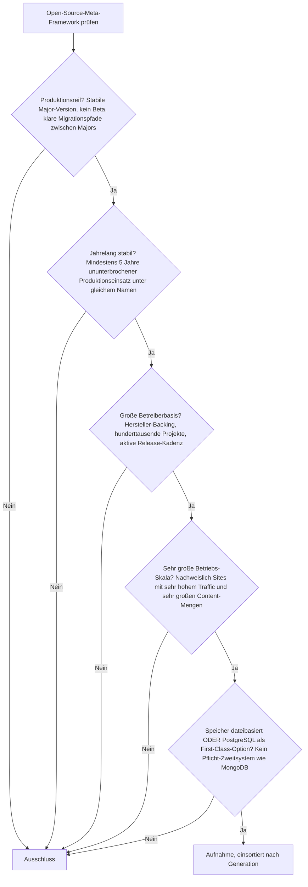
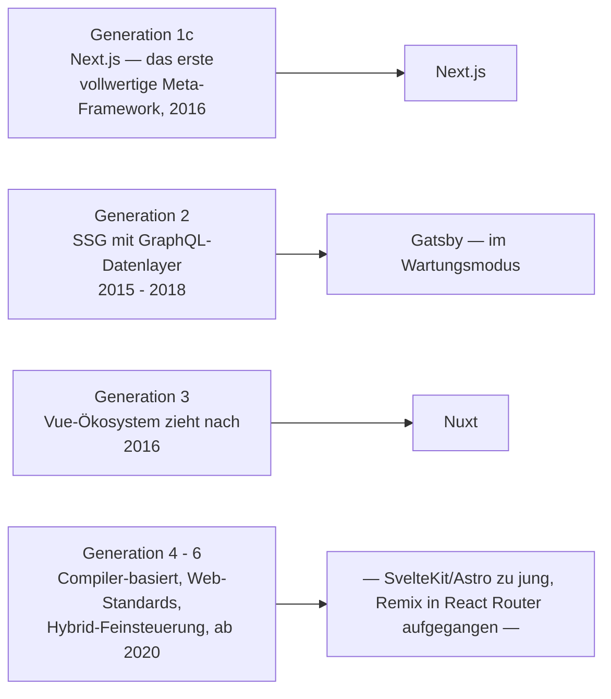
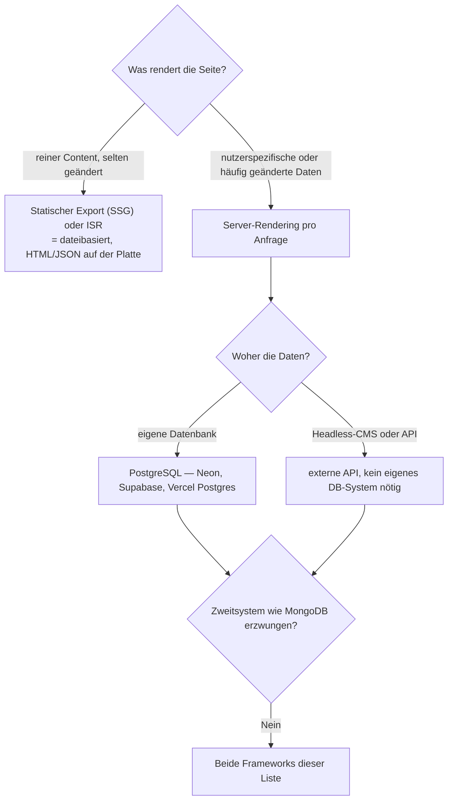

# Produktionsreife Open-Source-Full-Stack-Meta-Frameworks nach Generation — Reifegrad, Evaluation & Betriebs-Skala (2 Frameworks + Grenzfälle)

Die [Evolution und Architekturen digitaler Full-Stack-Meta-Frameworks](evolution-digitaler-meta-frameworks.md) ordnet diese Architekturlinie chronologisch in sechs technologische Generationen, die [Topliste bester Meta-Frameworks 2026](meta-frameworks-2026-topliste.md) rankt die gesamte Kategorie. Diese Seite legt — parallel zur allgemeinen [Web-Framework-Variante](produktionsreife-webframeworks-generationen-2026-topliste.md), der [Enterprise-](produktionsreife-enterprise-webframeworks-generationen-2026-topliste.md) und der [Rust-Variante](produktionsreife-rust-webframeworks-generationen-2026-topliste.md) sowie den Schwesterseiten für [Wissenssysteme](../../wissen/dokumentation/produktionsreife-wissenssysteme-generationen-2026-topliste.md), [CMS](../../wissen/dokumentation/produktionsreife-cms-generationen-2026-topliste.md) und [LMS](../../wissen/e-learning/produktionsreife-lms-generationen-2026-topliste.md) — dasselbe bewusst **konservative** Fünf-Filter-Sieb an: produktionsreif · jahrelang stabil · große Betreiberbasis · sehr große Betriebs-Skala · Speicher dateibasiert oder PostgreSQL. Sortiert nach Generation.

!!! warning "Achtung: Diese Kategorie hat die höchste Fluktuation der ganzen Familie"
    Von den prominenten Meta-Framework-Namen bestehen nur die **beiden ältesten** das volle Sieb — **Next.js** und **Nuxt**. Die jüngere Riege ist im Umbruch: **Remix** wurde Ende 2024 in **React Router v7** aufgelöst und existiert als eigenständiges Framework nicht mehr; **Gatsby** ist nach der Netlify-Übernahme (2023) in den Wartungsmodus gefallen; **SvelteKit** (1.0 erst Dezember 2022) und **Astro** sind noch unter der Fünf-Jahres-Marke. Die Speicherfrage ist hier nie das Problem — Details im [Speicher-Fazit](#dateibasiert-oder-postgresql-beides-mit-klarer-arbeitsteilung).

---

## Die fünf harten Filter

!!! note "Hinweis: Nur OSI-anerkannte Lizenzen"
    Es zählen nur Systeme unter einer OSI-anerkannten Open-Source-Lizenz — hier durchgängig MIT. In dieser Kategorie ist die Lizenz nie die Hürde; entscheidend sind Reifezeit und Kontinuität.

---

## Ergebnis: zwei Systeme, beide aus den ersten drei Generationen

---

## Systeme nach Generation

### Generation 1c — Next.js, das erste vollwertige Meta-Framework (2016)

| # | System | Basis | Speicher | Lizenz | Seit | Skala-Nachweis |
|---|---|---|---|---|---|---|
| 1 | **[Next.js](evolution-digitaler-meta-frameworks.md)** (Vercel) | React | bring-your-own-DB; statischer Export dateibasiert; PostgreSQL über Neon/Vercel Postgres/Supabase | MIT | 2016 | Nike, Notion, TikTok, Hulu, Washington Post; die Referenzarchitektur, an der sich alle folgenden Meta-Frameworks messen |

**Next.js** definiert die Kategorie: SSR und SSG als Kernfeature statt Zusatzbibliothek, dazu Incremental Static Regeneration (Generation 6) und der App Router mit React Server Components. Zehn Jahre Produktionshistorie, Vercel als hauptamtlicher Entwickler, die mit Abstand größte Betreiberbasis. Die enge Kopplung an Vercel als bevorzugte Hosting-Plattform ist vor einer Self-Hosting-Entscheidung zu bewerten — der Kern läuft aber unter Node.js überall.

### Generation 3 — Vue-Ökosystem zieht nach: Nuxt (2016)

| # | System | Basis | Speicher | Lizenz | Seit | Skala-Nachweis |
|---|---|---|---|---|---|---|
| 2 | **Nuxt** | Vue | bring-your-own-DB; statischer Export dateibasiert; PostgreSQL First-Class in der üblichen Paarung | MIT | 2016 | Breite Produktionsnutzung im Vue-Enterprise-Umfeld; das ausgereifteste Meta-Framework außerhalb des React-Lagers |

**Nuxt** ist das Vue-Pendant zu Next.js — File-based Routing, SSR/SSG-Hybrid, großes Modul-Ökosystem, seit 2025 mit Vercel-Backing (Übernahme von NuxtLabs). Der Sprung von Nuxt 2 auf das komplett neu geschriebene Nuxt 3 (Dezember 2022) war ein harter Migrationsschritt; seit Nuxt 3/4 ist die Basis (Nitro-Server-Engine, Vite) stabil.

### Generation 2 — warum Gatsby nicht (mehr) besteht

**Gatsby** (2015, Durchbruch 2017) erfüllte jahrelang alle Filter: primär SSG, GraphQL-Datenlayer, große Betreiberbasis, Einsatz auf sehr großen Content-Sites. Nach der Übernahme durch **Netlify (Februar 2023)** verließ binnen Monaten der Großteil des Kernteams das Projekt, die Release-Kadenz brach ein. Gatsby ist heute im Wartungsmodus — der Filter **„große Betreiberbasis, aktive Weiterentwicklung"** ist nicht mehr erfüllt. Bestehende Gatsby-Sites laufen weiter, für Neubau ist die Kategorie zu Next.js und Astro abgewandert.

### Generation 4 – 6 — noch nicht so weit oder nicht mehr eigenständig

| System | Generation | Status im Sieb |
|---|---|---|
| **SvelteKit** | 4 (Compiler ohne Virtual DOM) | 1.0 erst Dezember 2022 → unter der Fünf-Jahres-Marke; Vercel-Backing, wachsende Basis — der aussichtsreichste Kandidat für 2028 |
| **Astro** (SSR-Modus) | Schnittmenge zu Islands | 1.0 August 2022 → zu jung; zudem primär Islands-Architektur, siehe [Generation 5 der Web-Frameworks-Zeitachse](evolution-digitaler-webframeworks.md) |
| **Remix** | 5 (Web-Standards) | Ende 2024 in **React Router v7** aufgegangen; als eigenständiges Framework nicht mehr existent. Das angekündigte „Remix 3" ist ein kompletter Neuanfang ohne React |
| **TanStack Start, SolidStart, Analog, Waku** | Ergänzungen 2026 | Alle erst 2024/2025 stabil → Reifezeit-Filter |

---

## Dateibasiert oder PostgreSQL? — Beides, mit klarer Arbeitsteilung

Meta-Frameworks schreiben keine Datenbank vor — die Speicherfrage entscheidet sich am **Rendering-Modus**:

- **Dateibasiert** — Static Site Generation und Incremental Static Regeneration legen fertiges HTML/JSON ab; für reine Content-Sites braucht es zur Laufzeit keine Datenbank. Verwandt mit [Static-Site-Generatoren](../../wissen/dokumentation/static-site-generatoren-2026-topliste.md).
- **PostgreSQL** — sobald nutzerspezifische oder transaktionale Daten dazukommen, ist PostgreSQL die Standardwahl, meist als Managed-Angebot (Neon, Supabase, Vercel Postgres). Vertiefung: [PostgreSQL DBA Praxis-Handbuch](../infrastruktur/postgresql-dba-praxis.md).
- **Headless-CMS** — häufig liegt der Content in einem externen [Headless-CMS](../../wissen/dokumentation/headless-cms-2026-topliste.md); dann hat die Meta-Framework-Anwendung selbst gar kein Datenbanksystem.
- **MongoDB-Zwang** gibt es in dieser Kategorie nicht.

!!! warning "Achtung: Momentaufnahme, Stand August 2026"
    Diese Kategorie bewegt sich schnell. Insbesondere ist offen, wie sich die Auflösung von Remix in React Router und die Entwicklung von „Remix 3" (Preact-Fork, kein React) auswirken; SvelteKit erreicht 2027/2028 die Fünf-Jahres-Marke. Vor einer Framework-Entscheidung den aktuellen Stand prüfen.

---

## Was bewusst nicht auf dieser Liste steht

| System | Erfüllt nicht | Anmerkung |
|---|---|---|
| **Gatsby** | Betreiberbasis / Aktivität | Nach der Netlify-Übernahme 2023 Kernteam abgewandert, Wartungsmodus |
| **Remix** | Kontinuität / eigenständiges Framework | Ende 2024 in React Router v7 aufgegangen; „Remix 3" ist ein kompletter Neuanfang ohne React |
| **SvelteKit** | Reifezeit | 1.0 erst Dezember 2022 — der aussichtsreichste Nachrücker |
| **Astro** | Reifezeit + Kategorie-Zuordnung | 1.0 August 2022; primär Islands-Architektur statt klassisches Meta-Framework |
| **TanStack Start, SolidStart, Analog, Waku, Nitro (standalone)** | Reifezeit | Alle erst 2024/2025 stabil |
| **Angular Universal / Analog** | Betreiberbasis | Angular-SSR ist verbreitet, ein eigenständiges Meta-Framework dafür bislang Nische |

---

## 🔗 Verwandte Themen

- [Evolution und Architekturen digitaler Full-Stack-Meta-Frameworks](evolution-digitaler-meta-frameworks.md) — das sechsstufige Generationenmodell, nach dem diese Liste sortiert ist
- [Beste Full-Stack-Meta-Frameworks 2026 (Top 15)](meta-frameworks-2026-topliste.md) — breiteste Basis-Topliste der Kategorie
- [Produktionsreife Open-Source-Web-Frameworks & -Bibliotheken nach Generation](produktionsreife-webframeworks-generationen-2026-topliste.md) — die übergeordnete Variante; Next.js und Nuxt erscheinen dort in Generation 4
- [Produktionsreife Open-Source-Enterprise-Web-Frameworks nach Generation](produktionsreife-enterprise-webframeworks-generationen-2026-topliste.md) — dasselbe Sieb für die Java-/.NET-Klasse
- [Produktionsreife Open-Source-Rust-Web-Frameworks nach Generation](produktionsreife-rust-webframeworks-generationen-2026-topliste.md) — dasselbe Sieb für die Rust-Kategorie
- [Beste Headless-CMS 2026 (Top 20)](../../wissen/dokumentation/headless-cms-2026-topliste.md) — die übliche Content-Quelle hinter einem Meta-Framework
- [Beste Static-Site- & Docs-Generatoren 2026 (Top 20)](../../wissen/dokumentation/static-site-generatoren-2026-topliste.md) — die dateibasierte Nachbarkategorie
- [PostgreSQL DBA Praxis-Handbuch](../infrastruktur/postgresql-dba-praxis.md) — die Datenbankschicht hinter der PostgreSQL-Empfehlung
