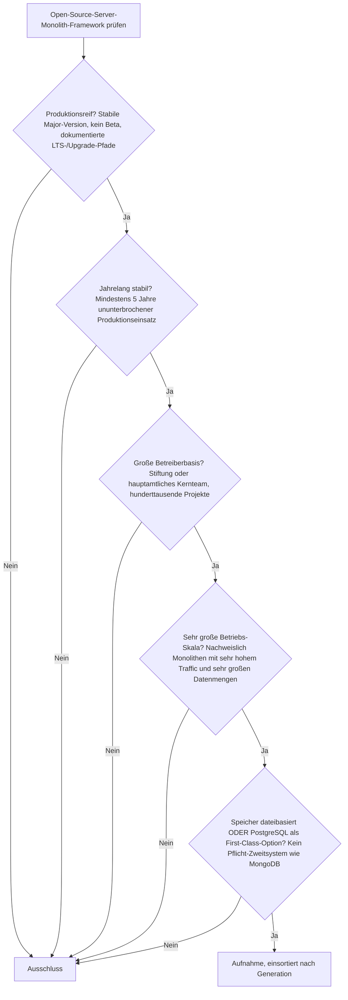
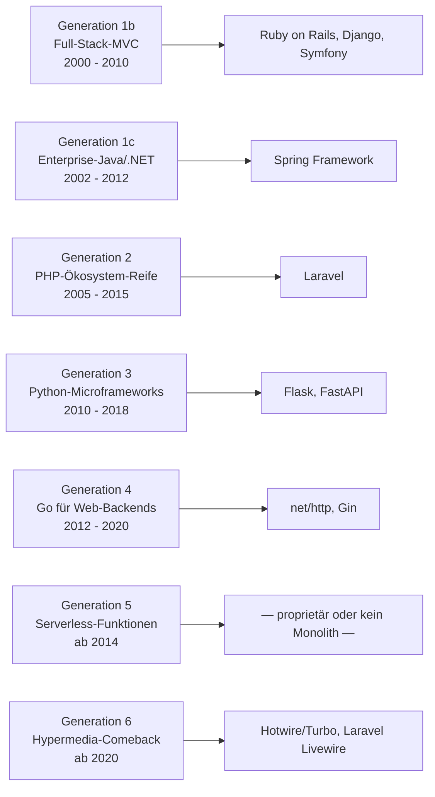

# Produktionsreife Open-Source-Server-Monolith-Frameworks nach Generation — Reifegrad, Evaluation & Betriebs-Skala (Top 11)

Die [Evolution und Architekturen digitaler Server-Monolith-Frameworks](evolution-digitaler-monolith-frameworks.md) ordnet die serverseitig-monolithische Linie chronologisch in sechs technologische Generationen, die [Topliste bester Server-Monolith-Frameworks 2026](monolith-frameworks-2026-topliste.md) rankt die gesamte Kategorie. Diese Seite legt — parallel zur allgemeinen [Web-Framework-Variante](produktionsreife-webframeworks-generationen-2026-topliste.md), der [Meta-](produktionsreife-meta-frameworks-generationen-2026-topliste.md), [SPA-](produktionsreife-spa-frameworks-generationen-2026-topliste.md), [Islands-/Edge-](produktionsreife-islands-edge-architekturen-generationen-2026-topliste.md), [Enterprise-](produktionsreife-enterprise-webframeworks-generationen-2026-topliste.md), [Rust-](produktionsreife-rust-webframeworks-generationen-2026-topliste.md) und [KI-nativen Variante](produktionsreife-ki-native-webframeworks-generationen-2026-topliste.md) sowie den Schwesterseiten für [Wissenssysteme](../../wissen/dokumentation/produktionsreife-wissenssysteme-generationen-2026-topliste.md), [CMS](../../wissen/dokumentation/produktionsreife-cms-generationen-2026-topliste.md) und [LMS](../../wissen/e-learning/produktionsreife-lms-generationen-2026-topliste.md) — dasselbe bewusst **konservative** Fünf-Filter-Sieb an: produktionsreif · jahrelang stabil · große Betreiberbasis · sehr große Betriebs-Skala · Speicher dateibasiert oder PostgreSQL. Sortiert nach Generation.

!!! warning "Achtung: Das ist die reifste Kategorie der ganzen Familie"
    Elf Frameworks bestehen alle fünf Filter, verteilt über **fünf der sechs Generationen** — mehr als jede andere Web-Framework-Liste. Die Aussage dahinter: Der Server-Monolith ist nicht Legacy. Nach dem SPA-/Meta-Framework-Umweg ist er mit **Generation 6 (Hypermedia)** wieder eine aktiv gewählte Architektur. Nur **Generation 5 (Serverless-Funktionen)** bleibt leer — teils proprietär, teils das architektonische Gegenteil eines Monolithen. Speicher: [beides tragfähig](#dateibasiert-oder-postgresql-wie-in-der-allgemeinen-liste).

---

## Die fünf harten Filter

!!! note "Hinweis: Nur OSI-anerkannte Lizenzen"
    Es zählen nur Systeme unter einer OSI-anerkannten Open-Source-Lizenz. Das kostet die Liste **Generation 5** fast vollständig: AWS Lambda und Vercel/Netlify Functions sind proprietäre Dienste, und die **Serverless Framework CLI** ist seit V4 (2024) für Unternehmen ab 2 Mio. USD Umsatz kostenpflichtig lizenziert.

---

## Ergebnis: elf Frameworks über fünf Generationen

---

## Systeme nach Generation

### Generation 1b — Full-Stack-MVC-Frameworks (2000 – 2010)

| # | System | Sprache | Speicher | Lizenz | Seit | Skala-Nachweis |
|---|---|---|---|---|---|---|
| 1 | **Ruby on Rails** | Ruby | SQLite (Default ab Rails 8) **oder** PostgreSQL First-Class | MIT | 2004 | GitHub, Shopify, Basecamp — Shopify betreibt einen der größten Monolithen der Welt |
| 2 | **Django** | Python | PostgreSQL ausdrücklich empfohlen; SQLite unterstützt | BSD-3-Clause | 2005 | Instagram, Disqus, Mozilla |
| 3 | **Symfony** | PHP | PostgreSQL First-Class über Doctrine | MIT | 2005 | Unterbau von Drupal, Shopware und großen Teilen des PHP-Enterprise-Markts |

Die Gründergeneration der Full-Stack-MVC-Frameworks: „Convention over Configuration", ORM und Scaffolding im Kern, zwei Jahrzehnte Produktionshistorie. Rails machte mit Rails 8 (2024) SQLite produktionstauglich; Django empfiehlt PostgreSQL ausdrücklich.

### Generation 1c — Enterprise-Java/.NET (2002 – 2012)

| # | System | Sprache | Speicher | Lizenz | Seit | Skala-Nachweis |
|---|---|---|---|---|---|---|
| 4 | **Spring Framework** | Java/Kotlin | datenbank-agnostisch über JPA/Hibernate; PostgreSQL First-Class | Apache-2.0 | 2003 | De-facto-Fundament fast aller Java-Enterprise-Monolithen |

Struts (EOL für 2.5.x seit April 2024) und ASP.NET Web Forms (eingefroren) fallen heraus; nur **Spring** besteht. Vertiefung mit Spring Boot und ASP.NET Core: [Produktionsreife Enterprise-Web-Frameworks](produktionsreife-enterprise-webframeworks-generationen-2026-topliste.md).

### Generation 2 — PHP-Ökosystem-Reife & Laravel (2005 – 2015)

| # | System | Sprache | Speicher | Lizenz | Seit | Skala-Nachweis |
|---|---|---|---|---|---|---|
| 5 | **Laravel** | PHP | SQLite (Default ab Laravel 11) **oder** PostgreSQL/MySQL First-Class | MIT | 2011 | Größtes PHP-Framework-Ökosystem, breite SaaS- und Agentur-Nutzung |

**CodeIgniter** und **CakePHP** werden weiter gepflegt, aber ihre Betreiberbasis ist gegenüber Laravel stark geschrumpft — Grenzfälle, keine breite Neubau-Wahl mehr.

### Generation 3 — Python-Microframeworks (2010 – 2018)

| # | System | Sprache | Speicher | Lizenz | Seit | Skala-Nachweis |
|---|---|---|---|---|---|---|
| 6 | **Flask** | Python | frei wählbar über SQLAlchemy; PostgreSQL und SQLite First-Class | BSD-3-Clause | 2010 | Pallets-Projekt; rund 40 Mio. PyPI-Downloads pro Monat |
| 7 | **FastAPI** | Python | frei wählbar über SQLAlchemy/SQLModel; PostgreSQL First-Class | MIT | 2018 | Netflix, Uber, Microsoft, Spotify; überholte Ende 2025 Flask nach GitHub-Sternen |

Der minimalistische Gegenentwurf zu Django: kleiner Kern, gezielte Erweiterung. **FastAPI** hat mit acht Jahren die Fünf-Jahres-Marke klar überschritten und ist das am schnellsten wachsende Python-Web-Framework — besonders für API-Backends und KI-Dienste.

### Generation 4 — Go für performante Web-Backends (2012 – 2020)

| # | System | Sprache | Speicher | Lizenz | Seit | Skala-Nachweis |
|---|---|---|---|---|---|---|
| 8 | **`net/http`** (Standardbibliothek) | Go | `database/sql` mit `pgx` → PostgreSQL; SQLite über Treiber | BSD-3-Clause | 2012 | Produktionsreifer HTTP-Server im Go-Kern; seit Go 1.22 (2024) mit erweitertem Routing |
| 9 | **Gin** | Go | wie `net/http` | MIT | 2014 | Meistgenutztes Go-Web-Framework, breite Nutzung in Cloud-Infrastruktur |

Go-Backends bündeln nichts im Framework — der Speicherzugriff läuft über `database/sql` bzw. `pgx`, PostgreSQL ist die pragmatische Standardwahl. **Echo** (2015) ist ein gleichwertiger Grenzfall mit etwas kleinerer Basis.

### Generation 5 — Serverless-Funktionen (ab 2014) — warum hier nichts steht

- **AWS Lambda**, **Vercel/Netlify Functions** — proprietäre Dienste → Lizenzfilter.
- **Serverless Framework** — die CLI ist seit V4 (2024) für größere Unternehmen kostenpflichtig lizenziert.
- Grundsätzlicher: Eine zustandslose, pro Anfrage neu instanziierte Funktion ist das **architektonische Gegenteil** eines Server-Monolithen. Offene FaaS-Plattformen (Knative, OpenFaaS) existieren, gehören aber konzeptionell nicht in diese Liste.

### Generation 6 — Das Monolith-Comeback: Hypermedia statt SPA (ab 2020)

| # | System | Basis | Speicher | Lizenz | Seit | Skala-Nachweis |
|---|---|---|---|---|---|---|
| 10 | **Hotwire / Turbo** | Ruby on Rails | erbt Rails' Speicherwahl (SQLite oder PostgreSQL) | MIT | 2020 | 37signals (Basecamp, HEY); als Teil von Rails ausgeliefert, von Shopify breit genutzt |
| 11 | **Laravel Livewire** | Laravel / PHP | erbt Laravels Speicherwahl | MIT | 2020 | Livewire 3; sehr breite Nutzung im gesamten Laravel-Ökosystem |

Beide senden **HTML-Fragmente statt JSON** und aktualisieren Seitenteile gezielt ohne Virtual DOM — mit sechs Jahren gerade über der Reifezeit-Marke und getragen von den Framework-Ökosystemen Rails bzw. Laravel.

**HTMX** (stabile 2.0 seit Juni 2024) ist der Mindshare-Führer der Hypermedia-Bewegung, aber im Kern eine ~14 KB-Bibliothek mit sehr kleinem Maintainer-Team — es besteht die Reifezeit, der Filter „große Betreiberbasis" als Team greift jedoch knapp nicht. Man baut den Monolithen weiterhin mit einem Framework aus den Generationen 1–4 und ergänzt HTMX.

---

## Dateibasiert oder PostgreSQL? — Wie in der allgemeinen Liste

Die Antwort deckt sich mit der [allgemeinen Web-Framework-Seite](produktionsreife-webframeworks-generationen-2026-topliste.md#dateibasiert-oder-postgresql-diesmal-beides):

- **PostgreSQL als Standardwahl** — Django (ausdrücklich empfohlen), First-Class in Rails, Laravel, Symfony, Go über `pgx`. Vertiefung: [PostgreSQL DBA Praxis-Handbuch](../infrastruktur/postgresql-dba-praxis.md).
- **Dateibasiert (SQLite) tragfähig** — seit Rails 8 und Laravel 11 ohne Zusatzarbeit für kleine bis mittlere Schreiblast.
- **Kein MongoDB-Zwang** — keines der elf Frameworks bindet ein Pflicht-Zweitsystem.

!!! warning "Achtung: Momentaufnahme, Stand August 2026"
    Generation 6 steht genau an der Fünf-Jahres-Marke (alle 2020 gestartet). Die Einschätzung von Hotwire/Turbo und Livewire als „bestanden" stützt sich wesentlich auf das Backing der Rails- und Laravel-Ökosysteme — bei HTMX fehlt genau das.

---

## Was bewusst nicht auf dieser Liste steht

| System | Erfüllt nicht | Anmerkung |
|---|---|---|
| **HTMX** | Betreiberbasis (Team) | Stabile 2.0, sechs Jahre, riesiger Mindshare — aber sehr kleines Kernteam, Bibliothek statt Framework |
| **CodeIgniter, CakePHP** | Betreiberbasis | Weiter gepflegt, aber gegenüber Laravel stark geschrumpft |
| **Echo (Go)** | Betreiberbasis | Gleichwertig zu Gin, etwas kleinere Nutzung |
| **AWS Lambda, Vercel/Netlify Functions** | Lizenzfilter | Proprietäre Dienste |
| **Serverless Framework** | Lizenzfilter | CLI seit V4 (2024) für Unternehmen kostenpflichtig |
| **Struts, ASP.NET Web Forms** | Produktionsreife | Struts 2.5.x EOL seit April 2024; Web Forms eingefroren auf .NET Framework |
| **Express.js** | Kategorie | Behandelt auf der [allgemeinen Web-Framework-Seite](produktionsreife-webframeworks-generationen-2026-topliste.md); eher API-Schicht als Full-Stack-Monolith |

---

## 🔗 Verwandte Themen

- [Evolution und Architekturen digitaler Server-Monolith-Frameworks](evolution-digitaler-monolith-frameworks.md) — das sechsstufige Generationenmodell, nach dem diese Liste sortiert ist
- [Beste Server-Monolith-Frameworks 2026 (Top 20)](monolith-frameworks-2026-topliste.md) — breiteste Basis-Topliste der Kategorie
- [Produktionsreife Open-Source-Web-Frameworks & -Bibliotheken nach Generation](produktionsreife-webframeworks-generationen-2026-topliste.md) — die übergeordnete Variante; Rails, Django, Laravel, Symfony erscheinen dort in Generation 1b
- [Produktionsreife Open-Source-Enterprise-Web-Frameworks nach Generation](produktionsreife-enterprise-webframeworks-generationen-2026-topliste.md) — Spring Boot und ASP.NET Core als Enterprise-Fortführung von Generation 1c
- [Evolution und Architekturen digitaler Batteries-Included-Web-Frameworks](evolution-digitaler-batteries-included-frameworks.md) — die Vollausstattungs-Achse hinter Rails, Django und Laravel
- [PostgreSQL DBA Praxis-Handbuch](../infrastruktur/postgresql-dba-praxis.md) — die Datenbankschicht hinter der PostgreSQL-Empfehlung
- [Websites entwickeln mit KI](ki-webentwicklung.md) — praktischer Lernpfad, u. a. Backend/APIs mit FastAPI
