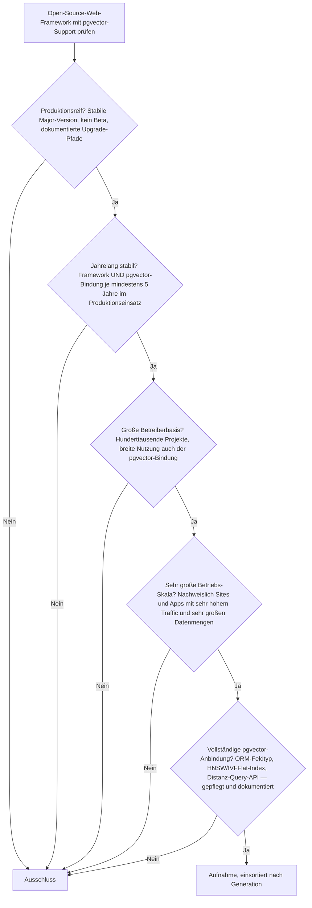
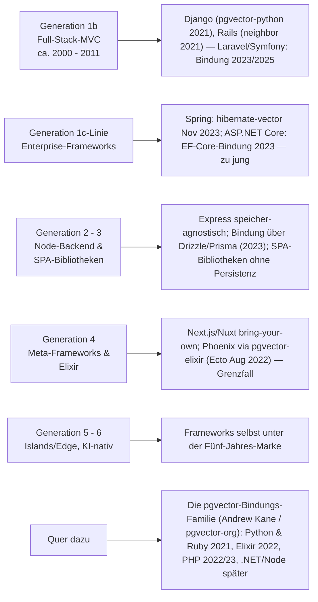
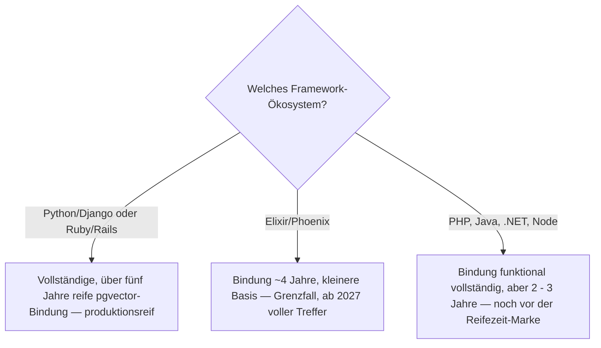

# Produktionsreife Open-Source-Web-Frameworks mit vollständigem pgvector-Support nach Generation — Reifegrad, Lizenz & Integrationstiefe (Top 2 — Django und Rails)

Die [Evolution und Architekturen digitaler Web-Frameworks](evolution-digitaler-webframeworks.md) ordnet die Framework-Landschaft in sechs Generationen, die [Topliste produktionsreifer Web-Frameworks nach Generation (Top 12)](produktionsreife-webframeworks-generationen-2026-topliste.md) siebt sie nach Reife, Betreiberbasis und Speicherbackend. Dort ist der Speicherfilter „selten das K.-o.-Kriterium", weil Frameworks ihre Persistenzschicht austauschbar mitbringen. Diese Seite verengt ihn auf eine Frage: **Welches quelloffene Web-Framework hat eine vollständige, produktionsreife [pgvector](../../wissen/daten/datenbanken/pgvector-anleitung.md)-Anbindung — ORM-Feldtyp, Index-Support (HNSW/IVFFlat), Distanz-Query-API — als gepflegte, jahrelang stabile Komponente?** Sortiert wird — parallel zur [CMS-](../../wissen/dokumentation/produktionsreife-pgvector-cms-generationen-2026-topliste.md) und [Wissenssysteme-Schwesterseite](../../wissen/dokumentation/produktionsreife-pgvector-wissenssysteme-generationen-2026-topliste.md) — **nach Generation** statt nach Rang.

!!! warning "Achtung: Die pgvector-Bindung reift mit ihrer eigenen Bibliothek — und die nahm nur bei Python und Ruby 2021 die Fünf-Jahres-Marke"
    Die pgvector-Anbindung eines Frameworks ist fast immer **dieselbe Handschrift**: Andrew Kane (der pgvector-Autor selbst) und die `pgvector`-Organisation pflegen `pgvector-python`, das `neighbor`-Gem für Rails, `pgvector-elixir`, `pgvector-php`, `pgvector-dotnet` und `pgvector-node`. Die Reifefrage reduziert sich damit auf: **Wann kam die Bindung für dieses Ökosystem?** Für **Django** (`pgvector-python`, Django-Feldtyp seit Juni 2021) und **Ruby on Rails** (`neighbor`, pgvector-Support seit April 2021) liegt das über fünf Jahre zurück — beide auf einem zwanzig Jahre alten Framework. Für **Elixir/Phoenix** (August 2022) sind es vier Jahre, für **Laravel** (März 2023), **Spring** (`hibernate-vector`, November 2023), **ASP.NET Core** (2023) und die **Node**-ORMs (Drizzle/Prisma, 2023) zwei bis drei. Anders als bei der [CMS-](../../wissen/dokumentation/produktionsreife-pgvector-cms-generationen-2026-topliste.md) (kein Treffer) und [Wissenssysteme-Seite](../../wissen/dokumentation/produktionsreife-pgvector-wissenssysteme-generationen-2026-topliste.md) (nur Bauteil-Ebene) gibt es hier **echte Produkt-Treffer** — aber nur die zwei ältesten, größten Ökosysteme.

---

## Die fünf harten Filter

!!! note "Hinweis: Nur OSI-anerkannte Lizenzen"
    In der Web-Framework-Welt ist das selten die Hürde — MIT, BSD und Apache-2.0 dominieren. `pgvector` selbst steht unter der freizügigen PostgreSQL-Lizenz, die `pgvector-*`-Bindungen unter MIT.

---

## Ergebnis: zwei Treffer, beide in Generation 1b

---

## Die pgvector-Bindung je Ökosystem

| Ökosystem / Framework | Bibliothek | Framework-Anbindung seit | Alter (Aug 2026) | Status im Sieb |
|---|---|---|---|---|
| **Python / Django** | `pgvector-python` (`VectorField`, `HnswIndex`, `IvfflatIndex`) | Juni 2021 (v0.1.2) | ~5 Jahre | **besteht** |
| **Ruby / Rails** | `neighbor` (`has_neighbors`, `nearest_neighbors`) | April 2021 (v0.2.0) | ~5 Jahre | **besteht** |
| **Python / SQLAlchemy** (FastAPI, Flask) | `pgvector-python` (SQLAlchemy) | Juni 2021 (v0.1.1) | ~5 Jahre | **Grenzfall** — Bindung reif, aber das Framework selbst hat keine Datenschicht |
| **Elixir / Phoenix** | `pgvector-elixir` (Ecto) | August 2022 (v0.1.1) | ~4 Jahre | **Grenzfall** — Bindung knapp unter fünf Jahren, kleinere Basis |
| **PHP / Laravel** | `pgvector-php` (Laravel-Cast) | März 2023 (v0.1.1) | ~3 Jahre | Reifezeit |
| **PHP / Symfony** | `pgvector-php` (Doctrine) | Februar 2025 (v0.2.2) | ~1,5 Jahre | Reifezeit |
| **Java / Spring** | `hibernate-vector` / Spring AI `PgVectorStore` | November 2023 / Mai 2025 | ~1 – 3 Jahre | Reifezeit |
| **.NET / ASP.NET Core** | `Pgvector.EntityFrameworkCore`, Npgsql 8 nativ | November 2023 | ~3 Jahre | Reifezeit |
| **Node / Express, Next.js, Nuxt** | Drizzle `vector`, Prisma (Preview) | ~2023 | ~3 Jahre | Reifezeit + nicht auf Framework-Ebene |

---

## Systeme nach Generation

### Generation 1b — Full-Stack-MVC-Frameworks (ca. 2000 – 2011)

| # | System | Sprache | pgvector-Bindung | Lizenz | Framework seit | Bindung seit |
|---|---|---|---|---|---|---|
| 1 | **Django** | Python | `pgvector-python` — `VectorField`, `HalfVectorField`, `BitField`, `SparseVectorField`, `HnswIndex`, `IvfflatIndex`, Distanz-Lookups | BSD-3-Clause | 2005 | Juni 2021 |
| 2 | **Ruby on Rails** | Ruby | `neighbor` — `has_neighbors`, `nearest_neighbors(distance:)`, Migrations-Helfer für `vector`-Spalten und HNSW/IVFFlat | MIT | 2004 | April 2021 |

**Django** und **Rails** sind die einzigen zwei vollen Treffer: Framework und pgvector-Bindung sind je über fünf Jahre produktionsreif, die Bindung stammt vom pgvector-Autor selbst, deckt Feldtyp, Index und Query-API vollständig ab und wird breit eingesetzt. **Django** nutzt `pgvector-python` (das zugleich SQLAlchemy, Psycopg 3, asyncpg und Peewee bedient), **Rails** das `neighbor`-Gem mit nativer Active-Record-Integration.

**Laravel** und **Symfony** erfüllen alle Framework-Filter, aber die pgvector-Bindung ist zu jung: der Laravel-Cast in `pgvector-php` kam im März 2023, die Doctrine-Unterstützung erst im Februar 2025.

### Generation 1c-Linie — Enterprise-Frameworks

**Spring Boot** bindet pgvector über `hibernate-vector` (ab 6.4.0.Final, November 2023) oder Spring AIs `PgVectorStore` (1.0 GA Mai 2025) an, **ASP.NET Core** über `Pgvector.EntityFrameworkCore` und die native pgvector-Unterstützung in Npgsql 8 (ebenfalls November 2023). Beide Wege sind funktional vollständig, aber erst zwei bis drei Jahre alt.

### Generation 2 & 3 — Node-Backend & SPA-Bibliotheken

**Express.js** hat keine Datenschicht im Kern — die pgvector-Anbindung läuft über die gewählte ORM (Drizzle mit `vector`-Spaltentyp seit 2023, Prisma als Preview). **React**, **Vue** und **Angular** haben keine Persistenz, der Filter ist nicht anwendbar.

### Generation 4 — Meta-Frameworks & Elixir

**Next.js** und **Nuxt** schreiben keine Datenbank vor. **Phoenix** ist der Grenzfall dieser Seite: `pgvector-elixir` bindet pgvector seit August 2022 an Ecto an — knapp unter der Fünf-Jahres-Marke, und die Betreiberbasis der Bindung ist deutlich kleiner als bei Django und Rails. 2027 rückt Phoenix als dritter Kandidat nach.

### Generation 5 – 6 — Islands/Edge & KI-nativ

Die Frameworks selbst (Astro, Qwik, SolidStart, die KI-nativen Frameworks) liegen unter fünf Jahren — die Frage nach ihrer pgvector-Bindung stellt sich noch nicht.

---

## Dateibasiert oder PostgreSQL? — hier ist pgvector selbst der Filter

Die Speicherfrage ist durch die Kategorie beantwortet: pgvector **ist** eine PostgreSQL-Erweiterung. Die Entscheidung liegt eine Ebene höher — **wie reif die Bindung des jeweiligen Ökosystems ist**:

- **Voller Treffer:** **Django** und **Rails**. Wer heute ein pgvector-gestütztes Feature produktionsreif in einem reifen Framework braucht, nimmt eines dieser beiden — die Bindung ist so alt und so breit erprobt wie die Frameworks selbst es verlangen.
- **Grenzfall:** **Phoenix** über `pgvector-elixir` — funktional gleichwertig, nur die Fünf-Jahres-Historie der Bindung fehlt knapp.
- **Noch zu jung:** Laravel, Symfony, Spring, ASP.NET Core, die Node-Frameworks — die Bindung existiert und ist vollständig, aber erst zwei bis drei Jahre alt.

**Absehbare künftige Treffer:** **Phoenix** 2027, **Laravel** und **ASP.NET Core** 2028, **Spring** 2028/29.

!!! warning "Achtung: Momentaufnahme, Stand August 2026"
    Die `pgvector-*`-Bindungen entwickeln sich schnell — Feldtypen, Index-Optionen und Framework-Integrationen kommen laufend hinzu. Vor einer Entscheidung den aktuellen Stand der jeweiligen Bibliothek prüfen.

---

## Was bewusst nicht auf dieser Liste steht

| System | Erfüllt nicht | Anmerkung |
|---|---|---|
| **Laravel, Symfony** | Reifezeit der Bindung | Framework reif; `pgvector-php` Laravel-Cast erst März 2023, Doctrine Februar 2025 |
| **Spring Boot** | Reifezeit der Bindung | `hibernate-vector` November 2023, Spring AI `PgVectorStore` Mai 2025 |
| **ASP.NET Core** | Reifezeit der Bindung | `Pgvector.EntityFrameworkCore` und Npgsql-8-Support ~2023 |
| **Express.js, Next.js, Nuxt** | Reifezeit + Ebene | Bindung über Drizzle/Prisma (2023), nicht auf Framework-Ebene |
| **Phoenix** | „Jahrelang stabil" der Bindung | `pgvector-elixir` Ecto-Support August 2022 — Grenzfall, ~4 Jahre |
| **FastAPI, Flask** | Ebene | pgvector über `pgvector-python`/SQLAlchemy (2021, reif), aber das Framework selbst hat keine Datenschicht |
| **Astro, Qwik, SolidStart, KI-native Frameworks** | Reifezeit | Frameworks selbst unter fünf Jahren |
| **Rust-Web-Frameworks (Axum, Actix Web)** | Reifezeit der Bindung | `pgvector` für Rust (via `sqlx`/`diesel`) vorhanden, aber Kategorie und Bindung jung — siehe [Rust-Web-Frameworks-Seite](produktionsreife-rust-webframeworks-generationen-2026-topliste.md) |

---

## 🔗 Verwandte Themen

- [Produktionsreife Open-Source-Web-Frameworks & -Bibliotheken nach Generation (Top 12)](produktionsreife-webframeworks-generationen-2026-topliste.md) — die allgemeine Schwesterseite; dort ist der Speicherfilter „selten K.-o.", hier auf „vollständige pgvector-Bindung" verengt
- [Evolution und Architekturen digitaler Web-Frameworks](evolution-digitaler-webframeworks.md) — das sechsstufige Generationenmodell, nach dem diese Liste sortiert ist
- [Produktionsreife Open-Source-Server-Monolith-Frameworks nach Generation (Top 11)](produktionsreife-monolith-frameworks-generationen-2026-topliste.md) — dieselben Full-Stack-MVC-Frameworks über alle sechs Monolith-Generationen
- [Produktionsreife Open-Source-Batteries-Included-Web-Frameworks nach Generation (Top 5)](produktionsreife-batteries-included-frameworks-generationen-2026-topliste.md) — die Vollausstattungs-Achse, auf der Django und Rails ebenfalls führen
- [Produktionsreife Open-Source-CMS mit vollständigem pgvector-Support nach Generation (kein Treffer)](../../wissen/dokumentation/produktionsreife-pgvector-cms-generationen-2026-topliste.md) — dieselbe Frage für CMS
- [Produktionsreife Open-Source-Wissenssysteme mit vollständigem pgvector-Support nach Generation (Top 2)](../../wissen/dokumentation/produktionsreife-pgvector-wissenssysteme-generationen-2026-topliste.md) — dieselbe Frage für Wissenssysteme; dort besteht Haystack als Framework
- [PostgreSQL + pgvector (Praxis-Guide)](../../wissen/daten/datenbanken/pgvector-anleitung.md) — Installation, Indexierung und Vektorsuche in der Praxis
- [PostgreSQL DBA Praxis-Handbuch](../infrastruktur/postgresql-dba-praxis.md) — Betrieb der Datenbankschicht hinter pgvector
- [KI-Anwendungen programmieren](../../künstliche-intelligenz/coding/ki-anwendungen-programmieren.md) — die Anwendungsschicht, die pgvector aus dem Framework heraus nutzt
