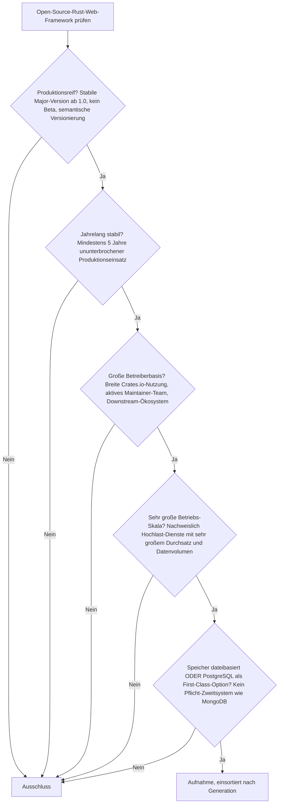
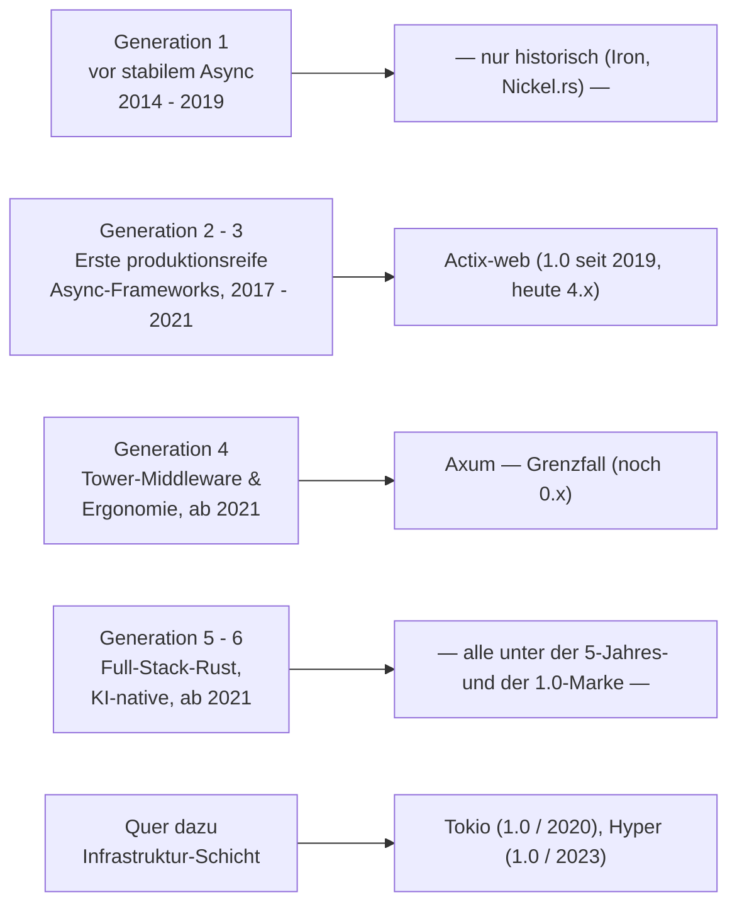
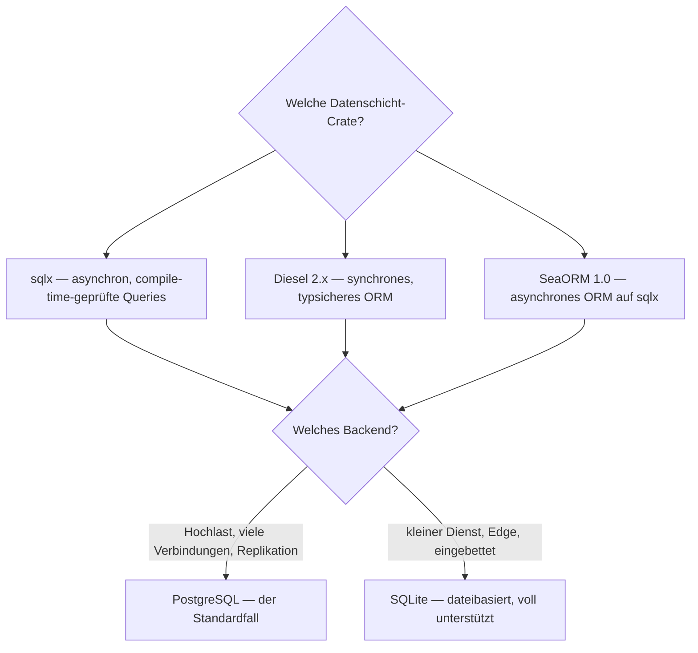

# Produktionsreife Open-Source-Rust-Web-Frameworks nach Generation — Reifegrad, Evaluation & Betriebs-Skala (1 Framework + Grenzfälle)

Die [Evolution und Architekturen digitaler Rust-Webframeworks](evolution-digitaler-rust-webframeworks.md) ordnet die Rust-Web-Landschaft chronologisch in sechs technologische Generationen, die [Topliste bester Rust-Webframeworks 2026](rust-webframeworks-2026-topliste.md) rankt die gesamte Kategorie. Diese Seite legt — parallel zur allgemeinen [Web-Framework-Variante](produktionsreife-webframeworks-generationen-2026-topliste.md), der [Enterprise-Variante](produktionsreife-enterprise-webframeworks-generationen-2026-topliste.md) und den Schwesterseiten für [Wissenssysteme](../../wissen/dokumentation/produktionsreife-wissenssysteme-generationen-2026-topliste.md), [CMS](../../wissen/dokumentation/produktionsreife-cms-generationen-2026-topliste.md) und [LMS](../../wissen/e-learning/produktionsreife-lms-generationen-2026-topliste.md) — dasselbe bewusst **konservative** Fünf-Filter-Sieb an: produktionsreif · jahrelang stabil · große Betreiberbasis · sehr große Betriebs-Skala · Speicher dateibasiert oder PostgreSQL. Sortiert nach Generation.

!!! warning "Achtung: Das Ergebnis ist das kürzeste der ganzen Familie — und das ist die Aussage"
    Rust-Web-Frameworks sind bei Performance und Speichersicherheit technisch führend, als **Kategorie** aber noch jung. Am „stabile Major-Version, kein Beta"-Filter scheitert fast das gesamte Ökosystem: Axum, Rocket, Warp, Leptos, Dioxus und Loco stehen alle noch bei `0.x`. **Nur Actix-web besteht alle fünf Filter.** [Axum](#grenzfall-axum) — das mit Abstand meistgenutzte — steht auf der Schwelle. Die produktionshärteste Rust-Web-Schicht ist ohnehin die [Infrastruktur darunter](#quer-zu-den-generationen-die-stabile-schicht-unter-den-frameworks) (Tokio, Hyper), nicht das Framework.

---

## Die fünf harten Filter

!!! note "Hinweis: Der Speicherfilter ist hier nie das Problem"
    Rust-Web-Frameworks bringen keine Persistenzschicht mit — die Datenbank kommt über eine separate Crate. Alle relevanten Optionen — **sqlx**, **Diesel** (2.x), **SeaORM** (1.0) — führen PostgreSQL und SQLite als First-Class-Ziele; MongoDB ist nie erzwungen. Bemerkenswert: die Datenschicht (Diesel 2.x, SeaORM 1.0) hat die 1.0-Marke früher erreicht als die meisten Frameworks darüber.

---

## Ergebnis: ein Framework besteht das volle Sieb

---

## Systeme nach Generation

### Generation 2 – 3 — Erste produktionsreife Async-Web-Frameworks (2017 – 2021)

| # | System | Speicher | Lizenz | Major seit | Skala-Nachweis |
|---|---|---|---|---|---|
| 1 | **[Actix-web](evolution-digitaler-rust-webframeworks.md)** | sqlx / Diesel / SeaORM — PostgreSQL und SQLite First-Class | MIT / Apache-2.0 | 1.0 im Juni 2019, aktuell 4.x | Durchgängig einer der schnellsten Web-Server überhaupt; produktiv in Hochlast- und Fintech-Systemen, seit 2018 kampferprobt |

**Actix-web** ist das einzige Rust-Web-Framework, das die Kombination aus **stabiler Major-Version** (1.0 in 2019, seither vier Major-Zyklen bis 4.x) und **über fünf Jahren ununterbrochenem Produktionseinsatz** erfüllt. Die frühe Abhängigkeit vom Actor-Modell wurde mit 2.0 (2019) zugunsten von reinem `async`/`await` aufgegeben — seitdem stabiles mentales Modell bei unverändert hohem Durchsatz. Aktive Pflege 2026 (4.14.x).

### Generation 4 — Tower-Middleware & Ergonomie-Ära (ab 2021)

| System | Erfüllt | Erfüllt nicht |
|---|---|---|
| **Axum** | jahrelang stabil (seit 2021), größte Betreiberbasis aller Rust-Web-Frameworks, Tokio-Team-Backing, sehr große Betriebs-Skala, Speicherfilter | **Produktionsreife im Filtersinn**: weiterhin `0.x` (0.8 im Jahr 2026, Arbeit an 0.9), Breaking Changes zwischen Minor-Versionen; die Fünf-Jahres-Marke erst 2026 erreicht |

#### Grenzfall: Axum

Axum ist in der Praxis das **meistgewählte** Rust-Web-Framework für neue Dienste — vom Tokio-Team entwickelt, direkt auf Tower und Hyper aufgebaut, neue Async-Fähigkeiten meist zuerst hier verfügbar. Es scheitert allein an der formalen Hürde „stabile Major-Version ab 1.0": Die anhaltende `0.x`-Reihe bedeutet, dass Upgrades zwischen Minor-Versionen bis heute Code-Änderungen erzwingen. Sobald Axum 1.0 erscheint, rückt es voraussichtlich auf Rang 1 dieser Liste.

### Generation 1, 5 & 6 — warum hier nichts steht

- **Generation 1 (vor stabilem Async)**: **Iron**, **Nickel.rs** — historische synchrone Frameworks aus der Zeit vor Rust 1.0, nicht mehr gepflegt.
- **Generation 5 (Full-Stack-Rust)**: **Leptos**, **Dioxus**, **Loco** — architektonisch interessant, aber alle unter fünf Jahren Produktionshistorie **und** unter der 1.0-Marke.
- **Generation 6 (KI-native Backends)**: **Rig** (2023) und der begleitende Stack (Candle, Qdrant als Bausteine) sind zu jung; siehe [Beste Rust-Frameworks & Web-Backends mit KI-Unterstützung](../../künstliche-intelligenz/coding/rust-web-frameworks-ki-topliste.md).

### Quer zu den Generationen — die stabile Schicht unter den Frameworks

Die produktionshärtesten Rust-Web-Bausteine sind keine Frameworks, sondern die Ebene darunter:

| Baustein | Rolle | 1.0 seit | Skala |
|---|---|---|---|
| **Tokio** | Async-Runtime, auf der jedes Framework aufbaut | Dezember 2020 | unter praktisch jedem großen Rust-Netzwerkdienst (AWS, Cloudflare, Discord) |
| **Hyper** | Low-Level-HTTP-Implementierung hinter Axum, Warp, reqwest | November 2023 | trägt HTTP-Verkehr im Hyperscaler-Maßstab |

Wer heute ein Rust-Backend auf maximale Stabilität auslegt, baut auf **Actix-web** (Framework mit 1.0-Historie) oder direkt auf **Tokio + Hyper + Tower** (Bibliotheks-Stack ohne Framework-Abstraktion).

---

## Dateibasiert oder PostgreSQL? — Frei wählbar, meist PostgreSQL

Da das Framework nichts vorschreibt, ist die Speicherfrage eine reine Crate-Wahl. In der Praxis:

- **PostgreSQL** ist der Standardfall für ernsthafte Dienste — über **sqlx** (asynchron, compile-time-geprüfte SQL-Queries), **Diesel** (synchrones ORM, 2.x) oder **SeaORM** (asynchrones ORM, 1.0). Vertiefung: [PostgreSQL DBA Praxis-Handbuch](../infrastruktur/postgresql-dba-praxis.md), für KI-Backends zusätzlich [PostgreSQL + pgvector](../../wissen/daten/datenbanken/pgvector-anleitung.md).
- **SQLite** ist dateibasiert und in allen drei Crates vollwertig unterstützt — üblich für kleine Dienste, Edge-Deployments und eingebettete Szenarien.
- **MongoDB-Bindung** gibt es in dieser Kategorie nicht.

!!! warning "Achtung: Momentaufnahme, Stand August 2026"
    Die 0.x-Situation ändert sich: Axum arbeitet auf 0.9 hin, ein 1.0 ist angekündigt. Erscheint es, ist die Bewertung dieser Seite zu aktualisieren — Axum erfüllt dann alle fünf Filter.

---

## Was bewusst nicht auf dieser Liste steht

| System | Erfüllt nicht | Anmerkung |
|---|---|---|
| **Axum** | Produktionsreife (Major-Version) | Größte Betreiberbasis, Tokio-Backing, aber weiterhin `0.x` — siehe [Grenzfall oben](#grenzfall-axum) |
| **Rocket** | Aktivität / Major-Version | Seit 0.1 (2016) im Ökosystem, aber lange Nightly-only-Phase, unstete Entwicklung, weiterhin `0.5.x` ohne 1.0 |
| **Warp** | Aktive Weiterentwicklung | Vom Hyper-Autor, elegantes Filter-System, doch die Entwicklung ist weitgehend zum Stillstand gekommen; viele Projekte auf Axum migriert |
| **Leptos, Dioxus** | Reifezeit + Major-Version | Full-Stack-SSR/WASM, technisch führend, aber jung und `0.x` |
| **Loco** | Reifezeit | „Rails für Rust" auf Axum-Basis, erst seit 2023 |
| **Rig** | Reifezeit | KI-natives Backend-Framework, seit 2023, `0.x` |
| **Iron, Nickel.rs** | Produktionsreife / Wartung | Synchrone Frameworks aus der Vor-1.0-Rust-Ära, nicht mehr gepflegt |
| **Poem, Salvo** | Betreiberbasis | Aktiv gepflegt, aber deutlich kleinere Nutzung als Axum oder Actix-web |

---

## 🔗 Verwandte Themen

- [Evolution und Architekturen digitaler Rust-Webframeworks](evolution-digitaler-rust-webframeworks.md) — das sechsstufige Rust-spezifische Generationenmodell, nach dem diese Liste sortiert ist
- [Beste Rust-Webframeworks 2026 (Top 15)](rust-webframeworks-2026-topliste.md) — breiteste Basis-Topliste der Kategorie, inklusive Infrastruktur-Bausteine
- [Produktionsreife Open-Source-Web-Frameworks & -Bibliotheken nach Generation](produktionsreife-webframeworks-generationen-2026-topliste.md) — die übergeordnete, sprachübergreifende Variante
- [Produktionsreife Open-Source-Enterprise-Web-Frameworks nach Generation](produktionsreife-enterprise-webframeworks-generationen-2026-topliste.md) — dasselbe Sieb für die Java-/.NET-Enterprise-Klasse
- [Beste Rust-Frameworks & Web-Backends mit KI-Unterstützung (Top 20)](../../künstliche-intelligenz/coding/rust-web-frameworks-ki-topliste.md) — dieselben Frameworks nach KI-Eignung statt nach Reifegrad gerankt
- [PostgreSQL DBA Praxis-Handbuch](../infrastruktur/postgresql-dba-praxis.md) — die Datenbankschicht hinter der PostgreSQL-Empfehlung
- [Produktionsreife Open-Source-Wissenssysteme nach Generation (Top 12)](../../wissen/dokumentation/produktionsreife-wissenssysteme-generationen-2026-topliste.md) — Schwester-Topliste mit demselben Fünf-Filter-Sieb
- [Produktionsreife Open-Source-CMS nach Generation (Top 12)](../../wissen/dokumentation/produktionsreife-cms-generationen-2026-topliste.md) — dasselbe Sieb für Content-Management-Systeme
- [Produktionsreife Open-Source-LMS nach Generation](../../wissen/e-learning/produktionsreife-lms-generationen-2026-topliste.md) — dasselbe Sieb für Lernmanagement-Systeme
