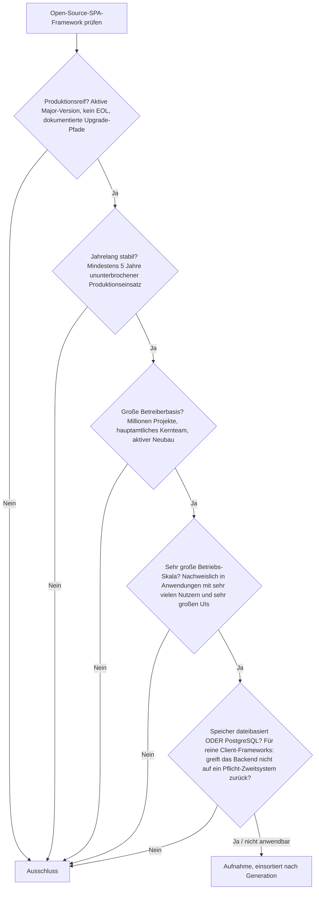
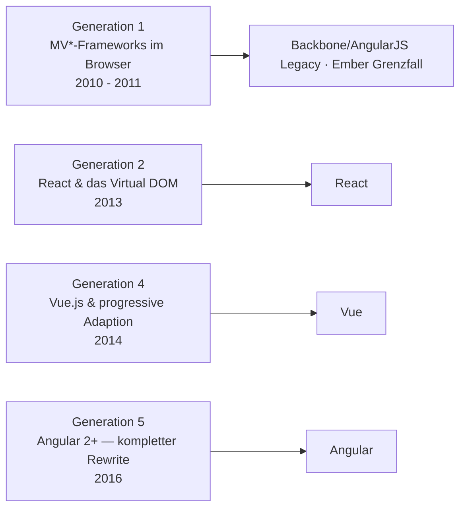
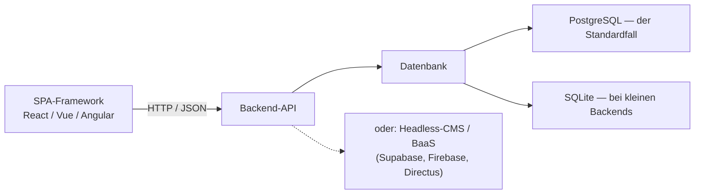

# Produktionsreife Open-Source-SPA-Frameworks nach Generation — Reifegrad, Evaluation & Betriebs-Skala (3 Frameworks + Grenzfall)

Die [Evolution und Architekturen digitaler SPA-Frameworks](evolution-digitaler-spa-frameworks.md) ordnet die Single-Page-Application-Linie chronologisch in sechs technologische Generationen, die [Topliste bester SPA-Frameworks 2026](spa-frameworks-2026-topliste.md) rankt die gesamte Kategorie inklusive State-Management- und Build-Bausteine. Diese Seite legt — parallel zur allgemeinen [Web-Framework-Variante](produktionsreife-webframeworks-generationen-2026-topliste.md), der [Meta-Framework-](produktionsreife-meta-frameworks-generationen-2026-topliste.md), [Enterprise-](produktionsreife-enterprise-webframeworks-generationen-2026-topliste.md) und [Rust-Variante](produktionsreife-rust-webframeworks-generationen-2026-topliste.md) sowie den Schwesterseiten für [Wissenssysteme](../../wissen/dokumentation/produktionsreife-wissenssysteme-generationen-2026-topliste.md), [CMS](../../wissen/dokumentation/produktionsreife-cms-generationen-2026-topliste.md) und [LMS](../../wissen/e-learning/produktionsreife-lms-generationen-2026-topliste.md) — dasselbe bewusst **konservative** Fünf-Filter-Sieb an: produktionsreif · jahrelang stabil · große Betreiberbasis · sehr große Betriebs-Skala · Speicher dateibasiert oder PostgreSQL. Sortiert nach Generation.

!!! warning "Achtung: Die Konsolidierung ist abgeschlossen — und der Speicherfilter entfällt"
    Von einem Dutzend SPA-Frameworks der frühen 2010er bestehen **drei** das volle Sieb: **React**, **Vue** und **Angular** — sie decken die Generationen 2, 4 und 5 ab. Generation 1 ist Geschichte: **AngularJS** ist seit Ende 2021 End-of-Life, **Backbone.js** nur noch Legacy, **Ember.js** [maintained, aber geschrumpft](#grenzfall-emberjs). Der **Speicherfilter greift hier gar nicht**: SPA-Frameworks haben keine Persistenzschicht — die Daten liegen im Backend. Siehe [Speicher-Fazit](#dateibasiert-oder-postgresql-weder-noch-die-daten-liegen-im-backend).

---

## Die fünf harten Filter

!!! note "Hinweis: Bausteine sind keine Frameworks"
    Die Generationen 3 (State-Management: Redux, Zustand, Jotai, TanStack Query) und 6 (Build-Tooling: Webpack, Babel, Vite) enthalten keine SPA-Frameworks, sondern **Ergänzungsbibliotheken**. Sie werden unten unter [Quer zu den Generationen](#quer-zu-den-generationen-bausteine-statt-frameworks) behandelt, nicht im Sieb geführt.

---

## Ergebnis: drei Frameworks, drei Generationen

---

## Systeme nach Generation

### Generation 2 — React & das Virtual DOM (2013)

| # | System | Speicher | Lizenz | Seit | Skala-Nachweis |
|---|---|---|---|---|---|
| 1 | **[React](evolution-digitaler-spa-frameworks.md)** (Meta) | reine UI-Bibliothek — keine Persistenzschicht | MIT | 2013 | Facebook, Instagram, WhatsApp Web, Netflix; die dominante Frontend-Bibliothek, größtes Ökosystem überhaupt |

**React** führte das Virtual DOM und das komponentenbasierte Rendering ein und ist seit über einem Jahrzehnt die Referenz. React 19 (2024) brachte Server Components und Actions in den Kern. Kein Framework im engeren Sinn — Routing und State kommen aus dem Ökosystem —, aber die mit Abstand größte Betreiberbasis und der Unterbau der meisten [Meta-Frameworks](produktionsreife-meta-frameworks-generationen-2026-topliste.md).

### Generation 4 — Vue.js & progressive Adaption (2014)

| # | System | Speicher | Lizenz | Seit | Skala-Nachweis |
|---|---|---|---|---|---|
| 2 | **Vue** | reine UI-Bibliothek — keine Persistenzschicht | MIT | 2014 | Alibaba, GitLab, Nintendo; besonders stark in Europa und Asien, das größte Framework außerhalb des Meta-Konzerns |

**Vue** positioniert sich zwischen jQuery-Einfachheit und React-/Angular-Vollausstattung — als kleine Ergänzung oder vollwertiges SPA-Framework nutzbar. Der Sprung von Vue 2 auf das reaktivere Vue 3 (2020) war ein harter Schnitt; Vue 2 ist seit **31. Dezember 2023** End-of-Life. Vue 3 mit Pinia (State) und Vue Router ist heute stabil und ausgereift.

### Generation 5 — Angular 2+, kompletter Rewrite (2016)

| # | System | Speicher | Lizenz | Seit | Skala-Nachweis |
|---|---|---|---|---|---|
| 3 | **Angular** (2+) | reine UI-Plattform — keine Persistenzschicht | MIT | 2016 | Google-intern breit im Einsatz, dazu Konzern- und Behörden-Frontends; strikte halbjährliche Releases mit definiertem LTS-Ende |

**Angular** ist der vollständige Neuanfang gegenüber AngularJS: TypeScript-first, eingebaute Dependency Injection, einheitliches CLI-Tooling, strikter Support-Kalender. Die Releases 17–19 (Signals, Standalone Components, neue Control-Flow-Syntax) haben das Framework spürbar modernisiert. Enterprise-Perspektive: [Evolution und Architekturen digitaler Enterprise-Web-Frameworks](evolution-digitaler-enterprise-webframeworks.md).

### Generation 1 — warum hier nur ein Grenzfall steht

- **Backbone.js** (2010): minimalistisches MV*, in Bestandsprojekten noch aktiv, aber kein Neubau, keine nennenswerte Weiterentwicklung → Legacy.
- **AngularJS** (1.x, 2010): prägte den Begriff „SPA", **End-of-Life seit 31. Dezember 2021** → scheitert am Produktionsreife-Filter, auch wenn noch über eine Million Sites darauf laufen.

#### Grenzfall: Ember.js

**Ember.js** (2011) erfüllt die Reife- und Stabilitätsfilter mühelos: 15 Jahre Produktionshistorie, striktes LTS-Modell, weiterhin **aktive Releases** (v7.1 im Juli 2026, Polaris-Edition im Rollout). Es scheitert am Filter **„große Betreiberbasis, sehr große Betriebs-Skala"**: Die Community ist über die Jahre stark geschrumpft, im Neubau spielt Ember praktisch keine Rolle mehr — auch wenn große Bestandsanwendungen (u. a. LinkedIn, Apple Music Web) weiterlaufen. Technisch grundsolide, aber keine breite Wahl mehr.

### Quer zu den Generationen — Bausteine statt Frameworks

| Generation | Bausteine | Rolle | Status |
|---|---|---|---|
| 3 — State-Management | **Redux** (2015), Zustand, Jotai, **TanStack Query** | Zustandsverwaltung neben dem Framework | Redux stabil und weit verbreitet, im Neubau oft durch leichtere Alternativen ersetzt |
| 6 — Build-Tooling | **Webpack** (2014), **Babel** (2014), **Vite** (2020) | Bundling, Transpilierung, Dev-Server | Vite hat Webpack als Standard weitgehend abgelöst; Babel bleibt ubiquitär |

Diese Bausteine sind je für sich produktionsreif und riesig verbreitet, aber sie rendern keine UI — sie ergänzen React, Vue oder Angular.

---

## Dateibasiert oder PostgreSQL? — Weder noch, die Daten liegen im Backend

Ein SPA-Framework hat **keine eigene Speicherschicht** — es läuft im Browser und spricht über HTTP mit einem Backend. Die Speicherfrage verlagert sich vollständig dorthin:

- **Das Backend** ist überwiegend PostgreSQL-gestützt — über eines der [Web-Frameworks](produktionsreife-webframeworks-generationen-2026-topliste.md) oder [Enterprise-Frameworks](produktionsreife-enterprise-webframeworks-generationen-2026-topliste.md) dieser Familie. Vertiefung: [PostgreSQL DBA Praxis-Handbuch](../infrastruktur/postgresql-dba-praxis.md).
- **Backend-as-a-Service** (Supabase auf PostgreSQL, Firebase, Directus) übernimmt bei kleineren Projekten die gesamte Datenschicht, sodass das SPA-Team gar kein eigenes Backend betreibt.
- **Kein SPA-Framework erzwingt** ein bestimmtes Datenbanksystem — der MongoDB-Grenzfall aus der [allgemeinen Web-Framework-Seite](produktionsreife-webframeworks-generationen-2026-topliste.md#dateibasiert-oder-postgresql-diesmal-beides) (Meteor, MEAN) betrifft den Backend-Stack, nicht das Frontend-Framework.

!!! warning "Achtung: Momentaufnahme, Stand August 2026"
    Die drei Frameworks sind stabil, aber ihre Ökosysteme bewegen sich — React Server Components verschieben die Grenze zwischen SPA und Meta-Framework, Angulars Signals-Umstellung und Vues nächste Major-Version sind laufende Themen. Für die Framework-Grundwahl ändert das nichts.

---

## Was bewusst nicht auf dieser Liste steht

| System | Erfüllt nicht | Anmerkung |
|---|---|---|
| **AngularJS** (1.x) | Produktionsreife | End-of-Life seit 31. Dezember 2021; über eine Million Sites laufen noch darauf, aber ohne Sicherheits-Support |
| **Backbone.js** | Aktivität / Betreiberbasis | Nur noch Legacy-Bestandsprojekte, kein Neubau |
| **Ember.js** | Betreiberbasis / Skala | Maintained und LTS-stabil, aber stark geschrumpfte Community — siehe [Grenzfall oben](#grenzfall-emberjs) |
| **Knockout.js, Mithril, Alpine.js, Lit** | Betreiberbasis bzw. Kategorie | Knockout/Mithril historisch klein; Alpine.js und Lit sind bewusst leichtgewichtig und decken nicht die volle SPA-Rolle ab |
| **Solid, Qwik, Svelte (ohne Kit)** | Reifezeit | Signal-/Compiler-basierte Ansätze, technisch stark, aber jünger als fünf Jahre in stabiler Form |
| **Redux, Zustand, Vite, Webpack, Babel** | keine Frameworks | Bausteine — siehe [Quer zu den Generationen](#quer-zu-den-generationen-bausteine-statt-frameworks) |

---

## 🔗 Verwandte Themen

- [Evolution und Architekturen digitaler SPA-Frameworks](evolution-digitaler-spa-frameworks.md) — das sechsstufige Generationenmodell, nach dem diese Liste sortiert ist
- [Beste SPA-Frameworks 2026 (Top 20)](spa-frameworks-2026-topliste.md) — breiteste Basis-Topliste inklusive State-Management- und Build-Bausteine
- [Produktionsreife Open-Source-Ajax- & JavaScript-Bibliotheken nach Generation](produktionsreife-ajax-js-bibliotheken-generationen-2026-topliste.md) — die Vorgänger-Kategorie; dort besteht nur noch jQuery
- [Produktionsreife Open-Source-Web-Frameworks & -Bibliotheken nach Generation](produktionsreife-webframeworks-generationen-2026-topliste.md) — die übergeordnete Variante; React, Vue und Angular erscheinen dort in Generation 3
- [Produktionsreife Open-Source-Full-Stack-Meta-Frameworks nach Generation](produktionsreife-meta-frameworks-generationen-2026-topliste.md) — die Server-Rendering-Schicht über diesen SPA-Bibliotheken (Next.js, Nuxt)
- [Produktionsreife Open-Source-Enterprise-Web-Frameworks nach Generation](produktionsreife-enterprise-webframeworks-generationen-2026-topliste.md) — Angular in seiner Enterprise-Rolle, plus die PostgreSQL-gestützten Backends
- [Produktionsreife Open-Source-Rust-Web-Frameworks nach Generation](produktionsreife-rust-webframeworks-generationen-2026-topliste.md) — dasselbe Sieb für die Rust-Kategorie
- [PostgreSQL DBA Praxis-Handbuch](../infrastruktur/postgresql-dba-praxis.md) — die Datenbankschicht im Backend hinter jedem SPA
