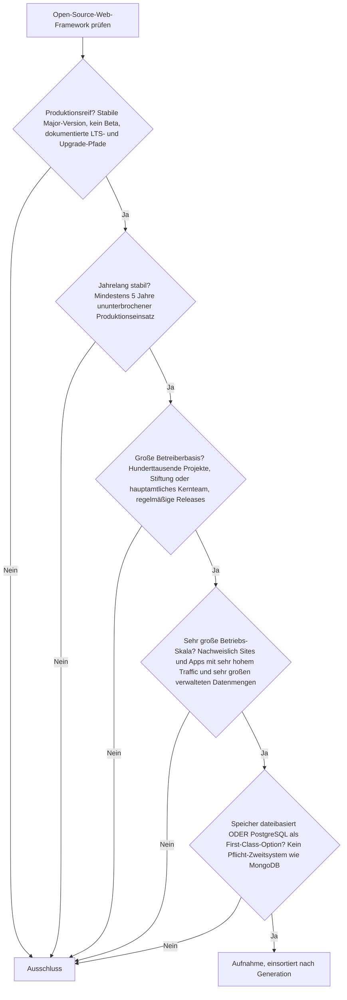
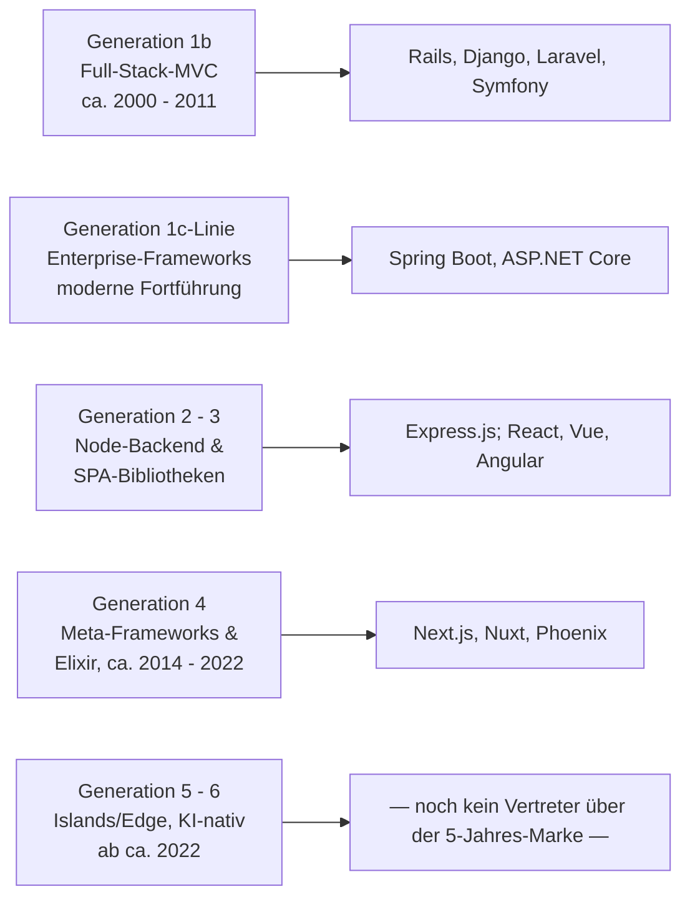
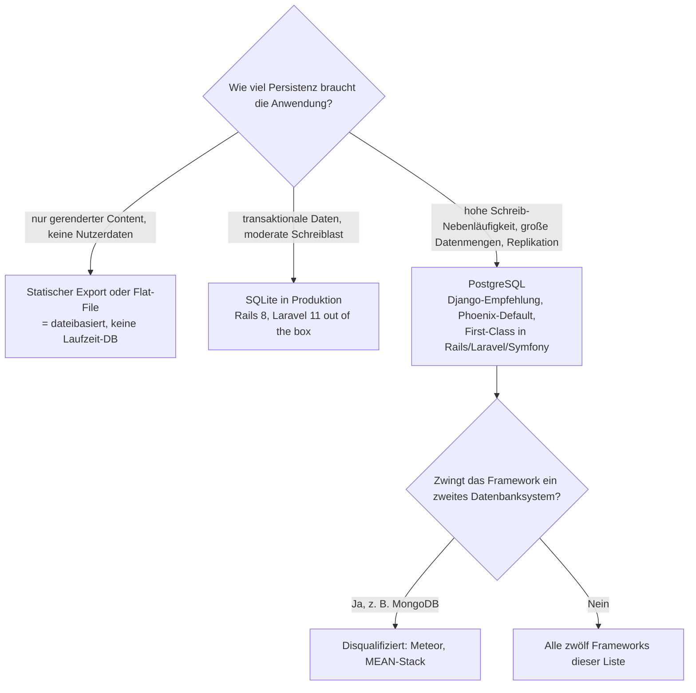

# Produktionsreife Open-Source-Web-Frameworks & -Bibliotheken nach Generation — Reifegrad, Evaluation & Betriebs-Skala

Die [Evolution und Architekturen digitaler Web-Frameworks](evolution-digitaler-webframeworks.md) ordnet die Framework-Landschaft chronologisch in sechs technologische Generationen, die [Topliste bester Web-Frameworks 2026](webframeworks-2026-topliste.md) rankt die gesamte Kategorie nach Verbreitung. Diese Seite legt — parallel zu den Schwesterseiten für [Wissenssysteme](../../wissen/dokumentation/produktionsreife-wissenssysteme-generationen-2026-topliste.md), [CMS](../../wissen/dokumentation/produktionsreife-cms-generationen-2026-topliste.md) und [LMS](../../wissen/e-learning/produktionsreife-lms-generationen-2026-topliste.md) — dasselbe bewusst **konservative** Fünf-Filter-Sieb an und sortiert das Ergebnis nach Generation: produktionsreif · jahrelang stabil · große Betreiberbasis · sehr große Betriebs-Skala · Speicher dateibasiert oder PostgreSQL.

!!! warning "Achtung: Anders als bei LMS und Wikis ist der Speicherfilter hier selten das K.-o.-Kriterium"
    Web-Frameworks bringen ihre Persistenzschicht **austauschbar** mit — die meisten reifen Frameworks bestehen den Speicherfilter mühelos, weil sie überhaupt kein Datenbanksystem erzwingen. Zur Ausnahme wird nur, wer ein **Pflicht-Zweitsystem** wie MongoDB bündelt: **Meteor** und der MEAN-Stack fallen genau daran. Umgekehrt ist ein rein **dateibasierter** Produktionsbetrieb hier — anders als bei LMS — seit **Rails 8** (2024) und **Laravel 11** (2024) eine ernsthafte Option, weil SQLite in beiden der Standard ist. Die Begründung steht im [Speicher-Fazit](#dateibasiert-oder-postgresql-diesmal-beides).

---

## Die fünf harten Filter

!!! note "Hinweis: Nur OSI-anerkannte Lizenzen"
    Wie in den Schwesterlisten zählen nur Systeme unter einer OSI-anerkannten Open-Source-Lizenz. In der Web-Framework-Welt ist das selten die Hürde — MIT, BSD-2/3-Clause, Apache-2.0 und GPL dominieren. Ausgeschlossen bleiben quellverfügbare, aber nicht OSI-lizenzierte Sonderfälle und rein kommerzielle Frameworks.

---

## Ergebnis: breiter als die Schwesterlisten

Zwölf Frameworks bestehen alle fünf Filter. Das ist deutlich mehr als bei LMS (2) oder Wikis (12 von einem viel kleineren Feld) — nicht weil die Filter lockerer sind, sondern weil die Web-Framework-Kategorie älter, breiter betrieben und speicher-agnostischer ist.

---

## Systeme nach Generation

### Generation 1b — Full-Stack-MVC-Frameworks (ca. 2000 – 2011)

| # | System | Sprache | Speicher | Lizenz | Seit | Skala-Nachweis |
|---|---|---|---|---|---|---|
| 1 | **[Ruby on Rails](evolution-digitaler-monolith-frameworks.md)** | Ruby | SQLite (Default ab Rails 8) **oder** PostgreSQL First-Class | MIT | 2004 | GitHub, Shopify, Basecamp — Shopify betreibt einen der größten Rails-Monolithen der Welt |
| 2 | **Django** | Python | PostgreSQL ausdrücklich empfohlen; SQLite/MySQL unterstützt | BSD-3-Clause | 2005 | Instagram, Disqus, Mozilla — Instagram als eines der größten Django-Deployments überhaupt |
| 3 | **Laravel** | PHP | SQLite (Default ab Laravel 11) **oder** PostgreSQL/MySQL First-Class | MIT | 2011 | Größtes PHP-Framework-Ökosystem, breite Agentur- und SaaS-Nutzung |
| 4 | **Symfony** | PHP | PostgreSQL First-Class über Doctrine | MIT | 2011 | Unterbau von Drupal, Shopware und großen Teilen des PHP-Enterprise-Markts |

Alle vier sind [Batteries-Included-Frameworks](evolution-digitaler-batteries-included-frameworks.md): ORM, Auth, Migrationen und Scaffolding stecken im Kern. Für diese Klasse ist der Speicherfilter überhaupt aussagekräftig — und alle vier führen entweder SQLite oder PostgreSQL als gleichwertige, dokumentierte First-Class-Wahl. **Rails** und **Django** sind die Referenzfälle: zwei Jahrzehnte Produktionshistorie, Skalierung nachweislich bis in den Bereich hunderter Millionen Nutzer.

### Generation 1c-Linie — Enterprise-Frameworks (moderne Fortführung)

| # | System | Sprache | Speicher | Lizenz | Seit | Skala-Nachweis |
|---|---|---|---|---|---|---|
| 5 | **[Spring Boot](evolution-digitaler-enterprise-webframeworks.md)** | Java/Kotlin | datenbank-agnostisch über JPA/Hibernate; PostgreSQL voll unterstützt | Apache-2.0 | 2014 | De-facto-Standard für Java-Backends in Banken, Handel und Industrie |
| 6 | **ASP.NET Core** | C# | datenbank-agnostisch über EF Core; PostgreSQL (Npgsql) First-Class | MIT | 2016 | Stack Overflow, Microsoft-Dienste; plattformübergreifend seit Core |

Die klassische Enterprise-Java/.NET-Generation (Struts, JSF, Portal-Frameworks) ist [architektonisch abgelöst](evolution-digitaler-enterprise-webframeworks.md); ihre lebenden Nachfolger **Spring Boot** und **ASP.NET Core** erzwingen kein Datenbanksystem und binden PostgreSQL sauber über die jeweilige ORM-Schicht an.

### Generation 2 & 3 — Node-Backend & SPA-Bibliotheken (ca. 2010 – 2016)

| # | System | Rolle | Speicher | Lizenz | Seit |
|---|---|---|---|---|---|
| 7 | **Express.js** | minimalistisches Node-Backend / API-Schicht | speicher-agnostisch — keine Datenschicht im Kern | MIT | 2010 |
| 8 | **[React](evolution-digitaler-spa-frameworks.md)** | UI-Bibliothek (Rendering) | Speicherfilter nicht anwendbar — keine Persistenzschicht | MIT | 2013 |
| 9 | **Vue.js** | UI-Framework (Rendering) | Speicherfilter nicht anwendbar | MIT | 2014 |
| 10 | **Angular** | UI-Framework (Rendering, Google) | Speicherfilter nicht anwendbar | MIT | 2016 |

**Express.js** mandatiert nichts und besteht den Speicherfilter genau deshalb — die häufige Paarung mit MongoDB (MEAN) ist Konvention, keine Anforderung. **React, Vue und Angular** sind reine Client-Bibliotheken ohne eigene Persistenz; für sie greift der Speicherfilter nicht, ihre Aufnahme stützt sich allein auf Reife und Betriebs-Skala (React und Vue mit den größten Frontend-Ökosystemen weltweit).

### Generation 4 — Full-Stack-Meta-Frameworks & Elixir (ca. 2014 – 2022)

| # | System | Basis | Speicher | Lizenz | Seit | Skala-Nachweis |
|---|---|---|---|---|---|---|
| 11 | **[Next.js](evolution-digitaler-meta-frameworks.md)** | React | bring-your-own-DB; statischer Export dateibasiert | MIT | 2016 | Marketing- und App-Frontends von TikTok, Notion, Twitch, Hulu |
| — | **Nuxt** | Vue | bring-your-own-DB; statischer Export dateibasiert | MIT | 2016 | größtes Vue-Meta-Framework, breite Produktionsnutzung |
| 12 | **Phoenix** | Elixir | Ecto mit PostgreSQL-Adapter als Default | MIT | 2014 | Discord (Voice/Presence auf der Erlang-VM), Sicherheit auf Millionen gleichzeitiger Verbindungen |

**Next.js** und **Nuxt** schreiben keine Datenbank vor und rendern im SSG-Modus vollständig dateibasiert. **Phoenix** ist der Elixir-Vertreter: `mix phx.new` erzeugt standardmäßig ein PostgreSQL-Projekt über Ecto, und die Erlang-VM trägt Echtzeit-Workloads, an denen klassische Stacks scheitern.

### Generation 5 – 6 — warum hier (noch) nichts steht

- **Generation 5 (Islands & Edge)**: **Astro** (2021), **Qwik** (2021), **SolidStart** und **TanStack Start** sind architektonisch reif, liegen aber unter der **Fünf-Jahres-Marke** für ununterbrochenen Produktionseinsatz. Astro dürfte 2027 als erster Kandidat nachrücken.
- **Generation 6 (KI-nativ)**: zu jung und häufig an einen einzelnen Hosting-Anbieter gekoppelt — die Reifezeit-Filter greifen doppelt. Details: [Evolution und Architekturen digitaler KI-nativer Web-Frameworks](evolution-digitaler-ki-native-webframeworks.md).
- **Rust-Web-Frameworks** (Axum, Actix Web, Leptos): reif und schnell wachsend, aber Betreiberbasis und Fünf-Jahres-Produktionshistorie noch nicht auf dem Niveau der obigen zwölf. Eigene Betrachtung: [Evolution und Architekturen digitaler Rust-Webframeworks](evolution-digitaler-rust-webframeworks.md).

### Quer zu den Generationen — dateibasierte Persistenz

Was dateibasiert sein **kann**, ist hier — anders als bei LMS — die Datenbank selbst, nicht nur statische Assets:

| Ansatz | Was dateibasiert ist |
|---|---|
| **SQLite in Produktion** (Rails 8, Laravel 11 als Default) | Die vollständige relationale Datenbank ist eine einzelne Datei; Replikation über Litestream/LiteFS |
| **Statischer Export** (Next.js/Nuxt/Astro SSG) | HTML und JSON liegen fertig auf der Platte, zur Laufzeit läuft keine Datenbank |
| **Flat-File-Content** (Markdown/MDX im Repository) | Der Inhalt liegt im Git, das Framework rendert ihn zur Build-Zeit — verwandt mit [Static-Site-Generatoren](../../wissen/dokumentation/static-site-generatoren-2026-topliste.md) |

---

## Dateibasiert oder PostgreSQL? — Diesmal beides

Die Persistenzschicht eines Web-Frameworks ist **auswechselbar** — deshalb ist die Frage nicht „welches Framework kann PostgreSQL", sondern „welches Framework **erzwingt etwas anderes**". Nur dort fällt eine Entscheidung:

- **PostgreSQL als Standardwahl** → **Django** (in der Doku ausdrücklich als leistungsfähigste Option empfohlen), **Phoenix** (Ecto-Default), sowie First-Class-Treiber in **Rails**, **Laravel** und **Symfony**. Die sichere Wahl bei hoher Schreib-Nebenläufigkeit, großen Datenmengen und echter Replikation — Vertiefung: [PostgreSQL DBA Praxis-Handbuch](../infrastruktur/postgresql-dba-praxis.md).
- **Dateibasiert (SQLite) tragfähig** → seit **Rails 8** und **Laravel 11** ohne Zusatzarbeit für kleine bis mittlere Schreiblast; Replikation über Litestream/LiteFS.
- **Speicher-agnostisch** → **Express.js**, **Next.js**, **Nuxt** und die SPA-Bibliotheken schreiben nichts vor; PostgreSQL ist die pragmatische Standardwahl, wenn eine Datenbank hinzukommt.
- **Disqualifiziert** → Frameworks mit einem Pflicht-Zweitsystem: **Meteor** bündelt MongoDB als Kern-Datenbank, der **MEAN-Stack** hat es im Namen.

!!! warning "Achtung: Momentaufnahme, Stand August 2026"
    Framework-Defaults verschieben sich mit Major-Releases — die SQLite-als-Default-Entscheidung von Rails und Laravel ist erst rund zwei Jahre alt. Vor dem Produktivstart die aktuelle Deployment-Dokumentation der jeweiligen Major-Version prüfen.

---

## Was bewusst nicht auf dieser Liste steht

| System | Erfüllt nicht | Anmerkung |
|---|---|---|
| **Meteor** | Speicherfilter | MongoDB als gebündeltes Pflichtsystem — das Web-Pendant zu Open edX in der LMS-Liste |
| **MEAN-Stack** | Speicherfilter | Bündelt MongoDB per Definition; die Einzelteile (Express, Angular, Node) qualifizieren sich getrennt |
| **AngularJS 1.x** | Produktionsreife / Stabilität | End-of-Life seit Januar 2022 — nicht zu verwechseln mit dem aktuellen Angular |
| **Gatsby** | Betreiberbasis / Aktivität | Stark koppelnder GraphQL-Datenlayer; Wartung nach der Netlify-Übernahme deutlich zurückgefahren |
| **Astro, Qwik, SolidStart, TanStack Start** | Reifezeit | Architektonisch reif, aber unter fünf Jahren Produktionshistorie |
| **KI-native Frameworks (Generation 6)** | Reifezeit + Betreiberbasis | Zu jung, oft an einen Hosting-Anbieter gebunden |
| **Struts, JSF / Jakarta Faces** | Betreiberbasis | Struts EOL; JSF im Neubau eine Nische |
| **RedwoodJS, Blitz.js** | Betreiberbasis | Kleinere Basis; RedwoodJS mitten in einer Neuausrichtung |
| **Rails / Django / Laravel auf MySQL/MariaDB** | — (bewusste Einordnung) | Voll akzeptabel; die Liste bevorzugt die dokumentierte PostgreSQL-/Datei-First-Class-Wahl, wie die LMS-Seite den MySQL-Split macht |

---

## 🔗 Verwandte Themen

- [Evolution und Architekturen digitaler Web-Frameworks](evolution-digitaler-webframeworks.md) — das sechsstufige Generationenmodell, nach dem diese Liste sortiert ist
- [Beste Web-Frameworks 2026 (Top 20)](webframeworks-2026-topliste.md) — breiteste Basis-Topliste nach Verbreitung
- [Evolution und Architekturen digitaler Batteries-Included-Web-Frameworks](evolution-digitaler-batteries-included-frameworks.md) — die Vollausstattungs-Achse, für die der Speicherfilter überhaupt greift
- [Evolution und Architekturen digitaler Server-Monolith-Frameworks](evolution-digitaler-monolith-frameworks.md) — vertiefend zu Generation 1 (Rails, Django, Laravel)
- [Evolution und Architekturen digitaler Enterprise-Web-Frameworks](evolution-digitaler-enterprise-webframeworks.md) — vertiefend zu Spring Boot und ASP.NET Core
- [Produktionsreife Open-Source-Enterprise-Web-Frameworks nach Generation (Top 7 + Grenzfälle)](produktionsreife-enterprise-webframeworks-generationen-2026-topliste.md) — dasselbe Sieb, enger auf die Enterprise-Klasse (Java/.NET) gefasst; dort fällt die Speicherantwort eindeutig auf PostgreSQL
- [Evolution und Architekturen digitaler Rust-Webframeworks](evolution-digitaler-rust-webframeworks.md) — die Rust-Kandidaten, die die Fünf-Jahres-Marke noch nicht erreichen
- [Produktionsreife Open-Source-Wissenssysteme nach Generation (Top 12)](../../wissen/dokumentation/produktionsreife-wissenssysteme-generationen-2026-topliste.md) — Schwester-Topliste mit demselben Fünf-Filter-Sieb für Wikis, PKM und RAG
- [Produktionsreife Open-Source-CMS nach Generation (Top 12)](../../wissen/dokumentation/produktionsreife-cms-generationen-2026-topliste.md) — dasselbe Sieb für Content-Management-Systeme
- [Produktionsreife Open-Source-LMS nach Generation](../../wissen/e-learning/produktionsreife-lms-generationen-2026-topliste.md) — dasselbe Sieb für Lernmanagement-Systeme
- [PostgreSQL DBA Praxis-Handbuch](../infrastruktur/postgresql-dba-praxis.md) — die Datenbankschicht hinter der PostgreSQL-Empfehlung
- [Beste Static-Site- & Docs-Generatoren 2026 (Top 20)](../../wissen/dokumentation/static-site-generatoren-2026-topliste.md) — die dateibasierte Option für reinen gerenderten Content
