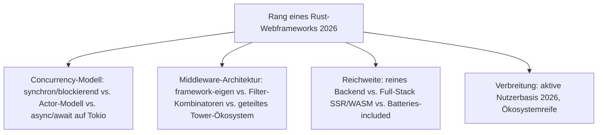
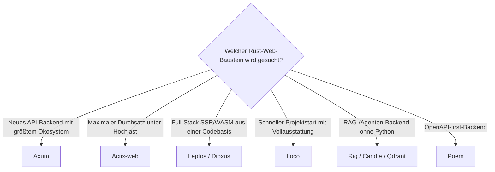

# Beste Rust-Webframeworks 2026 — Top-15-Topliste

Die [Evolution und Architekturen digitaler Rust-Webframeworks](evolution-digitaler-rust-webframeworks.md) ordnet diese Kategorie chronologisch nach Architektur-Generation — von frühen synchronen Experimenten vor stabilem Async über das Actor-Modell und die Tokio-Runtime bis zu ausgereiften Tower-Middleware-Frameworks, Full-Stack-SSR/WASM-Ansätzen und KI-nativen Streaming-Backends. Diese Seite übersetzt die Chronologie in eine **Momentaufnahme 2026**: 15 Frameworks und Bausteine, die heute tatsächlich betrieben werden.

!!! note "Hinweis: Abgrenzung zum KI-Eignungs-Ranking"
    Wer konkrete Frameworks nach ihrer **Eignung für KI-Anwendungen** vergleichen will, findet das spezialisierte Ranking in [Beste Rust-Frameworks & Web-Backends mit KI-Unterstützung (Top 20)](../../künstliche-intelligenz/coding/rust-web-frameworks-ki-topliste.md). Diese Seite ordnet dieselben und weitere Frameworks stattdessen nach **allgemeiner Verbreitung über alle sechs Architektur-Generationen hinweg**.

---

## Bewertungskriterien

---

## Top 15 im Überblick

| Rang | Baustein | Generation | Rolle | Besondere Stärke |
|---|---|---|---|---|
| 1 | **Axum** | 4 (Tower-Middleware & Ergonomie-Ära) | Web-Framework | Vom Tokio-Team selbst entwickelt, neue Async-Fähigkeiten meist zuerst hier verfügbar |
| 2 | **Actix-web** | 2/3 (Erste produktionsreife Async-Web-Frameworks / Abkehr vom Actor-Modell) | Web-Framework | Sehr hoher Durchsatz, bis heute produktiv in Hochlast-Systemen eingesetzt |
| 3 | **Tokio** | 1c (Async-Fundament) | Async-Runtime | Fundament, auf dem praktisch jedes spätere Rust-Web-Framework aufbaut |
| 4 | **Hyper** | 1c (Async-Fundament) | HTTP-Bibliothek | Low-Level-HTTP-Implementierung, technische Basis von Axum, Warp und weiteren Frameworks |
| 5 | **Warp** | 2 (Erste produktionsreife Async-Web-Frameworks) | Web-Framework | Komponierbares Filter-System als Routing-Grundlage statt klassischer Middleware-Ketten |
| 6 | **Rocket** | 1b/3 (Actor-Modell & Rocket auf Nightly / Reife & Abkehr vom Actor-Modell) | Web-Framework | Ergonomische Makros und Type-Level-Routing, seit Version 0.5 stabiles Rust statt Nightly |
| 7 | **Leptos** | 5 (Full-Stack-Rust — SSR/WASM) | Full-Stack-Framework | Signal-basierte Reaktivität, Server-Functions erlauben Backend-Aufrufe direkt aus der UI-Logik |
| 8 | **Dioxus** | 5 (Full-Stack-Rust — SSR/WASM) | Full-Stack-Framework | React-ähnliches Komponentenmodell für Web, Desktop und Mobile aus einer gemeinsamen Codebasis |
| 9 | **Loco** | 5 (Full-Stack-Rust — SSR/WASM) | Batteries-Included-Framework | „Rails für Rust" auf Axum-Basis, priorisiert schnellen Projektstart über maximale Flexibilität |
| 10 | **Rig** | 6 (KI-native Rust-Web-Backends) | KI-Anwendungsframework | Rust-natives Pendant zu LangChain — Agents, RAG-Pipelines und Tool-Use ohne Python-Bridge |
| 11 | **Poem** | 4 (Tower-Middleware & Ergonomie-Ära) | Web-Framework | OpenAPI-first-Ansatz mit ähnlicher Ergonomie-Philosophie wie Axum |
| 12 | **Candle** (Hugging Face) | 6 (KI-native Rust-Web-Backends) | ML-Laufzeit | Vervollständigt den Stack für vollständig in Rust implementierte RAG-Backends |
| 13 | **Qdrant** | 6 (KI-native Rust-Web-Backends) | Vektordatenbank | Meistgenutzte Rust-native Vektordatenbank, häufig hinter Axum-/Actix-web-Streaming-APIs |
| 14 | **Iron** | 1a (Synchrone Frameworks vor stabilem Async) | Web-Framework (historisch) | Eines der ersten Rust-Web-Frameworks überhaupt, inspiriert von Express.js/Connect |
| 15 | **Nickel.rs** | 1a (Synchrone Frameworks vor stabilem Async) | Web-Framework (historisch) | An Sinatra angelehnte frühe Alternative, aus der API-Instabilitätsphase vor Rust 1.0 |

---

## Highlights im Detail

### Rang 1–2, 5–6: die vier heute meistgenutzten Rust-Web-Frameworks
Axum, Actix-web, Warp und Rocket decken zusammen praktisch den gesamten produktiven Rust-Web-Backend-Markt ab — mit unterschiedlicher Philosophie (Tower-Middleware, hoher Durchsatz, Filter-Kombinatoren, ergonomische Makros), siehe [Generation 2 und 4](evolution-digitaler-rust-webframeworks.md#generation-4-tower-middleware-ergonomie-ara-ab-2021).

### Rang 3–4: das unsichtbare Async-Fundament
Tokio und Hyper tauchen selten als eigenständige „Frameworks" in Diskussionen auf, tragen aber praktisch jedes andere System dieser Liste — ohne die Stabilisierung von `async`/`await` in Rust 1.39 (2019) wäre Generation 2 nicht möglich gewesen, siehe [Generation 1c](evolution-digitaler-rust-webframeworks.md#generation-1-fruhe-experimente-vor-stabilem-async-2014-2019).

### Rang 10, 12–13: der vollständig Rust-native KI-Stack
Rig, Candle und Qdrant zeigen, wie sich Rust-Web-Backends 2026 direkt mit RAG-Pipelines und LLM-Tool-Use kombinieren lassen, ohne Python-Umweg — siehe [Generation 6](evolution-digitaler-rust-webframeworks.md#generation-6-ki-native-rust-web-backends-ab-2023) und das vertiefende [KI-Eignungs-Ranking](../../künstliche-intelligenz/coding/rust-web-frameworks-ki-topliste.md).

---

## Entscheidungshilfe nach Baustellen-Typ

!!! tip "Tipp: KI-Eignung separat prüfen"
    Für ein detailliertes Ranking nach konkreter KI-Anwendungseignung siehe [Beste Rust-Frameworks & Web-Backends mit KI-Unterstützung (Top 20)](../../künstliche-intelligenz/coding/rust-web-frameworks-ki-topliste.md).

---

## 🔗 Verwandte Themen

- [Startseite](../../index.md) — zurück zur Dokumentations-Zentrale
- [Evolution und Architekturen digitaler Rust-Webframeworks](evolution-digitaler-rust-webframeworks.md) — chronologisches Generationenmodell, dessen aktuellen Stand diese Topliste zusammenfasst
- [Beste Web-Frameworks 2026 (Top 20)](webframeworks-2026-topliste.md) — Gesamtmarkt-Topliste über alle Sprachen hinweg
- [Beste Rust-Frameworks & Web-Backends mit KI-Unterstützung (Top 20)](../../künstliche-intelligenz/coding/rust-web-frameworks-ki-topliste.md) — Ranking nach KI-Eignung statt chronologischer Einordnung
- [Beste Batteries-Included-Web-Frameworks 2026 (Top 15)](batteries-included-frameworks-2026-topliste.md) — Loco dort als Rust-Vertreter der sprachübergreifenden Vollausstattungs-Achse
- [Beste Rust-Bausteine für Wissenssysteme 2026 (Top 20)](../../wissen/dokumentation/rust-wissenssysteme-2026-topliste.md) — Candle/Qdrant als geteilte Bausteine, analoge Rust-Achse für Wissenssysteme
- [Beste IDEs & Editoren mit Rust-Unterstützung (Top 20)](../system/rust-ide-topliste.md)
