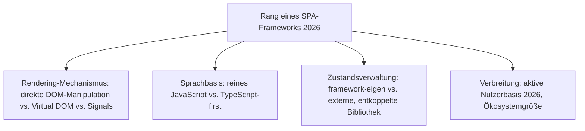
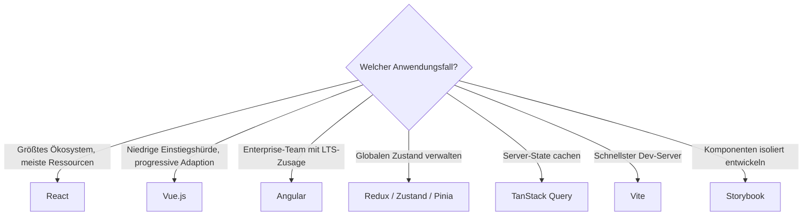

# Beste SPA-Frameworks 2026 — Top-20-Topliste

Die [Evolution und Architekturen digitaler SPA-Frameworks](evolution-digitaler-spa-frameworks.md) ordnet diese Kategorie chronologisch nach Architektur-Generation — von frühen MV*-Frameworks über React und das Virtual DOM, State-Management-Bibliotheken und Vues progressive Adaption bis zum Angular-2-Rewrite und der Build-Tooling-Reife. Diese Seite übersetzt die Chronologie in eine **Momentaufnahme 2026**: 20 Frameworks, Bibliotheken und Werkzeuge, die heute tatsächlich produktiv eingesetzt werden.

!!! note "Hinweis: Abgrenzung zu Meta-Frameworks"
    Diese Liste rankt reine Client-Rendering-Bibliotheken und ihr direktes Ökosystem — Frameworks, die zusätzlich Server-Rendering/SSG einbauen, behandelt [Beste Full-Stack-Meta-Frameworks 2026](meta-frameworks-2026-topliste.md).

---

## Bewertungskriterien

---

## Top 20 im Überblick

| Rang | System | Generation | Besondere Stärke |
|---|---|---|---|
| 1 | **React** | 2 (React & das Virtual DOM) | Einführung des Komponentenmodells und Virtual DOM — bis heute dominante Bibliothek |
| 2 | **Vue.js** | 4 (Vue.js & progressive Adaption) | Positioniert zwischen jQuery-Einfachheit und React-/Angular-Vollausstattung |
| 3 | **Angular** (2+) | 5 (Angular 2+ — kompletter Rewrite) | TypeScript-first, vollständiger Neuanfang gegenüber AngularJS, eingebaute Dependency Injection |
| 4 | **Redux** | 3 (State-Management-Bibliotheken) | Ein unveränderlicher Zustandsbaum, Änderungen nur über reine Reducer-Funktionen — De-facto-Standard |
| 5 | **Zustand** | Ergänzung 2026 | Minimalistische State-Management-Alternative zu Redux mit deutlich weniger Boilerplate |
| 6 | **TanStack Query** | Ergänzung 2026 | Standardwerkzeug für Server-State-Caching, ergänzt Redux/Zustand um Datenabruf-Logik |
| 7 | **Pinia** | Ergänzung 2026 | Offizielles State-Management für Vue 3, Nachfolger von Vuex |
| 8 | **Vite** | Ergänzung 2026 | Meistgenutztes modernes Build-Tool, hat Webpack als Standard-Dev-Server weitgehend abgelöst |
| 9 | **Webpack** | 6 (Component-Ökosystem-Reife & Build-Tooling) | Modul-Bundler, der JavaScript, CSS und Assets zu optimierten Produktions-Bundles zusammenführt |
| 10 | **Babel** | 6 (Component-Ökosystem-Reife & Build-Tooling) | Transpiliert modernes JavaScript zu browserkompatiblem Code, Voraussetzung für JSX |
| 11 | **Ember.js** | 1c (Ember.js — Konvention statt Konfiguration) | „Convention over Configuration" analog zu Rails, eingebautes Routing und Datenschicht |
| 12 | **Vite + Vue/React SFC-Tooling** | Ergänzung 2026 | Single-File-Components mit HMR in Millisekunden statt Sekunden |
| 13 | **RxJS** | 5 (Angular 2+ — kompletter Rewrite) | Reaktive Programmierung als Kernbaustein von Angular, weit über Angular hinaus genutzt |
| 14 | **Backbone.js** | 1a (Backbone.js — minimalistisches MV*) | Minimalistisches MV*-Muster, in älteren Bestandsprojekten weiterhin aktiv |
| 15 | **Create React App** (historisch) / **Vite React-Template** | 6 (Component-Ökosystem-Reife) | Senkt die Einstiegshürde für neue React-Projekte drastisch |
| 16 | **Flux** | 3 (State-Management-Bibliotheken) | Facebooks ursprüngliches Architekturmuster, konzeptioneller Vorläufer von Redux |
| 17 | **AngularJS** (1.x) | 1b (AngularJS — Zwei-Wege-Datenbindung & DI) | Prägte den Begriff „SPA", heute nur noch in Legacy-Bestandsprojekten aktiv |
| 18 | **Jotai** | Ergänzung 2026 | Atomares State-Management für React, wachsende Alternative zu Redux/Zustand |
| 19 | **XState** | Ergänzung 2026 | State-Machine-basiertes Zustandsmanagement für komplexe UI-Abläufe |
| 20 | **Storybook** | Ergänzung 2026 | Meistgenutztes Werkzeug für isolierte Komponentenentwicklung und -dokumentation |

---

## Highlights im Detail

### Rang 1–3: die drei dominanten Basis-Bibliotheken
React, Vue.js und Angular decken zusammen praktisch den gesamten SPA-Markt ab — jeweils mit unterschiedlicher Philosophie (unopinionated Bibliothek, progressive Adaption, vollständiges TypeScript-first-Framework), siehe [Generation 2, 4 und 5](evolution-digitaler-spa-frameworks.md#generation-2-react-das-virtual-dom-2013).

### Rang 4–7, 18: die State-Management-Vielfalt nach Redux
Zustand, TanStack Query, Pinia und Jotai zeigen, dass sich das Redux-Muster aus [Generation 3](evolution-digitaler-spa-frameworks.md#generation-3-state-management-bibliotheken-2014-2015) 2026 in mehrere spezialisierte Nachfolger aufgefächert hat, statt eines einzigen dominanten Standards.

### Rang 8–10: das Build-Tooling-Fundament, ohne das SPA-Entwicklung nicht skaliert
Vite, Webpack und Babel sind keine UI-Frameworks, sondern die Infrastruktur, auf der praktisch jedes andere System dieser Liste aufbaut — Vite hat Webpack als Standard-Dev-Server 2026 weitgehend abgelöst, siehe [Generation 6](evolution-digitaler-spa-frameworks.md#generation-6-component-okosystem-reife-build-tooling-2014-2016).

---

## Entscheidungshilfe nach Anwendungsfall

!!! tip "Tipp: Meta-Framework-Perspektive separat prüfen"
    Wer SEO-fähiges Server-Rendering statt reinem Client-Rendering sucht, findet die passenderen Kandidaten in [Beste Full-Stack-Meta-Frameworks 2026](meta-frameworks-2026-topliste.md).

---

## 🔗 Verwandte Themen

- [Startseite](../../index.md) — zurück zur Dokumentations-Zentrale
- [Evolution und Architekturen digitaler SPA-Frameworks](evolution-digitaler-spa-frameworks.md) — chronologisches Generationenmodell, dessen aktuellen Stand diese Topliste zusammenfasst
- [Beste Web-Frameworks 2026 (Top 20)](webframeworks-2026-topliste.md) — Gesamtmarkt-Topliste über alle Generationen hinweg
- [Einflussreichste Ajax- & JavaScript-Bibliotheken (Top 15)](ajax-js-bibliotheken-topliste.md) — vorausgehende Generation
- [Beste Full-Stack-Meta-Frameworks 2026 (Top 15)](meta-frameworks-2026-topliste.md) — nachfolgende Generation
- [Beste Enterprise-Web-Frameworks 2026 (Top 15)](enterprise-webframeworks-2026-topliste.md) — Angulars Enterprise-Positionierung vertieft
- [Beste Enterprise-UI-Bibliotheken 2026 (Top 15)](enterprise-ui-bibliotheken-2026-topliste.md) — Kendo UI for Angular und PrimeNG als konkrete Angular-Komponentenbibliotheken
