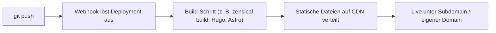
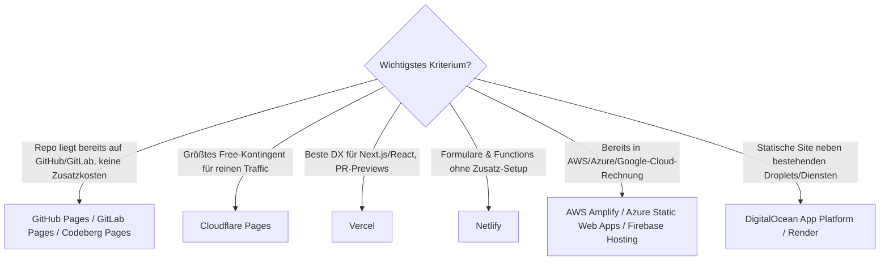

# Statisches Hosting aus Git-Repositories: Anbieter & Preise

Statisches Hosting **direkt aus einem Git-Repository** bedeutet: Ein `git push` löst automatisch Build und Deployment aus — ohne manuellen Datei-Upload, ohne eigenen Server. Der Anbieter beobachtet das Repository per Webhook, baut die Seite (z. B. mit Hugo, Zensical, Astro oder einem reinen HTML-Ordner) und stellt sie über ein CDN aus.

---

## Wie die Pipeline funktioniert



!!! note "Hinweis"
    Diese Seite selbst (Wissen Ahrensburg) nutzt genau dieses Muster: `npm run ver` baut mit Zensical und pusht `site/` in den `gh-pages`-Branch, von dem GitHub Pages die Seite ausliefert.

---

## Worauf beim Vergleich achten

!!! tip "Checkliste vor der Anbieterwahl"
    - **Kostenlose Kontingente**: Bandbreite/Monat, Build-Minuten, Anzahl Sites/Projekte — diese Grenzen entscheiden, wie lange "kostenlos" wirklich reicht.
    - **Abrechnungsmodell**: Festes Freemium-Abo (Netlify, Vercel) vs. reines Pay-as-you-go (AWS Amplify, Firebase Blaze) — Pay-as-you-go kann bei Traffic-Spitzen überraschen.
    - **Team-/Kommerz-Nutzung**: Manche Free-Tiers (z. B. Vercel Hobby) sind ausdrücklich nicht-kommerziell lizenziert.
    - **Vendor-Lock-in**: Reine Git-Pages-Dienste (GitHub/GitLab/Codeberg Pages) sind am portabelsten, da nur Standard-HTML/CSS/JS ausgeliefert wird.
    - **Preview-Deployments**: Ob jeder Pull Request automatisch eine eigene Vorschau-URL bekommt (Standard bei Netlify, Vercel, Cloudflare Pages).

!!! warning "Achtung"
    Preise und Kontingente ändern sich bei diesen Anbietern häufig (2026 z. B. Umstellung von Netlify auf Credit-Abrechnung, Wegfall der Vercel-Pro-Sitzplatzpreise). Die Tabelle dient nur zur groben Orientierung — vor einer Entscheidung immer die aktuelle Preisseite des Anbieters prüfen.

---

## Vergleichstabelle: kostenlose Kontingente & Einstiegspreise

| Anbieter | Kostenlos-Kontingent | Bezahlt ab | Besonderheit |
|---|---|---|---|
| **GitHub Pages** | 1 GB Site-Größe, ~100 GB Bandbreite/Monat (Soft-Limit), 10 Builds/Std. (Soft-Limit) | An GitHub-Kontoplan gekoppelt (kein eigener Pages-Tarif) | Am einfachsten bei Repo bereits auf GitHub; öffentliche Repos kostenlos, private Pages erst ab Pro-Konto |
| **GitLab Pages** | 10 GB pro Repository, unbegrenzte Sites, 400 CI/CD-Minuten/Monat | Premium ab 29 $/Nutzer/Monat (mehr CI-Minuten) | Volle CI/CD-Pipeline inklusive, nicht nur Deployment |
| **Codeberg Pages** | Vollständig kostenlos, kein Bandbreiten-Deckel dokumentiert | Kein Bezahltarif (spendenfinanziert) | Gemeinnützig, EU-Server, kein Tracking — Alternative ohne Konzern dahinter |
| **Cloudflare Pages** | 500 Builds/Monat, unbegrenzte statische Requests; Functions über Workers-Free (100.000 Requests/Tag) | Workers Paid ab 5 $/Monat (kein Tageslimit, 30 s CPU-Zeit) | Größtes Free-Kontingent für reinen Static-Traffic, globales CDN |
| **Netlify** | 300 Credits/Monat (≈ 20 Produktions-Deploys oder 15 GB Traffic) | Personal 9 $/Monat (1.000 Credits), Pro 20 $/Monat (3.000 Credits, unlimitierte Teammitglieder) | Formulare, Functions und A/B-Split-Testing im Baukasten enthalten |
| **Vercel** | 100 GB Bandbreite, 1 Mio. Function-Aufrufe, 4 h Active CPU — nur nicht-kommerzielle Nutzung | Pro 20 $/Sitzplatz/Monat inkl. 20 $ Nutzungsguthaben | Beste Developer Experience für Next.js/React, Preview-URL pro PR |
| **Render** | 100 GB Bandbreite/Monat, 750 Build-Minuten, 2 Custom-Domains | Zusatz-Bandbreite 0,10 $/GB, weitere Domains 0,25 $/Monat | Statische Sites dauerhaft kostenlos, auch neben bezahlten Diensten (DB, Worker) im selben Workspace |
| **AWS Amplify Hosting** | 1.000 Build-Minuten, 5 GB Speicher, 15 GB Transfer/Monat | Danach 0,01 $/Build-Minute, 0,023 $/GB Speicher, 0,15 $/GB Transfer | Reines Pay-as-you-go, kein Abo — passt in bestehende AWS-Rechnung |
| **Azure Static Web Apps** | 100 GB Bandbreite, 1 Custom-Domain, kein SLA | Standard 9 $/App/Monat (500 GB, SLA, mehr Domains) | Sekundengenaue Abrechnung, enge Integration mit Azure Functions als Backend |
| **Firebase Hosting** | 10 GB Speicher, ~10,8 GB Transfer/Monat (360 MB/Tag) | Blaze-Tarif: Pay-as-you-go, 0,15 $/GB darüber | Sinnvoll, wenn ohnehin Firebase-Auth/-Firestore im Einsatz ist |
| **DigitalOcean App Platform** | 3 statische Sites gratis, je 1 GiB Transfer/Monat | Weitere Sites 3 $/Monat, Transfer 0,02 $/GiB | Statische Site neben bestehenden Droplets/Datenbanken im selben Konto |

---

## Gruppierung nach Anwendungsfall

### Reine Git-Pages-Dienste
**GitHub Pages**, **GitLab Pages** und **Codeberg Pages** sind an die jeweilige Code-Hosting-Plattform gebunden. Keine separate Anmeldung nötig, kein Vendor-Lock-in über proprietäre Build-Formate hinaus — ideal für Projektseiten, Dokumentation (wie diese hier) und persönliche Blogs.

### Jamstack-Plattformen
**Netlify**, **Vercel**, **Cloudflare Pages** und **Render** sind spezialisierte Hosting-Anbieter mit Preview-Deployments pro Pull Request, Serverless Functions und CDN als Kernprodukt. Hier lohnt sich der Umstieg, sobald Formulare, A/B-Tests oder dynamische API-Routen neben dem statischen Teil gebraucht werden.

### Cloud-Provider-Integration
**AWS Amplify Hosting**, **Azure Static Web Apps**, **Firebase Hosting** und **DigitalOcean App Platform** binden das Static-Hosting in ein größeres Cloud-Ökosystem ein — sinnvoll, wenn Backend, Datenbank oder Auth bereits beim selben Anbieter laufen und eine gemeinsame Rechnung gewünscht ist.

---

## Entscheidungshilfe



---

## Beispiel-Konfiguration

=== "GitHub Actions → GitHub Pages"
    ```yaml
    # .github/workflows/deploy.yml
    name: Deploy to GitHub Pages
    on:
      push:
        branches: [main]
    jobs:
      build-deploy:
        runs-on: ubuntu-latest
        steps:
          - uses: actions/checkout@v4
          - name: Build
            run: npm ci && npm run build
          - name: Deploy
            uses: peaceiris/actions-gh-pages@v4
            with:
              github_token: ${{ secrets.GITHUB_TOKEN }}
              publish_dir: ./dist
    ```

=== "netlify.toml"
    ```toml
    [build]
      command = "npm run build"
      publish = "dist"

    [build.environment]
      NODE_VERSION = "20"
    ```

---

## 🔗 Verwandte Themen

- [Deployment mit KI](deployment.md) — CI/CD-Pipelines, Blue-Green- und Canary-Strategien für dynamische Anwendungen
- [KVM-Server mieten](../infrastruktur/kvm-server-mieten.md) — Alternative, wenn eigenes Server-Hosting statt verwaltetem Static-Hosting gebraucht wird
- [Webentwicklung/Übersicht](index.md) — zurück zur Übersicht
