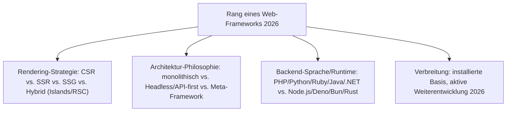
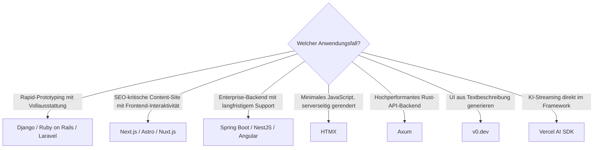

# Beste Web-Frameworks 2026 — Top-20-Topliste

Die [Evolution und Architekturen digitaler Web-Frameworks](evolution-digitaler-webframeworks.md) bündelt sechs Generationen — von serverseitigen CGI-/MVC-Frameworks über die Ajax-Ära, Single-Page-Applications und Full-Stack-Meta-Frameworks bis zu Server-Components/Islands-Architekturen und KI-nativen Frameworks — plus drei quer liegende Achsen (Batteries-Included, Enterprise, Rust). Diese Seite übersetzt den gesamten Cluster in eine **Momentaufnahme 2026**: 20 Frameworks und Bibliotheken, die 2026 tatsächlich produktiv im Einsatz sind, quer über alle Generationen und Querschnittsachsen hinweg.

!!! note "Hinweis: neun Zeitachsen, ein gemeinsames Ranking"
    Diese Seite mischt bewusst alle Generationen und Querschnittsachsen gleichberechtigt — Django (Generation 1) konkurriert hier direkt mit Astro (Generation 5), obwohl beide völlig unterschiedliche Architekturprinzipien verfolgen. Für die Tiefenperspektive je Generation siehe die neun verlinkten Sub-Toplisten unter „Verwandte Themen".

---

## Bewertungskriterien

!!! warning "Achtung: Momentaufnahme, Stand August 2026"
    Die KI-native Ebene (Rang 18–20) verändert sich am schnellsten — vor einer Langzeitentscheidung aktuelle Roadmap prüfen.

---

## Top 20 im Überblick

| Rang | Framework | Generation | Backend/Basis | Besondere Stärke |
|---|---|---|---|---|
| 1 | **React** | 3 (SPA-Frameworks) | JavaScript | Virtual DOM & komponentenbasierte UIs, bis heute dominante Basis-Bibliothek |
| 2 | **Next.js** | 4/5 (Meta-Frameworks / Islands-Edge) | React | Referenzarchitektur für SSR/SSG/RSC, größtes Ökosystem aller Meta-Frameworks |
| 3 | **Vue.js** | 3 (SPA-Frameworks) | JavaScript | Progressive Adaption zwischen jQuery-Einfachheit und React-/Angular-Vollausstattung |
| 4 | **Django** | 1 (Server-Monolith) | Python | „Batteries included" — ORM, Admin-Oberfläche und Auth direkt im Kern |
| 5 | **Ruby on Rails** | 1 (Server-Monolith) | Ruby | Prägte „Convention over Configuration" für eine ganze Framework-Generation |
| 6 | **Spring Boot** | Enterprise (Gen. 2) | Java | „Convention over Configuration" plus eingebetteter Server, Standard im Java-Enterprise-Umfeld |
| 7 | **Laravel** | Batteries-Included (Gen. 2) | PHP | Elegante Syntax, Composer-Paketverwaltung, verdrängt ältere PHP-Frameworks als De-facto-Standard |
| 8 | **Angular** | Enterprise (Gen. 4) | TypeScript | Vollständiges, Google-gestütztes Framework mit eingebauter Dependency Injection und LTS-Zyklus |
| 9 | **Astro** | 5 (Islands-Edge) | Framework-agnostisch | Islands-Architektur von Grund auf — standardmäßig null JavaScript |
| 10 | **SvelteKit** | 4 (Meta-Frameworks) | Svelte | Compiler-basiert ohne Virtual DOM, kleinere Bundles als React-/Vue-Äquivalente |
| 11 | **Express.js** | 2/3 (Ajax-Ära → SPA-Backend) | Node.js | Bis heute meistgenutztes API-Backend hinter modernen SPA- und Meta-Framework-Frontends |
| 12 | **jQuery** | 2 (Ajax-Ära) | JavaScript | Jahrelang meistgenutzte JS-Bibliothek weltweit, in unzähligen Bestandsprojekten weiterhin aktiv |
| 13 | **Nuxt.js** | 4 (Meta-Frameworks) | Vue | Analoges Konzept zu Next.js für das Vue-Ökosystem |
| 14 | **NestJS** | Enterprise (Gen. 5) | Node.js | Bringt Angular-artige Modul-/Decorator-/DI-Struktur explizit in die Node.js-Backend-Welt |
| 15 | **FastAPI** | 1 (Server-Monolith, Python-Microframeworks) | Python | Async-first, automatische OpenAPI-Dokumentation aus Typannotationen |
| 16 | **HTMX** | 1 (Server-Monolith, Hypermedia-Comeback) | Framework-agnostisch | Erweitert HTML um Ajax-/WebSocket-Attribute ohne Build-Schritt oder Virtual DOM |
| 17 | **Axum** | Rust (Gen. 4) | Rust | Vom Tokio-Team selbst entwickelt, neue Async-Fähigkeiten meist zuerst hier verfügbar |
| 18 | **v0.dev** | 6 (KI-native Web-Frameworks) | React/Next.js | Generiert vollständige React/Next.js-Komponenten aus Textbeschreibungen oder Screenshots |
| 19 | **Qwik** | 5 (Islands-Edge) | JavaScript | „Resumability" statt Hydration — Browser führt gespeicherten Ausführungszustand fort |
| 20 | **Vercel AI SDK** | 6 (KI-native Web-Frameworks) | React/Next.js | Framework-eigene Primitive für Streaming, Tool-Calling und generative UI |

---

## Highlights im Detail

### Rang 1–3, 9–10, 13, 19: die dominanten Frontend-Basis-Bibliotheken und ihre Meta-Framework-Ableger
React, Vue.js, Astro, SvelteKit, Nuxt.js und Qwik zeigen zusammen die gesamte Bandbreite heutiger Rendering-Strategien — von reinem Component-Modell über Islands-Architektur bis Resumability, siehe [Generation 3–5 der Web-Frameworks-Zeitachse](evolution-digitaler-webframeworks.md#generation-3-single-page-application-frameworks-spa-ca-2010-2016).

### Rang 4–8, 14–15: die Server-Monolith- und Enterprise-Achse bleibt marktprägend
Django, Ruby on Rails, Spring Boot, Laravel, Angular, NestJS und FastAPI belegen, dass klassische, serverseitige Architektur 2026 keineswegs von SPA-/Meta-Frameworks verdrängt wurde — sie bedienen jeweils eigene Zielgruppen (Rapid-Prototyping, Enterprise-Compliance, typsichere Backends).

### Rang 16, 18, 20: zwei Gegenbewegungen zur JavaScript-Komplexität
HTMX steht für das Hypermedia-Comeback aus [Generation 6 der Server-Monolith-Zeitachse](evolution-digitaler-monolith-frameworks.md#generation-6-das-monolith-comeback-hypermedia-statt-spa-ab-2020) — weniger JavaScript statt mehr Framework —, während v0.dev und Vercel AI SDK den entgegengesetzten Trend zeigen: KI generiert und steuert die UI direkt im Framework-Kern.

---

## Entscheidungshilfe nach Anwendungsfall

!!! tip "Tipp: Vertiefung je Generation"
    Diese Liste rankt generationenübergreifend — für die tieferen Toplisten je Architekturlinie siehe die neun Sub-Toplisten unter „Verwandte Themen".

---

## 🔗 Verwandte Themen

- [Startseite](../../index.md) — zurück zur Dokumentations-Zentrale
- [Evolution und Architekturen digitaler Web-Frameworks](evolution-digitaler-webframeworks.md) — übergeordnetes Generationenmodell, dessen aktuellen Stand diese Topliste zusammenfasst
- [Beste Server-Monolith-Frameworks 2026 (Top 20)](monolith-frameworks-2026-topliste.md) — vertiefend zu Rang 4–7, 11, 15–16
- [Einflussreichste Ajax- & JavaScript-Bibliotheken (Top 15)](ajax-js-bibliotheken-topliste.md) — vertiefend zu Rang 12
- [Beste SPA-Frameworks 2026 (Top 20)](spa-frameworks-2026-topliste.md) — vertiefend zu Rang 1, 3, 8
- [Beste Full-Stack-Meta-Frameworks 2026 (Top 15)](meta-frameworks-2026-topliste.md) — vertiefend zu Rang 2, 10, 13
- [Beste Islands- & Edge-Architekturen 2026 (Top 15)](islands-edge-architektur-2026-topliste.md) — vertiefend zu Rang 2, 9, 19
- [Beste KI-native Web-Frameworks 2026 (Top 20)](ki-native-webframeworks-2026-topliste.md) — vertiefend zu Rang 18, 20
- [Beste Rust-Webframeworks 2026 (Top 15)](rust-webframeworks-2026-topliste.md) — vertiefend zu Rang 17
- [Beste Batteries-Included-Web-Frameworks 2026 (Top 15)](batteries-included-frameworks-2026-topliste.md) — quer liegende Vollausstattungs-Achse
- [Beste Enterprise-Web-Frameworks 2026 (Top 15)](enterprise-webframeworks-2026-topliste.md) — vertiefend zu Rang 6, 8, 14
- [Beste Enterprise-UI-Bibliotheken 2026 (Top 15)](enterprise-ui-bibliotheken-2026-topliste.md) — quer liegende Achse für kommerzielle UI-Komponenten
- [Beste Lernmanagement-Systeme 2026 (Top 20)](../../wissen/e-learning/lms-2026-topliste.md) — analoge Topliste für LMS statt Web-Frameworks
