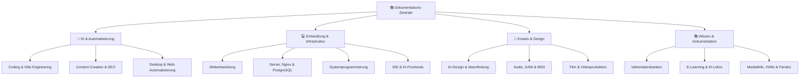

# Dokumentations-Zentrale

Willkommen in der zentralen Wissensdatenbank. Hier sind alle Konfigurationen,
Anleitungen und Technologieübersichten zur Serverlandschaft, Entwicklungsumgebung
und KI-Integration strukturiert dokumentiert.

---

-   :material-robot:{ .lg .middle } **KI & Automatisierung**

    ---

    Strategien, Frameworks und Best Practices für KI-gestützte Softwareentwicklung,
    Content-Erstellung und Desktop-Automatisierung.

    [:octicons-arrow-right-24: Zur Übersicht](künstliche-intelligenz/index.md)

-   :material-server:{ .lg .middle } **Entwicklung & Infrastruktur**

    ---

    Konfiguration und Absicherung von Nginx, PostgreSQL und
    weiteren Serverdiensten auf Ubuntu 24.04 LTS.

    [:octicons-arrow-right-24: Zur Übersicht](entwicklung/infrastruktur/index.md)

-   :material-palette:{ .lg .middle } **Kreativ & Design**

    ---

    KI in der Kreativarbeit: Bildgenerierung, Audio-Processing, DAW-Integration,
    Videoproduktion und Animationen.

    [:octicons-arrow-right-24: Zur Übersicht](kreativ/design/index.md)

-   :material-bookshelf:{ .lg .middle } **Wissen & Dokumentation**

    ---

    MediaWiki, XWiki, Pandoc, E-Learning-Konzepte und
    Vektordatenbanken für strukturiertes Wissensmanagement.

    [:octicons-arrow-right-24: Zur Übersicht](wissen/dokumentation/index.md)

---

## Systemübersicht

---

## KI & Automatisierung

### :material-code-braces: KI-Coding

- [KI Coding](künstliche-intelligenz/coding/ki-coding.md) – Grundlagen und Best Practices
- [Vibe Coding & Engineering](künstliche-intelligenz/coding/vibe-coding-engineering.md)
- [Eigene KI-Anwendungen](künstliche-intelligenz/coding/ki-anwendungen-programmieren.md)
- [Programmieren lernen mit KI](künstliche-intelligenz/coding/programmieren-lernen-ki.md)
- [Lokales RAG & LLM-Serving](künstliche-intelligenz/coding/lokales-rag-ollama.md)
- [Agentic Workflows (LangGraph)](künstliche-intelligenz/coding/agentic-workflows-langgraph.md)

### :material-robot-outline: Automatisierung

- [PyAutoGUI](künstliche-intelligenz/automatisierung/pyautogui-anleitung.md) – GUI-Automatisierung
- [Playwright](künstliche-intelligenz/automatisierung/playwright-anleitung.md) – Web-Automatisierung
- [Robot Framework](künstliche-intelligenz/automatisierung/robot-framework-anleitung.md) – Testautomatisierung
- [ydotool](künstliche-intelligenz/automatisierung/ydotool-anleitung.md) – Wayland-Automatisierung

### :material-text-box-outline: Content-Erstellung

- [KI Content Creation](künstliche-intelligenz/content/ki-content-creation.md)
- [KI-gestützte SEO](künstliche-intelligenz/content/ki-seo-optimierung.md)
- [Multilinguale Inhalte](künstliche-intelligenz/content/multilinguale-inhalte.md)

---

## Entwicklung & Infrastruktur

### :material-web: Webentwicklung

- [KI Webentwicklung](entwicklung/webentwicklung/ki-webentwicklung.md)
- [Frontend mit KI](entwicklung/webentwicklung/frontend-ki.md)
- [Backend-Integration](entwicklung/webentwicklung/backend-integration.md)
- [Deployment mit KI](entwicklung/webentwicklung/deployment.md)
- [Performance-Optimierung](entwicklung/webentwicklung/performance.md)

### :material-chip: Systemprogrammierung

- [Assembler](entwicklung/system/assembler.md)
- [Rust, C & C++ Integration](entwicklung/system/rust-c-cpp-integration.md)
- [Linux-Systemprogrammierung](entwicklung/system/linux-systemprogrammierung.md)
- [Linux eBPF Performance](entwicklung/system/linux-ebpf-performance.md)

### :material-server-network: Server & Infrastruktur

**Nginx**
- [Grundlagen](entwicklung/infrastruktur/nginx.md) · [SSL](entwicklung/infrastruktur/nginx-ssl.md) · [Hardening](entwicklung/infrastruktur/nginx-hardening.md)
- [Load Balancing](entwicklung/infrastruktur/nginx-loadbalancing.md) · [Rate Limiting](entwicklung/infrastruktur/nginx-rate-limiting.md)

**PostgreSQL**
- [Grundlagen](entwicklung/infrastruktur/postgresql.md) · [Backup](entwicklung/infrastruktur/postgresql-backup-restore.md)
- [Performance Tuning](entwicklung/infrastruktur/postgresql-tuning.md) · [pgvector](wissen/daten/datenbanken/pgvector-anleitung.md)

**Kachelserver**
- [Ubuntu 22.04](entwicklung/infrastruktur/kachelserver/server224.md) · [Ubuntu 24.04](entwicklung/infrastruktur/kachelserver/server244.md)

---

## Kreativ & Design

### :material-music: Audio & Musik

- [KI und Audio](kreativ/audio/ki-audio.md)
- [Audacity mit KI](kreativ/audio/audacity-ki.md)
- [DAW-Integration](kreativ/audio/daw-integration.md)
- [MIDI-Programmierung](kreativ/audio/midi-programmierung.md)
- [AI Voice Cloning (XTTS v2)](kreativ/audio/ai-voice-cloning-xtts.md)

### :material-video: Video & Film

- [KI in der Videoproduktion](kreativ/video/ki-filmproduktion.md)
- [FFmpeg & Whisper](kreativ/video/ffmpeg-whisper-automatisierung.md)
- [FFmpeg HLS Streaming](kreativ/video/ffmpeg-hls-streaming.md)
- [Manim Animation Engine](kreativ/video/manim-animation-guide.md)
- [Remotion React Video](kreativ/video/remotion-react-video.md)

### :material-brush: Design

- [ComfyUI & SD Automatisierung](kreativ/design/comfyui-workflow-anleitung.md)
- [Blender 3D Python](kreativ/design/blender-python-automation.md)

---

## Wissen & Dokumentation

### :material-wikipedia: Wikis

- [MediaWiki installieren](wissen/dokumentation/mediawiki/index.md)
- [Semantisches MediaWiki](wissen/dokumentation/semantische-mediawiki/installieren.md)
- [XWiki installieren](wissen/dokumentation/xwiki/installieren.md)

### :material-tools: Tools & Daten

- [Pandoc](wissen/tools/pandoc.md) – Dokumentenkonvertierung
- [OpenDataKit](wissen/daten/datenerfassung/opendatakit.md)
- [KI in Lehre & Weiterbildung](wissen/e-learning/ki-lehre-weiterbildung.md)
- [Analysetool & Benchmark](wissen/tools/analysetool.md)

---

## Produktionsserver – Technologieübersicht

=== "Produktionsserver"

    **Ubuntu 24.04 LTS** – maximale Datenkontrolle, kein Cookie-Banner nötig

    | Komponente | Technologie |
    |------------|-------------|
    | Webserver / Reverse Proxy | Nginx |
    | Kartendaten | Switch2OSM Tileserver |
    | Datenbank | PostgreSQL + PostGIS |
    | Laufzeiten | Java, Python, Git / GitHub CLI |

=== "Entwicklungsrechner"

    **Ubuntu 25.10** – vollständig für lokale KI-Entwicklung ausgestattet

    | Kategorie | Tools |
    |-----------|-------|
    | Sprachen | Node.js, Python, Java, Golang, Rust, C/C++ |
    | Editoren | VS Code, Antigravity IDE |
    | KI-Assistenten | GitHub Copilot, Claude Code, Antigravity CLI |
    | Lokale Dienste | PostgreSQL, Nginx, Google Chrome |

---

!!! info "Rechtliches"

    [Impressum](rechtliches/impressum.md) · [Datenschutz](rechtliches/datenschutz.md)
