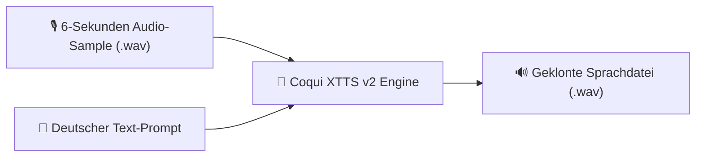

# Praxis-Guide: AI Voice Cloning & Text-to-Speech mit XTTS v2

Mit **Coqui XTTS v2** lassen sich qualitativ hochwertige Sprachausgaben (Text-to-Speech) generieren und eigene Stimmen anhand von 6-sekündigen Audio-Proben klonen.

---



---

## 🛠️ 1. Installation

```bash
pip install TTS torch torchaudio
```

---

## 🐍 2. Python Skript (`voice_clone.py`)

```python
import torch
from TTS.api import TTS

# 1. Device wählen (GPU oder CPU)
device = "cuda" if torch.cuda.is_available() else "cpu"

# 2. XTTS v2 Modell laden
tts = TTS("tts_models/multilingual/multi-dataset/xtts_v2").to(device)

# 3. Stimmen-Klonen & Text-to-Speech ausführen
tts.tts_to_file(
    text="Willkommen in der automatisierten Sprachverarbeitung mit Coqui XTTS.",
    speaker_wav="referenz_stimme.wav",  # Pfad zur 6s Sprachaufnahme
    language="de",                      # Sprache: Deutsch
    file_path="output_gekloent.wav"
)

print("✅ Geklonte Audiodatei erfolgreich in 'output_gekloent.wav' gespeichert!")
```

---

## 🔗 Verwandte Themen
* [KI und Audio](ki-audio.md) – Übersicht
* [Audacity Macro Automatisierung](audacity-macro-automatisierung.md) – Audioverarbeitung
* [MIDI-Generierung mit Python](midi-python-automation.md) – Musik-Skripte
