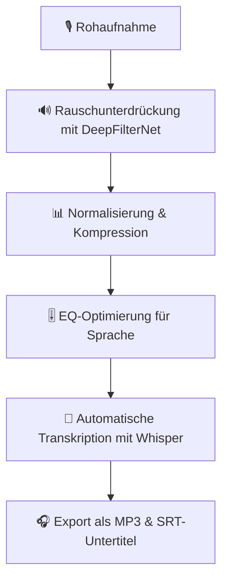
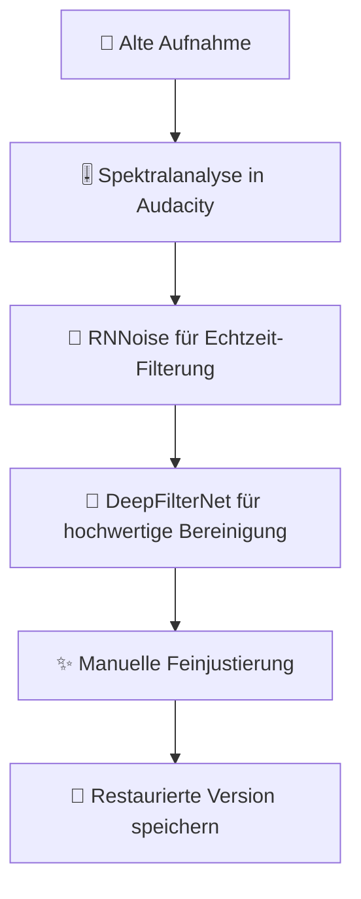

# Audacity mit KI: Professionelle Audiobearbeitung

Wie künstliche Intelligenz Audacity zur mächtigen Audio-Workstation für Rauschunterdrückung, Stem-Separation, Sprachbearbeitung und automatisierte Workflows erweitert.

---

## 🎯 Einführung: KI in Audacity

### Warum KI für Audacity?

Audacity ist der beliebteste Open-Source-Audio-Editor – aber mit KI-Plugins wird er zur professionellen Workstation:

| KI-Funktion | Vorteil | Zeitersparnis |
|------------|---------|--------------|
| **Rauschunterdrückung** | Neuronale Filter entfernen Hintergrundgeräusche | 80-90% |
| **Stem-Separation** | Trennung von Gesang und Instrumenten | 70-80% |
| **Sprachverbesserung** | Automatische Klangoptimierung für Podcasts | 60-70% |
| **Transkription** | Automatische Untertitel-Generierung | 90-95% |
| **Batch-Verarbeitung** | Automatisierte Verarbeitung mehrerer Dateien | 95% |

### KI vs. Traditionelle Audacity-Plugins

| Aspekt | Traditionelle Plugins | KI-Plugins |
|--------|---------------------|------------|
| **Rauschunterdrückung** | Statische Filter (Noise Gate, EQ) | Dynamische neuronale Netze |
| **Stem-Separation** | Nicht möglich | KI-basierte Trennung |
| **Spracherkennung** | Nicht verfügbar | Echtzeit-Transkription |
| **Klangoptimierung** | Manuelle Einstellung | Automatische Analyse |
| **Batch-Verarbeitung** | Eingeschränkt | Vollautomatisch |

---

## 🔧 KI-Plugins für Audacity

### 1. OpenVINO KI-Plugins (Intel)

Intel bietet eine Collection von KI-Plugins für Audacity, die auf OpenVINO basieren – optimiert für Intel-CPUs und GPUs.

#### Installation

```bash
# Vorraussetzungen installieren
sudo apt update
sudo apt install -y git cmake build-essential

# OpenVINO Plugins klonen
git clone https://github.com/intel/openvino-plugins-audacity.git
cd openvino-plugins-audacity

# Kompilieren
mkdir build
cd build
cmake .. -DCMAKE_BUILD_TYPE=Release
make -j$(nproc)

# Plugin installieren
sudo cp *.so /usr/lib/audacity/plugins/
```

#### Verfügbare KI-Effekte

| Plugin | Funktion | Beschreibung |
|--------|----------|--------------|
| **Noise Suppression** | Rauschunterdrückung | RNNoise-basierte neuronale Rauschfilterung |
| **Stem Separation** | Spurtrennung | Trennung von Vocals, Drums, Bass, Other |
| **Speech Enhancement** | Sprachverbesserung | Optimierung für Podcasts und Sprachaufnahmen |
| **Pitch Correction** | Tonhöhenkorrektur | Automatische Pitch-Korrektur für Gesang |

---

## 🎙️ Rauschunterdrückung mit KI

### RNNoise: Echtzeit-Rauschfilterung

**RNNoise** ist ein neuronales Netzwerk zur Rauschunterdrückung, das speziell für Sprachaufnahmen optimiert ist.

#### Installation in Audacity

```bash
# RNNoise als LADSPA-Plugin installieren
sudo apt install -y ladspa-sdk

git clone https://github.com/jmvalin/rnnoise.git
cd rnnoise
./autogen.sh
./configure
make
sudo make install

# Audacity Plugins aktualisieren
sudo cp /usr/local/lib/ladspa/rnnoise_ladspa.so /usr/lib/ladspa/
```

#### Anwendung

1. **Audiodatei in Audacity öffnen**
2. **Effekt → RNNoise auswählen**
3. **Parameter anpassen:**
   - **Noise Reduction**: 0.0 (kein Filter) bis 1.0 (maximale Filterung)
   - **Wet/Dry Mix**: Balance zwischen Original und gefiltertem Signal
4. **Vorschau hören und anwenden**

#### Vergleich: RNNoise vs. DeepFilterNet

| Kriterium | RNNoise | DeepFilterNet |
|----------|---------|--------------|
| **Qualität** | Gut für Sprache | Exzellent für Musik |
| **Echtzeitfähig** | ✅ Ja | ❌ Nein |
| **Ressourcenverbrauch** | Niedrig | Mittel |
| **Installationsaufwand** | Niedrig | Mittel |
| **Sprachoptimierung** | ✅ Sehr gut | ✅ Gut |
| **Musikoptimierung** | ❌ Eingeschränkt | ✅ Exzellent |

---

## 🎵 Stem-Separation: Musik in Spuren trennen

### Demucs Integration

**Demucs** (von Meta/Facebook) ist der Industriestandard für KI-basierte Stem-Separation.

#### Demucs über Audacity nutzen

```bash
# Demucs installieren
pip install -U demucs torch

# Separate Stichprobe herunterladen
pip install -U demucs
```

#### Workflow: Audacity + Demucs

1. **Audio in Audacity vorbereiten**
2. **Datei exportieren** (WAV-Format)
3. **Demucs über Kommandozeile ausführen:**

```bash
# Standard-Separation (4 Stems: vocals, drums, bass, other)
demucs -d cpu song.wav

# Nur Gesang extrahieren (2 Stems: vocals, no_vocals)
demucs -d cpu --two-stems=vocals song.wav

# Hochwertige Separation mit GPU (falls verfügbar)
demucs -d cuda song.wav
```

4. **Separierte Spuren in Audacity importieren**
5. **Einzelne Spuren weiter bearbeiten**

#### Qualität der Trennung

| Modell | Vocals | Drums | Bass | Other |
|--------|--------|-------|------|-------|
| **demucs** | ✅✅✅✅ | ✅✅✅✅ | ✅✅✅ | ✅✅✅✅ |
| **demucs_extra** | ✅✅✅✅✅ | ✅✅✅✅✅ | ✅✅✅✅ | ✅✅✅✅ |
| **hdemucs** | ✅✅✅✅ | ✅✅✅✅ | ✅✅✅✅ | ✅✅✅✅ |

---

## 🗣️ Sprachverarbeitung & Transkription

### Whisper für automatische Transkription

Integrieren Sie **Whisper.cpp** mit Audacity für automatische Transkription.

#### Installation

```bash
# Whisper.cpp installieren
git clone https://github.com/ggerganov/whisper.cpp.git
cd whisper.cpp
make

# Modell herunterladen (z.B. tiny für schnelle Tests)
./download-ggml-model.sh tiny

# Größe der Modelle
# tiny: 75MB, base: 150MB, small: 470MB, medium: 1.5GB, large: 3GB
```

#### Audio transkribieren

```bash
# WAV-Datei transkribieren
./main -f audio.wav -m models/ggml-tiny.bin -l de -otxt

# Parameter:
# -f: Input-Datei
# -m: Modell-Datei
# -l: Sprache (de = Deutsch)
# -otxt: Output als Textdatei
# -ovtt: Output als VTT (WebVTT Untertitel)
# -osrt: Output als SRT (SubRip Untertitel)
```

#### Transkription in Audacity nutzen

1. **Audio in Audacity öffnen**
2. **Datei exportieren** (WAV, 16kHz, Mono für beste Ergebnisse)
3. **Whisper.cpp ausführen**
4. **Transkript importieren** (als Label-Track)

---

## 🎚️ Audio-Restaurierung & Verbessung

### DeepFilterNet: Professionelle Audio-Bereinigung

**DeepFilterNet** ist ein neuronales Netzwerk für hochwertige Rauschunterdrückung und Audio-Restaurierung.

#### Installation

```bash
# Vorraussetzungen
sudo apt install -y python3-pip python3-venv
python3 -m venv deepfilternet-venv
source deepfilternet-venv/bin/activate

# DeepFilterNet installieren
pip install deepfilternet
```

#### Anwendung

```bash
# Einfache Rauschunterdrückung
deepfilternet audio.wav --output audio_clean.wav

# Mit benutzerdefiniertem Modell
deepfilternet audio.wav --model custom_model --output audio_clean.wav

# Batch-Verarbeitung
for file in *.wav; do
    deepfilternet "$file" --output "clean_${file}"
done
```

#### Vergleich: Rauschunterdrückungs-Tools

| Tool | Typ | Qualität | Echtzeit | Open Source |
|------|-----|----------|----------|-------------|
| **RNNoise** | Neuronal | ✅✅✅ | ✅ Ja | ✅ Ja |
| **DeepFilterNet** | Neuronal | ✅✅✅✅✅ | ❌ Nein | ✅ Ja |
| **Audacity Noise Reduction** | Spektral | ✅✅ | ✅ Ja | ✅ Ja |
| **iZotope RX** | Professionell | ✅✅✅✅✅ | ❌ Nein | ❌ Nein |
| **Adobe Podcast Enhance** | Cloud | ✅✅✅✅ | ❌ Nein | ❌ Nein |

---

## 📊 Batch-Verarbeitung mit KI

### Automatisierte Workflows

#### Skript: Batch-Rauschunterdrückung

```bash
#!/bin/bash
# batch-denoise.sh - Batch-Rauschunterdrückung mit RNNoise

INPUT_DIR="./input"
OUTPUT_DIR="./output"

mkdir -p "$OUTPUT_DIR"

for file in "$INPUT_DIR"/*.wav; do
    filename=$(basename -- "$file")
    filename_noext="${filename%.*}"
    
    echo "Verarbeite: $filename"
    
    # RNNoise anwenden
    sox "$file" -n noiseprof noise.prof
    sox "$file" "$OUTPUT_DIR/${filename_noext}_denoised.wav" noisered noise.prof 0.21
    
    # Oder mit DeepFilterNet
    # deepfilternet "$file" --output "$OUTPUT_DIR/${filename_noext}_denoised.wav"
done

echo "Batch-Verarbeitung abgeschlossen!"
```

#### Skript: Automatische Stem-Separation

```bash
#!/bin/bash
# batch-separate.sh - Batch-Stem-Separation mit Demucs

INPUT_DIR="./songs"
OUTPUT_DIR="./separated"

mkdir -p "$OUTPUT_DIR"

for file in "$INPUT_DIR"/*.wav; do
    filename=$(basename -- "$file")
    filename_noext="${filename%.*}"
    
    echo "Trenne: $filename"
    
    # Demucs mit 4 Stems
    demucs -d cpu -o "$OUTPUT_DIR/${filename_noext}" "$file"
    
    # Separate Dateien umbenennen
    mv "$OUTPUT_DIR/${filename_noext}/htdemucs/*.wav" "$OUTPUT_DIR/${filename_noext}/"
done

echo "Stem-Separation abgeschlossen!"
```

---

## 🎛️ Automatisierung mit Makros

### Audacity Makros erstellen

Audacity unterstützt Makros zur Automatisierung von Arbeitsabläufen.

#### Makro: Podcast-Vorbereitung

1. **Rauschunterdrückung anwenden** (RNNoise)
2. **Normalisierung** (-3 dB)
3. **Kompression** (Leichte Dynamik-Kontrolle)
4. **EQ anpassen** (Sprachoptimierung)

#### Makro-Datei (JSON)

```json
{
  "name": "Podcast-Vorbereitung",
  "commands": [
    {
      "command": "NoiseReduction",
      "params": {
        "noiseProfile": "noise.prof",
        "noiseReductionDb": 12,
        "sensitivity": 6,
        "frequencySmoothing": 3
      }
    },
    {
      "command": "Normalize",
      "params": {
        "level": -3,
        "removeDc": true,
        "stereoIndependently": false
      }
    },
    {
      "command": "Compressor",
      "params": {
        "threshold": -20,
        "noiseFloor": -40,
        "ratio": 3,
        "attack": 0.1,
        "release": 1.0
      }
    }
  ]
}
```

---

## 🔬 Qualitätsanalyse mit KI

### Automatisierte Audio-Analyse

#### Python-Skript für Audio-Metriken

```python
import librosa
import numpy as np
import pandas as pd

def analyze_audio(file_path):
    """Analysiert Audio-Dateien und gibt Qualitätsmetriken zurück."""
    
    # Audio laden
    y, sr = librosa.load(file_path, sr=None)
    
    # Dauer
    duration = librosa.get_duration(y=y, sr=sr)
    
    # Lautstärke (RMS)
    rms = np.sqrt(np.mean(librosa.feature.rms(y=y)[0]**2))
    
    # Dynamikbereich
    peak = np.max(np.abs(y))
    dynamic_range = 20 * np.log10(peak / rms) if rms > 0 else 0
    
    # Spektrale Bandbreite
    spectral_bandwidth = librosa.feature.spectral_bandwidth(y=y, sr=sr)[0]
    
    # Zero-Crossing Rate
    zcr = librosa.feature.zero_crossing_rate(y)[0]
    
    # Klangfarbe (Spectral Centroid)
    spectral_centroid = librosa.feature.spectral_centroid(y=y, sr=sr)[0]
    
    return {
        'Datei': file_path,
        'Dauer (s)': duration,
        'RMS (dB)': 20 * np.log10(rms) if rms > 0 else -np.inf,
        'Dynamikbereich (dB)': dynamic_range,
        'Spektrale Bandbreite (Hz)': np.mean(spectral_bandwidth),
        'Zero-Crossing Rate': np.mean(zcr),
        'Spektraler Schwerpunkt (Hz)': np.mean(spectral_centroid)
    }

# Mehrere Dateien analysieren
files = ['audio1.wav', 'audio2.wav', 'audio3.wav']
results = [analyze_audio(f) for f in files]

df = pd.DataFrame(results)
print(df)
```

#### KI-basierte Qualitätssicherung

| Metrik | Optimaler Wert | KI-Analyse |
|--------|---------------|------------|
| **RMS Level** | -12 bis -6 dB | Automatische Normalisierung |
| **Dynamikbereich** | > 15 dB | Kompressions-Empfehlungen |
| **Signal-Rausch-Verhältnis (SNR)** | > 30 dB | Rauschunterdrückungs-Bedarf |
| **Verzerrung (THD)** | < 0.1% | Qualitätswarnungen |
| **Spektrale Bandbreite** | > 1 kHz | EQ-Optimierung |

---

## 🎯 Praxisprojekte

### Projekt 1: Podcast-Produktion mit KI

**Ziel:** Automatisierte Podcast-Nachbearbeitung von der Rohaufnahme bis zur Fertigstellung.



**Benötigte Tools:**
- Audacity
- DeepFilterNet
- Whisper.cpp
- FFmpeg

**Verarbeitungszeit:** 5-10 Minuten pro Stunde Audio

---

### Projekt 2: Karaoke-Version erstellen

**Ziel:** Gesang aus einem Song extrahieren für Karaoke.

```mermaid
graph TD
    A["🎵 Original-Song"] --> B["🎛️ Demucs Stem-Separation"]
    B --> C["🎤 Vocals extrahieren"]
    B --> D["🥁 Instrumente extrahieren"]
    C --> E["🔇 Vocal-Removal ("für Instrumental")"]
    D --> F["💾 Karaoke-Version speichern"]
```

**Benötigte Tools:**
- Audacity
- Demucs
- FFmpeg

**Qualität:** 85-95% der Original-Qualität

---

### Projekt 3: Sprachaufnahmen restaurieren

**Ziel:** Alte Sprachaufnahmen von Hintergrundgeräuschen bereinigen.



**Benötigte Tools:**
- Audacity
- RNNoise
- DeepFilterNet

**Ergebnis:** Professionelle Klangqualität

---

## 📦 Vollständige Tool-Übersicht

### Open-Source KI-Tools für Audacity

| Tool | Funktion | Plattform | Integration |
|------|----------|-----------|-------------|
| **RNNoise** | Echtzeit-Rauschunterdrückung | Linux/Windows/macOS | LADSPA-Plugin |
| **DeepFilterNet** | Hochwertige Audio-Restaurierung | Linux/Windows/macOS | CLI-Tool |
| **Demucs** | Stem-Separation | Linux/Windows/macOS | CLI-Tool |
| **Whisper.cpp** | Sprach-zu-Text | Linux/Windows/macOS | CLI-Tool |
| **OpenVINO Plugins** | Verschiedene KI-Effekte | Linux/Windows | Audacity-Plugin |
| **Sox** | Audio-Konvertierung & Effekte | Linux/Windows/macOS | CLI-Tool |
| **FFmpeg** | Audio-/Video-Verarbeitung | Linux/Windows/macOS | CLI-Tool |

### Kommerzielle Alternativen

| Tool | Funktion | Preis | Plattform |
|------|----------|-------|-----------|
| **iZotope RX** | Professionelle Audio-Restaurierung | ~$999 | Windows/macOS |
| **Adobe Podcast Enhance** | KI-basierte Sprachverbesserung | ~$20/Monat | Web |
| **LALAL.AI** | Stem-Separation (Cloud) | ~$15/Stunde | Web |
| **Sonible smart:eq** | KI-EQ | ~$179 | Windows/macOS |

---

## 🔗 Verwandte Themen

* [Audio/KI und Audio](ki-audio.md) – Umfassende Übersicht zu KI in der Audio-Verarbeitung
* [Audio/Daw-Integration](daw-integration.md) – KI in Digital Audio Workstations
* [Audio/MIDI-Programmierung](midi-programmierung.md) – MIDI mit KI steuern
* [Audio/Audio-Processing](audio-processing.md) – Signalverarbeitung mit KI
* [Tools/Analysetool](../../wissen/tools/analysetool.md) – Code-Analyse für Audio-Projekte

---

*Letzte Aktualisierung: Juli 2026*
