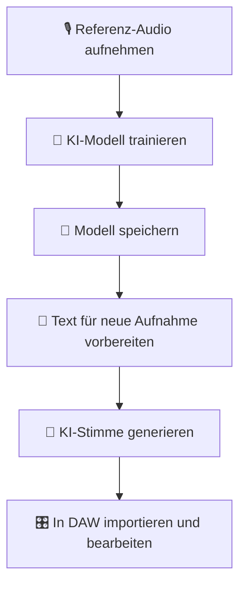
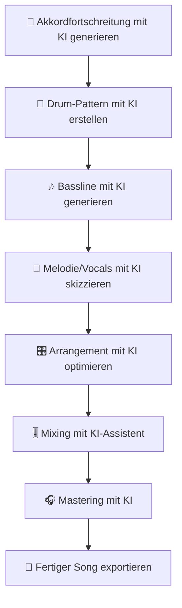
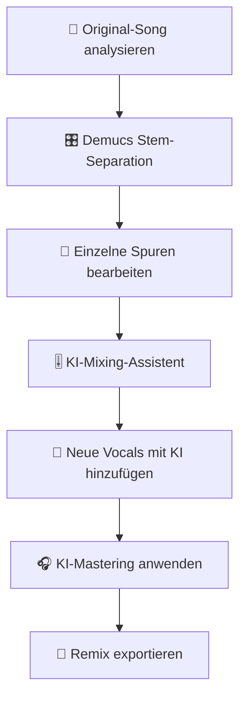
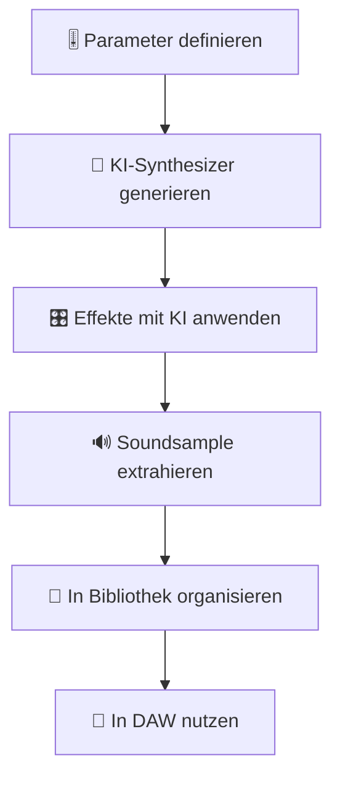

# KI-Integration in Digital Audio Workstations (DAWs)

Wie künstliche Intelligenz professionelle Audio-Produktion in DAWs wie Ardour, LMMS, Qtractor, REAPER und Bitwig revolutioniert – von automatisierten Mixing-Assistenten bis zu generativen Musik-Tools.

---

## 🎯 Einführung: KI in DAWs

### Warum KI für Digital Audio Workstations?

DAWs profitieren von KI durch Automatisierung komplexer Aufgaben und kreative Erweiterung:

| KI-Funktion | Vorteil | Zeitersparnis |
|------------|---------|--------------|
| **Automatisches Mixing** | KI analysiert und optimiert Levels, EQ, Kompression | 70-80% |
| **Stem-Separation** | Trennung von Spuren ohne Multitrack | 90% |
| **Drum-Pattern-Generierung** | KI erstellt Schlagzeug-Patterns im Projekt-Tempo | 80% |
| **Harmonie-Vorschläge** | Akkordfortschreitungen und Melodie-Ideen | 60% |
| **Mastering-Assistent** | Professionelles Mastering mit einem Klick | 75% |
| **Stimm-Klonen** | Eigene Stimme oder Instrumente klonen | 95% |

### KI vs. Traditionelle DAW-Workflows

| Aufgabe | Traditionell | Mit KI |
|---------|-------------|-------|
| **Mixing** | Manuelle Einstellung jedes Parameters | KI analysiert und schlägt optimale Werte vor |
| **Drum-Programming** | Manuelles Einprogrammieren jedes Hits | KI generiert komplette Patterns |
| **Sound-Design** | Stundenlanges Experimentieren | KI schlägt passende Sounds vor |
| **Mastering** | Teure Studiozeit oder spezielle Plugins | KI-Mastering-Tools für alle |
| **Stimm-Bearbeitung** | Manuelle Pitch-Korrektur | Automatische KI-Pitch-Korrektur |
| **Arrangement** | Manuelle Strukturierung | KI analysiert und schlägt Arrangements vor |

---

## 🎛️ Open-Source DAWs mit KI-Integration

### Ardour: Professionelle Audio-Workstation

**Ardour** ist eine vollständige Open-Source-DAW für Linux, macOS und Windows.

#### KI-Integration

| Plugin/Tool | Funktion | Integration |
|------------|----------|-------------|
| **LADSPA KI-Plugins** | Rauschunterdrückung, EQ, Effekte | Native |
| **LV2 KI-Plugins** | Moderne Audio-Effekte | Native |
| **Demucs (extern)** | Stem-Separation | Über Datei-Import/Export |
| **Whisper (extern)** | Automatische Transkription | Über Skripte |
| **Python-Skripte** | Benutzerdefinierte KI-Tools | Über OSC |

#### Installation

```bash
# Ardour installieren (Ubuntu)
sudo apt update
sudo apt install -y ardour

# Für aktuellste Version
sudo add-apt-repository ppa:ardour/ardour
sudo apt update
sudo apt install -y ardour
```

#### KI-Plugins für Ardour

```bash
# LADSPA KI-Plugins installieren
sudo apt install -y ladspa-sdk cmt csladspa tap-plugins

# LV2 KI-Plugins
sudo apt install -y lv2-plugins albada lsp-plugins
```

---

### LMMS: Musikproduktion für Einsteiger

**LMMS (Linux MultiMedia Studio)** ist eine kostenlose DAW speziell für Musikproduktion.

#### KI-Features

| Feature | Beschreibung | Status |
|---------|--------------|--------|
| **MIDI-Pattern-Generierung** | KI generiert MIDI-Patterns | Experimentell |
| **Instrument-Empfehlungen** | KI schlägt passende Sounds vor | In Entwicklung |
| **Automatisches Mixing** | KI optimiert Lautstärke und Panorama | Geplant |
| **Stem-Separation** | Integration mit Demucs | Über Skripte |

#### Installation

```bash
# LMMS installieren (Ubuntu)
sudo add-apt-repository ppa:ubuntuhandbook1/lmms
sudo apt update
sudo apt install -y lmms
```

#### KI-Instrumente

```bash
# FluidSynth für KI-generierte MIDI
sudo apt install -y fluidsynth

# SoundFonts für realistische Instrumente
sudo apt install -y fluid-soundfont-gm
```

---

### Qtractor: MIDI- und Audio-Sequencer

**Qtractor** ist ein Open-Source-MIDI- und Audio-Sequencer für Linux.

#### KI-Integration

| Plugin | Funktion | Typ |
|--------|----------|-----|
| **Calf Studio Gear** | KI-basierte Effekte | LV2 |
| **CMT (Computer Music Toolkit)** | Audio-Analyse | LV2 |
| **AMS (Alsa Modular Synth)** | KI-Synthesizer | LV2 |

#### Installation

```bash
# Qtractor installieren
sudo apt install -y qtractor

# LV2 Plugins
sudo apt install -y calf-plugins cmt lsp-plugins
```

---

### REAPER: Professionell & Skriptbar

**REAPER** ist eine günstige, aber mächtige DAW mit hervorragender Skript-Unterstützung.

#### KI-Integration über Skripte

```lua
-- REAPER Lua-Skript für KI-Integration
function KI_Mixing_Assistent()
    -- Tracks analysieren
    local trackCount = reaper.CountTracks(0)
    
    for i = 0, trackCount - 1 do
        local track = reaper.GetTrack(0, i)
        local trackName = reaper.GetTrackName(track)
        
        -- KI-Analyse simulieren
        local volume = reaper.GetTrackUIHeight(track)
        local pan = reaper.GetTrackPan(track)
        
        -- Automatische EQ-Einstellungen
        local eq = reaper.TrackFX_GetByName(track, "ReaEQ")
        if eq >= 0 then
            reaper.TrackFX_SetParam(track, eq, 0, 0.5) -- Gain
        end
    end
    
    reaper.UpdateArrange()
end

-- Skript registrieren
reaper.AddAction(0, "KI Mixing Assistent", "KI Mixing Assistent", KI_Mixing_Assistent)
```

#### KI-Plugins für REAPER

| Plugin | Funktion | Typ |
|--------|----------|-----|
| **SWS Extensions** | Automatisierungs-Tools | Native |
| **ReaScript** | Python/Lua/EEL Skripte | Native |
| **OSC-Control** | Externe KI-Tools steuern | OSC |
| **JSFX Plugins** | Benutzerdefinierte Effekte | Native |

---

## 🤖 KI-Mixing-Assistenten

### Automatisiertes Mixing mit KI

#### LANDR (Cloud-basiert)

**LANDR** bietet KI-basiertes Mixing und Mastering über die Cloud.

```bash
# LANDR CLI (inoffiziell)
# 1. Dateien hochladen
# 2. KI-Mixing starten
# 3. Ergebnisse herunterladen

# Alternative: Lokale KI-Mixing-Tools
pip install pydub numpy scipy
```

#### Python: Einfacher KI-Mixing-Assistent

```python
import librosa
import numpy as np
import soundfile as sf

def ki_mixing_assistent(audio_files, output_file):
    """Einfacher KI-Mixing-Assistent für mehrere Spuren."""
    
    # Alle Spuren laden
    tracks = []
    sample_rates = []
    
    for file in audio_files:
        y, sr = librosa.load(file, sr=None)
        tracks.append(y)
        sample_rates.append(sr)
    
    # Gemeinsame Sample-Rate
    target_sr = max(sample_rates)
    
    # Alle Spuren auf gleiche Sample-Rate bringen
    resampled_tracks = []
    for y, sr in zip(tracks, sample_rates):
        if sr != target_sr:
            y_resampled = librosa.resample(y, orig_sr=sr, target_sr=target_sr)
        else:
            y_resampled = y
        resampled_tracks.append(y_resampled)
    
    # Normalisierung jedes Tracks
    normalized_tracks = []
    for y in resampled_tracks:
        y_normalized = librosa.util.normalize(y)
        normalized_tracks.append(y_normalized)
    
    # Einfaches Mixing: Alle Spuren gleich laut
    mixed = np.sum(normalized_tracks, axis=0)
    
    # Normalisierung des Mix
    mixed = librosa.util.normalize(mixed)
    
    # Speichern
    sf.write(output_file, mixed, target_sr)
    print(f"Mix gespeichert als {output_file}")

# Verwendung
ki_mixing_assistent(
    ['vocals.wav', 'guitar.wav', 'bass.wav', 'drums.wav'],
    'mix_output.wav'
)
```

#### Mixing-Parameter-Optimierung

| Parameter | KI-Empfehlung | Begründung |
|-----------|---------------|------------|
| **Vocals Level** | -6 dB bis -3 dB | Sollte im Vordergrund sein |
| **Drums Level** | -9 dB bis -6 dB | Energie ohne Dominanz |
| **Bass Level** | -9 dB bis -6 dB | Fundament, aber nicht zu laut |
| **Guitar/Keys Level** | -12 dB bis -9 dB | Hintergrund, aber präsent |
| **EQ: Vocals** | 100Hz cut, 10kHz boost | Klarheit und Präsenz |
| **EQ: Bass** | 60Hz boost, 500Hz cut | Tiefe ohne Schlamm |
| **Compression: Vocals** | 4:1, -24dB threshold | Kontrollierte Dynamik |
| **Compression: Drums** | 3:1, -18dB threshold | Punch ohne Pumpen |

---

## 🥁 KI für Drum-Programming

### Automatische Drum-Pattern-Generierung

#### Python: MIDI-Drum-Pattern-Generator

```python
import numpy as np
import mido
from mido import Message, MidiFile, MidiTrack

def generate_drum_pattern(bpm=120, bars=4, output_file='drums.mid'):
    """Generiert ein einfaches Drum-Pattern im MIDI-Format."""
    
    # MIDI-Datei erstellen
    mid = MidiFile()
    track = MidiTrack()
    mid.tracks.append(track)
    
    # Tempo setzen (Mikrosekunden pro Beat)
    ticks_per_beat = mid.ticks_per_beat
    microseconds_per_beat = mido.bpm2tempo(bpm)
    
    # Drum-Mapping (General MIDI)
    kick = 36
    snare = 38
    hi_hat_closed = 42
    hi_hat_open = 46
    
    # Pattern pro Takt (16tel-Note Resolution)
    pattern = [
        [kick, None, hi_hat_closed, None],      # Beat 1
        [None, snare, hi_hat_closed, None],     # Beat 2
        [kick, None, hi_hat_closed, None],      # Beat 3
        [None, snare, hi_hat_open, None]        # Beat 4
    ]
    
    # MIDI-Nachrichten hinzufügen
    time = 0
    
    for bar in range(bars):
        for beat in range(4):
            for sixteenth in range(4):
                drum = pattern[beat][sixteenth]
                if drum is not None:
                    # Note On
                    track.append(Message('note_on', note=drum, velocity=100, time=time))
                    time = 0
                    # Note Off (kurze Dauer für Drums)
                    track.append(Message('note_off', note=drum, velocity=100, time=16))
                else:
                    time += 16
            
        # Ende des Takts
        time = 0
    
    # Datei speichern
    mid.save(output_file)
    print(f"Drum-Pattern gespeichert als {output_file}")

# Verwendung
generate_drum_pattern(bpm=120, bars=8, output_file='drum_pattern.mid')
```

#### KI-basierte Drum-Generierung

| Tool | Funktion | Plattform |
|------|----------|-----------|
| **Magenta (Google)** | KI-generierte Musik & Drums | Python |
| **DrumGAN** | GAN-basierte Drum-Patterns | Python |
| **Groove MIDI** | KI-Drum-Grooves | Web/CLI |
| **AIVA** | KI-Komposition inkl. Drums | Cloud |

---

## 🎹 KI für Sound-Design & Synthesizer

### Neuronale Synthesizer

#### NeuralSynth

**NeuralSynth** verwendet neuronale Netze zur Klangerzeugung.

```bash
# NeuralSynth installieren (inoffiziell)
git clone https://github.com/neural-synth/neural-synth.git
cd neural-synth
pip install -r requirements.txt
```

#### Differentiable Digital Signal Processing (DDSP)

**DDSP** von Magenta ermöglicht KI-basierte Klangsynthese.

```python
import ddsp
import tensorflow as tf

# Modell laden
model = ddsp.models.Autoencoder()
model.restore('path/to/model checkpoint')

# Audio generieren
audio = model.generate()
```

#### KI-Synthesizer-Tools

| Tool | Beschreibung | Plattform |
|------|--------------|-----------|
| **Vital** | Wavetable-Synth mit KI-Unterstützung | Windows/macOS/Linux |
| **Surge XT** | Open-Source-Synth mit KI-Features | Windows/macOS/Linux |
| **Dexed** | FM-Synth mit KI-Presets | Windows/macOS/Linux |
| **Helm** | Polyphoner Synth mit KI | Windows/macOS/Linux |

---

## 🎤 KI für Vocals & Voice Processing

### Automatische Pitch-Korrektur

#### Python: Einfache Pitch-Korrektur

```python
import librosa
import numpy as np
import soundfile as sf

def pitch_correction(audio_file, output_file, target_notes):
    """Einfache Pitch-Korrektur für Vocals."""
    
    # Audio laden
    y, sr = librosa.load(audio_file, sr=None)
    
    # Pitch extrahieren
    pitches, magnitudes = librosa.piptrack(y=y, sr=sr)
    
    # Pitch anpassen (vereinfacht)
    # In einer echten Implementierung würde man hier:
    # 1. Die tonale Höhe der Stimme extrahieren
    # 2. Mit den Zielnoten vergleichen
    # 3. Die Stimme auf die Zielnoten verschieben
    
    # Für dieses Beispiel: Einfache Pitch-Verschiebung
    y_shifted = librosa.effects.pitch_shift(y, sr=sr, n_steps=2)
    
    # Speichern
    sf.write(output_file, y_shifted, sr)
    print(f"Pitch-korrigierte Audio gespeichert als {output_file}")

# Verwendung
pitch_correction('vocals.wav', 'vocals_corrected.wav', ['C4', 'E4', 'G4'])
```

#### Professionelle Tools

| Tool | Funktion | Plattform | Preis |
|------|----------|-----------|-------|
| **Melodyne** | Professionelle Pitch-Korrektur | Windows/macOS | ~$99-499 |
| **Auto-Tune** | Echtzeit-Pitch-Korrektur | Windows/macOS | ~$99-399 |
| **Graillon** | Kostenlose Pitch-Korrektur | Windows/macOS | Kostenlos |
| **MAutoPitch** | MeldaProduction | Windows/macOS | ~$49 |

---

### Voice Cloning für DAWs

#### Coqui XTTS-v2 Integration

```bash
# Coqui TTS installieren
git clone https://github.com/coqui-ai/TTS.git
cd TTS
pip install -e .

# Voice Cloning
# 1. Referenz-Audio aufnehmen
# 2. Modell trainieren (oder vortrainiertes Modell verwenden)
# 3. Neue Stimme generieren

# Einfache Verwendung
from TTS.api import TTS

tts = TTS(model_name="tts_models/de/ufth/xttsv2", progress_bar=False)
tts.tts_to_file(
    text="Hallo, dies ist meine geklonte Stimme.",
    file_path="output.wav",
    speaker_wav="reference.wav"  # Referenz-Audio
)
```

#### Voice-Cloning-Workflows



---

## 🎚️ KI-Mastering

### Automatisiertes Mastering

#### Python: Einfacher Mastering-Prozess

```python
import librosa
import numpy as np
import soundfile as sf
from scipy import signal

def ki_mastering(audio_file, output_file):
    """Einfacher KI-Mastering-Prozess."""
    
    # Audio laden
    y, sr = librosa.load(audio_file, sr=None)
    
    # 1. Normalisierung
    y = librosa.util.normalize(y)
    
    # 2. EQ - leichter Bass-Boost
    # FIR-Filter für Hochpass bei 30Hz
    b, a = signal.butter(4, 30, btype='highpass', fs=sr)
    y = signal.filtfilt(b, a, y)
    
    # 3. Leichte Kompression
    y_compressed = np.copy(y)
    threshold = 0.5
    ratio = 2.0
    
    for i in range(len(y_compressed)):
        if abs(y_compressed[i]) > threshold:
            y_compressed[i] = np.sign(y_compressed[i]) * (
                threshold + (abs(y_compressed[i]) - threshold) / ratio
            )
    
    # 4. Limiting
    max_peak = 0.9
    y_limited = np.clip(y_compressed, -max_peak, max_peak)
    
    # 5. Finaler Boost
    y_final = y_limited * 0.95
    
    # Speichern
    sf.write(output_file, y_final, sr)
    print(f"Mastered Audio gespeichert als {output_file}")

# Verwendung
ki_mastering('mix.wav', 'mastered.wav')
```

#### Professionelle Mastering-Tools

| Tool | Funktion | Plattform | Preis |
|------|----------|-----------|-------|
| **LANDR** | KI-Mastering | Web | ~$10-20/Monat |
| **CloudBounce** | Automatisiertes Mastering | Web | ~$10-20/Track |
| **eMastered** | KI-Mastering mit menschlicher Kontrolle | Web | ~$10-30/Monat |
| **Sonible smart:master** | KI-Mastering-Plugin | Windows/macOS | ~$179 |

---

## 🔄 Stem-Separation in DAWs

### Demucs Integration

#### Workflow: Demucs → DAW

1. **Song in DAW importieren**
2. **Als WAV exportieren**
3. **Demucs ausführen:**

```bash
# Stem-Separation mit Demucs
demucs -d cpu song.wav

# oder mit besserer Qualität
demucs -d cpu --model demucs_extra song.wav
```

4. **Separierte Spuren in DAW importieren**
5. **Einzelne Spuren weiter bearbeiten**

#### DAW-spezifische Integration

| DAW | Integration | Method |
|-----|-------------|--------|
| **Ardour** | Direkter Import | Datei → Import |
| **LMMS** | Sample-Import | Project → Import Sample |
| **Qtractor** | Audio-Import | Track → Import |
| **REAPER** | Drag & Drop | Datei in Timeline ziehen |
| **Bitwig** | Audio-Import | Datei → Import Audio |

---

## 📊 Automatisierte Analyse & Feedback

### Audio-Qualitätsanalyse

#### Python: Umfassende Audio-Analyse

```python
import librosa
import numpy as np
import pandas as pd

def comprehensive_audio_analysis(audio_file):
    """Umfassende Analyse von Audio-Dateien."""
    
    # Audio laden
    y, sr = librosa.load(audio_file, sr=None)
    
    # 1. Grundlegende Metriken
    duration = librosa.get_duration(y=y, sr=sr)
    rms = np.sqrt(np.mean(librosa.feature.rms(y=y)[0]**2))
    peak = np.max(np.abs(y))
    dynamic_range = 20 * np.log10(peak / rms) if rms > 0 else 0
    
    # 2. Spektrale Analyse
    spectral_centroid = np.mean(librosa.feature.spectral_centroid(y=y, sr=sr)[0])
    spectral_bandwidth = np.mean(librosa.feature.spectral_bandwidth(y=y, sr=sr)[0])
    spectral_rolloff = np.mean(librosa.feature.spectral_rolloff(y=y, sr=sr)[0])
    
    # 3. Tonale Analyse
    pitches, magnitudes = librosa.piptrack(y=y, sr=sr)
    pitch_mean = np.mean(pitches[pitches > 0]) if np.any(pitches > 0) else 0
    
    # 4. Rhythmus-Analyse
    tempo, beat_frames = librosa.beat.beat_track(y=y, sr=sr)
    
    # 5. Klangfarbe
    mfccs = librosa.feature.mfcc(y=y, sr=sr, n_mfcc=13)
    mfcc_mean = np.mean(mfccs, axis=1)
    
    # 6. Stereo-Analyse (falls Stereo)
    if len(y.shape) > 1 and y.shape[0] == 2:
        y_left = y[0]
        y_right = y[1]
        stereo_width = np.mean(np.abs(y_left - y_right)) / (np.mean(np.abs(y_left + y_right)) + 1e-10)
    else:
        stereo_width = 0
    
    return {
        'Datei': audio_file,
        'Dauer (s)': duration,
        'RMS (dB)': 20 * np.log10(rms) if rms > 0 else -np.inf,
        'Peak': peak,
        'Dynamikbereich (dB)': dynamic_range,
        'Spektraler Schwerpunkt (Hz)': spectral_centroid,
        'Spektrale Bandbreite (Hz)': spectral_bandwidth,
        'Spektrale Roll-off (Hz)': spectral_rolloff,
        'Durchschnittliche Tonhöhe (Hz)': pitch_mean,
        'Tempo (BPM)': tempo,
        'Stereo-Breite': stereo_width,
        **{f'MFCC {i+1}': mfcc_mean[i] for i in range(13)}
    }

# Analyse durchführen
result = comprehensive_audio_analysis('mix.wav')
for key, value in result.items():
    print(f"{key}: {value}")
```

#### KI-basierte Mixing-Empfehlungen

| Metrik | Optimaler Bereich | KI-Empfehlung |
|--------|-------------------|---------------|
| **RMS Level** | -12 dB bis -6 dB | Automatische Normalisierung |
| **Dynamikbereich** | > 15 dB | Kompressions-Empfehlung |
| **Spektraler Schwerpunkt** | 1-4 kHz | EQ-Optimierung |
| **Stereo-Breite** | 0.3-0.7 | Stereo-Imaging-Tipps |
| **Tempo** | 60-180 BPM | Arrangement-Hinweise |
| **MFCCs** | Variiert | Klangfarbe-Optimierung |

---

## 🎯 Praxisprojekte

### Projekt 1: Automatisierte Musikproduktion

**Ziel:** Kompletter Song von der Idee bis zum Master mit KI-Unterstützung.



**Benötigte Tools:**
- DAW (Ardour, LMMS, REAPER)
- Magenta für Melodie-Generierung
- Demucs für Stem-Separation
- Coqui XTTS für Vocals
- LANDR für Mastering

**Zeitaufwand:** 2-4 Stunden (statt 20-40 Stunden traditionell)

---

### Projekt 2: Remix mit KI

**Ziel:** Bestehenden Song remixen mit KI-Unterstützung.



**Benötigte Tools:**
- DAW
- Demucs
- KI-Mixing-Tools
- Coqui XTTS für neue Vocals

**Qualität:** Professionelles Ergebnis

---

### Projekt 3: KI-gestützte Sound-Design-Bibliothek

**Ziel:** Eigene Sound-Design-Bibliothek mit KI generieren.



**Benötigte Tools:**
- NeuralSynth oder DDSP
- DAW mit Sample-Unterstützung
- KI-Effekte

**Ergebnis:** 100+ einzigartige Sounds pro Stunde

---

## 📦 Vollständige Tool-Übersicht

### Open-Source DAWs

| DAW | Plattform | KI-Integration | Preis |
|-----|-----------|----------------|-------|
| **Ardour** | Linux/macOS/Windows | Plugins, Skripte | Kostenlos |
| **LMMS** | Linux/macOS/Windows | Eingeschränkt | Kostenlos |
| **Qtractor** | Linux | LV2-Plugins | Kostenlos |
| **REAPER** | Windows/macOS/Linux | Skripte, Plugins | $60 |
| **Bitwig Studio** | Windows/macOS/Linux | Native KI-Tools | $399 |

### KI-Tools für DAWs

| Tool | Funktion | Plattform | Integration |
|------|----------|-----------|-------------|
| **Demucs** | Stem-Separation | CLI | Extern |
| **Whisper** | Spracherkennung | CLI | Extern |
| **Magenta** | Musik-Generierung | Python | Plugin/Extern |
| **Coqui TTS** | Sprachsynthese | Python | Extern |
| **LANDR** | Mastering | Web | Extern |
| **NeuralSynth** | KI-Synthesizer | Python | Plugin |
| **DDSP** | KI-Sound-Design | Python | Plugin |

---

## 🔗 Verwandte Themen

* [Audio/Audacity mit KI](audacity-ki.md) – KI-Integration in Audacity
* [Audio/KI und Audio](ki-audio.md) – Umfassende Übersicht zu KI in der Audio-Verarbeitung
* [Audio/MIDI-Programmierung](midi-programmierung.md) – MIDI mit KI steuern
* [Audio/Audio-Processing](audio-processing.md) – Signalverarbeitung mit KI
* [Content/KI Content Creation](../../künstliche-intelligenz/content/ki-content-creation.md) – KI für Content-Produktion

---

*Letzte Aktualisierung: Juli 2026*
