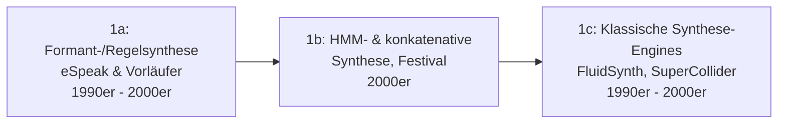

# Evolution und Architekturen digitaler KI-Audio-Werkzeuge

Die Übersicht [KI und Audio](ki-audio.md) erklärt Sprachsynthese, Spracherkennung und Musikgenerierung als fertige Konzepte, die [Beste KI-Audio-Tools (Top 20)](ki-audio-tools-topliste.md) rankt konkrete Werkzeuge nach 2026-Eignung. Dieser Artikel liefert die fehlende dritte Perspektive: die **chronologische Architekturgeschichte** — von klassischer, vor-neuronaler Sprachsynthese über den WaveNet-/Tacotron-Durchbruch, produktionsreife offene Spracherkennung und Zero-Shot-Stimmklonen bis zur heutigen Echtzeit- und Edge-fähigen Generation.

!!! note "Hinweis: Generationen überlappen sich"
    Die Zeiträume sind grobe Orientierung, keine scharfen Grenzen — klassische, nicht-neuronale Synthese-Engines (FluidSynth, SuperCollider) laufen bis heute produktiv als Rendering-Basis neben modernen KI-Modellen. Entscheidend ist die **Architektur** (regelbasiert/konkatenativ vs. autoregressiv-neuronal vs. Diffusion/Flow-basiert), nicht allein das Erscheinungsjahr.

---

## Generation 1: Klassische Sprachsynthese vor Deep Learning, bis ca. 2016

Die Gründergeneration eint drei Prinzipien: **regelbasierte oder konkatenative Synthese** statt gelernter Klangmodelle, **keine durchgängige neuronale End-to-End-Architektur** und ein bereits ausgereiftes klassisches Synthese-/Rendering-Fundament für Musik. Sie lässt sich in drei technologische Entwicklungsstufen unterteilen:

### 1a. Formant- & Regelsynthese, 1990er – 2000er

- **Architektur:** feste akustische Regeln erzeugen Sprachlaute direkt aus Phonemsymbolen, ohne aus Audiodaten zu lernen.
- **Vertreter:** **eSpeak** — extrem leichtgewichtig, robotisch klingend, bis heute als minimaler Accessibility-Fallback im Einsatz.

### 1b. HMM- & konkatenative Synthese, 2000er

- **Architektur:** **Festival** und verwandte Systeme setzen Sprache aus aufgezeichneten Sprachfragmenten (Diphone/Silben) zusammen oder modellieren Prosodie über Hidden-Markov-Modelle — natürlicher als reine Formantsynthese, aber weiterhin ohne gelerntes akustisches Gesamtmodell.
- **Grenzen:** begrenzte Stimmenvielfalt, hörbare Übergänge zwischen Sprachfragmenten — die direkte Motivation für den Wechsel zu neuronalen Modellen in Generation 2.

### 1c. Klassische Synthese-Engines für Musik, 1990er – 2000er

- **Architektur:** **FluidSynth** rendert MIDI über SoundFonts zu Audio, **SuperCollider** bietet eine mächtige Echtzeit-Sound-Synthese-Umgebung für Live-Coding und algorithmische Komposition — beide ohne eigenes KI-Feature.
- **Bedeutung:** bilden bis heute die Rendering-Basis vieler KI-gestützter Musik-Pipelines, siehe [Beste KI-Audio-Tools](ki-audio-tools-topliste.md#top-20-im-uberblick).

---

## Generation 2: Neuronale Sprachsynthese durchbricht die Qualitätsgrenze, 2016 – 2019

Der entscheidende Architekturbruch: Statt Sprachfragmente zusammenzusetzen, lernt ein neuronales Netz, Rohaudio direkt aus akustischen Merkmalen zu erzeugen — ein spürbarer Qualitätssprung gegenüber jeder konkatenativen Methode.

**Architektur:** autoregressive Waveform-Generierung Sample für Sample (WaveNet), zweistufige Text-zu-Spektrogramm-plus-Vocoder-Pipelines (Tacotron).

| Meilenstein | Jahr | Bedeutung |
|---|---|---|
| **WaveNet** (DeepMind) | 2016 | Erstes neuronales Modell, das Rohaudio Sample für Sample generiert — deutlich natürlicher als jede vorherige Synthesemethode, aber rechenintensiv. |
| **Tacotron** (Google) | 2017 | Text-zu-Mel-Spektrogramm-Modell, kombiniert mit einem Vocoder zur finalen Audioerzeugung — trennt linguistische von akustischer Modellierung. |
| **Tacotron 2 + WaveGlow** | 2018 | Verbindet Tacotrons Spektrogramm-Vorhersage mit einem schnelleren, parallelen Vocoder statt eines autoregressiven WaveNet. |

---

## Generation 3: Spracherkennung wird produktionsreif offen, 2019 – 2022

Parallel zur Sprachsynthese durchläuft die Spracherkennung (Speech-to-Text) denselben Architekturwandel — von aufgabenspezifischen HMM-Systemen zu einem einzigen, generalisierten neuronalen Modell.

**Architektur:** selbstüberwachtes Vortraining auf riesigen unlabeled Audiomengen (wav2vec 2.0), gefolgt von einem vollständig überwacht trainierten, mehrsprachigen Transformer-Encoder-Decoder (Whisper).

| System | Jahr | Bedeutung |
|---|---|---|
| **wav2vec 2.0** (Meta AI) | 2020 | Selbstüberwachtes Vortraining auf unlabeled Audio, deutlich reduzierter Bedarf an gelabelten Trainingsdaten. |
| **Whisper** (OpenAI) | 2022 | Massentaugliches, mehrsprachiges Transformer-Modell, trainiert auf 680.000 Stunden Web-Audio — etabliert sich sofort als Branchenstandard, siehe [Beste KI-Audio-Tools](ki-audio-tools-topliste.md#top-20-im-uberblick). |

---

## Generation 4: Stimmklonen & Voice Conversion, 2021 – 2023

Statt eine feste Stimme zu synthetisieren, lernen Modelle, aus wenigen Sekunden Referenzaudio eine beliebige Zielstimme nachzubilden — Zero-Shot-Fähigkeit als zentrale neue Anforderung.

**Architektur:** Speaker-Embedding-konditionierte TTS-Modelle statt fest trainierter Einzelstimmen, retrieval-basierte Merkmalsübertragung für Echtzeit-Stimmkonvertierung.

| System | Jahr | Rolle |
|---|---|---|
| **YourTTS** | 2021 | Frühes Zero-Shot-Multispeaker-TTS-Modell, Vorlage für die folgende Coqui-Linie. |
| **RVC** (Retrieval-based Voice Conversion) | 2023 | Community-Standard für Echtzeit-fähige Stimmkonvertierung und Coverversionen. |
| **XTTS v2** (Coqui) | 2023 | Hochwertiges Zero-Shot-Voice-Cloning aus wenigen Sekunden Audio, siehe [AI Voice Cloning (XTTS v2)](ai-voice-cloning-xtts.md). |

!!! warning "Ethik & Recht bei Stimmklonen"
    Wie die Quell-Topliste festhält, erfordert der produktive Einsatz dieser Generation die **Einwilligung der stimmgebenden Person** und die Kennzeichnungspflicht für synthetische Medien nach EU AI Act.

---

## Generation 5: Musik- & Sound-Generierung per Diffusion/Transformer, 2022 – 2024

Nach Sprache erschließt dieselbe Grundtechnologie — große generative Modelle statt regelbasierter Komposition — die Musik- und Sounddesign-Domäne.

**Architektur:** autoregressive Token-Generierung über komprimierte Audio-Codes (MusicGen) oder Diffusionsmodelle direkt auf Audio-Latents (Stable Audio), analog zum Architekturwandel bei [Bildgenerierung](../design/evolution-digitaler-ki-bildgenerierung.md#generation-2-diffusionsmodelle-losen-gans-ab-2020-2022).

| System | Jahr | Rolle |
|---|---|---|
| **Jukebox** (OpenAI) | 2020 | Früher Vorläufer, generiert Rohaudio-Musik inklusive Gesang — sehr rechenintensiv, kaum praxistauglich. |
| **MusicGen / AudioCraft** (Meta) | 2023 | Textprompt-zu-Musik-Generierung mit gut dokumentierter, offener Architektur. |
| **Stable Audio Open** (Stability AI) | 2024 | Diffusionsmodell für Musik und Soundeffekte, kommerziell nutzbar bis zu einer Umsatzgrenze. |

---

## Generation 6: Echtzeit- und Edge-fähige Generation, ab 2023

Die aktuelle Generation optimiert nicht primär auf maximale Qualität, sondern auf **Geschwindigkeit, Ressourcenschonung und Echtzeitfähigkeit** — Sprachsynthese und -erkennung laufen zunehmend lokal auf Edge-Geräten statt in der Cloud.

| System | Jahr | Rolle |
|---|---|---|
| **Piper** (Rhasspy) | 2023 | Extrem schnelle, leichtgewichtige lokale TTS für Edge-Geräte, viele Sprachen inklusive Deutsch. |
| **whisper.cpp / faster-whisper** | 2023 | CPU-/GPU-optimierte Whisper-Inferenz-Engines für lokale und Edge-Einsätze ohne Cloud-Abhängigkeit. |
| **RNNoise** (Xiph.Org/Mozilla) | seit 2017, breite Integration ab 2023 | Sehr leichtgewichtiges neuronales Netz für Echtzeit-Rauschunterdrückung, Basis vieler Kommunikations-Plugins. |
| **Bark** (Suno AI) | 2023 | Generiert aus einem Prompt neben Sprache auch nonverbale Laute, Musik-Snippets und Soundeffekte — ein Modell für mehrere Audio-Modalitäten. |

!!! tip "Bezug zu diesem Repository"
    Die aktuelle Werkzeuglandschaft dieser Generation vergleicht [Beste KI-Audio-Tools (Top 20)](ki-audio-tools-topliste.md) im Detail — inklusive Lizenzfragen bei MusicGen/XTTS v2 und der Ethik-/Rechtslage beim Stimmklonen.

---

## Alternative Sortier- & Klassifikationskriterien für KI-Audio-Werkzeuge

### 1. Funktionsdomäne

- **Sprachsynthese (TTS)** — Piper, XTTS v2 (Generation 2, 4, 6).
- **Spracherkennung (STT)** — Whisper, whisper.cpp (Generation 3, 6).
- **Musik-/Sound-Generierung** — MusicGen, Stable Audio (Generation 5).
- **Stimmkonvertierung** — RVC, so-vits-svc (Generation 4).

### 2. Generierungsprinzip

- **Regelbasiert/konkatenativ** — feste Regeln oder zusammengesetzte Fragmente (Generation 1).
- **Autoregressiv-neuronal** — WaveNet, Tacotron, Whisper (Generation 2–3).
- **Diffusion/Flow-basiert** — Stable Audio (Generation 5).

### 3. Betriebsmodell

- **Cloud-/GPU-intensiv** — Jukebox, größere Diffusionsmodelle (Generation 5).
- **Lokal/Edge-fähig** — Piper, whisper.cpp, RNNoise (Generation 6).

### 4. Zero-Shot-Fähigkeit

- **Feste, vortrainierte Stimme** — klassisches TTS ohne Anpassung (Generation 1–2).
- **Zero-Shot aus Referenzaudio** — XTTS v2, OpenVoice, YourTTS (Generation 4).

---

## Verwandte Themen

- [Beste KI-Audio-Tools (Top 20)](ki-audio-tools-topliste.md) — Momentaufnahme 2026, die diese Chronologie in eine gerankte Topliste übersetzt
- [Produktionsreife KI-Audio-Werkzeuge nach Generation (Top 4)](produktionsreife-ki-audio-werkzeuge-generationen-2026-topliste.md) — dieses Generationenmodell durch das konservative Fünf-Filter-Sieb; nur das klassische Synthese-Fundament (FluidSynth, SuperCollider, eSpeak NG) plus RNNoise besteht, die neuronalen Generierungswellen der Generationen 2–5 nicht
- [KI und Audio](ki-audio.md) — Konzepte hinter Sprachsynthese, Spracherkennung und Musikgenerierung
- [AI Voice Cloning (XTTS v2)](ai-voice-cloning-xtts.md) — praktische Vertiefung zu Generation 4
- [Evolution und Architekturen digitaler KI-Bildgenerierung](../design/evolution-digitaler-ki-bildgenerierung.md) — analoger Architekturwandel von GAN zu Diffusion in der Bild-Domäne
- [Evolution und Architekturen digitaler Deep-Learning-Anwendungen](../../künstliche-intelligenz/evolution-digitaler-deep-learning-anwendungen.md) — Sequenzmodelle/Attention aus Generation 2 dieser Zeitachse als übergeordneter Kontext
- [Audio-Übersicht](index.md)
