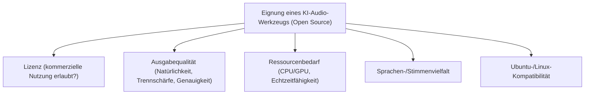
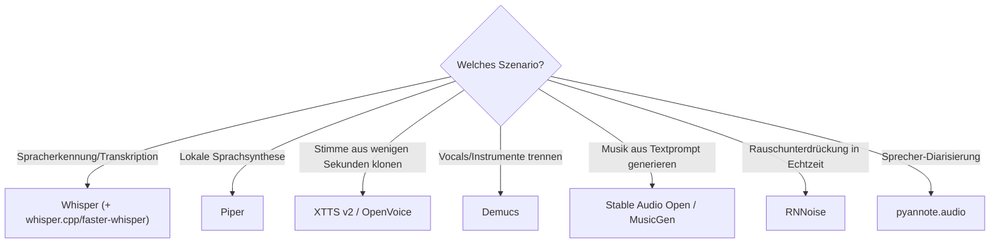

# Beste KI-Audio-Tools — Top-20-Topliste (Open Source)

Die Übersicht [KI und Audio](ki-audio.md) erklärt die Konzepte hinter Sprachsynthese, Spracherkennung und Musikgenerierung, die [Audio-Übersicht](index.md) listet die breitere Palette an Bibliotheken und Frameworks für programmatische Audioverarbeitung. Diese Seite konzentriert sich auf einen konkreten Vergleich: Welche **quelloffenen KI-Modelle und -Werkzeuge für Sprachsynthese, Spracherkennung, Stimmklonen, Stem-Separation und Musikgenerierung** sind aktuell die stärksten?

!!! note "Hinweis: Modell ≠ Framework ≠ Engine"
    Ein Teil dieser Liste sind eigenständige **KI-Modelle** (Whisper, Piper, Demucs), ein anderer Teil sind **Frameworks**, die mehrere austauschbare Modelle bündeln (Coqui TTS), und wieder andere sind klassische **Synthese-/Rendering-Engines** ohne eigenes KI-Feature (FluidSynth, SuperCollider), die aber als Basis KI-gestützter Pipelines dienen.

---

## Bewertungskriterien

!!! warning "Achtung: Lizenzen und Ethik unterscheiden sich stark zwischen den Modellen"
    MusicGen/AudioCraft steht unter einer nicht-kommerziellen CC-BY-NC-4.0-Lizenz, XTTS v2 unter der Coqui Public Model License mit kommerziellen Einschränkungen, Essentia unter AGPL-3.0 (kommerzielle Lizenz separat erhältlich). Bei **Stimmklonen und -konvertierung** (XTTS v2, RVC, OpenVoice, so-vits-svc) sind zusätzlich die **Einwilligung der stimmgebenden Person** und die Kennzeichnungspflicht für synthetische Medien nach EU AI Act zu beachten. **Stand: Juli 2026.**

---

## Top 20 im Überblick

| Rang | Software/Modell | Anbieter | Lizenz | Kategorie | Einschätzung | Besondere Stärke | Schwäche |
|---|---|---|---|---|---|---|---|
| 1 | **Whisper** | OpenAI | MIT | Spracherkennung (STT) | Sehr stark | Branchenführendes, mehrsprachiges STT-Modell mit riesigem Ökosystem (whisper.cpp, faster-whisper) | Keine native Streaming-Erkennung, gelegentliche Halluzinationen bei Stille/Rauschen |
| 2 | **Piper** | Rhasspy/Community | MIT | Sprachsynthese (TTS) | Sehr stark | Extrem schnelle, leichtgewichtige lokale TTS mit vielen Sprachen inkl. Deutsch, ideal für Edge-Geräte | Stimmqualität hinter neueren autoregressiven/Diffusionsmodellen wie XTTS |
| 3 | **Demucs** | Meta AI | MIT | Stem-Separation | Sehr stark | State-of-the-art Trennung von Vocals, Bass, Drums und weiteren Instrumenten | GPU für akzeptable Verarbeitungszeit bei längeren Tracks empfohlen |
| 4 | **Coqui TTS** | Community (Fork von Coqui AI) | MPL-2.0 | TTS-Framework | Stark | Größtes Ökosystem an TTS-Architekturen (Tacotron, VITS, XTTS) unter einer gemeinsamen API | Ursprüngliches Unternehmen 2024 geschlossen, Weiterentwicklung community-getragen |
| 5 | **XTTS v2** | Coqui/Community | Coqui Public Model License (kommerziell eingeschränkt) | Voice Cloning (TTS) | Stark | Hochwertiges Zero-Shot-Voice-Cloning aus wenigen Sekunden Audio, siehe [AI Voice Cloning (XTTS v2)](ai-voice-cloning-xtts.md) | Lizenz schränkt kommerzielle Nutzung ein |
| 6 | **RVC (Retrieval-based Voice Conversion WebUI)** | Community | MIT | Stimmumwandlung | Stark | Community-Standard für Echtzeit-fähige Stimmkonvertierung und Coverversionen | Ethische/rechtliche Fragen bei fremden Stimmen ohne Einwilligung strikt beachten |
| 7 | **Stable Audio Open** | Stability AI | Stability AI Community License (permissiv bis Umsatzgrenze) | Musik-/Sound-Generierung | Stark | Offenes Diffusionsmodell für Musik und Soundeffekte, kommerziell nutzbar | Maximale Ausgabelänge begrenzt (ca. 47 Sekunden) |
| 8 | **RNNoise** | Xiph.Org/Mozilla | BSD-3-Clause | Rauschunterdrückung | Stark | Sehr leichtgewichtiges neuronales Netz für Echtzeit-Rauschunterdrückung, Basis vieler Plugins | Reine Rauschunterdrückung, kein umfassendes Restaurationswerkzeug |
| 9 | **whisper.cpp / faster-whisper** | Community | MIT | STT-Inferenz-Engine | Stark | Extrem schnelle CPU-/GPU-optimierte Whisper-Inferenz für lokale und Edge-Einsätze | Reine Reimplementierung, keine über Whisper hinausgehenden Fähigkeiten |
| 10 | **MusicGen (AudioCraft)** | Meta AI | CC-BY-NC 4.0 | Musikgenerierung | Solide bis stark | Hochwertige Textprompt-zu-Musik-Generierung, gut dokumentiert | Nicht-kommerzielle Lizenz |
| 11 | **Bark** | Suno AI | MIT | Text-zu-Audio (Sprache/Musik/SFX) | Solide bis stark | Generiert neben Sprache auch nonverbale Laute, Musik-Snippets und Soundeffekte aus einem Prompt | Qualität/Konsistenz hinter spezialisierten TTS-Modellen |
| 12 | **OpenVoice** | MyShell | MIT | Voice Cloning | Solide bis stark | Schnelles, flexibles Zero-Shot-Cloning mit granularer Stil-Kontrolle (Emotion, Akzent, Rhythmus) | Jüngeres Projekt, kleineres Ökosystem als XTTS |
| 13 | **Vosk** | Alpha Cephei | Apache-2.0 | Offline-Spracherkennung | Solide bis stark | Kompakte, vollständig offline-fähige Erkennung für viele Sprachen inkl. ressourcenarmer Geräte | Erkennungsgenauigkeit hinter Whisper bei komplexem/verrauschtem Audio |
| 14 | **pyannote.audio** | Community (Hervé Bredin) | MIT (einzelne Modelle gated) | Sprecher-Diarisierung | Solide | Referenzbibliothek zur Trennung „wer spricht wann", gut kombinierbar mit Whisper | Gated Modelle benötigen Zustimmung/Anmeldung bei Hugging Face |
| 15 | **so-vits-svc** | Community | MIT | Gesangsstimmen-Konvertierung | Solide | Etabliertes Projekt für hochwertige Cover-/Gesangsstimmkonvertierung | Training erfordert saubere A-cappella-Daten, ethische Grenzen strikt beachten |
| 16 | **Magenta / Magenta.js** | Google | Apache-2.0 | Algorithmische Musikgenerierung | Solide | Forschungsgetriebenes Toolkit mit vielen vortrainierten Modellen (MusicVAE, Onsets & Frames) | Aktive Weiterentwicklung seit einiger Zeit verlangsamt |
| 17 | **Spleeter** | Deezer | MIT | Stem-Separation | Solide | Historisch wichtiges, sehr schnelles Separationswerkzeug mit einfacher CLI | Trennqualität inzwischen hinter Demucs |
| 18 | **Essentia** | MTG-UPF | AGPL-3.0 (kommerzielle Lizenz separat erhältlich) | Audio-Analyse (MIR) | Solide | Umfangreichste Bibliothek für Music Information Retrieval (Tempo, Tonart, Genre-Klassifikation) | AGPL erschwert Einbindung in proprietäre/geschlossene Produkte |
| 19 | **FluidSynth** | Community | LGPL-2.1 | Software-Synthesizer (MIDI-zu-Audio) | Solide | Standard-Engine zum Rendern von MIDI mit SoundFonts, Basis vieler Automatisierungs-Pipelines | Kein eigenes KI-Feature, reines Rendering-Werkzeug |
| 20 | **SuperCollider** | Community | GPL-3.0 (Server: BSD) | Live-Coding/Sound-Synthese | Solide | Mächtige Echtzeit-Sound-Engine, Basis für Sonic Pi und algorithmische Komposition | Kein eigenes KI-Feature, steile Lernkurve |

!!! tip "Tipp: Rang ≠ einzige Entscheidungsgröße"
    Für **Spracherkennung ohne Lizenz-Einschränkungen** ist Whisper (bzw. die schnellere whisper.cpp/faster-whisper-Inferenz) die naheliegende Wahl. Für **lokale Sprachsynthese** liefert Piper das beste Verhältnis aus Geschwindigkeit und Qualität, für **Voice Cloning** XTTS v2 die beste Qualität bei einzuhaltenden Lizenzgrenzen. Für die **Musikproduktion** des generierten Materials (Stem-Trennung, Rauschunterdrückung, MIDI-Rendering) sind Demucs, RNNoise und FluidSynth die etablierten Ergänzungswerkzeuge, siehe auch [DAW-Integration mit KI](daw-integration.md).

---

## Empfehlung nach Einsatzszenario

---

## 🔗 Verwandte Themen

- [Startseite](../../index.md) — zurück zur Dokumentations-Zentrale
- [KI und Audio](ki-audio.md) — Konzepte hinter Sprachsynthese, Spracherkennung und Musikgenerierung
- [AI Voice Cloning (XTTS v2)](ai-voice-cloning-xtts.md) — vertiefende Praxis zu Rang 5
- [DAW-Integration mit KI](daw-integration.md)
- [Audacity mit KI](audacity-ki.md)
- [Audio-Übersicht](index.md)
- [Beste KI-Bildgenerierungs-Tools (Open Source, Top 20)](../design/ki-bildgenerierung-tools-topliste.md)
- [Beste KI-Video-Tools (Open Source, Top 20)](../video/ki-video-tools-topliste.md)
