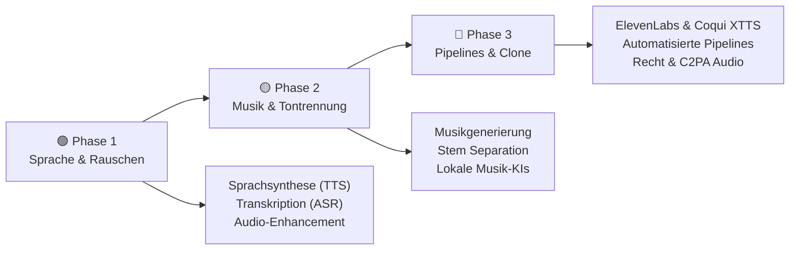

# KI und Audio

> **Hinweis zur Software-Auswahl:**  
> Diese Dokumentation priorisiert **Open-Source-Software**, die lokal unter Ubuntu läuft, um Datenschutz bei Sprachaufnahmen und Unabhängigkeit bei der Audioverarbeitung zu gewährleisten.  
> Bei kommerziellen Cloud-Services wird stets eine **Open-Source-Alternative** mit gleichem Funktionsumfang gegenübergestellt.  
> **LLM-Modelle** und APIs werden unabhängig vom Preis gelistet, da sie als Steuerung für Sprach- und Musikprozesse dienen.

---

## Legende

| Symbol | Bedeutung |
|---|---|
| 🟩 | Open Source – kostenlos, self-hosted / Ubuntu-kompatibel |
| 💰 | Kostenpflichtig |
| 🤖 | LLM-Modell / API – bleibt immer gelistet |
| 🐧 | Linux / Ubuntu nativ |
| 🌐 | Nur Web-Browser |

---

## Lernpfad-Übersicht



---

## Inhaltsverzeichnis

- [🟢 Phase 1 – Grundlagen & Sprachsynthese](#phase-1-grundlagen-sprachsynthese)
    - [1.1 Konzept: Text-to-Speech (TTS) vs. Speech-to-Text (ASR)](#11-konzept-text-to-speech-tts-vs-speech-to-text-asr)
    - [1.2 Thema: Transkription mit Whisper.cpp](#12-thema-transkription-mit-whispercpp)
    - [1.3 Thema: Einfache Sprachsynthese & Voice-Over](#13-thema-einfache-sprachsynthese-voice-over)
    - [1.4 Thema: Audio-Enhancement (Rauschunterdrückung)](#14-thema-audio-enhancement-rauschunterdruckung)
- [🟡 Phase 2 – Musikgenerierung & Stem Separation](#phase-2-musikgenerierung-stem-separation)
    - [2.1 Konzept: MIDI-Generierung vs. Waveform-Generierung](#21-konzept-midi-generierung-vs-waveform-generierung)
    - [2.2 Thema: Tontrennung (Stem Separation)](#22-thema-tontrennung-stem-separation)
    - [2.3 Thema: Lokale Musikgenerierung mit MusicGen](#23-thema-lokale-musikgenerierung-mit-musicgen)
    - [2.4 Thema: Audio-Restaurierung lokal (DeepFilterNet)](#24-thema-audio-restaurierung-lokal-deepfilternet)
- [🔴 Phase 3 – Eigene Pipelines & Integration](#phase-3-eigene-pipelines-integration)
    - [3.1 Konzept: Synthetische Stimmen im professionellen Umfeld](#31-konzept-synthetische-stimmen-im-professionellen-umfeld)
    - [3.2 Thema: Voice Cloning lokal vs. Cloud](#32-thema-voice-cloning-lokal-vs-cloud)
    - [3.3 Thema: Automatisierte Audio-Pipelines mit n8n](#33-thema-automatisierte-audio-pipelines-mit-n8n)
    - [3.4 Thema: Ethik, Deepfakes & Wasserzeichen (C2PA Audio)](#34-thema-ethik-deepfakes-wasserzeichen-c2pa-audio)
- [📋 Praxisprojekte](#praxisprojekte)
- [📦 Vollständige Softwareübersicht & Vergleich](#vollstandige-softwareubersicht-vergleich)

---

## 🟢 Phase 1 – Grundlagen & Sprachsynthese

> **Was lerne ich hier?**  
> Die Konzepte zur Umwandlung von Sprache in Text (und umgekehrt), wie du Whisper lokal unter Ubuntu einrichtest und wie KI störendes Rauschen aus Aufnahmen entfernt.  
> **Voraussetzungen:** Keine.

---

### 1.1 Konzept: Text-to-Speech (TTS) vs. Speech-to-Text (ASR)

#### Die Schnittstellen zwischen Stimme und Computer

| Technologie | Langform | Funktion | Beispiel |
|---|---|---|---|
| **TTS** | Text-to-Speech | Wandelt geschriebenen Text in gesprochene Sprache um | Vorlesen eines E-Books |
| **ASR** | Automatic Speech Recognition | Wandelt gesprochene Sprache in geschriebenen Text um | Diktierfunktion |

```
Text  ------------------> [ TTS (z.B. Kokoro) ]  ------------------> Sprache (Audio)
Sprache (Audio)  -------> [ ASR (z.B. Whisper) ] ------------------> Text
```

---

### 1.2 Thema: Transkription mit Whisper.cpp

#### Konzept: Lokale Spracherkennung

Das **Whisper-Modell** (von OpenAI veröffentlicht, als Open-Source freigegeben) ist das präziseste ASR-Modell. Die C++-Portierung `whisper.cpp` läuft extrem schnell auf Ubuntu – auch ohne Grafikkarte auf einer normalen CPU.

```bash
# Whisper.cpp lokal installieren und testen
git clone https://github.com/ggerganov/whisper.cpp
cd whisper.cpp
make

# Modell herunterladen (z.B. base.bin)
bash ./models/download-ggml-model.sh base

# Audio transkribieren
./main -f samples/jfk.wav -m models/ggml-base.bin
```

---

### 1.3 Thema: Einfache Sprachsynthese & Voice-Over

#### Konzept: Sprachsynthese mit Modellen

Moderne TTS-Systeme klingen nicht mehr robotisch, sondern modulieren Betonung und Atmung natürlich.

#### Software – Open Source zuerst:

| Software | Typ | Funktion | Ubuntu | Link |
|---|---|---|---|---|
| 🟩 [Kokoro-ONNX](https://github.com/thewh1teagle/kokoro-onnx) | TTS | Ultraschnelles, ressourcenschonendes TTS lokal | 🐧 Ja | github.com/thewh1teagle |
| 🟩 [Bark (Suno)](https://github.com/suno-ai/bark) | Audio-KI | Generiert Sprache, Musik und Soundeffekte | 🐧 Ja | github.com/suno-ai |
| 🤖 [ElevenLabs API](https://elevenlabs.io) | Cloud TTS | Premium-Stimmen und Voice-Cloning über API | 🌐 Web | elevenlabs.io |

---

### 1.4 Thema: Audio-Enhancement (Rauschunterdrückung)

#### Konzept: Neuronale Rauschunterdrückung

KI-basierte Rauschunterdrückungs-Modelle wurden auf Millionen sauberer und verrauschter Audiobeispiele trainiert. Sie filtern Frequenzen nicht starr heraus, sondern rekonstruieren die Stimme aktiv und eliminieren Wind, Hall und Hintergrundgeräusche.

#### Software – Open Source zuerst:

| Software | Typ | Funktion | Ubuntu | Link |
|---|---|---|---|---|
| 🟩 [DeepFilterNet](https://github.com/Rikorose/DeepFilterNet) | Audio-KI | Lokale, latenzfreie Rauschunterdrückung (Rust-basiert) | 🐧 Ja | github.com/Rikorose |
| 🟩 [Audacity](https://www.audacityteam.org) | Editor | Open-Source-Editor mit KI-Rauschfilter-Plugins | 🐧 Ja | audacityteam.org |

#### Vergleich: Open Source vs. Kommerziell

| Funktion | Open Source 🟩 (Ubuntu) | Kommerziell 💰 |
|---|---|---|
| Rauschunterdrückung | DeepFilterNet, RNNoise | iZotope RX 11, Krisp |
| 1-Klick Verbesserung | DeepFilterNet CLI | Adobe Podcast Enhance |

---

## 🟡 Phase 2 – Musikgenerierung & Stem Separation

> **Was lerne ich hier?**  
> Wie du Musikspuren in Gesang und Instrumente trennst und wie KI-Modelle komplette Songs oder Soundeffekte lokal generieren.  
> **Voraussetzungen:** Phase 1 abgeschlossen.

---

### 2.1 Konzept: MIDI-Generierung vs. Waveform-Generierung

| Methode | Beschreibung | Vorteile | Nachteile |
|---|---|---|---|
| **MIDI-Generierung** | KI schreibt Notenbefehle (Synthesizer-Noten) | Unbegrenzt editierbar, extrem klein | Benötigt Synthesizer für Klang |
| **Waveform-Generierung** | KI rechnet direkt die finale Audiodatei (WAV/MP3) | Klingt sofort nach echten Instrumenten | Kaum nachträglich bearbeitbar |

---

### 2.2 Thema: Tontrennung (Stem Separation)

#### Konzept: Was ist Stem Separation?

KI-Modelle können eine fertige Musikdatei analysieren und in separate Spuren (**Stems**) aufteilen – meist in Gesang (Vocals), Schlagzeug (Drums), Bass und andere Instrumente.

```
[ Song.mp3 ]  --> [ KI-Separation (Demucs) ] --> [ Vocals.wav, Drums.wav, Bass.wav, Other.wav ]
```

#### Software – Open Source zuerst:

| Software | Typ | Funktion | Ubuntu | Link |
|---|---|---|---|---|
| 🟩 [Demucs (Meta)](https://github.com/facebookresearch/demucs) | Audio-KI | Der Industriestandard für Tontrennung lokal | 🐧 Ja | github.com/facebookresearch |
| 🟩 [Audacity + OpenVINO Plugins](https://github.com/intel/openvino-plugins-audacity) | Editor | Stem-Separation direkt im GUI von Audacity | 🐧 Ja | github.com/intel |

#### Vergleich: Open Source vs. Kommerziell

| Funktion | Open Source 🟩 (Ubuntu / Self-hosted) | Kommerziell 💰 |
|---|---|---|
| Stem Separation | Demucs CLI, Audacity Integration | LALAL.AI, RipX, PhonicMind |

---

### 2.3 Thema: Lokale Musikgenerierung mit MusicGen

#### Konzept: Musik aus Textbeschreibungen (Text-to-Music)

**MusicGen** (von Meta) ist ein Open-Source-Modell, das Musikstücke anhand von Prompts generiert.

```python
# MusicGen lokal nutzen (Python)
from audiocraft.models import MusicGen

model = MusicGen.get_pretrained('facebook/musicgen-small')
model.set_generation_params(duration=8)
wav = model.generate(["Jazz mit klarem Klavierspiel und weichem Schlagzeug"])
```

#### Software – alle Open Source:

| Software | Typ | Funktion | Ubuntu | Link |
|---|---|---|---|---|
| 🟩 [AudioCraft (Meta)](https://github.com/facebookresearch/audiocraft) | Audio-KI | Framework für MusicGen, AudioGen und EnCodec | 🐧 Ja | github.com/facebookresearch |

#### Vergleich: Open Source vs. Kommerziell

| Musik-Generierung | Open Source 🟩 (Ubuntu / Self-hosted) | Kommerziell 💰 |
|---|---|---|
| Generative Songs | AudioCraft / MusicGen | Suno AI, Udio, Loudly |

---

### 2.4 Thema: Audio-Restaurierung lokal (DeepFilterNet)

#### Konzept: Signalverarbeitung mit neuronalen Netzen

DeepFilterNet nutzt Faltungs-Neuronale Netze (CNNs), um die komplexen Spektrogramme von Audioaufnahmen in Echtzeit zu filtern. Es arbeitet extrem ressourceneffizient und eignet sich perfekt für Linux-Server-Pipelines.

---

## 🔴 Phase 3 – Eigene Pipelines & Integration

> **Was lerne ich hier?**  
> Wie du Stimmen klonst, automatisierte Audio-Workflows programmierst und Audiodateien rechtssicher mit Metadaten signierst.  
> **Voraussetzungen:** Phase 1 & 2 abgeschlossen. Python-Grundkenntnisse.

---

### 3.1 Konzept: Synthetische Stimmen im professionellen Umfeld

#### Vor- und Nachteile von KI-Stimmen

- **Vorteile:** Skalierbarkeit (100 Sprachen auf Knopfdruck), unbegrenzte Text-Aktualisierungen ohne Studio-Nachaufnahmen, geringe Kosten.
- **Nachteile:** Fehlende feine emotionale Nuancen (Schauspiel), rechtliche Risiken bei unbefugtem Klonen.

---

### 3.2 Thema: Voice Cloning lokal vs. Cloud

#### Konzept: Zero-Shot Voice Cloning

Moderne Klon-Systeme benötigen keine Stunden an Audiomaterial mehr. Es reicht eine **3-sekündige Sprachprobe** (Referenz-Audio), um die Stimmcharakteristik auf einen neuen Text zu übertragen.

#### Software – Open Source zuerst:

| Software | Typ | Funktion | Ubuntu | Link |
|---|---|---|---|---|
| 🟩 [Coqui XTTS-v2](https://github.com/coqui-ai/TTS) | Voice Cloning | Lokales, hochwertiges Stimmen-Klonen (20+ Sprachen) | 🐧 Ja | github.com/coqui-ai |
| 🟩 [Bark](https://github.com/suno-ai/bark) | Voice-KI | Lokale Stimm-Synthese inklusive Lachen und Seufzen | 🐧 Ja | github.com/suno-ai |
| 🤖 [ElevenLabs](https://elevenlabs.io) | Cloud Voice | Marktführer für Cloud-Voice-Cloning | 🌐 Web | elevenlabs.io |

---

### 3.3 Thema: Automatisierte Audio-Pipelines mit n8n

#### Konzept: Workflow-Automatisierung für Podcasts

Du lädst eine Roh-Audiodatei auf deinen Cloud-Speicher. Eine n8n-Pipeline verarbeitet diese automatisch:

```mermaid
graph TD
    A["📹 Neues Video / Audio auf Nextcloud"] --> B["⚙️ n8n Workflow startet"]
    B --> C["🤖 Demucs ("Trennt Musik & Stimme")"]
    C --> D["🤖 DeepFilterNet (Bereinigt die Stimme)"]
    D --> E["🤖 Whisper.cpp (Generiert SRT-Untertitel)"]
    E --> F["🚀 Fertige Spur + Untertitel auf Nextcloud"]
```

---

### 3.4 Thema: Ethik, Deepfakes & Wasserzeichen (C2PA Audio)

#### Konzept: Herkunftsnachweis von Audiodaten

Um Missbrauch und gefälschte Sprachnachrichten (Deepfakes) zu bekämpfen, etabliert sich der **C2PA-Standard**. Er bettet kryptografisch signierte Metadaten in das Audiofile ein, um den Ersteller und die KI-Beteiligung lückenlos nachzuweisen.

---

## 📋 Praxisprojekte

### 🟢 Einsteiger: Lokale Transkription mit GUI

Wir nutzen Subtitle Edit unter Ubuntu mit integriertem Whisper-Modell, um Untertitel für ein Video automatisch zu erstellen und als `.srt` zu exportieren.


**Software (alle Open Source):** Subtitle Edit · Whisper.cpp

---

### 🟡 Fortgeschritten: Instrumente aus Songs filtern

Wir trennen mit Demucs Gesang und Begleitmusik für eine Karaoke-Version.

```bash
# Demucs lokal installieren (Ubuntu)
pip install demucs

# Spur trennen (erzeugt separate Spuren für Vocals, Drums, Bass, Other)
demucs -two-stems=vocals song.mp3
```

**Software (alle Open Source):** Demucs · FFmpeg · Python

---

### 🔴 Experte: DSGVO-konforme Vorlesungs-Nachbereitung

Ein Python-Skript transkribiert eine Audio-Aufzeichnung lokal, bereinigt sie, lässt ein lokales LLM Shownotes schreiben und speichert alles in Nextcloud.

```mermaid
graph TD
    A["🎙️ Vorlesungs-Audio"] --> B["⚡ DeepFilterNet (Bereinigung)"]
    B --> C["🔤 Whisper.cpp (Transkript)"]
    C --> D["🤖 Ollama ("Modell: Llama3 - Shownotes & Zusammenfassung")"]
    D --> E["💾 Nextcloud Ordner"]
```

**Software (alle Open Source):** DeepFilterNet · Whisper.cpp · Ollama · Python · Nextcloud

---

## 📦 Vollständige Softwareübersicht & Vergleich

### Text-to-Speech (TTS) & Voice Cloning

| Funktion | Open Source 🟩 (Ubuntu / Self-hosted) | Kommerziell 💰 |
|---|---|---|
| Premium Voice Cloning | Coqui XTTS-v2 🐧, Bark 🐧 | ElevenLabs |
| Schnelles lokales TTS | Kokoro-ONNX 🐧 | Murf.ai, Play.ht |

### Spracherkennung (ASR / Transkription)

| Funktion | Open Source 🟩 (Ubuntu / Self-hosted) | Kommerziell 💰 |
|---|---|---|
| Transkription | Whisper.cpp 🐧, Faster-Whisper 🐧 | Sonix, Rev.com |
| Untertitel-Editor | Subtitle Edit 🐧 | Submagic |

### Audio-Restaurierung & Tontrennung

| Funktion | Open Source 🟩 (Ubuntu / Self-hosted) | Kommerziell 💰 |
|---|---|---|
| Rauschunterdrückung | DeepFilterNet 🐧, RNNoise 🐧 | iZotope RX 11 |
| Tontrennung (Stem Sep) | Demucs 🐧, Spleeter 🐧 | LALAL.AI |

### Musikgenerierung & Soundeffekte

| Funktion | Open Source 🟩 (Ubuntu / Self-hosted) | Kommerziell 💰 |
|---|---|---|
| Text-to-Music | AudioCraft / MusicGen 🐧 | Suno AI, Udio |
| Soundeffekte (SFX) | AudioCraft / AudioGen 🐧 | ElevenLabs SFX |

---

## Weiterführende Ressourcen

- **[Beste KI-Audio-Tools (Open Source, Top 20)](ki-audio-tools-topliste.md)** – Vertiefender Werkzeug-/Modellvergleich 🟩
- **[Whisper.cpp Repo](https://github.com/ggerganov/whisper.cpp)** – Schnelle lokale Spracherkennung 🟩
- **[DeepFilterNet GitHub](https://github.com/Rikorose/DeepFilterNet)** – Echtzeit-Rauschunterdrückung 🟩
- **[Meta AudioCraft Repo](https://github.com/facebookresearch/audiocraft)** – MusicGen Demos & Code 🟩
- **[Coqui TTS Github](https://github.com/coqui-ai/TTS)** – Voice-Cloning-Schnittstelle 🟩
- **[C2PA Project](https://c2pa.org)** – Spezifikationen zur Audio-Signierung

---

*Letzte Aktualisierung: Juli 2026*
