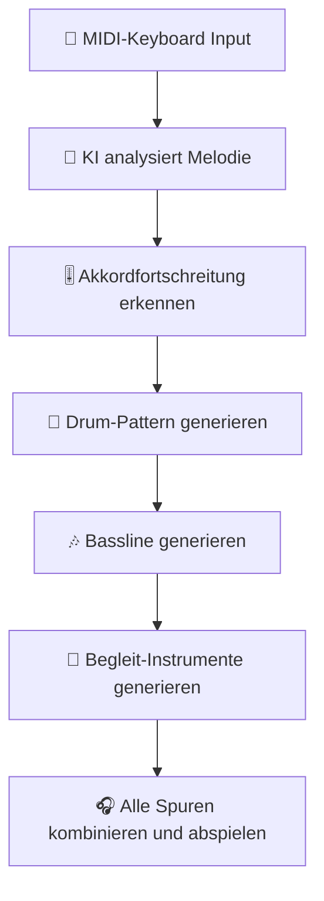
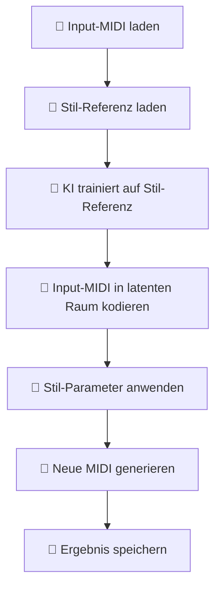
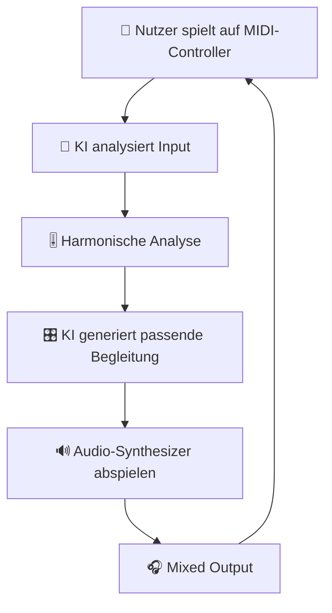
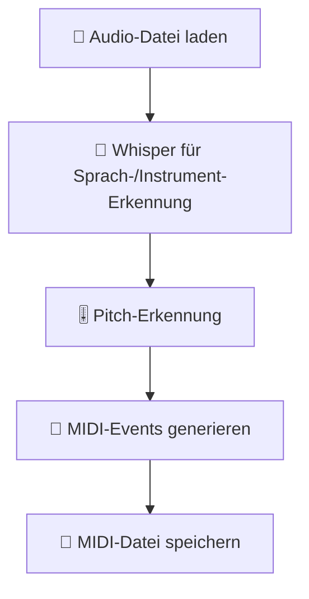

# MIDI-Programmierung mit KI: Intelligente Musiksteuerung

Wie künstliche Intelligenz MIDI-Daten generiert, analysiert und verarbeitet – von automatischer Melodie-Erstellung bis zur Echtzeit-Steuerung von Synthesizern und DAWs.

---

## 🎯 Einführung: KI und MIDI

### Warum KI für MIDI-Programmierung?

MIDI (Musical Instrument Digital Interface) ist das Standardprotokoll für Musiksteuerung. KI kann MIDI in folgenden Bereichen revolutionieren:

| KI-Funktion | Vorteil | Anwendungsbeispiel |
|------------|---------|-------------------|
| **MIDI-Generierung** | Automatische Erstellung von Melodien, Akkorden, Drums | Musikproduktion, Sound-Design |
| **MIDI-Analyse** | Erkennung von Tonarten, Akkorden, Mustern | Musiktranskription, Musiktheorie |
| **MIDI-Transformation** | Umwandlung von MIDI-Daten (z.B. Stiltransfer) | Remixing, Arrangement |
| **MIDI-Lernung** | Analyse von MIDI-Daten zum Trainieren von Modellen | KI-Modelltraining |
| **Echtzeit-Steuerung** | Dynamische MIDI-Steuerung basierend auf KI-Entscheidungen | Live-Performance, Interaktive Installationen |
| **MIDI-Optimierung** | Automatische Korrektur von Timing und Dynamik | Musikproduktion, Mixing |

### KI vs. Traditionelle MIDI-Programmierung

| Aspekt | Traditionell | Mit KI |
|--------|-------------|-------|
| **Melodie-Erstellung** | Manuelles Kompositionieren | KI generiert Melodien basierend auf Stimmungen |
| **Akkordfortschreitungen** | Musiktheorie-Kenntnisse erforderlich | KI schlägt harmonische Fortschreitungen vor |
| **Drum-Programming** | Manuelles Einprogrammieren jedes Hits | KI generiert komplette Drum-Patterns |
| **Arrangement** | Manuelle Strukturierung | KI analysiert und schlägt Arrangements vor |
| **Stil-Transfer** | Manuelles Anpassen | KI überträgt den Stil eines Künstlers |
| **Echtzeit-Begleitung** | Vorgefertigte Patterns | KI improvisiert basierend auf Input |

---

## 📝 MIDI-Grundlagen

### MIDI-Nachrichten-Typen

| Nachrichtstyp | Beschreibung | Hex-Wert | Datenbytes |
|--------------|--------------|----------|------------|
| **Note Off** | Beendet eine Note | 0x8n | 2 (Note, Velocity) |
| **Note On** | Startet eine Note (Velocity=0 = Note Off) | 0x9n | 2 (Note, Velocity) |
| **Polyphonic Pressure** | Druck pro Note (Aftertouch) | 0xAn | 2 (Note, Pressure) |
| **Control Change** | Steuerungsänderung (z.B. Modulation) | 0xBn | 2 (Controller, Value) |
| **Program Change** | Instrument wechseln | 0xCn | 1 (Program) |
| **Channel Pressure** | Druck für gesamten Kanal | 0xDn | 1 (Pressure) |
| **Pitch Bend** | Tonhöhenänderung | 0xEn | 2 (LSB, MSB) |
| **System Exclusive** | Herstellerspezifische Daten | 0xF0 | Variabel |
| **System Common** | Systemweite Nachrichten | 0xF1-0xF7 | Variabel |
| **System Real-Time** | Echtzeit-Nachrichten | 0xF8-0xFF | 0-1 |

### MIDI-Note-Nummern

```python
# MIDI-Note-Nummern zu Notennamen
NOTE_NAMES = ['C', 'C#', 'D', 'D#', 'E', 'F', 'F#', 'G', 'G#', 'A', 'A#', 'B']

def note_number_to_name(note_number):
    """Konvertiert MIDI-Note-Nummer zu Notename."""
    octave = note_number // 12 - 1
    note = note_number % 12
    return f"{NOTE_NAMES[note]}{octave}"

# Beispiele
print(note_number_to_name(60))  # C4 (Mittleres C)
print(note_number_to_name(69))  # A4 (Kammerton A)
print(note_number_to_name(36))  # C2 (Bass-Drum)
```

### MIDI-Dateiformat

MIDI-Dateien bestehen aus **Tracks**, die **Events** enthalten:

```
Header-Chunk (14 Bytes)
  - Chunk-Typ: 'MThd' (4 Bytes)
  - Länge: 6 (4 Bytes)
  - Format: 0, 1 oder 2 (2 Bytes)
  - Anzahl der Tracks (2 Bytes)
  - Division (2 Bytes)

Track-Chunk(s)
  - Chunk-Typ: 'MTrk' (4 Bytes)
  - Länge (4 Bytes)
  - Events (variabel)
    - Delta-Time (variabel)
    - Event-Typ (1 Byte)
    - Daten (variabel)
```

---

## 🤖 KI-Modelle für MIDI

### Magenta: Googles KI für Musik

**Magenta** ist ein Open-Source-Projekt von Google, das Deep Learning für Musik und Kunst nutzt.

#### Installation

```bash
# Magenta installieren
pip install magenta

# TensorFlow (für GPU-Beschleunigung)
pip install tensorflow  # oder tensorflow-gpu
```

#### MIDI-Generierung mit Magenta

```python
import magenta.music as mm
from magenta.models.melody_rnn import melody_rnn_sequence_generator
from magenta.protobuf import music_pb2

# Einfaches Melodie-Modell
bundle = melody_rnn_sequence_generator.load_bundle('/path/to/melody_rnn_bundle')
generator = bundle.generator

# Eingabe-Sequenz erstellen
input_sequence = music_pb2.NoteSequence()
input_sequence.notes.add(pitch=60, start_time=0.0, end_time=0.5, velocity=100)
input_sequence.notes.add(pitch=62, start_time=0.5, end_time=1.0, velocity=100)
input_sequence.notes.add(pitch=64, start_time=1.0, end_time=1.5, velocity=100)
input_sequence.total_time = 1.5
input_sequence.tempos.add(qpm=120)

# MIDI generieren
result = generator.generate(
    input_sequence,
    generator_options=mm.GeneratorOptions(args={'temperature': 1.0})
)

# MIDI-Datei speichern
mm.sequence_proto_to_midi_file(result, 'generated_melody.mid')
```

#### Vorhandene Magenta-Modelle

| Modell | Beschreibung | Eingabe | Ausgabe |
|--------|--------------|--------|--------|
| **Melody RNN** | Einfache Melodie-Generierung | Monophone MIDI | Monophone MIDI |
| **Polyphony RNN** | Polyphone Musik-Generierung | Polyphone MIDI | Polyphone MIDI |
| **Drum RNN** | Drum-Pattern-Generierung | Drum-Pattern | Drum-Pattern |
| **Chord RNN** | Akkordfortschreitungen | Akkordfolgen | Akkordfolgen |
| **Attention RNN** | Musik mit Aufmerksamkeit | MIDI | MIDI |
| **Transformer** | Musik mit Transformer-Architektur | MIDI | MIDI |

---

### MIDI-LSTM: LSTM-Netzwerke für MIDI

#### Einfaches LSTM-Modell für MIDI-Generierung

```python
import numpy as np
import tensorflow as tf
from tensorflow.keras.models import Sequential
from tensorflow.keras.layers import LSTM, Dense, Dropout
from tensorflow.keras.optimizers import Adam

# Parameter
SEQUENCE_LENGTH = 100
VOCAB_SIZE = 128 * 3  # 128 Noten + 128 Controller + 128 Sonstiges
EMBEDDING_DIM = 256
RNN_UNITS = 512

# Modell definieren
def build_model():
    model = Sequential([
        LSTM(RNN_UNITS, return_sequences=True, input_shape=(SEQUENCE_LENGTH, VOCAB_SIZE)),
        Dropout(0.2),
        LSTM(RNN_UNITS, return_sequences=True),
        Dropout(0.2),
        LSTM(RNN_UNITS),
        Dropout(0.2),
        Dense(VOCAB_SIZE, activation='softmax')
    ])
    
    model.compile(
        loss='categorical_crossentropy',
        optimizer=Adam(learning_rate=0.001)
    )
    
    return model

# Modell trainieren
model = build_model()
model.summary()

# Training (vereinfacht)
# In einer echten Implementierung müssten MIDI-Dateien in Sequenzen umgewandelt werden
# X = Eingabesequenzen, y = nächste Note/Event
# model.fit(X, y, batch_size=64, epochs=100)
```

---

### Transformer für MIDI

#### MIDI-Transformer-Architektur

```python
import tensorflow as tf
from tensorflow.keras.layers import Input, Dense, MultiHeadAttention, LayerNormalization, Dropout
from tensorflow.keras.models import Model

def transformer_encoder(inputs, head_size, num_heads, ff_dim, dropout=0):
    # Self-Attention
    x = MultiHeadAttention(
        key_dim=head_size, num_heads=num_heads, dropout=dropout
    )(inputs, inputs)
    x = Dropout(dropout)(x)
    x = LayerNormalization(epsilon=1e-6)(x + inputs)
    
    # Feed-Forward Network
    y = Dense(ff_dim, activation="relu")(x)
    y = Dense(inputs.shape[-1])(y)
    y = Dropout(dropout)(y)
    y = LayerNormalization(epsilon=1e-6)(x + y)
    
    return y

def build_transformer_model(
    input_shape,
    head_size,
    num_heads,
    ff_dim,
    num_transformer_blocks,
    vocab_size
):
    inputs = Input(shape=input_shape)
    x = inputs
    
    for _ in range(num_transformer_blocks):
        x = transformer_encoder(x, head_size, num_heads, ff_dim)
    
    outputs = Dense(vocab_size, activation="softmax")(x)
    
    return Model(inputs=inputs, outputs=outputs)

# Modell erstellen
model = build_transformer_model(
    input_shape=(128, 256),  # Sequenzlänge 128, Embedding-Dim 256
    head_size=256,
    num_heads=8,
    ff_dim=1024,
    num_transformer_blocks=6,
    vocab_size=128 * 3  # MIDI-Vokabular
)
model.summary()
```

---

## 🎹 MIDI-Generierung

### Melodie-Generierung

#### Einfacher Melodie-Generator mit Magenta

```python
import magenta.music as mm
from magenta.models.melody_rnn import melody_rnn_sequence_generator

# Modell laden
bundle_name = 'melody_rnn'
bundle = melody_rnn_sequence_generator.load_bundle('/path/to/bundle')
generator = bundle.generator

# Eingabe-Sequenz mit Akkordfortschreitung
input_sequence = mm.melody_rnn_sequence_generator.create_pianoroll_sequence(
    [60, 64, 67, 72],  # C4, E4, G4, C5 (C-Dur Akkord)
    tempo=120,
    start_time=0.0,
    end_time=4.0
)

# Generierungs-Optionen
generator_options = mm.GeneratorOptions(
    args={
        'temperature': 1.5,  # Höhere Temperatur = mehr Zufall
        'beam_size': 5,
        'branch_factor': 5,
        'steps_per_iteration': 1,
        'max_steps': 512
    },
    generate_sections=[
        mm.GeneratorOptions.GenerationSection(
            section_type=mm.GeneratorOptions.GenerationSection.Type.MELODY,
            start_time=4.0,
            end_time=8.0
        )
    ]
)

# Melodie generieren
result = generator.generate(input_sequence, generator_options)

# MIDI speichern
mm.sequence_proto_to_midi_file(result, 'generated_melody.mid')
```

#### Melodie-Generierung mit Constraints

```python
# Melodie mit bestimmten Constraints generieren
constraints = mm.MelodyConstraints(
    min_pitch=48,    # C3
    max_pitch=84,    # C6
    min_duration=0.25,  # 16tel-Note
    max_duration=2.0,   # Halbe Note
    step_size=0.25,      # 16tel-Note Grid
    allow_simultaneous_notes=False  # Monophon
)

result = generator.generate(
    input_sequence,
    generator_options,
    constraints
)
```

---

### Akkordfortschreitungen generieren

#### Akkord-Generator mit Magenta

```python
from magenta.models.chord_rnn import chord_rnn_sequence_generator

# Chord-RNN-Modell laden
chord_bundle = chord_rnn_sequence_generator.load_bundle('/path/to/chord_bundle')
chord_generator = chord_bundle.generator

# Eingabe-Akkordfolge
input_chords = [
    mm.ChordSymbol(root='C', quality='major'),
    mm.ChordSymbol(root='G', quality='major'),
    mm.ChordSymbol(root='A', quality='minor'),
    mm.ChordSymbol(root='F', quality='major')
]

# Akkordfolge in Sequenz konvertieren
input_sequence = mm.chords_to_sequence(input_chords, time_per_quarter=1.0)

# Akkordfolge generieren
result = chord_generator.generate(
    input_sequence,
    chord_rnn_sequence_generator.ChordRnnOptions(
        temperature=1.0,
        beam_size=5
    )
)

# MIDI speichern
mm.sequence_proto_to_midi_file(result, 'generated_chords.mid')
```

#### Akkord-Vokabular

| Qualität | Beschreibung | Beispiel |
|----------|--------------|----------|
| **major** | Dur-Akkord | C, E, G |
| **minor** | Moll-Akkord | C, Eb, G |
| **7** | Dominantseptakkord | C, E, G, Bb |
| **maj7** | Großer Septakkord | C, E, G, B |
| **m7** | Moll-Septakkord | C, Eb, G, Bb |
| **dim** | Vermindert | C, Eb, Gb |
| **aug** | Übermäßig | C, E, G# |
| **sus4** | Sus4 | C, F, G |
| **sus2** | Sus2 | C, D, G |

---

### Drum-Pattern generieren

#### Drum-Pattern-Generator

```python
from magenta.models.drums_rnn import drums_rnn_sequence_generator

# Drum-RNN-Modell laden
drum_bundle = drums_rnn_sequence_generator.load_bundle('/path/to/drums_bundle')
drum_generator = drum_bundle.generator

# Eingabe-Drum-Pattern (leer für komplett neue Generierung)
input_sequence = mm.drums_rnn_sequence_generator.create_drum_sequence(
    [],  # Leere Eingabe
    tempo=120,
    start_time=0.0,
    end_time=2.0
)

# Drum-Pattern generieren
result = drum_generator.generate(
    input_sequence,
    drums_rnn_sequence_generator.DrumsRnnOptions(
        temperature=1.2,
        beam_size=5,
        num_steps=32  # Anzahl der Generierungs-Schritte
    )
)

# MIDI speichern
mm.sequence_proto_to_midi_file(result, 'generated_drums.mid')
```

#### Drum-Mapping (General MIDI)

| Note | Instrument | Beschreibung |
|------|------------|--------------|
| 35 | Acoustic Bass Drum | Bass-Drum |
| 36 | Bass Drum 1 | Bass-Drum (alternativ) |
| 37 | Side Stick | Rimshot |
| 38 | Acoustic Snare | Snare |
| 39 | Hand Clap | Handklatschen |
| 40 | Electric Snare | Elektrische Snare |
| 41 | Low Floor Tom | Tiefe Tom |
| 42 | Closed Hi-Hat | Geschlossene Hi-Hat |
| 43 | High Floor Tom | Hohe Tom |
| 44 | Pedal Hi-Hat | Pedal-Hi-Hat |
| 45 | Low Tom | Tiefe Tom |
| 46 | Open Hi-Hat | Offene Hi-Hat |
| 47 | Low-Mid Tom | Mittel-tiefe Tom |
| 48 | Hi-Mid Tom | Mittel-hohe Tom |
| 49 | Crash Cymbal 1 | Crash-Becken 1 |
| 50 | High Tom | Hohe Tom |
| 51 | Ride Cymbal 1 | Ride-Becken |
| 52 | Chinese Cymbal | China-Becken |
| 53 | Ride Bell | Ride-Glocke |
| 54 | Tambourine | Schellenkranz |
| 55 | Splash Cymbal | Splash-Becken |
| 56 | Cowbell | Kuhglocke |
| 57 | Crash Cymbal 2 | Crash-Becken 2 |
| 58 | Vibraslap | Vibraslap |
| 59 | Ride Cymbal 2 | Ride-Becken 2 |

---

## 🔍 MIDI-Analyse

### Akkord- und Tonart-Erkennung

#### Python: Akkord-Erkennung

```python
import numpy as np
import pretty_midi

# MIDI-Datei laden
midi_data = pretty_midi.PrettyMIDI('song.mid')

# Alle Noten extrahieren
notes = []
for instrument in midi_data.instruments:
    for note in instrument.notes:
        notes.append({
            'pitch': note.pitch,
            'start': note.start,
            'end': note.end,
            'velocity': note.velocity
        })

# Noten nach Startzeit sortieren
notes.sort(key=lambda x: x['start'])

# Akkorde erkennen
def detect_chords(notes, time_tolerance=0.1):
    """Erkennt Akkorde aus einer Liste von Noten."""
    chords = []
    current_chord_notes = []
    current_time = None
    
    for note in notes:
        if not current_chord_notes or note['start'] - current_time <= time_tolerance:
            # Note gehört zum aktuellen Akkord
            current_chord_notes.append(note['pitch'])
            if current_time is None or note['start'] < current_time:
                current_time = note['start']
        else:
            # Neuer Akkord beginnt
            if current_chord_notes:
                # Akkord speichern
                chord_notes = sorted(list(set(current_chord_notes)))
                chords.append({
                    'time': current_time,
                    'notes': chord_notes,
                    'name': notes_to_chord_name(chord_notes)
                })
            current_chord_notes = [note['pitch']]
            current_time = note['start']
    
    # Letzten Akkord speichern
    if current_chord_notes:
        chord_notes = sorted(list(set(current_chord_notes)))
        chords.append({
            'time': current_time,
            'notes': chord_notes,
            'name': notes_to_chord_name(chord_notes)
        })
    
    return chords

def notes_to_chord_name(notes):
    """Konvertiert eine Liste von MIDI-Noten zu Akkordname."""
    # Einfache Akkord-Erkennung
    note_names = [NOTE_NAMES[n % 12] for n in notes]
    
    # Häufige Akkord-Typen
    if set(note_names) == {'C', 'E', 'G'}:
        return 'C major'
    elif set(note_names) == {'C', 'Eb', 'G'}:
        return 'C minor'
    elif set(note_names) == {'C', 'E', 'G', 'Bb'}:
        return 'C7'
    elif set(note_names) == {'C', 'E', 'G', 'B'}:
        return 'Cmaj7'
    elif len(note_names) == 1:
        return f"Single note: {note_names[0]}{notes[0]//12}"
    else:
        return 'Unknown'

# Akkorde erkennen
chords = detect_chords(notes)
for chord in chords:
    print(f"{chord['time']:.2f}s: {chord['name']} ({chord['notes']})")
```

---

### Musiktheorie-Analyse

#### Tonart-Erkennung

```python
from music21 import converter, environment

# Environment für music21 einrichten
env = environment.Environment()
env['musicxmlPath'] = '/usr/bin/'

# MIDI-Datei laden und Tonart analysieren
def detect_key_signature(midi_file):
    """Erkennt die Tonart einer MIDI-Datei."""
    score = converter.parse(midi_file)
    
    # Tonart extrahieren
    key_signatures = score.flat.notes.getElementsByClass('KeySignature')
    
    if key_signatures:
        key_sig = key_signatures[0]
        return f"{key_sig.tonic.name} {key_sig.mode}"
    else:
        # Automatische Tonart-Erkennung
        key = score.analyze('key')
        return f"{key.tonic.name} {key.mode}"

# Tonart erkennen
key_signature = detect_key_signature('song.mid')
print(f"Tonart: {key_signature}")
```

#### music21 für MIDI-Analyse

```python
import music21

# MIDI-Datei laden
score = music21.converter.parse('song.mid')

# Analysen durchführen
print("Tonart:", score.analyze('key'))
print("Akkordfortschreitungen:", score.analyze('chords'))
print("Romische Ziffernanalyse:", score.analyze('romanNumeral'))

# Melodische Analyse
melody = score.flat.notes.stream()
print("Durchschnittliche Tonhöhe:", melody.pitchAverage())
print("Ambitus:", melody.ambitus())
```

---

## 🔄 MIDI-Transformation

### Stiltransfer

#### MIDI-Stiltransfer mit KI

```python
import magenta.music as mm
from magenta.models.music_vae import music_vae_sequence_generator

# MusicVAE-Modell laden
bundle = music_vae_sequence_generator.load_bundle('/path/to/music_vae_bundle')
generator = bundle.generator

# Eingabe-Melodie laden
input_sequence = mm.midi_file_to_sequence_proto('input.mid')

# Stil-Transfer
# 1. Eingabe in latenten Raum kodieren
encoded = bundle.encoder(input_sequence)

# 2. Stil-Parameter anpassen (z.B. Temperatur, Interpolation)
# 3. Neue Sequenz generieren
result = generator.generate(
    input_sequence,
    generator_options=mm.GeneratorOptions(
        args={
            'temperature': 1.0,
            'max_steps': 512
        }
    )
)

# MIDI speichern
mm.sequence_proto_to_midi_file(result, 'transferred_style.mid')
```

---

### MIDI-Optimierung

#### Quantisierung

```python
import mido

def quantize_midi(midi_file, output_file, resolution=480):
    """Quantisiert MIDI-Events auf das nächstgelegene Grid."""
    
    # MIDI-Datei laden
    mid = mido.MidiFile(midi_file)
    
    # Quantisierungs-Resolution (Ticks pro Beat)
    ticks_per_beat = mid.ticks_per_beat
    
    # Neues MIDI-Objekt erstellen
    new_mid = mido.MidiFile(ticks_per_beat=ticks_per_beat)
    
    for track in mid.tracks:
        new_track = mido.MidiTrack()
        new_mid.tracks.append(new_track)
        
        # Accumulated delta time
        accumulated_delta = 0
        
        for msg in track:
            # Delta-Zeit quantisieren
            quantized_delta = (accumulated_delta + resolution // 2) // resolution * resolution
            delta_difference = quantized_delta - accumulated_delta
            accumulated_delta += msg.time
            
            # Nachricht mit quantisierter Delta-Zeit hinzufügen
            new_track.append(mido.Message(
                msg.type,
                time=max(0, msg.time - delta_difference),
                **{k: v for k, v in msg.dict.items() if k != 'time'}
            ))
        
        # Restliche Zeit hinzufügen
        if accumulated_delta > 0:
            new_track.append(mido.Message('note_off', time=accumulated_delta, note=0, velocity=0))
    
    # Speichern
    new_mid.save(output_file)

# Quantisierung anwenden
quantize_midi('input.mid', 'quantized.mid')
```

#### Humanisierung

```python
def humanize_midi(midi_file, output_file, timing_variation=0.02, velocity_variation=0.1):
    """Fügt kleine Zufallsvariationen zu MIDI-Events hinzu, um es "menschlicher" klingen zu lassen."""
    
    import random
    
    # MIDI-Datei laden
    mid = mido.MidiFile(midi_file)
    
    # Neues MIDI-Objekt erstellen
    new_mid = mido.MidiFile(ticks_per_beat=mid.ticks_per_beat)
    
    for track in mid.tracks:
        new_track = mido.MidiTrack()
        new_mid.tracks.append(new_track)
        
        for msg in track:
            # Zufällige Variation hinzufügen
            if msg.type in ['note_on', 'note_off']:
                # Timing-Variation
                time_var = int(msg.time * timing_variation * random.uniform(-1, 1))
                new_time = max(0, msg.time + time_var)
                
                # Velocity-Variation (nur für note_on)
                new_velocity = msg.velocity
                if msg.type == 'note_on' and msg.velocity > 0:
                    vel_var = int(msg.velocity * velocity_variation * random.uniform(-1, 1))
                    new_velocity = max(1, min(127, msg.velocity + vel_var))
                
                # Neue Nachricht erstellen
                new_msg = msg.copy(
                    time=new_time,
                    velocity=new_velocity if msg.type == 'note_on' else msg.velocity
                )
                new_track.append(new_msg)
            else:
                new_track.append(msg)
    
    # Speichern
    new_mid.save(output_file)

# Humanisierung anwenden
humanize_midi('input.mid', 'humanized.mid', timing_variation=0.03, velocity_variation=0.15)
```

---

## 🎹 Echtzeit-MIDI-Steuerung

### MIDI mit Python steuern

#### python-rtmidi

```python
import rtmidi

# MIDI-Out-Gerät öffnen
midiout = rtmidi.MidiOut()
available_ports = midiout.get_ports()

if available_ports:
    midiout.open_port(0)
else:
    midiout.open_virtual_port("My Virtual Output")

# MIDI-Nachrichten senden
def send_midi_note(note, velocity=100, duration=1.0):
    """Sendet eine MIDI-Note."""
    note_on = [0x90, note, velocity]  # Note On auf Kanal 0
    note_off = [0x80, note, velocity]  # Note Off auf Kanal 0
    
    midiout.send_message(note_on)
    
    # Warten
    import time
    time.sleep(duration)
    
    midiout.send_message(note_off)

# Beispiel: C-Dur Akkord spielen
send_midi_note(60, 100, 0.5)  # C4
send_midi_note(64, 100, 0.5)  # E4
send_midi_note(67, 100, 0.5)  # G4

# Verbindung schließen
midiout.close_port()
del midiout
```

#### MIDI-In mit KI-Reaktion

```python
import rtmidi
import numpy as np

# MIDI-In-Gerät öffnen
midiin = rtmidi.MidiIn()
ports = midiin.get_ports()

if ports:
    midiin.open_port(0)
else:
    midiin.open_virtual_port("My Virtual Input")

# KI-Modell für Echtzeit-Reaktion (vereinfacht)
class SimpleKIResponder:
    def __init__(self):
        self.last_note = None
        self.note_history = []
        
    def process_midi(self, message):
        """Verarbeitet MIDI-Nachricht und generiert Antwort."""
        if message[0] == 0x90 and message[2] > 0:  # Note On
            note = message[1]
            velocity = message[2]
            
            # Note speichern
            self.note_history.append(note)
            if len(self.note_history) > 10:
                self.note_history.pop(0)
            
            # Einfache Reaktion: Oktave höher spielen
            response_note = note + 12
            
            # Oder: Harmonie hinzufügen (Terz über der gespielten Note)
            # response_note = note + 4  # Große Terz
            
            return [0x90, response_note, velocity]
        
        return None

# KI-Responder erstellen
ki_responder = SimpleKIResponder()

# MIDI-In-Callback
def midi_callback(message, time_stamp):
    """Wird aufgerufen, wenn eine MIDI-Nachricht empfangen wird."""
    print(f"Empfangen: {message}")
    
    # KI-Reaktion
    response = ki_responder.process_midi(message)
    if response:
        print(f"Antwort: {response}")
        # Hier würde man die Antwort senden (benötigt MIDI-Out)

# Callback registrieren
midiin.set_callback(midi_callback)

# MIDI-Events verarbeiten
print("Warte auf MIDI-Input... (Strg+C zum Beenden)")
try:
    while True:
        pass
except KeyboardInterrupt:
    print("Beenden...")

# Verbindung schließen
midiin.close_port()
del midiin
```

---

## 🔌 MIDI und Hardware

### Raspberry Pi als MIDI-Controller

```python
import rtmidi
import time
from gpiozero import Button

# MIDI-Out einrichten
midiout = rtmidi.MidiOut()
midiout.open_virtual_port("Raspberry Pi MIDI")

# GPIO-Buttons einrichten
button_pins = [2, 3, 4, 5]
buttons = [Button(pin) for pin in button_pins]

# MIDI-Noten für Buttons
button_notes = [60, 62, 64, 67]  # C4, D4, E4, G4

# Button-Callbacks
def on_press(button_index):
    """Wird aufgerufen, wenn ein Button gedrückt wird."""
    note = button_notes[button_index]
    midiout.send_message([0x90, note, 100])  # Note On


def on_release(button_index):
    """Wird aufgerufen, wenn ein Button losgelassen wird."""
    note = button_notes[button_index]
    midiout.send_message([0x80, note, 100])  # Note Off


# Callbacks für Buttons registrieren
for i, button in enumerate(buttons):
    button.when_pressed = lambda b=i: on_press(b)
    button.when_released = lambda b=i: on_release(b)

print("Raspberry Pi MIDI-Controller bereit...")
try:
    while True:
        time.sleep(0.1)
except KeyboardInterrupt:
    print("Beenden...")

# Aufräumen
midiout.close_port()
del midiout
```

---

## 📊 MIDI-Visualisierung

### MIDI zu Piano Roll

```python
import numpy as np
import matplotlib.pyplot as plt
import pretty_midi

def midi_to_piano_roll(midi_file, output_image='piano_roll.png'):
    """Konvertiert MIDI-Datei zu Piano-Roll-Darstellung."""
    
    # MIDI laden
    midi_data = pretty_midi.PrettyMIDI(midi_file)
    
    # Piano Roll Daten erstellen
    fs = 100  # Zeitauflösung
    hop_length = 512
    
    # Zeitbereich
    start_time = 0
    end_time = midi_data.get_end_time()
    
    # Noten-Matrix (128 Noten x Zeit)
    piano_roll = np.zeros((128, int((end_time - start_time) * fs) + 1))
    
    # Noten in Piano Roll eintragen
    for instrument in midi_data.instruments:
        for note in instrument.notes:
            start_idx = int(note.start * fs)
            end_idx = int(note.end * fs)
            piano_roll[note.pitch, start_idx:end_idx] = note.velocity / 127.0
    
    # Darstellung
    plt.figure(figsize=(15, 8))
    plt.imshow(piano_roll[20:108, :], aspect='auto', origin='lower', cmap='viridis')
    
    # Achsen beschriften
    plt.yticks(range(0, 88, 12), [f'C{i+1}' for i in range(0, 88, 12)])
    plt.xticks(np.arange(0, piano_roll.shape[1], fs), 
               np.arange(0, end_time, 1))
    plt.xlabel('Zeit (s)')
    plt.ylabel('Note')
    plt.title('Piano Roll')
    plt.colorbar(label='Velocity')
    
    # Speichern
    plt.tight_layout()
    plt.savefig(output_image, dpi=300)
    plt.close()
    print(f"Piano Roll gespeichert als {output_image}")

# Piano Roll erstellen
midi_to_piano_roll('song.mid', 'piano_roll.png')
```

---

## 🎯 Praxisprojekte

### Projekt 1: Automatischer Begleitautomat

**Ziel:** KI-generierte Begleitung basierend auf gespielten Melodien.



**Benötigte Tools:**
- python-rtmidi
- Magenta
- pretty_midi

---

### Projekt 2: MIDI-Stiltransfer

**Ziel:** MIDI-Dateien im Stil eines anderen Künstlers umwandeln.



**Benötigte Tools:**
- Magenta MusicVAE
- TensorFlow

---

### Projekt 3: Interaktives Musiksystem

**Ziel:** Echtzeit-Musikgenerierung basierend auf Nutzer-Input.



**Benötigte Tools:**
- python-rtmidi
- FluidSynth
- Magenta

---

### Projekt 4: Automatische Transkription

**Ziel:** Audio-Dateien in MIDI transkribieren.



**Benötigte Tools:**
- librosa
- pretty_midi
- KI-Pitch-Erkennungsmodelle

---

## 📦 Vollständige Tool-Übersicht

### Python-Bibliotheken für MIDI

| Bibliothek | Funktion | Install | Plattform |
|------------|----------|---------|-----------|
| **mido** | MIDI-Datei I/O und Echtzeit | `pip install mido` | Win/macOS/Linux |
| **pretty_midi** | MIDI-Analyse und Manipulation | `pip install pretty_midi` | Win/macOS/Linux |
| **python-rtmidi** | Echtzeit-MIDI | `pip install python-rtmidi` | Win/macOS/Linux |
| **music21** | Musiktheorie und Analyse | `pip install music21` | Win/macOS/Linux |
| **magenta** | KI-basierte Musikgenerierung | `pip install magenta` | Win/macOS/Linux |
| **pydub** | Audio-Verarbeitung | `pip install pydub` | Win/macOS/Linux |

### KI-Modelle für MIDI

| Modell | Typ | Funktion | Framework |
|--------|-----|----------|-----------|
| **Melody RNN** | RNN | Melodie-Generierung | TensorFlow |
| **Polyphony RNN** | RNN | Polyphone Musik-Generierung | TensorFlow |
| **Drums RNN** | RNN | Drum-Pattern-Generierung | TensorFlow |
| **Chord RNN** | RNN | Akkordfortschreitungen | TensorFlow |
| **MusicVAE** | VAE | Musik-Generierung und Interpolation | TensorFlow |
| **Transformer** | Transformer | Langfristige Musik-Generierung | TensorFlow |
| **MIDI-LSTM** | LSTM | Benutzerdefinierte MIDI-Modelle | Keras/PyTorch |

### Hardware für MIDI-KI

| Gerät | Funktion | Preis | Plattform |
|-------|----------|-------|-----------|
| **Raspberry Pi** | MIDI-Controller & KI-Inferenz | ~$50-100 | Linux |
| **Teensy** | Echtzeit-MIDI-Verarbeitung | ~$20-40 | Arduino |
| **Arduino** | MIDI-Controller | ~$10-30 | Arduino |
| **ESP32** | MIDI über Bluetooth/WiFi | ~$10-20 | MicroPython |
| **BeagleBone** | Leistungsstarker MIDI-Prozessor | ~$60-90 | Linux |

---

## 🔗 Verwandte Themen

* [Audio/KI und Audio](ki-audio.md) – Umfassende Übersicht zu KI in der Audio-Verarbeitung
* [Audio/Audacity mit KI](audacity-ki.md) – KI-Integration in Audacity
* [Audio/Daw-Integration](daw-integration.md) – KI in Digital Audio Workstations
* [Audio/Audio-Processing](audio-processing.md) – Signalverarbeitung mit KI
* [Coding/KI Coding](../../künstliche-intelligenz/coding/ki-coding.md) – KI für Software-Entwicklung

---

*Letzte Aktualisierung: Juli 2026*
