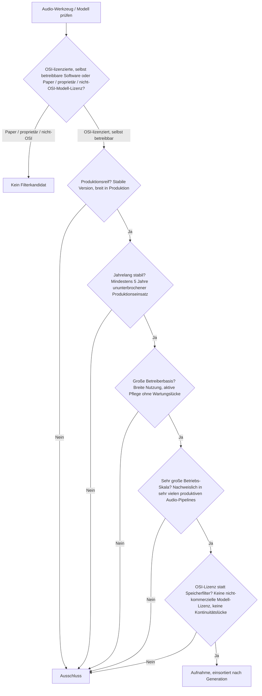
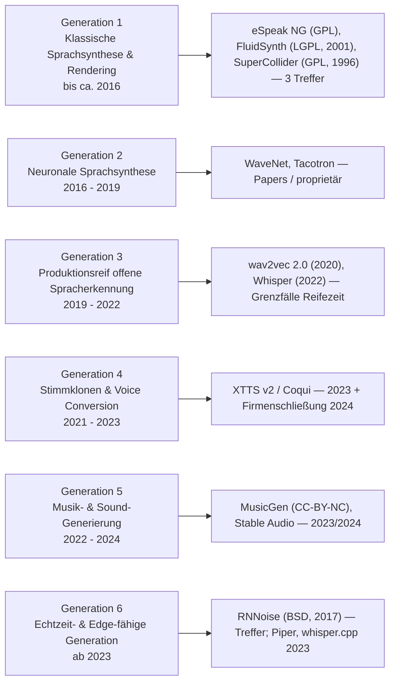
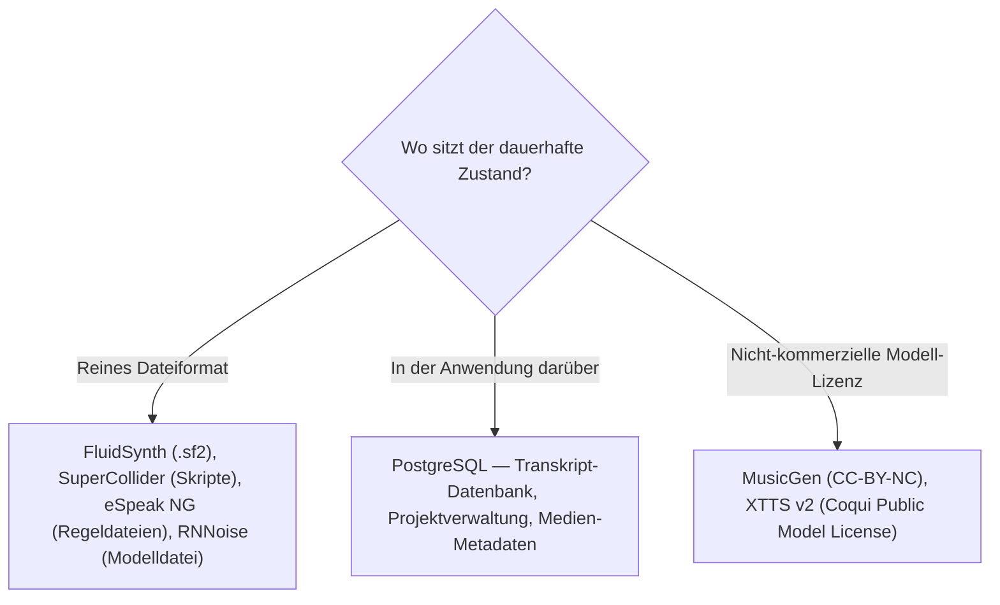

# Produktionsreife KI-Audio-Werkzeuge nach Generation — Reifegrad, Lizenz & Betriebs-Skala (Top 4 — das klassische Synthese-Fundament besteht, die neuronalen Generierungswellen nicht)

Die [Evolution und Architekturen digitaler KI-Audio-Werkzeuge](evolution-digitaler-ki-audio-werkzeuge.md) ordnet die Kategorie chronologisch in sechs Generationen: klassische Sprachsynthese vor Deep Learning (1), neuronale Sprachsynthese (2), produktionsreif offene Spracherkennung (3), Stimmklonen & Voice Conversion (4), Musik- & Sound-Generierung per Diffusion/Transformer (5), Echtzeit- und Edge-fähige Generation (6). Die [Topliste bester KI-Audio-Tools (Top 20)](ki-audio-tools-topliste.md) rankt die gesamte Kategorie. Diese Seite legt das **konservative** Fünf-Filter-Sieb der Familie an — produktionsreif · jahrelang stabil · große Betreiberbasis · sehr große Betriebs-Skala · Speicher dateibasiert oder PostgreSQL — und sortiert nach Generation.

!!! warning "Achtung: Die reife Substanz ist das vor-neuronale Fundament — plus ein Ausreißer aus 2017"
    Anders als bei [Bild](../design/produktionsreife-ki-bildgenerierung-generationen-2026-topliste.md) und [Video](../video/produktionsreife-ki-videogenerierung-generationen-2026-topliste.md) hat die Audio-Achse Treffer — aber nicht in den neuronalen Generierungswellen. Es besteht das **klassische Synthese- und Rendering-Fundament der Generation 1**, das die Evolution-Seite selbst als Basis heutiger KI-Pipelines führt: **FluidSynth** (LGPL, seit 2001, MIDI-zu-Audio-Standard), **SuperCollider** (GPL, seit 1996, algorithmische Komposition), **eSpeak NG** (GPL, Formant-TTS als Accessibility-Fallback überall). Dazu **RNNoise** (BSD, seit 2017) — auf der Evolution-Seite unter Generation 6 geführt, aber tatsächlich neun Jahre alt und in praktisch jedem Kommunikations-Stack verbaut. Was **nicht** besteht: **Whisper** (2022, ~4 Jahre — der klarste Grenzfall), **XTTS v2 / Coqui** (2023, plus Firmenschließung 2024 — Kontinuitätsbruch wie Redash), **MusicGen / Stable Audio** (2023/2024, teils nicht-kommerziell). Der Speicherfilter läuft für Modelle/Engines leer und wird durch **OSI-Lizenz + Kontinuität** ersetzt.

---

## Die fünf harten Filter

!!! note "Hinweis: Die klassische Synthese-Engine zählt als Generation-1-Fundament"
    FluidSynth und SuperCollider haben „kein eigenes KI-Feature" — die Evolution-Seite führt sie dennoch als Generation 1 der KI-Audio-Linie, weil sie die Rendering- und Synthesebasis bilden, auf der die neuronalen Wellen aufsetzen. Dieselbe Logik wie bei den Regel-Engines auf der [Expertensysteme-Seite](../../künstliche-intelligenz/produktionsreife-expertensysteme-generationen-2026-topliste.md): die „Generation 0" einer KI-Kategorie kann reifer sein als die KI-Ära selbst.

---

## Ergebnis: vier Treffer über sechs Generationen

---

## Systeme nach Generation

### Generation 1 — Klassische Sprachsynthese & Rendering-Engines (bis ca. 2016)

| # | System | Speicher | Lizenz | Seit | Skala-Nachweis |
|---|---|---|---|---|---|
| 1 | **FluidSynth** | SoundFont-Dateien (`.sf2`/`.sf3`), MIDI rein, Audio raus | LGPL-2.1 | 2001 | Standard-Engine zum Rendern von MIDI mit SoundFonts — in praktisch jeder Linux-Distribution, in Android verbaut, Basis zahlloser Musik- und Automatisierungs-Pipelines |
| 2 | **SuperCollider** | reines Skript-/Projektformat | GPL-3.0 (Server: BSD) | 1996 (quelloffen ab 2002) | Referenz-Umgebung für Echtzeit-Sound-Synthese, Live-Coding und algorithmische Komposition — Unterbau von Sonic Pi, breite Basis in Musikhochschulen und der Netzmusik-Szene |
| 3 | **eSpeak NG** | reines Dateiformat (Phonem-/Sprachregeldateien) | GPL-3.0 | 1995 (NG-Fork seit 2015) | Extrem leichtgewichtige Formant-TTS — der Standard-Accessibility-Fallback in Screenreadern (NVDA, Orca), als Basisstimme in Android und vielen Embedded-Systemen |

**FluidSynth** und **SuperCollider** sind das klassische Synthese-Fundament, das seit über zwanzig Jahren ohne Bruch läuft und die Rendering-Basis vieler KI-gestützter Musik-Pipelines bildet. **eSpeak NG** ist die vor-neuronale Sprachsynthese in Reinform — robotisch, aber unschlagbar leichtgewichtig und in gigantischer Skala als Accessibility-Fallback im Einsatz. Alle drei sind OSI-lizenziert, dateibasiert und aktiv gepflegt (ruhige, aber lückenlose Kadenz — dieselbe Auslegung wie bei DokuWiki in den [PKM-Toplisten](../../wissen/dokumentation/produktionsreife-pkm-wissensgraphen-generationen-2026-topliste.md)).

### Generation 6 — Echtzeit- & Edge-fähige Generation (ab 2023, RNNoise seit 2017)

| # | System | Speicher | Lizenz | Seit | Skala-Nachweis |
|---|---|---|---|---|---|
| 4 | **RNNoise** (Xiph.Org / Jean-Marc Valin) | Modell als Datei, Stream rein/raus | BSD-3-Clause | 2017 | Sehr leichtgewichtiges neuronales Netz für Echtzeit-Rauschunterdrückung — Basis zahlloser Kommunikations-Plugins, in WebRTC-Stacks, PulseAudio/PipeWire, OBS und Konferenzsoftware verbaut |

**RNNoise** ist der einzige neuronale Treffer: 2017 von Xiph.Org veröffentlicht, BSD-3, in praktisch jeder Videokonferenz- und Streaming-Anwendung als Rauschunterdrückung im Einsatz. Die Evolution-Seite ordnet es Generation 6 zu (breite Integration ab 2023), tatsächlich ist es neun Jahre alt und damit das einzige „KI-Audio"-Modell, das die Fünf-Jahres-Marke klar besteht.

### Generation 2 – 5 — warum hier nichts steht

- **Generation 2 (neuronale Sprachsynthese)**: **WaveNet** (DeepMind, 2016) und **Tacotron** (Google, 2017) sind Papers bzw. proprietäre Systeme — architektonisch prägend, aber ohne eigenständige, großskalig genutzte OSS-Referenzimplementierung, und weitgehend von neueren Vocodern abgelöst.
- **Generation 3 (offene Spracherkennung)**: **wav2vec 2.0** (Meta, 2020, MIT) besteht mit ~6 Jahren die Reifezeit, ist aber eher Forschungs-Baustein (via Hugging Face `transformers`) als eigenständiges Produkt — Grenzfall. **Whisper** (OpenAI, September 2022, MIT) ist der De-facto-STT-Standard in gigantischer Skala, aber ~4 Jahre alt — der klarste Grenzfall dieser Seite, der 2027 zum Treffer wird.
- **Generation 4 (Stimmklonen)**: **YourTTS** (2021), **RVC** (2023), **XTTS v2** (2023) sind alle unter fünf Jahre; **Coqui**, das Unternehmen hinter XTTS, wurde Anfang 2024 geschlossen — die Weiterentwicklung ist community-getragen, ein Kontinuitätsbruch wie bei Redash auf der [BI-Analytics-Seite](../../wissen/daten/datenbanken/produktionsreife-bi-analytics-tools-generationen-2026-topliste.md).
- **Generation 5 (Musik- & Sound-Generierung)**: **Jukebox** (OpenAI, 2020) ist praktisch nicht mehr in Nutzung; **MusicGen / AudioCraft** (Meta, 2023) steht unter der nicht-kommerziellen **CC-BY-NC-4.0**; **Stable Audio Open** (2024) hat eine Umsatzgrenze. Keiner besteht Lizenz- oder Reifezeitfilter.

---

## Dateibasiert oder PostgreSQL?

Alle vier Treffer sind eindeutig **dateibasiert** — Modelle, SoundFonts und Regeldateien liegen als Dateien vor, Audio-Streams laufen durch:

- Die vier Treffer halten keinen eigenen dauerhaften Zustand — sie verarbeiten Ströme und laden Modell-/Konfigurationsdateien.
- Eine Anwendung darüber (Transkriptions-Dienst, Podcast-Pipeline, DAW-Projektverwaltung) hält ihren Zustand relational — dieselbe Logik wie bei jeder Medien-Anwendung.

Vertiefung zur Datenbankschicht: [PostgreSQL DBA Praxis-Handbuch](../../entwicklung/infrastruktur/postgresql-dba-praxis.md).

!!! warning "Achtung: Momentaufnahme, Stand August 2026"
    **Whisper** erreicht 2027 die Fünf-Jahres-Marke und wird dann mit sehr großem Abstand der wichtigste Treffer dieser Seite — die STT-Infrastruktur ist bereits reif, ihr fehlt 2026 nur ein Jahr. **FluidSynth**, **SuperCollider**, **eSpeak NG** und **RNNoise** sind die stabilen Konstanten.

---

## Was bewusst nicht auf dieser Liste steht

| System | Erfüllt nicht | Anmerkung |
|---|---|---|
| **Whisper** | Reifezeit | MIT, De-facto-STT-Standard in riesiger Skala — aber September 2022 (~4 Jahre); Treffer ab 2027 |
| **wav2vec 2.0** | Kategorie / Reife | MIT, seit 2020 — eher Forschungs-Baustein als eigenständiges Produkt; Grenzfall |
| **Piper, whisper.cpp / faster-whisper, Bark** | Reifezeit | MIT, breit genutzt — aber alle 2023 |
| **XTTS v2, Coqui TTS, RVC, OpenVoice, so-vits-svc** | Reifezeit / Kontinuität | Voice-Cloning-Werkzeuge, 2021–2023; Coqui als Firma 2024 geschlossen |
| **MusicGen / AudioCraft** | Lizenzfilter | CC-BY-NC-4.0 — nicht kommerziell nutzbar |
| **Stable Audio Open** | Lizenz + Reifezeit | Stability AI Community License mit Umsatzgrenze; 2024 |
| **Demucs, Spleeter, pyannote.audio** | Reifezeit | MIT, Stem-Separation / Diarisierung — aber 2019–2022 (Demucs/pyannote Grenzfälle) |
| **WaveNet, Tacotron, Jukebox** | Kategorie / Kontinuität | Papers bzw. abgelöste/inaktive Modelle |

---

## 🔗 Verwandte Themen

- [Evolution und Architekturen digitaler KI-Audio-Werkzeuge](evolution-digitaler-ki-audio-werkzeuge.md) — das sechsstufige Generationenmodell, nach dem diese Liste sortiert ist
- [Beste KI-Audio-Tools (Open Source, Top 20)](ki-audio-tools-topliste.md) — breiteste Basis-Topliste inklusive aller jungen Modelle und nicht-kommerziellen Lizenzen
- [Produktionsreife KI-Bildgenerierung nach Generation (kein Treffer)](../design/produktionsreife-ki-bildgenerierung-generationen-2026-topliste.md) · [Produktionsreife KI-Videogenerierung nach Generation (kein Treffer)](../video/produktionsreife-ki-videogenerierung-generationen-2026-topliste.md) — die beiden anderen Kreativ-Achsen, beide ohne Treffer
- [Produktionsreife Expertensysteme & Regel-Engines nach Generation (Top 2)](../../künstliche-intelligenz/produktionsreife-expertensysteme-generationen-2026-topliste.md) — dieselbe „Generation 0 reifer als die KI-Ära"-Struktur
- [AI Voice Cloning (XTTS v2)](ai-voice-cloning-xtts.md) — praktische Vertiefung zu Generation 4
- [PostgreSQL DBA Praxis-Handbuch](../../entwicklung/infrastruktur/postgresql-dba-praxis.md) — Datenbankschicht der Audio-Anwendung über den Engines
