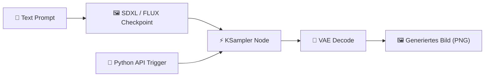

# Praxis-Guide: ComfyUI & Stable Diffusion Automatisierung

ComfyUI ist ein knotenbasiertes Web-UI für Stable Diffusion und FLUX, das komplexe Bildgenerierungs-Pipelines ermöglicht und per REST-API/Python steuerbar ist.

---



---

## 🛠️ 1. Installation & Start

```bash
git clone https://github.com/comfyanonymous/ComfyUI.git
cd ComfyUI
pip install -r requirements.txt

# Starten
python main.py --listen 0.0.0.0 --port 8188
```

---

## 🐍 2. Python API Automatisierung (`generate_image.py`)

ComfyUI speichert Workflows als JSON-API-Prompt. Dieses Skript sendet Prompts automatisiert an den ComfyUI-Server:

```python
import json
import urllib.request

COMFYUI_URL = "http://127.0.0.1:8188"

def queue_prompt(prompt_workflow):
    p = {"prompt": prompt_workflow}
    data = json.dumps(p).encode('utf-8')
    req = urllib.request.Request(f"{COMFYUI_URL}/prompt", data=data, headers={'Content-Type': 'application/json'})
    with urllib.request.urlopen(req) as response:
        return json.loads(response.read())

# Minimaler ComfyUI API Prompt (Workflow JSON)
prompt_workflow = {
    "3": {
        "inputs": {
            "seed": 42,
            "steps": 20,
            "cfg": 7.0,
            "sampler_name": "euler",
            "scheduler": "normal",
            "denoise": 1.0,
            "model": ["4", 0],
            "positive": ["6", 0],
            "negative": ["7", 0],
            "latent_image": ["5", 0]
        },
        "class_type": "KSampler"
    },
    "4": {
        "inputs": {"ckpt_name": "sd_xl_base_1.0.safetensors"},
        "class_type": "CheckpointLoaderSimple"
    },
    "5": {
        "inputs": {"width": 1024, "height": 1024, "batch_size": 1},
        "class_type": "EmptyLatentImage"
    },
    "6": {
        "inputs": {"text": "A futuristic glowing cybernetic neon city, 8k resolution, photorealistic"},
        "class_type": "CLIPTextEncode"
    },
    "7": {
        "inputs": {"text": "blurry, low quality, distortion"},
        "class_type": "CLIPTextEncode"
    }
}

if __name__ == "__main__":
    res = queue_prompt(prompt_workflow)
    print("Prompt in Queue eingereiht! Prompt-ID:", res.get("prompt_id"))
```

---

## 🔗 Verwandte Themen
* [Ideenfindung mit KI](ideenfindung-ki.md) – Kreative Prompts
* [Design nach KI](design-nach-ki.md) – KI im Design-Prozess
* [KI in der Film- und Videoproduktion](../video/ki-filmproduktion.md) – Video-Synthese
