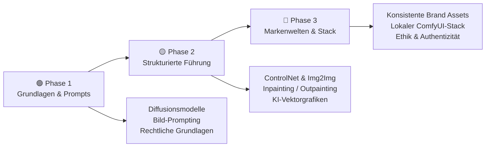
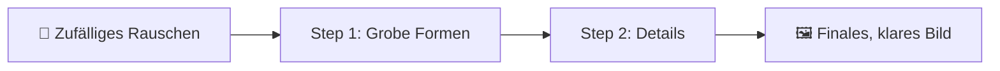
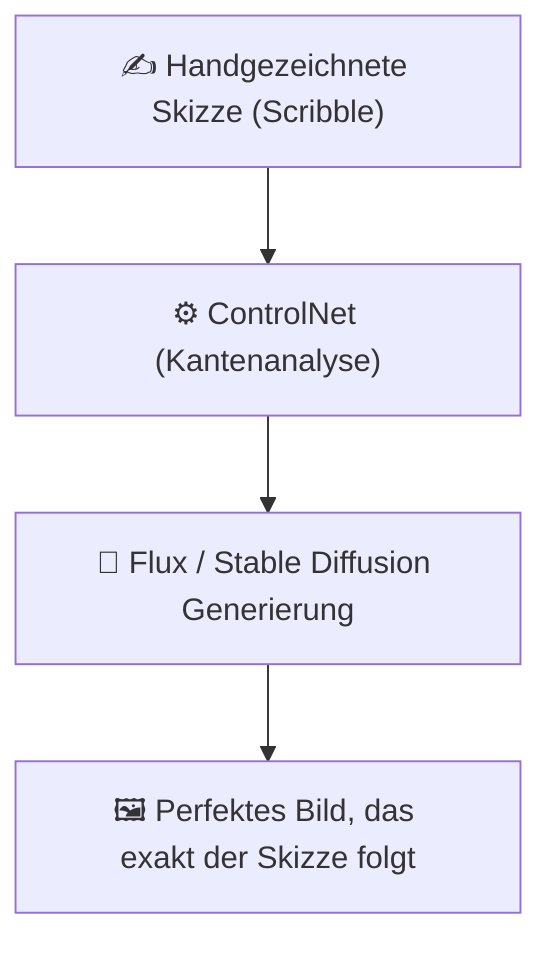
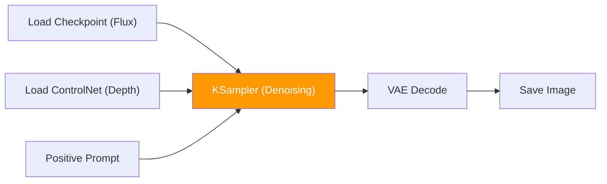
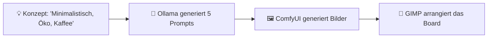
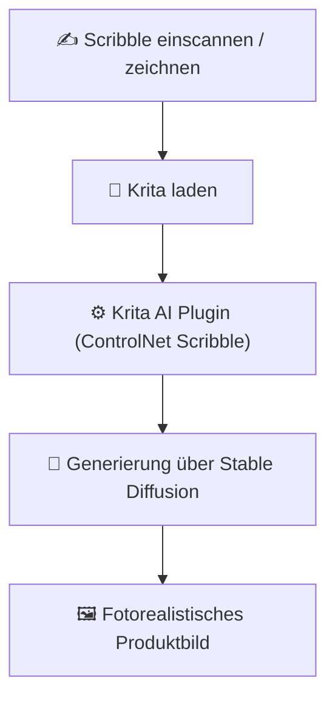
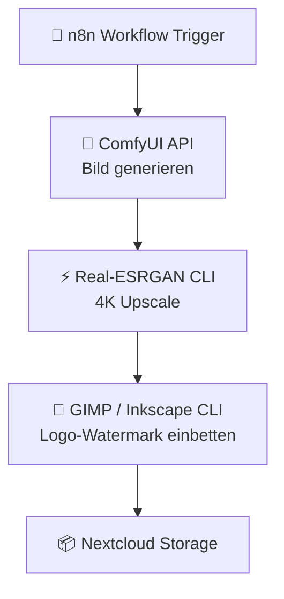

# Design nach KI

> **Hinweis zur Software-Auswahl:**  
> Diese Dokumentation priorisiert **Open-Source-Software**, die lokal unter Ubuntu läuft und die volle Kontrolle über Bildrechte und Urheberrechte sichert.  
> Bei proprietären Cloud-Lösungen wird stets eine **Open-Source-Alternative** mit gleichem Funktionsumfang gegenübergestellt.  
> **LLM-Modelle** und APIs werden unabhängig vom Preis gelistet, da sie zur Ideenfindung (Ideation) eingesetzt werden.

---

## Legende

| Symbol | Bedeutung |
|---|---|
| 🟩 | Open Source – kostenlos, self-hosted / Ubuntu-kompatibel |
| 💰 | Kostenpflichtig |
| 🤖 | LLM-Modell / API – bleibt immer gelistet |
| 🐧 | Linux / Ubuntu nativ |
| 🌐 | Nur Web-Browser |

---

## Lernpfad-Übersicht



---

## Inhaltsverzeichnis

- [🟢 Phase 1 – Grundlagen & Bild-KI-Konzepte](#phase-1-grundlagen-bild-ki-konzepte)
    - [1.1 Konzept: Der Wandel des Designprozesses (Co-Creation)](#11-konzept-der-wandel-des-designprozesses-co-creation)
    - [1.2 Konzept: Wie funktionieren Bild-KIs?](#12-konzept-wie-funktionieren-bild-kis)
    - [1.3 Thema: Visual Prompting (Die Sprache der Bilder)](#13-thema-visual-prompting-die-sprache-der-bilder)
    - [1.4 Thema: Rechtliche Aspekte & Bildrechte](#14-thema-rechtliche-aspekte-bildrechte)
- [🟡 Phase 2 – Strukturierte Führung, Vektor & Typografie](#phase-2-strukturierte-fuhrung-vektor-typografie)
    - [2.1 Konzept: Kontrolle über die KI-Generierung behalten](#21-konzept-kontrolle-uber-die-ki-generierung-behalten)
    - [2.2 Thema: Image-to-Image & ControlNet (Präzise Layouts)](#22-thema-image-to-image-controlnet-prazise-layouts)
    - [2.3 Thema: Inpainting, Outpainting & Retusche](#23-thema-inpainting-outpainting-retusche)
    - [2.4 Thema: Vektorgrafiken & Icons mit KI-Hilfe](#24-thema-vektorgrafiken-icons-mit-ki-hilfe)
- [🔴 Phase 3 – Branding, Workflows & Lokaler Stack](#phase-3-branding-workflows-lokaler-stack)
    - [3.1 Konzept: Konsistente Markenwelten generieren](#31-konzept-konsistente-markenwelten-generieren)
    - [3.2 Thema: Professioneller lokaler Bild-Stack (ComfyUI)](#32-thema-professioneller-lokaler-bild-stack-comfyui)
    - [3.3 Thema: Post-Processing, Skalierung & Veredelung](#33-thema-post-processing-skalierung-veredelung)
    - [3.4 Thema: Ethik, Authentizität & der menschliche Wert](#34-thema-ethik-authentizitat-der-menschliche-wert)
- [📋 Praxisprojekte](#praxisprojekte)
- [📦 Vollständige Softwareübersicht & Vergleich](#vollstandige-softwareubersicht-vergleich)

---

## 🟢 Phase 1 – Grundlagen & Bild-KI-Konzepte

> **Was lerne ich hier?**  
> Die Verschiebung von klassischem Handwerk hin zur Kuration, die mathematische Funktionsweise von Diffusionsmodellen und das präzise Formulieren visueller Prompts.  
> **Voraussetzungen:** Keine.

---

### 1.1 Konzept: Der Wandel des Designprozesses (Co-Creation)

#### Vom Umsetzer zum Kurator

Der Designer der Nach-KI-Ära verbringt weniger Zeit mit rein manuellen, repetitiven Pixelschubs-Arbeiten (wie Freistellen oder Texturen füllen). Stattdessen wandelt sich seine Rolle hin zum **Art Director**, der Konzepte vorgibt, Varianten der KI steuert, auswählt und veredelt.

```
Klassisch:  Idee -> Layout zeichnen -> Vektorisieren -> Texturieren -> Export (100% Manuell)
Mit KI:     Idee -> Prompts & Skizzen -> KI generiert Varianten -> Auswahl & Veredelung
```

---

### 1.2 Konzept: Wie funktionieren Bild-KIs?

#### Diffusion-Modelle verständlich erklärt

Bild-KIs wie Stable Diffusion oder Flux generieren Bilder nicht durch das Zusammensetzen von Puzzleteilen. Sie starten mit einem vollständigen **Bildrauschen** (Noise) und entfernen dieses Rauschen schrittweise über mathematische Schritte (Denoising), gesteuert durch den Prompt.



---

### 1.3 Thema: Visual Prompting (Die Sprache der Bilder)

#### Konzept: Die Parameter eines Bild-Prompts

Ein guter Bild-Prompt nutzt fotografische und künstlerische Fachbegriffe, um das gewünschte Ergebnis präzise zu steuern:

| Kategorie | Bedeutung | Beispiel im Prompt |
|---|---|---|
| **Subjekt** | Hauptmotiv | „Ein alter, verwitterter Leuchtturm auf einer Klippe" |
| **Licht** | Beleuchtungsart | „Volumetrisches Gegenlicht, goldene Stunde, weiche Schatten" |
| **Kamera** | Brennweite & Winkel | „85mm Porträtlinse, Nahaufnahme, geringe Schärfentiefe" |
| **Stil** | Künstlerische Richtung | „Cineastischer Film-Look, körnige Analogfotografie" |
| **Rendering** | Render-Engine (falls 3D) | „Octane Render, 3D-Modellierung, hyperrealistisch" |

---

### 1.4 Thema: Rechtliche Aspekte & Bildrechte

#### Konzept: Urheberrecht an KI-Generaten in der EU

- **Schöpfungshöhe:** Ein reiner Text-to-Image Prompt hat in der Regel **keine Schöpfungshöhe**. Das Bild ist gemeinfrei (kann von jedem kopiert werden).
- **Menschliche Bearbeitung:** Erst wenn ein Designer das Bild in GIMP/Inkscape signifikant überarbeitet, Skizzen vorgibt oder Bildteile gezielt zusammensetzt, entsteht schützbares Urheberrecht.
- **Markenrecht:** Logos oder geschützte Charaktere dürfen von KIs nicht im kommerziellen Kontext nachgeahmt werden.

---

## 🟡 Phase 2 – Strukturierte Führung, Vektor & Typografie

> **Was lerne ich hier?**  
> Wie du der KI präzise Strukturen vorgibst, Vektordateien bearbeitest und Layouts sowie Schriften kontrollierst.  
> **Voraussetzungen:** Phase 1 abgeschlossen.

---

### 2.1 Konzept: Kontrolle über die KI-Generierung behalten

#### Warum Text-to-Image für Layouts scheitert

Ein reiner Text-Prompt führt immer zu zufälligen Ergebnissen. Professionelle Designer führen die KI über visuelle Platzhalter (Scribbles, Farbflächen, Posen).



---

### 2.2 Thema: Image-to-Image & ControlNet (Präzise Layouts)

#### Konzept: ControlNet-Modelle

ControlNet ist ein neuronales Netzwerk, das zusätzliche Bedingungen an eine Bild-KI knüpft:

| ControlNet-Typ | Was es analysiert | Anwendung |
|---|---|---|
| **Canny / Lineart** | Konturen und Strichzeichnungen | Skizzen in fotorealistische Designs umwandeln |
| **Depth** | Tiefenkarte des Bildes (3D-Abstände) | Räumliche Tiefe und Objektplatzierung fixieren |
| **OpenPose** | Skelett-Posen von Personen | Exakte Körperhaltungen für Models vorgeben |

#### Software – alle Open Source:

| Software | Typ | Funktion | Ubuntu | Link |
|---|---|---|---|---|
| 🟩 [AUTOMATIC1111 + ControlNet](https://github.com/Mikubill/sd-webui-controlnet) | Bild-KI | Weit verbreitetes Interface mit ControlNet-Unterstützung | 🐧 Ja | github.com/Mikubill |
| 🟩 [ComfyUI + ControlNet Nodes](https://github.com/comfyanonymous/ComfyUI) | Bild-KI | Knotenbasiertes Interface für maximale ControlNet-Kontrolle | 🐧 Ja | github.com/comfyanonymous |

---

### 2.3 Thema: Inpainting, Outpainting & Retusche

#### Konzept: Lokales Generieren (Maskierung)

- **Inpainting:** Du maskierst (übermalst) einen Bereich im Bild (z. B. ein störendes Straßenschild) und die KI füllt diesen Bereich passend zum Hintergrund neu aus.
- **Outpainting:** Die KI erweitert die Bildränder über das ursprüngliche Format hinaus (z. B. ein quadratisches Bild in 16:9 Querformat wandeln).

#### Software – Open Source zuerst:

| Software | Typ | Funktion | Ubuntu | Link |
|---|---|---|---|---|
| 🟩 [GIMP + Open-Source-KI-Plugins](https://www.gimp.org) | Bildbearbeitung | Klassische Bildmanipulation mit Inpainting-Unterstützung | 🐧 Ja | gimp.org |
| 🟩 [Krita + Generative AI Plugin](https://krita.org) | Painting | Professionelles Zeichenprogramm mit nativer SD-Integration | 🐧 Ja | krita.org |

#### Vergleich: Open Source vs. Kommerziell

| Funktion | Open Source 🟩 (Ubuntu) | Kommerziell 💰 |
|---|---|---|
| Retusche & Inpainting | Krita + AI-Plugin, GIMP | Adobe Photoshop (Generative Füllung) |
| Outpainting / Erweitern | ComfyUI Outpainting | Photoshop Generative Expand |

---

### 2.4 Thema: Vektorgrafiken & Icons mit KI-Hilfe

#### Konzept: Raster-zu-Vektor Konvertierung

Bild-KIs generieren Pixelbilder (PNG/JPG). Um sie für Logos, Interfaces oder Print zu nutzen, müssen sie in mathematische Pfade (SVG) konvertiert werden (Vektorisierung).

#### Software – Open Source zuerst:

| Software | Typ | Funktion | Ubuntu | Link |
|---|---|---|---|---|
| 🟩 [Inkscape](https://inkscape.org/de/) | Vektorbearbeitung | Import, manuelle Nachbearbeitung und SVG-Vektorisierung | 🐧 Ja | inkscape.org |
| 🟩 [Potrace](https://potrace.sourceforge.net) | CLI-Vektorisierung | Hochpräzises, schnelles Vektorisieren per Terminal | 🐧 Ja | potrace.sourceforge.net |

---

## 🔴 Phase 3 – Branding, Workflows & Lokaler Stack

> **Was lerne ich hier?**  
> Wie du einen wiederholbaren, hochprofessionellen Design-Stack aufbaust, Markenwelten konsistent gestaltest und ethische Richtlinien einhältst.  
> **Voraussetzungen:** Phase 1 & 2 abgeschlossen. Gute GPU-Hardware empfohlen.

---

### 3.1 Konzept: Konsistente Markenwelten generieren

#### Konzept: LoRAs für Brand Styles

Um einen einheitlichen Corporate-Design-Stil zu erzwingen, trainieren Designer ein eigenes **LoRA-Zusatzmodell** auf 15-20 repräsentativen Markenbildern.

```
Marken-Fotos -> LoRA-Training -> Stable Diffusion -> Alle Ausgaben folgen dem exakten Brand-Stil
```

#### Konzept: Farbkontrolle via Custom LUTs

Statt der KI Farbnamen zu nennen, werden Rohbilder generiert und über farbmetrische **Look-Up Tables (LUTs)** exakt an die Corporate-Identity-Farben angepasst.

---

### 3.2 Thema: Professioneller lokaler Bild-Stack (ComfyUI)

#### Konzept: Knotenbasiertes Visual Scripting

ComfyUI arbeitet mit visuellen Knoten (Nodes). Du verbindest Bildquellen, Modelle, Sampler und Veredelungs-Filter manuell. Das ermöglicht die Automatisierung komplexer Design-Workflows als Skript.



#### Software – alle Open Source:

| Software | Typ | Funktion | Ubuntu | Link |
|---|---|---|---|---|
| 🟩 [ComfyUI](https://github.com/comfyanonymous/ComfyUI) | Bild-Engine | Das flexibelste, knotenbasierte Design-Interface | 🐧 Ja | github.com/comfyanonymous |
| 🟩 [AUTOMATIC1111 WebUI](https://github.com/AUTOMATIC1111/stable-diffusion-webui) | Bild-Engine | Benutzerfreundliche Stable-Diffusion-Oberfläche | 🐧 Ja | github.com/AUTOMATIC1111 |

---

### 3.3 Thema: Post-Processing, Skalierung & Veredelung

#### Konzept: Bild-Veredelung (High-Res Fix)

KI-Bilder neigen bei hohen Auflösungen zu Fehlern (z. B. doppelte Köpfe). Der professionelle Weg ist: Bild klein generieren, mit Real-ESRGAN hochskalieren und im zweiten Durchlauf leicht verfeinern (Tile Upscale).

#### Software – alle Open Source:

| Software | Typ | Funktion | Ubuntu | Link |
|---|---|---|---|---|
| 🟩 [Upscayl](https://github.com/upscayl/upscayl) | AI-Upscaler | Lokales 4K/8K Bild-Upscaling (Real-ESRGAN) | 🐧 Ja | github.com/upscayl |
| 🟩 [Real-ESRGAN](https://github.com/xinntao/Real-ESRGAN) | CLI-Upscaler | Terminal-basiertes Upscaling für Pipelines | 🐧 Ja | github.com/xinntao |

---

### 3.4 Thema: Ethik, Authentizität & der menschliche Wert

#### Konzept: Deepfakes & Kennzeichnungspflicht

Laut **EU AI Act** müssen fotorealistische, KI-generierte Bilder digital als solche signiert werden (z. B. über den unsichtbaren **C2PA-Metadatenstandard**), um Manipulationen und Täuschungen zu verhindern.

#### Konzept: Das Handwerk als Alleinstellungsmerkmal

Da KI Bilder extrem schnell generieren kann, verschiebt sich der Wert:
- **KI-generiert:** Massenware, austauschbar.
- **Menschliches Konzept & Veredelung:** Premiumware, emotional aufladbar, einzigartig.

---

## 📋 Praxisprojekte

### 🟢 Einsteiger: Moodboard für ein Logo-Design

Wir generieren 5 visuell konsistente Moodboard-Kacheln für eine nachhaltige Kaffeemarke.



**Software (alle Open Source):** Ollama · ComfyUI · GIMP

---

### 🟡 Fortgeschritten: Handskizze in ein Produktbild verwandeln

Wir wandeln ein gezeichnetes Produkt-Scribble in ein fotorealistisches Rendering um.



**Software (alle Open Source):** Krita · Krita AI Plugin · Stable Diffusion

---

### 🔴 Experte: Automatisierte Content-Asset-Pipeline

Ein Skript liest Blogartikel-Keywords ein, generiert passende Beitragsbilder im Corporate-Stil, skaliert sie auf 4K hoch und speichert sie als WebP.



**Software (alle Open Source):** n8n · ComfyUI API · Real-ESRGAN CLI · Inkscape CLI · Nextcloud

---

## 📦 Vollständige Softwareübersicht & Vergleich

### Generative Bild-Engines

| Funktion | Open Source 🟩 (Ubuntu / Self-hosted) | Kommerziell 💰 |
|---|---|---|
| Text-to-Image UI | ComfyUI 🐧, AUTOMATIC1111 🐧, InvokeAI 🐧 | Midjourney, DALL-E 3, Adobe Firefly |
| Bild-Modelle | Flux.1 🐧, Stable Diffusion XL 🐧 | Midjourney v6, Firefly Image 3 |

### Bildbearbeitung & Malprogramme

| Funktion | Open Source 🟩 (Ubuntu) | Kommerziell 💰 |
|---|---|---|
| Klassische Bildbearbeitung | GIMP 🐧 | Adobe Photoshop |
| Digitales Malen mit KI | Krita 🐧 (+ AI Plugin) | Photoshop Generative Fill |
| Vektorgrafiken | Inkscape 🐧 | Adobe Illustrator |
| Bild-Vektorisierung | Potrace 🐧, Inkscape 🐧 | Vectorizer.ai |

### Upscaling & Veredelung

| Funktion | Open Source 🟩 (Ubuntu) | Kommerziell 💰 |
|---|---|---|
| KI-Bildskalierung | Upscayl 🐧, Real-ESRGAN 🐧 | Topaz Gigapixel AI |

### Metadaten & Kennzeichnung

| Funktion | Open Source 🟩 (Ubuntu) | Kommerziell 💰 |
|---|---|---|
| C2PA Signierung | C2PA Tool CLI 🐧 | Adobe Content Credentials |

---

## Weiterführende Ressourcen

- **[Beste KI-Bildgenerierungs-Tools (Open Source, Top 20)](ki-bildgenerierung-tools-topliste.md)** – Vertiefender Werkzeug-/Modellvergleich 🟩
- **[C2PA Standard](https://c2pa.org)** – Spezifikation zur Bild-Signierung
- **[ComfyUI Workflows](https://comfyanonymous.github.io/ComfyUI_examples/)** – Praktische Ablaufbeispiele 🟩
- **[Krita AI Project](https://github.com/Acly/krita-ai-diffusion)** – Installations-Anleitung 🟩
- **[Stable Diffusion WebUI Guide](https://github.com/AUTOMATIC1111/stable-diffusion-webui)** – Offizielle Doku 🟩
- **[EU AI Act Bildregulierung](https://digital-strategy.ec.europa.eu/de/policies/european-approach-artificial-intelligence)** – Rechtslage

---

*Letzte Aktualisierung: Juli 2026*
