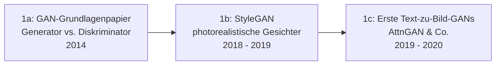

# Evolution und Architekturen digitaler KI-Bildgenerierung

Die Übersicht [Design nach KI](design-nach-ki.md) erklärt Diffusionsmodelle, ControlNet und Prompting als fertige Konzepte, die [Beste KI-Bildgenerierungs-Tools (Top 20)](ki-bildgenerierung-tools-topliste.md) rankt konkrete Werkzeuge nach 2026-Eignung. Dieser Artikel liefert die fehlende dritte Perspektive: die **chronologische Architekturgeschichte** — von frühen GAN-Experimenten über den Diffusions-Durchbruch und das ControlNet-/LoRA-Ökosystem bis zu den heutigen Rectified-Flow-Transformer-Modellen wie Flux.1.

!!! note "Hinweis: Generationen überlappen sich"
    Die Zeiträume sind grobe Orientierung, keine scharfen Grenzen — GAN-Architekturen wie StyleGAN laufen in Nischenanwendungen (z. B. Gesichtsgenerierung ohne Textsteuerung) bis heute parallel zu Diffusionsmodellen weiter. Entscheidend ist die **Architektur** (adversariales Training vs. iteratives Entrauschen vs. Flow-Matching), nicht allein das Erscheinungsjahr.

---

## Generation 1: GAN-Ära & frühe Text-zu-Bild-Versuche, 2014 – 2020

Die Gründergeneration eint drei Prinzipien: **adversariales Training** (Generator gegen Diskriminator), zunächst **unbedingte** Bildgenerierung ohne Textsteuerung und erst spät erste, noch stark limitierte Versuche, Text als Steuersignal einzubinden. Sie lässt sich in drei technologische Entwicklungsstufen unterteilen:

### 1a. GAN-Grundlagenpapier, 2014

- **Architektur:** Ian Goodfellow et al. formalisieren das Generator-Diskriminator-Prinzip — zwei konkurrierende Netze treiben sich im Training gegenseitig zu besseren Ergebnissen, siehe [Generation 4 der Deep-Learning-Anwendungen](../../künstliche-intelligenz/evolution-digitaler-deep-learning-anwendungen.md#generation-4-generative-adversarial-networks-fruhe-generative-bildmodelle-2014-2018).
- **Bedeutung:** liefert für sechs Jahre die dominante Architektur für generative Bildaufgaben, bevor Diffusionsmodelle sie ablösen.

### 1b. StyleGAN — photorealistische Gesichter, 2018 – 2019

- **Architektur:** stilbasierter Generator mit granularer Kontrolle über Bildmerkmale auf unterschiedlichen Auflösungsebenen.
- **Bedeutung:** erreicht erstmals fotorealistische, kaum von echten Fotos unterscheidbare Gesichter, populär u. a. durch „This Person Does Not Exist" — bleibt bis heute die Referenzarchitektur für unbedingte, hochauflösende Gesichtsgenerierung.

### 1c. Erste Text-zu-Bild-GANs, 2019 – 2020

- **Architektur:** Modelle wie AttnGAN kombinieren erstmals Text-Encoder mit GAN-Generatoren über Attention-Mechanismen.
- **Grenzen:** niedrige Auflösung, begrenzte Prompt-Treue und instabiles Training — die direkte Motivation für den Architekturwechsel zu Diffusionsmodellen in Generation 2.

---

## Generation 2: Diffusionsmodelle lösen GANs ab, 2020 – 2022

Der entscheidende Architekturbruch: Statt eines einzigen adversarialen Trainingsschritts lernt ein Netz, Bilder durch **iteratives Entrauschen** aus reinem Rauschen zu erzeugen — stabileres Training und höhere Bildqualität als GANs bei vergleichbarem Aufwand.

**Architektur:** Denoising Diffusion Probabilistic Models (DDPM) — ein Vorwärtsprozess fügt Bildern schrittweise Rauschen hinzu, ein trainiertes Netz lernt den umgekehrten Entrauschungsprozess; **Latent Diffusion** verlagert diesen Prozess in einen komprimierten latenten Raum statt auf Pixelebene, drastisch günstiger zu trainieren und auszuführen.

| Meilenstein | Jahr | Bedeutung |
|---|---|---|
| **DDPM-Grundlagenpapier** | 2020 | Formalisiert das Diffusions-/Entrauschungs-Prinzip als Alternative zu GANs. |
| **GLIDE / DALL-E 2** | 2021/2022 | CLIP-geführte Diffusion, OpenAI etabliert Diffusionsmodelle als führenden Ansatz für Text-zu-Bild. |
| **Stable Diffusion** | August 2022 | Erstes offen verfügbares Latent-Diffusion-Modell (Stability AI/CompVis) — löst die Diffusions-Community-Welle aus, technische Grundlage praktisch aller folgenden offenen Generationen. |

---

## Generation 3: Community-Ökosystem & Steuerungswerkzeuge, 2022 – 2023

Um das offene Basismodell aus Generation 2 entsteht ein rasant wachsendes Ökosystem an Bedienoberflächen und Feinsteuerungs-Werkzeugen — Bildgenerierung wird vom Forschungsexperiment zum alltagstauglichen, präzise steuerbaren Werkzeug.

**Architektur:** Fine-Tuning-Verfahren (DreamBooth, Textual Inversion, **LoRA** als ressourcenschonende Alternative zum vollständigen Nachtrainieren) plus strukturelle Steuerung des Diffusionsprozesses über Zusatznetze.

| System | Jahr | Rolle |
|---|---|---|
| **AUTOMATIC1111 WebUI** | 2022 | Erste breit adoptierte Bedienoberfläche für Stable Diffusion, etabliert das Community-Ökosystem an Erweiterungen. |
| **LoRA für Diffusionsmodelle** | 2022/2023 | Portiert Low-Rank-Adaptation aus der LLM-Welt auf Bildmodelle — eigene Stile/Charaktere trainierbar mit einem Bruchteil des Rechenaufwands eines vollständigen Fine-Tunings. |
| **ControlNet** | Februar 2023 | Strukturierte Bildführung über Kantenkarten, Tiefenkarten oder Posen (lllyasviel) — macht Diffusionsmodelle erstmals präzise steuerbar statt rein promptgetrieben. |

---

## Generation 4: Skalierung & Transformer-Diffusion-Hybriden, 2023 – 2024

Zwei parallele Entwicklungen prägen diese Generation: größere, leistungsfähigere U-Net-basierte Modelle und der schrittweise Wechsel der Kernarchitektur von U-Net zu Transformer.

**Architektur:** **SDXL** skaliert das etablierte U-Net-Diffusionsprinzip deutlich hoch; parallel etablieren **Diffusion Transformers (DiT)** eine neue Kernarchitektur, die das U-Net durch eine Transformer-Architektur ersetzt — dieselbe Grundidee, die parallel [Generation 6 der Deep-Learning-Anwendungen](../../künstliche-intelligenz/evolution-digitaler-deep-learning-anwendungen.md#generation-6-attention-mechanismus-der-transformer-vorabend-2015-2018) für Sprachmodelle bereits etabliert hatte.

| System | Jahr | Bedeutung |
|---|---|---|
| **Stable Diffusion XL (SDXL)** | Juli 2023 | Deutlich höhere Auflösung und Bildqualität, reifstes LoRA-/ControlNet-Ökosystem aller offenen Modelle. |
| **DiT-Grundlagenpapier** | Dezember 2022 | Zeigt, dass ein Transformer das U-Net im Diffusionsprozess vollständig ersetzen kann — technische Grundlage von PixArt, Stable Diffusion 3 und Flux.1. |
| **PixArt-α/Σ** | 2023/2024 | Frühe, ressourceneffiziente DiT-Umsetzung mit vergleichsweise geringem Trainingsaufwand. |

---

## Generation 5: Node-basierte Produktions-Pipelines & Rectified Flow, 2023 – 2024

Bildgenerierung wird produktionsreif für komplexe, mehrstufige Workflows — sowohl auf Werkzeug- als auch auf Trainingsebene.

**Architektur:** **ComfyUI** etabliert eine knotenbasierte, frei verkettbare Pipeline-Architektur als Gegenentwurf zu linearen WebUIs; auf Modellebene ersetzt **Rectified Flow** (geradlinige statt gekrümmte Entrauschungspfade) den klassischen DDPM-Diffusionsprozess für schnellere, hochwertigere Generierung.

| System | Jahr | Rolle |
|---|---|---|
| **ComfyUI** | 2023 | Knotenbasierte Oberfläche mit maximaler Kontrolle über jeden Pipeline-Schritt, siehe [ComfyUI & SD Automatisierung](comfyui-workflow-anleitung.md). |
| **Stable Diffusion 3** | 2024 | Erstes breit verfügbares Modell mit MMDiT-Architektur (Multimodal Diffusion Transformer) und Rectified-Flow-Training. |
| **SDXL Turbo / SDXL Lightning** | 2023/2024 | Destillierte Varianten für 1–4-Schritt-Generierung statt der üblichen 20–50 Schritte — Echtzeit-Iteration als neue Anforderung. |

---

## Generation 6: Rectified-Flow-Transformer als aktueller Standard, ab 2024

Die aktuelle Generation konsolidiert DiT-Architektur und Rectified Flow zum neuen Standard offener Bildmodelle — mit spürbarem Qualitätssprung bei Prompt-Treue und Textdarstellung im Bild gegenüber allen Vorgängergenerationen.

| System | Jahr | Rolle |
|---|---|---|
| **Flux.1** (Black Forest Labs) | August 2024 | Von den ursprünglichen Stable-Diffusion-Erfindern gegründetes Unternehmen, aktuell führendes offenes Modell bei Prompt-Treue und Textdarstellung, siehe [Beste KI-Bildgenerierungs-Tools](ki-bildgenerierung-tools-topliste.md#top-20-im-uberblick). |
| **StableSwarmUI** | 2024 | Offizielles Multi-GPU-/Cluster-taugliches Interface auf ComfyUI-Basis für Produktions-Skalierung. |

!!! tip "Bezug zu diesem Repository"
    Die aktuelle Werkzeuglandschaft dieser Generation vergleicht [Beste KI-Bildgenerierungs-Tools (Top 20)](ki-bildgenerierung-tools-topliste.md) im Detail — inklusive Lizenzfragen, die bei kommerzieller Nutzung von Flux.1 „dev" und anderen Forschungslizenzen zu beachten sind.

---

## Alternative Sortier- & Klassifikationskriterien für KI-Bildgenerierung

### 1. Trainingsparadigma

- **Adversarial** — Generator gegen Diskriminator (Generation 1).
- **Diffusion/Denoising** — iteratives Entrauschen aus Zufallsrauschen (Generation 2–4).
- **Flow-Matching/Rectified Flow** — geradlinige statt gekrümmte Entrauschungspfade (Generation 5–6).

### 2. Kernarchitektur

- **Convolutional (U-Net)** — Stable Diffusion, SDXL (Generation 2–4).
- **Transformer (DiT/MMDiT)** — PixArt, Stable Diffusion 3, Flux.1 (Generation 4–6).

### 3. Steuerbarkeit

- **Reines Prompting** — Text als einziges Steuersignal (Generation 1–2).
- **Strukturierte Führung** — ControlNet, Posen-/Tiefenkarten (ab Generation 3).
- **Personalisiertes Fine-Tuning** — LoRA, DreamBooth für eigene Stile/Charaktere (ab Generation 3).

### 4. Geschwindigkeit vs. Qualität

- **Volle Schrittzahl (20–50 Schritte)** — maximale Qualität, längere Rechenzeit (Standard-Diffusionsmodelle).
- **Destilliert (1–4 Schritte)** — SDXL Turbo/Lightning, Flux.1 „schnell" — Echtzeit-Iteration bei etwas reduzierter Detailtreue.

---

## Verwandte Themen

- [Beste KI-Bildgenerierungs-Tools (Top 20)](ki-bildgenerierung-tools-topliste.md) — Momentaufnahme 2026, die diese Chronologie in eine gerankte Topliste übersetzt
- [Produktionsreife KI-Bildgenerierung nach Generation (kein Treffer)](produktionsreife-ki-bildgenerierung-generationen-2026-topliste.md) — dieses Generationenmodell durch das konservative Fünf-Filter-Sieb; kein Treffer — die Kategorie beginnt im August 2022, StyleGAN und die Diffusionsmodelle tragen nicht-OSI-Lizenzen, die Oberflächen (AUTOMATIC1111, ComfyUI) sind unter fünf Jahre
- [Design nach KI](design-nach-ki.md) — Konzepte hinter Diffusionsmodellen, ControlNet, Vektorisierung und Branding
- [ComfyUI & SD Automatisierung](comfyui-workflow-anleitung.md) — praktische Vertiefung zu Generation 5
- [Evolution und Architekturen digitaler Deep-Learning-Anwendungen](../../künstliche-intelligenz/evolution-digitaler-deep-learning-anwendungen.md) — GAN-Grundlagen aus Generation 1 dieses Artikels im übergeordneten Kontext
- [Evolution und Architekturen digitaler KI-Videogenerierung](../video/evolution-digitaler-ki-videogenerierung.md) — Bildmodelle als Ausgangsmaterial für Image-to-Video-Architekturen
- [Design-Übersicht](index.md)
