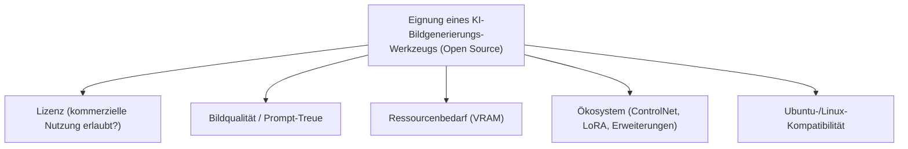
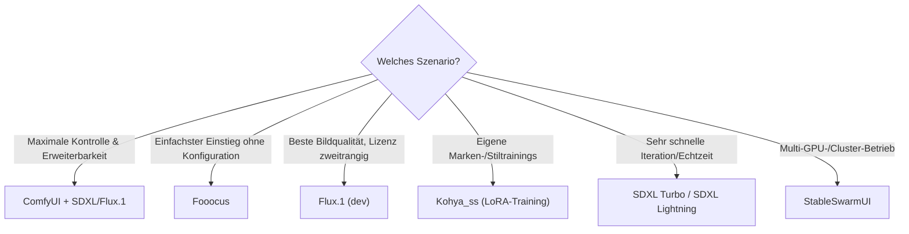

# Beste KI-Bildgenerierungs-Tools — Top-20-Topliste (Open Source)

Die Übersicht [Design nach KI](design-nach-ki.md) erklärt Konzepte wie Diffusionsmodelle, ControlNet und Prompting Schritt für Schritt. Diese Seite konzentriert sich auf einen konkreten Vergleich: Welche **quelloffenen Bildgenerierungs-Werkzeuge und -Modelle** eignen sich aktuell am besten — von der Bedienoberfläche über das zugrunde liegende Diffusionsmodell bis zum Trainings-Werkzeug für eigene Stile?

!!! note "Hinweis: Oberfläche ≠ Modell"
    Ein Teil dieser Liste sind **Bedienoberflächen** (ComfyUI, AUTOMATIC1111, Fooocus, InvokeAI), die ein austauschbares Basismodell laden; ein anderer Teil sind die **Basismodelle selbst** (Flux.1, Stable Diffusion 3, PixArt, Kandinsky). Für ein vollständiges lokales Setup braucht es meist beides — eine Oberfläche aus dieser Liste plus ein Modell aus dieser Liste.

---

## Bewertungskriterien

!!! warning "Achtung: Lizenzen unterscheiden sich stark zwischen den Modellen"
    „Open Source" bedeutet bei Bildmodellen nicht automatisch uneingeschränkte kommerzielle Nutzung. Flux.1 „dev" und DeepFloyd IF stehen unter nicht-kommerziellen Forschungslizenzen, während Flux.1 „schnell", SDXL, PixArt und HunyuanDiT unter permissiven Lizenzen (Apache-2.0 o. ä.) auch kommerziell nutzbar sind. Vor produktivem Einsatz immer die genaue Modell-Lizenz prüfen. **Stand: Juli 2026.**

---

## Top 20 im Überblick

| Rang | Software/Modell | Anbieter | Lizenz | Kategorie | Einschätzung | Besondere Stärke | Schwäche |
|---|---|---|---|---|---|---|---|
| 1 | **Flux.1** | Black Forest Labs | Apache-2.0 (schnell) / nicht-kommerziell (dev) | Basismodell | Sehr stark | Aktuell führendes offenes Modell bei Prompt-Treue und Textdarstellung im Bild | „dev"-Variante mit bester Qualität nur nicht-kommerziell nutzbar |
| 2 | **ComfyUI** | Community | GPL-3.0 | Bedienoberfläche | Sehr stark | Knotenbasiertes Interface mit maximaler Kontrolle, größtes Erweiterungs-Ökosystem | Steile Lernkurve für Einsteiger im Vergleich zu einfacheren UIs |
| 3 | **Stable Diffusion XL (SDXL)** | Stability AI | Stability AI Community License (permissiv) | Basismodell | Sehr stark | Sehr reifes Ökosystem an LoRAs, ControlNets und Fine-Tunes, gute Ubuntu-/GPU-Kompatibilität | Bildqualität und Prompt-Treue hinter Flux.1 |
| 4 | **AUTOMATIC1111 (Stable Diffusion WebUI)** | Community | AGPL-3.0 | Bedienoberfläche | Stark | Größte Community, riesige Zahl an Erweiterungen, gute Dokumentation | Entwicklungstempo seit 2024 hinter ComfyUI und Forks zurückgefallen |
| 5 | **Fooocus** | Community | GPL-3.0 | Bedienoberfläche | Stark | Sehr einfache, Midjourney-ähnliche Bedienung ohne komplexe Konfiguration | Weniger granulare Kontrolle als ComfyUI/A1111 |
| 6 | **InvokeAI** | Invoke AI | Apache-2.0 | Bedienoberfläche | Stark | Poliertes, professionell wirkendes Interface mit gutem Canvas-/Inpainting-Workflow | Kleineres Erweiterungs-Ökosystem als ComfyUI |
| 7 | **SD.Next** | Community (vladmandic) | AGPL-3.0 | Bedienoberfläche | Stark | Aktiv gepflegter Fork mit breiterer Modellunterstützung (SDXL, SD3, Flux) als klassisches A1111 | Kleinere Nutzerbasis als A1111 |
| 8 | **Stable Diffusion 3 Medium** | Stability AI | Stability AI Community License (permissiv) | Basismodell | Stark | Deutlich verbesserte Textdarstellung und Kompositionsverständnis gegenüber SDXL | Höhere Hardware-Anforderungen als SDXL |
| 9 | **PixArt-Σ** | Community/Huawei Noah's Ark Lab | Apache-2.0 (openrail-ähnlich) | Basismodell | Solide bis stark | Sehr effizientes Transformer-Modell, gute Qualität bei geringerem Rechenaufwand als SD3/Flux | Kleinere Community/Ökosystem als SD/Flux |
| 10 | **StableSwarmUI** | Stability AI | MIT | Bedienoberfläche | Solide bis stark | Offizielles Multi-GPU-/Cluster-taugliches Interface auf ComfyUI-Basis | Jüngeres Projekt, kleinere Community als ComfyUI direkt |
| 11 | **Kohya_ss** | Community | Apache-2.0 | Trainings-Werkzeug | Solide bis stark | Der Standard für eigenes LoRA-/Fine-Tuning-Training, siehe [Konsistente Markenwelten](design-nach-ki.md#31-konzept-konsistente-markenwelten-generieren) | Trainingsprozess erfordert GPU mit ausreichend VRAM und Einarbeitung |
| 12 | **IP-Adapter** | Community (Tencent AI Lab) | Apache-2.0 | Erweiterung | Solide bis stark | Ermöglicht Bild-Prompts (Stiltransfer) ohne eigenes LoRA-Training | Ergebnisqualität variiert je nach Basismodell/Backend |
| 13 | **ControlNet** | Community (lllyasviel) | Apache-2.0 | Erweiterung | Solide bis stark | Grundlegender Standard für strukturierte Bildführung (Canny, Depth, OpenPose) | Eigenständig kein Bildmodell, immer in Kombination mit SD/SDXL/Flux nötig |
| 14 | **Kandinsky 3** | Sber AI | Apache-2.0 | Basismodell | Solide | Gute Qualität bei künstlerischen/illustrativen Stilen, aktiv weiterentwickelt | Kleinere internationale Community/Dokumentation als westliche Modelle |
| 15 | **HunyuanDiT** | Tencent | Tencent Hunyuan Community License (permissiv) | Basismodell | Solide | Gute bilinguale (Chinesisch/Englisch) Prompt-Unterstützung, moderne Transformer-Architektur | Community/Tooling außerhalb Chinas kleiner |
| 16 | **SDXL Turbo / SDXL Lightning** | Stability AI / ByteDance | Stability AI Community License / Apache-2.0 (Lightning) | Basismodell | Solide | Extrem schnelle Generierung in 1-4 Schritten, gut für Echtzeit-/Iterations-Workflows | Qualität/Detailtreue etwas hinter regulärem SDXL bei gleicher Auflösung |
| 17 | **Playground v2.5** | Playground AI | Community License (permissiv, nicht-kommerziell einschränkend je nach Nutzung) | Basismodell | Solide | Sehr ansprechende Standard-Ästhetik ohne aufwendiges Prompt-Engineering | Lizenz für kommerzielle Nutzung vor Einsatz genau prüfen |
| 18 | **Segmind SSD-1B / Vega** | Segmind | Apache-2.0 | Basismodell (destilliert) | Solide | Deutlich kleinere, schnellere Modelle bei akzeptabler Qualitätseinbuße gegenüber SDXL | Feinere Details/Textdarstellung schwächer als das volle SDXL |
| 19 | **DeepFloyd IF** | Stability AI/DeepFloyd | Nicht-kommerzielle Forschungslizenz | Basismodell | Ausreichend bis solide | Bekannt für ungewöhnlich gute Textdarstellung im Bild (Pixel-basierte Kaskade) | Nicht-kommerzielle Lizenz, hoher VRAM-Bedarf, komplexeres Setup |
| 20 | **Craiyon** | Community (ehem. DALL-E mini) | Apache-2.0 | Basismodell (leichtgewichtig) | Ausreichend | Sehr geringe Hardware-Anforderungen, historisch bedeutendes frühes offenes Text-zu-Bild-Modell | Bildqualität deutlich hinter allen moderneren Modellen dieser Liste |

!!! tip "Tipp: Rang ≠ einzige Entscheidungsgröße"
    Für **maximale Bildqualität ohne Lizenz-Einschränkungen** ist die Kombination aus SDXL oder Flux.1 „schnell" mit ComfyUI aktuell am zukunftssichersten. Für **Einsteiger ohne Interesse an Node-Workflows** ist Fooocus der einfachste Einstieg. Für **eigene Marken-/Stiltrainings** führt kein Weg an Kohya_ss vorbei, siehe auch das [LoRA-Konzept in Design nach KI](design-nach-ki.md#31-konzept-konsistente-markenwelten-generieren).

---

## Empfehlung nach Einsatzszenario

---

## 🔗 Verwandte Themen

- [Startseite](../../index.md) — zurück zur Dokumentations-Zentrale
- [Design nach KI](design-nach-ki.md) — Konzepte hinter Diffusionsmodellen, ControlNet, Vektorisierung und Branding
- [ComfyUI & SD Automatisierung](comfyui-workflow-anleitung.md) — vertiefende Praxis zu Rang 2
- [Ideenfindung mit KI](ideenfindung-ki.md)
- [Design-Übersicht](index.md)
