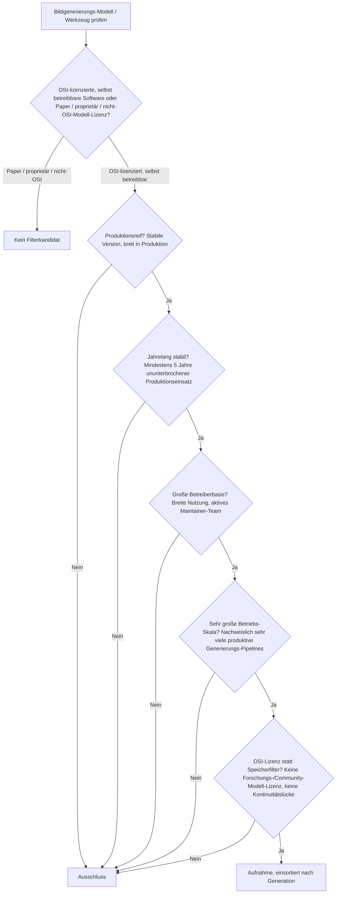
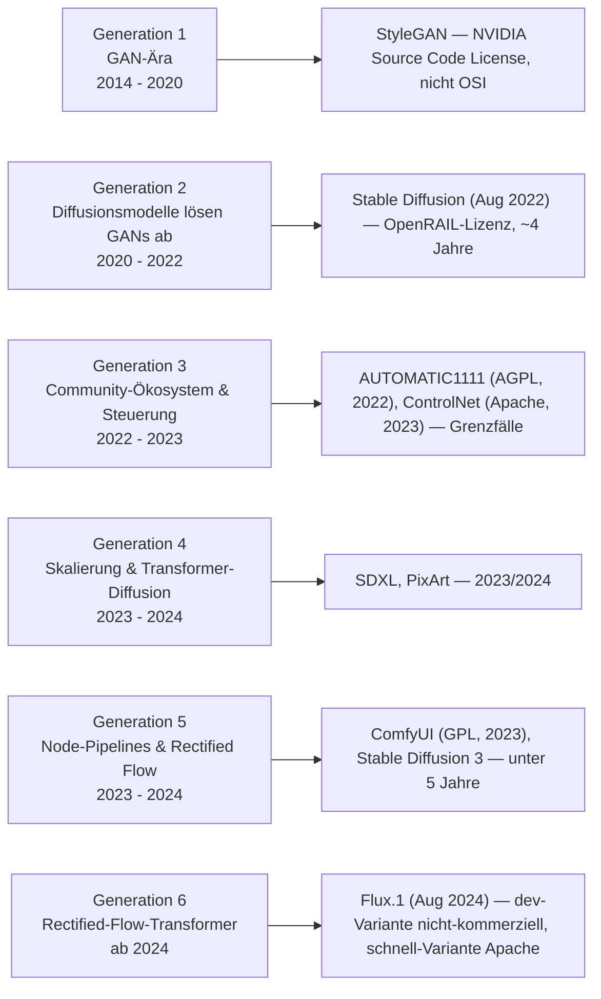
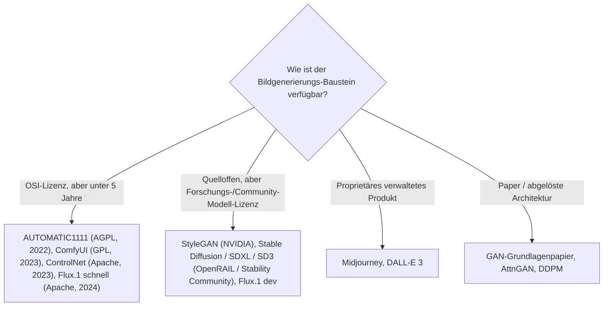

# Produktionsreife KI-Bildgenerierung nach Generation — Reifegrad, Lizenz & Betriebs-Skala (kein Treffer — die Kategorie beginnt im August 2022, alle Werkzeuge sind unter fünf Jahre)

Die [Evolution und Architekturen digitaler KI-Bildgenerierung](evolution-digitaler-ki-bildgenerierung.md) ordnet die Kategorie chronologisch in sechs Generationen: GAN-Ära & frühe Text-zu-Bild-Versuche (1), Diffusionsmodelle lösen GANs ab (2), Community-Ökosystem & Steuerungswerkzeuge (3), Skalierung & Transformer-Diffusion-Hybriden (4), node-basierte Produktions-Pipelines & Rectified Flow (5), Rectified-Flow-Transformer als aktueller Standard (6). Die [Topliste bester KI-Bildgenerierungs-Tools (Top 20)](ki-bildgenerierung-tools-topliste.md) rankt die gesamte Kategorie. Diese Seite legt das **konservative** Fünf-Filter-Sieb der Familie an — produktionsreif · jahrelang stabil · große Betreiberbasis · sehr große Betriebs-Skala · Speicher dateibasiert oder PostgreSQL — und sortiert nach Generation.

!!! warning "Achtung: Kein Treffer — dieselbe Struktur wie die Deep-Learning-GANs, nur drei Jahre jünger"
    Die praktisch nutzbare KI-Bildgenerierung beginnt mit **Stable Diffusion im August 2022** — die Kategorie ist rund vier Jahre alt, der zweite Filter verlangt fünf. Hinzu kommt die Lizenz-Achse: Die **GAN-Referenz StyleGAN** steht unter der NVIDIA Source Code License (nicht OSI), die **Diffusions-Basismodelle** unter Modell-Lizenzen mit Nutzungsbeschränkungen (CreativeML OpenRAIL-M, Stability AI Community License) — nur **Flux.1 „schnell"** und **PixArt** sind permissiv, aber von 2023/2024. Die **Bedienoberflächen** — **AUTOMATIC1111 WebUI** (AGPL-3.0, seit 2022), **ComfyUI** (GPL-3.0, seit 2023) — sind die aussichtsreichsten künftigen Treffer, aber noch keine fünf Jahre alt. Dieselbe Einordnung wie die abgelehnten GANs auf der [Deep-Learning-Seite](../../künstliche-intelligenz/produktionsreife-deep-learning-anwendungen-generationen-2026-topliste.md) und die [KI-Modell-Generatoren](../../künstliche-intelligenz/produktionsreife-ki-modell-generatoren-generationen-2026-topliste.md). Der Speicherfilter läuft für Modelle/Werkzeuge leer (Gewichte sind Dateien) und wird durch **OSI-Lizenz + Reifezeit** ersetzt.

---

## Die fünf harten Filter

!!! note "Hinweis: Oberfläche, Basismodell und Erweiterung sind drei verschiedene Dinge"
    Eine Bedienoberfläche (ComfyUI, AUTOMATIC1111) lädt ein austauschbares Basismodell. Ein Basismodell (Stable Diffusion, Flux.1) ist ein trainiertes Gewicht unter einer eigenen Lizenz. Eine Erweiterung (ControlNet, LoRA) steuert den Diffusionsprozess. Zählbar wäre nur eine OSI-lizenzierte, fünf Jahre alte, großskalig genutzte Referenz — die es 2026 in keiner der drei Kategorien gibt.

---

## Ergebnis: kein Treffer über sechs Generationen

---

## Warum keine Generation einen Treffer liefert

- **Generation 1 (GAN-Ära)**: **StyleGAN** ist die Referenzarchitektur für unbedingte, hochauflösende Gesichtsgenerierung und weiterhin produktiv — der Code steht aber unter der **NVIDIA Source Code License**, nicht OSI-anerkannt. Exakt derselbe Ausschlussgrund wie auf der [Deep-Learning-Seite](../../künstliche-intelligenz/produktionsreife-deep-learning-anwendungen-generationen-2026-topliste.md). GAN-Grundlagenpapier und AttnGAN sind Papers.
- **Generation 2 (Diffusionsmodelle)**: **Stable Diffusion** (August 2022) ist die technische Grundlage praktisch aller folgenden offenen Generationen — aber ~4 Jahre alt, und die Gewichte stehen unter der **CreativeML OpenRAIL-M** bzw. der **Stability AI Community License** mit Nutzungsbeschränkungen (keine OSI-Lizenz). DALL-E 2 / Imagen sind proprietär.
- **Generation 3 (Community-Ökosystem)**: **AUTOMATIC1111 WebUI** (AGPL-3.0, 2022) hat die größte Nutzerbasis der Kategorie, ist aber ~4 Jahre alt und hat seit 2024 an Entwicklungstempo verloren. **ControlNet** (Apache-2.0, Februar 2023) ist eine saubere OSS-Lizenz — aber ~3,5 Jahre und eigenständig kein Bildmodell. **LoRA für Diffusion** ist eine Technik.
- **Generation 4 (Skalierung & DiT)**: **SDXL** (Juli 2023, Stability AI Community License), **PixArt** (Apache-2.0, 2023) — beide unter fünf Jahre.
- **Generation 5 (Node-Pipelines & Rectified Flow)**: **ComfyUI** (GPL-3.0, 2023) ist die zweite aussichtsreiche Oberfläche — ~3 Jahre. **Stable Diffusion 3** (2024).
- **Generation 6 (Rectified-Flow-Transformer)**: **Flux.1** (Black Forest Labs, August 2024) — die „dev"-Variante steht unter einer nicht-kommerziellen Forschungslizenz, nur „schnell" ist Apache-2.0; ~2 Jahre alt.

---

## OSI-Lizenz statt Speicherbackend

Modell-Gewichte sind Dateien — der Speicherfilter läuft leer. Die trennende Achse ist die Lizenz der Referenz und deren Reifezeit:

- Der Speicherfilter greift nicht: Ein Checkpoint wird als Datei (`.safetensors`) geladen; die Anwendung darüber hält ihren Zustand relational.
- Die ersetzende Lizenz-/Reifezeit-Achse siebt vollständig: nicht-OSI-Modell-Lizenzen, proprietäre Produkte, abgelöste Architekturen — und die verbleibende OSI-Werkzeugschicht ist zu jung.

Vertiefung zur Datenbankschicht der Generierungs-Anwendung: [PostgreSQL DBA Praxis-Handbuch](../../entwicklung/infrastruktur/postgresql-dba-praxis.md).

!!! warning "Achtung: Momentaufnahme, Stand August 2026"
    Dies ist die aussichtsreichste „kein Treffer"-Seite der Familie für einen baldigen ersten Treffer: **AUTOMATIC1111** (2027) und **ComfyUI** (2028) erreichen die Fünf-Jahres-Marke absehbar, sofern die Ökosysteme stabil bleiben. Ein OSI-lizenziertes Basismodell mit großer Betreiberbasis hängt dagegen von der Lizenzpolitik der Anbieter ab.

---

## Was bewusst nicht auf dieser Liste steht

| System | Erfüllt nicht | Anmerkung |
|---|---|---|
| **StyleGAN / StyleGAN2 / StyleGAN3** | Lizenzfilter | NVIDIA Source Code License — nicht OSI-anerkannt |
| **Stable Diffusion, SDXL, Stable Diffusion 3** | Lizenz + Reifezeit | OpenRAIL / Stability AI Community License mit Nutzungsbeschränkungen; ab August 2022 |
| **Flux.1** | Lizenz + Reifezeit | „dev" nicht-kommerziell, „schnell" Apache-2.0 — aber erst August 2024 |
| **AUTOMATIC1111 WebUI** | Reifezeit / Aktivität | AGPL-3.0, größte Nutzerbasis — aber ~4 Jahre und nachlassendes Tempo seit 2024 |
| **ComfyUI** | Reifezeit | GPL-3.0, node-basiert, sehr aktiv — aber erst 2023 |
| **ControlNet, PixArt, InvokeAI, Fooocus, Kohya_ss** | Reifezeit | OSI-lizenziert, aber alle 2022–2024 |
| **Midjourney, DALL-E 3** | Lizenzfilter | Proprietäre, verwaltete Dienste |
| **Craiyon** (ehem. DALL-E mini) | Produktionsreife / Skala | Apache-2.0, ~5 Jahre — aber Bildqualität weit hinter allen modernen Modellen, kaum produktive Nutzung |

---

## 🔗 Verwandte Themen

- [Evolution und Architekturen digitaler KI-Bildgenerierung](evolution-digitaler-ki-bildgenerierung.md) — das sechsstufige Generationenmodell, nach dem diese Liste sortiert ist
- [Beste KI-Bildgenerierungs-Tools (Open Source, Top 20)](ki-bildgenerierung-tools-topliste.md) — breiteste Basis-Topliste inklusive aller Forschungslizenzen und proprietären Dienste
- [Produktionsreife KI-Modell-Generatoren nach Generation (kein Treffer)](../../künstliche-intelligenz/produktionsreife-ki-modell-generatoren-generationen-2026-topliste.md) — dieselbe Architektur-Zeitachse aus Modellsicht, ebenfalls ohne Treffer
- [Produktionsreife Deep-Learning-Anwendungen nach Generation (Top 3)](../../künstliche-intelligenz/produktionsreife-deep-learning-anwendungen-generationen-2026-topliste.md) — die GAN-Ablehnung an derselben NVIDIA-Lizenz
- [Produktionsreife KI-Videogenerierung nach Generation (kein Treffer)](../video/produktionsreife-ki-videogenerierung-generationen-2026-topliste.md) — die Bildmodelle als Ausgangsmaterial, noch jüngere Kategorie
- [ComfyUI & SD Automatisierung](comfyui-workflow-anleitung.md) — praktische Vertiefung zur aussichtsreichsten künftigen Kandidatin
- [PostgreSQL DBA Praxis-Handbuch](../../entwicklung/infrastruktur/postgresql-dba-praxis.md) — Datenbankschicht der Generierungs-Anwendung
