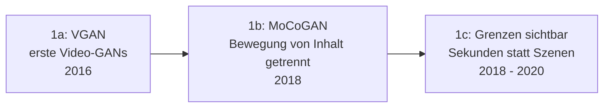

# Evolution und Architekturen digitaler KI-Videogenerierung

Die Übersicht [KI in der Film- und Videoproduktion](ki-filmproduktion.md) erklärt den gesamten Produktionsprozess als fertiges Konzept, die [Beste KI-Video-Tools (Top 20)](ki-video-tools-topliste.md) rankt konkrete Werkzeuge nach 2026-Eignung. Dieser Artikel liefert die fehlende dritte Perspektive: die **chronologische Architekturgeschichte** — von frühen GAN-basierten Kurzclip-Experimenten über den Diffusions-Transfer aus der Bild-Domäne und den Sora-Moment bis zu den heutigen effizienten, produktionsreifen offenen Videomodellen.

!!! note "Hinweis: Generationen überlappen sich"
    Die Zeiträume sind grobe Orientierung, keine scharfen Grenzen — Frame-Interpolations- und Avatar-Werkzeuge aus früheren Generationen laufen produktiv neben den neuesten Text-zu-Video-Modellen weiter. Entscheidend ist die **Architektur** (adversariale Kurzclip-Synthese vs. Diffusions-Transformer vs. effizienzoptimierte Flow-Modelle), nicht allein das Erscheinungsjahr.

---

## Generation 1: Frühe GAN-basierte Videosynthese, 2016 – 2020

Die Gründergeneration überträgt das GAN-Prinzip aus der Bild-Domäne (vgl. [Generation 1 der KI-Bildgenerierung](../design/evolution-digitaler-ki-bildgenerierung.md#generation-1-gan-ara-fruhe-text-zu-bild-versuche-2014-2020)) auf die zusätzliche Dimension Zeit — mit deutlich stärkeren Grenzen bei Auflösung, Länge und zeitlicher Konsistenz. Sie lässt sich in drei technologische Entwicklungsstufen unterteilen:

### 1a. VGAN — erste Video-GANs, 2016

- **Architektur:** ein GAN-Generator erzeugt direkt kurze Videosequenzen aus Zufallsrauschen, ohne Textsteuerung.
- **Grenzen:** wenige Sekunden Länge, niedrige Auflösung, kaum Kontrolle über den Inhalt.

### 1b. MoCoGAN — Bewegung von Inhalt getrennt, 2018

- **Architektur:** trennt explizit einen Inhalts- von einem Bewegungs-Vektor im latenten Raum — ein Prinzip, das in abgewandelter Form bis in heutige Motion-Module (Generation 3 dieser Zeitachse) fortwirkt.
- **Bedeutung:** verbessert die zeitliche Konsistenz gegenüber reinem VGAN, bleibt aber auf einfache, kurze Bewegungsmuster beschränkt.

### 1c. Grenzen sichtbar — Sekunden statt Szenen, 2018 – 2020

- **Beobachtung:** GAN-Architekturen skalieren für Video schlechter als für Einzelbilder — instabiles Training über die Zeitdimension hinweg bleibt ungelöst, die direkte Motivation für den Architekturwechsel zu Diffusionsmodellen in Generation 2.

---

## Generation 2: Diffusion kommt zur Video-Domäne, 2022

Der entscheidende Architekturbruch: Dasselbe Diffusions-/Entrauschungsprinzip, das Bildgenerierung revolutioniert hatte (vgl. [Generation 2 der KI-Bildgenerierung](../design/evolution-digitaler-ki-bildgenerierung.md#generation-2-diffusionsmodelle-losen-gans-ab-2020-2022)), wird auf die zusätzliche Zeitdimension erweitert.

**Architektur:** räumlich-zeitliche Diffusion — ein Netz entrauscht nicht ein Einzelbild, sondern eine ganze Sequenz von Frames gemeinsam, meist mit zusätzlichen zeitlichen Attention-Schichten.

| Meilenstein | Jahr | Bedeutung |
|---|---|---|
| **Video Diffusion Models** (Google) | 2022 | Grundlagenpapier, überträgt das Diffusionsprinzip formal auf Videodaten. |
| **Imagen Video** (Google) | 2022 | Skaliert räumlich-zeitliche Diffusion auf höhere Auflösung und Länge. |
| **Make-A-Video** (Meta) | 2022 | Nutzt bereits trainierte Text-zu-Bild-Modelle als Ausgangspunkt statt vollständig neuem Videotraining — spart Trainingsaufwand gegenüber einem Modell von Grund auf. |

---

## Generation 3: Erste offene & kommerzielle Text-zu-Video-Modelle, 2023

Videogenerierung wird erstmals für ein breiteres Publikum tatsächlich nutzbar — als kommerzielles Produkt und als offenes, selbst betreibbares Modell.

**Architektur:** Image-to-Video-Diffusion auf Basis bestehender Bildmodelle, sowie **Motion-Module** als Zusatzschicht über bestehende Stable-Diffusion-Checkpoints statt eines vollständig eigenständigen Videomodells.

| System | Jahr | Rolle |
|---|---|---|
| **Runway Gen-2** | 2023 | Erstes breit zugängliches kommerzielles Text-/Image-zu-Video-Produkt. |
| **Stable Video Diffusion** (Stability AI) | November 2023 | Offenes Image-to-Video-Diffusionsmodell, gut in ComfyUI integrierbar — Lizenz zunächst nicht-kommerziell. |
| **AnimateDiff** | 2023 | Macht jedes bestehende Stable-Diffusion-Checkpoint animierbar über ein austauschbares Motion-Modul, statt ein eigenes Videomodell zu benötigen. |

---

## Generation 4: Der Sora-Moment & DiT-Skalierung, 2024

Ein einzelnes Modell verschiebt die wahrgenommene Grenze des Machbaren deutlich — von wenigen Sekunden wackeliger Bewegung zu deutlich längeren, kohärenteren Clips — und etabliert die Diffusion-Transformer-Architektur (vgl. [Generation 4 der KI-Bildgenerierung](../design/evolution-digitaler-ki-bildgenerierung.md#generation-4-skalierung-transformer-diffusion-hybriden-2023-2024)) als neuen Videostandard.

| Meilenstein | Jahr | Bedeutung |
|---|---|---|
| **Sora** (OpenAI, Ankündigung) | Februar 2024 | Demonstriert deutlich längere, kohärentere Videosequenzen als alle vorherigen Modelle, treibt den Umstieg der gesamten Branche auf DiT-basierte Videoarchitekturen. |
| **Open-Sora** (HPC-AI Tech) | 2024 | Vollständig transparentes, offenes Reimplementierungsprojekt eines Sora-ähnlichen Modells — macht die Architekturidee unabhängig vom geschlossenen Original nachvollziehbar. |

---

## Generation 5: Offene, produktionsreife Videomodelle, 2024

Mehrere große Anbieter veröffentlichen im selben Jahr eigenständige, leistungsfähige DiT-basierte Videomodelle unter offenen Lizenzen — Videogenerierung erreicht die gleiche Ökosystem-Reife, die Bildmodelle bereits in Generation 4/5 der Bild-Zeitachse erreicht hatten.

| System | Jahr | Rolle |
|---|---|---|
| **CogVideoX** (Zhipu AI/THUDM) | 2024 | Gutes Verhältnis aus Qualität und Ressourcenbedarf, gut dokumentiert. |
| **Mochi 1** (Genmo AI) | 2024 | Sehr realistische Bewegungsphysik, vollständig offen lizenziert. |
| **HunyuanVideo** (Tencent) | Dezember 2024 | State-of-the-art unter offenen Modellen bei Bild- und Bewegungsqualität, sehr hoher Hardware-Bedarf (13 Mrd. Parameter). |

---

## Generation 6: Effizienz & Kontrolle als aktuelle Priorität, ab 2025

Statt reiner Qualitätssteigerung optimiert die aktuelle Generation auf **Geschwindigkeit, Ressourceneffizienz und präzise Steuerung** — sowie auf spezialisierte Zweiglinien wie Avatar-/Portrait-Animation, die eigene Anforderungen an zeitliche Konsistenz stellen.

| System | Jahr | Rolle |
|---|---|---|
| **Wan2.1** (Alibaba) | 2025 | Aktuell führendes offenes Videomodell, sehr aktive Community und ComfyUI-Integration, siehe [Beste KI-Video-Tools](ki-video-tools-topliste.md#top-20-im-uberblick). |
| **LTX-Video** (Lightricks) | 2024/2025 | Eines der schnellsten offenen Videomodelle, optimiert auf zügige Iteration statt maximaler Einzelbildqualität. |
| **LivePortrait** (Kuaishou/Alibaba) | 2024 | Spezialisierte Zweiglinie für Portrait-/Avatar-Animation — sehr flüssige Animation eines einzelnen Fotos per Antriebsvideo statt allgemeiner Textprompt-Generierung. |

!!! tip "Bezug zu diesem Repository"
    Die aktuelle Werkzeuglandschaft dieser Generation vergleicht [Beste KI-Video-Tools (Top 20)](ki-video-tools-topliste.md) im Detail — inklusive der Post-Produktions-Werkzeuge (Frame-Interpolation, Upscaling, Untertitelung), die generiertes Rohmaterial erst produktionsreif machen.

---

## Alternative Sortier- & Klassifikationskriterien für KI-Videogenerierung

### 1. Trainingsparadigma

- **Adversarial** — VGAN, MoCoGAN (Generation 1).
- **Diffusion (U-Net-basiert)** — Video Diffusion Models, Stable Video Diffusion (Generation 2–3).
- **Diffusion Transformer (DiT)** — Sora, HunyuanVideo, Wan2.1 (Generation 4–6).

### 2. Eingabemodalität

- **Text-zu-Video** — Sora, CogVideoX (Generation 4–5).
- **Image-zu-Video** — Stable Video Diffusion, Wan2.1 (Generation 3, 6).
- **Referenzvideo-getrieben** — LivePortrait, Avatar-Animation (Generation 6).

### 3. Basis-Wiederverwendung

- **Von Grund auf trainiert** — eigenständige Videomodelle wie Mochi 1, HunyuanVideo.
- **Auf bestehendem Bildmodell aufbauend** — Make-A-Video, AnimateDiff — spart Trainingsaufwand gegenüber einem vollständig neuen Videomodell.

### 4. Geschwindigkeit vs. Qualität

- **Maximale Qualität, hoher Ressourcenbedarf** — HunyuanVideo (13 Mrd. Parameter).
- **Effizienzoptimiert für schnelle Iteration** — LTX-Video, Wan2.1 in kleineren Konfigurationen.

---

## Verwandte Themen

- [Beste KI-Video-Tools (Top 20)](ki-video-tools-topliste.md) — Momentaufnahme 2026, die diese Chronologie in eine gerankte Topliste übersetzt
- [KI in der Film- und Videoproduktion](ki-filmproduktion.md) — vollständiger Produktionsprozess von Idee bis Veröffentlichung
- [Evolution und Architekturen digitaler KI-Bildgenerierung](../design/evolution-digitaler-ki-bildgenerierung.md) — Bildmodelle als Ausgangsmaterial und Architekturvorbild für Generation 2–4 dieser Zeitachse
- [Evolution und Architekturen digitaler KI-Audio-Werkzeuge](../audio/evolution-digitaler-ki-audio-werkzeuge.md) — analoger Architekturwandel von klassischer zu neuronaler Generierung in der Audio-Domäne
- [ComfyUI & SD Automatisierung](../design/comfyui-workflow-anleitung.md) — praktische Vertiefung zur Pipeline-Integration aus Generation 6
- [Programmatische Videogenerierung & Animation](index.md) — code-getriebene Animations-Frameworks als Gegenentwurf zu KI-Modellen dieser Zeitachse
