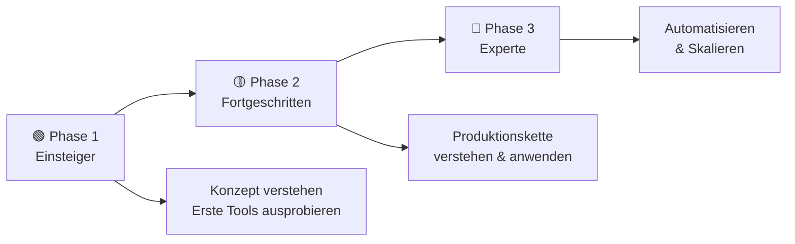
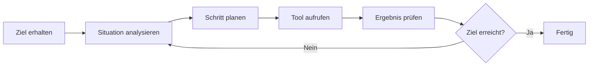
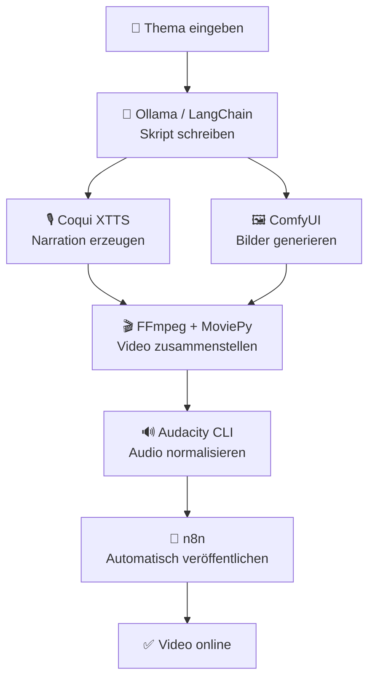
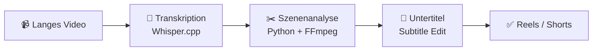
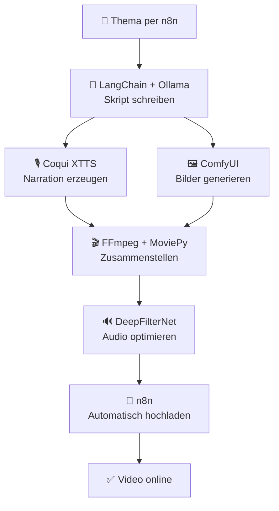

# KI in der Film- und Videoproduktion

> **Hinweis zur Software-Auswahl:**  
> Diese Dokumentation priorisiert **Open-Source-Software**, die unter Ubuntu läuft.  
> Bei kostenpflichtiger Software wird immer eine **Open-Source-Alternative** mit gleichem Funktionsumfang gegenübergestellt.  
> **LLM-Modelle** (ChatGPT, Claude, Gemini, Ollama u. a.) werden unabhängig vom Preis gelistet – sie sind Grundlage vieler KI-Workflows.

---

## Legende

| Symbol | Bedeutung |
|---|---|
| 🟩 | Open Source – kostenlos, Ubuntu-kompatibel |
| 💰 | Kostenpflichtig |
| 🤖 | LLM-Modell – bleibt immer gelistet |
| 🐧 | Linux / Ubuntu nativ unterstützt |
| 🌐 | Nur Web-Browser (kein lokaler Install) |

---

## Lernpfad-Übersicht



---

## Inhaltsverzeichnis

- [🟢 Phase 1 – Einsteiger](#phase-1-einsteiger)
    - [1.1 Was ist KI-gestützte Videoproduktion?](#11-was-ist-ki-gestutzte-videoproduktion)
    - [1.2 Konzept: Wie entsteht ein Video mit KI?](#12-konzept-wie-entsteht-ein-video-mit-ki)
    - [1.3 Thema: Idee & Skript mit KI entwickeln](#13-thema-idee-skript-mit-ki-entwickeln)
    - [1.4 Thema: Bilder & Storyboards mit KI erstellen](#14-thema-bilder-storyboards-mit-ki-erstellen)
    - [1.5 Thema: Erstes Video schneiden mit KI](#15-thema-erstes-video-schneiden-mit-ki)
    - [1.6 Thema: Audio automatisch verbessern](#16-thema-audio-automatisch-verbessern)
- [🟡 Phase 2 – Fortgeschritten](#phase-2-fortgeschritten)
    - [2.1 Konzept: Die drei Phasen einer Videoproduktion](#21-konzept-die-drei-phasen-einer-videoproduktion)
    - [2.2 Thema: Vorproduktion & Planung mit KI](#22-thema-vorproduktion-planung-mit-ki)
    - [2.3 Thema: Professionelles Drehbuch mit KI-Assistenz](#23-thema-professionelles-drehbuch-mit-ki-assistenz)
    - [2.4 Thema: KI beim Dreh & Kameraarbeit](#24-thema-ki-beim-dreh-kameraarbeit)
    - [2.5 Thema: Professioneller Schnitt mit KI-Tools](#25-thema-professioneller-schnitt-mit-ki-tools)
    - [2.6 Thema: Color Grading & Bildoptimierung mit KI](#26-thema-color-grading-bildoptimierung-mit-ki)
    - [2.7 Thema: Sounddesign & Musik mit KI](#27-thema-sounddesign-musik-mit-ki)
    - [2.8 Thema: KI-Avatare & synthetische Presenter](#28-thema-ki-avatare-synthetische-presenter)
    - [2.9 Thema: Dubbing, Stimme & Untertitelung mit KI](#29-thema-dubbing-stimme-untertitelung-mit-ki)
- [🔴 Phase 3 – Experte](#phase-3-experte)
    - [3.1 Konzept: Von der Produktion zur Automatisierung](#31-konzept-von-der-produktion-zur-automatisierung)
    - [3.2 Thema: Visuelle Effekte (VFX) mit KI](#32-thema-visuelle-effekte-vfx-mit-ki)
    - [3.3 Thema: KI-Agenten als autonome Videoproduzenten](#33-thema-ki-agenten-als-autonome-videoproduzenten)
    - [3.4 Thema: Programmatische Videogenerierung](#34-thema-programmatische-videogenerierung)
    - [3.5 Thema: Vollständige Produktions-Pipelines bauen](#35-thema-vollstandige-produktions-pipelines-bauen)
    - [3.6 Thema: Ethik, Urheberrecht & Recht](#36-thema-ethik-urheberrecht-recht)
- [📋 Praxisprojekte](#praxisprojekte)
- [📦 Vollständige Softwareübersicht & Vergleich](#vollstandige-softwareubersicht-vergleich)

---

## 🟢 Phase 1 – Einsteiger

> **Was lerne ich hier?**  
> Grundlegende Konzepte verstehen: Wie denkt KI? Was kann sie – und was nicht?  
> **Voraussetzungen:** Keine. Nur Neugier und ein Browser.

---

### 1.1 Was ist KI-gestützte Videoproduktion?

#### Konzept: Drei Arten von KI in der Videoproduktion

| KI-Typ | Was sie tut | Beispiel |
|---|---|---|
| **Generative KI** | Erstellt etwas Neues aus einer Beschreibung (Prompt) | ComfyUI generiert ein Bild aus Text |
| **Assistive KI** | Verbessert oder analysiert bestehendes Material | DeepFilterNet rauscht Audio heraus |
| **Automatisierungs-KI** | Führt wiederkehrende Aufgaben selbstständig aus | n8n veröffentlicht Videos automatisch |

#### Konzept: Was ist ein Prompt?

```
❌ Schlechter Prompt:  "Mach ein Video über Katzen"
✅ Guter Prompt:       "Eine flauschige orange Katze schläft auf einem Fensterbrett,
                        weiches Morgenlicht, cineastisch, 4K, ruhige Bewegung"
```

#### Konzept: Was kann KI (noch) nicht?

- KI versteht **keine Absichten** – nur Beschreibungen
- KI macht **kreative Fehler** (z. B. falsche Finger, inkonsistente Gesichter)
- KI braucht immer noch einen **Menschen als Regisseur**

#### Einstiegs-Software (Open Source / LLM):

| Software | Typ | Was es kann | Ubuntu | Link |
|---|---|---|---|---|
| 🤖 [ChatGPT](https://chat.openai.com) | LLM | Ideen & Konzepte entwickeln | 🌐 Web | openai.com |
| 🤖 [Claude](https://claude.ai) | LLM | Strukturierte Texte & Analyse | 🌐 Web | claude.ai |
| 🤖 [Gemini](https://gemini.google.com) | LLM | Multimodales Brainstorming | 🌐 Web | gemini.google.com |
| 🤖 🟩 [Ollama](https://ollama.com) | LLM lokal | LLMs lokal auf Ubuntu ausführen | 🐧 Ja | ollama.com |

---

### 1.2 Konzept: Wie entsteht ein Video mit KI?

#### Der KI-Videoproduktions-Kreislauf

```mermaid
graph TD
    A["💡 Idee\n("Was will ich zeigen?")"] --> B["📝 Skript\n("Was wird gesagt?")"]
    B --> C["🖼️ Storyboard\n("Wie sieht es aus?")"]
    C --> D["🎬 Produktion\n(Video generieren oder aufnehmen)"]
    D --> E["✂️ Post-Produktion\n("Schnitt, Farbe, Audio")"]
    E --> F["🚀 Veröffentlichung"]
```

#### Konzept: KI-Tools nach Produktionsphase

| Produktionsphase | Open Source (Ubuntu) | Kostenpflichtige Alternative |
|---|---|---|
| Idee & Konzept | Ollama + lokale LLMs | ChatGPT, Claude |
| Skript | Ollama, LibreOffice Writer | Jasper AI, Sudowrite |
| Storyboard | ComfyUI, Stable Diffusion | Midjourney, DALL-E 3 |
| Videogenerierung | Wan2.1, CogVideoX | Runway ML, Kling AI |
| Schnitt | Kdenlive, DaVinci Resolve (Free) | Adobe Premiere Pro |
| Audio | Audacity, DeepFilterNet | iZotope RX 11 |
| Export / Untertitel | FFmpeg, Subtitle Edit | Sonix, Submagic |

---

### 1.3 Thema: Idee & Skript mit KI entwickeln

#### Konzept: Wie funktioniert ein Sprachmodell (LLM)?

Ein **Large Language Model (LLM)** hat aus Milliarden von Texten gelernt, wie Menschen schreiben. Es erzeugt **wahrscheinliche Fortsetzungen** deines Textes – kein Faktenwissen, sondern Sprachlogik.

- LLMs sind **kreativ**, aber nicht immer **akkurat** – Fakten prüfen!
- Lokale LLMs (Ollama) laufen **ohne Internet** und sind **datenschutzkonform**

#### Konzept: Prompt-Strategie für Skripte

```
Rolle:     "Du bist ein erfahrener Dokumentarfilm-Autor."
Kontext:   "Ich erstelle ein 3-minütiges YouTube-Video über..."
Aufgabe:   "Schreibe ein Sprecherskript mit Einleitung, Hauptteil und Call-to-Action."
Format:    "Max. 400 Wörter, gegliedert in Abschnitte."
```

#### Software – Open Source zuerst:

| Software | Typ | Funktion | Ubuntu | Link |
|---|---|---|---|---|
| 🟩 🤖 [Ollama](https://ollama.com) | LLM lokal | Lokale LLMs (Llama 3, Mistral, Phi-3) | 🐧 Ja | ollama.com |
| 🟩 🤖 [LM Studio](https://lmstudio.ai) | LLM lokal | Grafische Oberfläche für lokale LLMs | 🐧 Ja | lmstudio.ai |
| 🟩 🤖 [Jan.ai](https://jan.ai) | LLM lokal | Open-Source ChatGPT-Alternative lokal | 🐧 Ja | jan.ai |
| 🤖 [ChatGPT](https://chat.openai.com) | LLM | Brainstorming, Skripte | 🌐 Web | openai.com |
| 🤖 [Claude](https://claude.ai) | LLM | Lange, strukturierte Texte | 🌐 Web | claude.ai |
| 🤖 [Gemini](https://gemini.google.com) | LLM | Multimodales Brainstorming | 🌐 Web | gemini.google.com |

#### Vergleich: Lokal vs. Cloud LLM

| Kriterium | Ollama / Jan.ai (lokal) 🟩 | ChatGPT / Claude 🤖 |
|---|---|---|
| Datenschutz | ✅ Vollständig lokal | ❌ Daten gehen in Cloud |
| Kosten | ✅ Kostenlos | 💰 Ab 20$/Monat (Pro) |
| Qualität | 🟡 Gut (Llama 3, Mistral) | ✅ Sehr gut |
| Internetverbindung | ✅ Nicht nötig | ❌ Erforderlich |
| Ubuntu-Support | 🐧 Nativ | 🌐 Nur Browser |

---

### 1.4 Thema: Bilder & Storyboards mit KI erstellen

#### Konzept: Was ist Text-to-Image?

Ein **Diffusion-Modell** beginnt mit zufälligem Bildrauschen und formt daraus schrittweise ein Bild, das zu deinem Prompt passt. Open-Source-Modelle laufen lokal auf deiner eigenen GPU.

#### Konzept: Stil-Konsistenz

- **Seed fixieren** – gleicher Zufallswert = ähnliches Bild
- **Referenzbild** mitgeben (Image-to-Image)
- **LoRA-Modelle** für konsistente Charaktere verwenden

#### Software – Open Source zuerst:

| Software | Typ | Funktion | Ubuntu | Link |
|---|---|---|---|---|
| 🟩 [ComfyUI](https://github.com/comfyanonymous/ComfyUI) | Bild-KI | Leistungsstärkste lokale KI-Bildgenerierung | 🐧 Ja | github.com/comfyanonymous |
| 🟩 [Stable Diffusion WebUI (AUTOMATIC1111)](https://github.com/AUTOMATIC1111/stable-diffusion-webui) | Bild-KI | Benutzerfreundliche SD-Oberfläche | 🐧 Ja | github.com/AUTOMATIC1111 |
| 🟩 [Flux (Black Forest Labs)](https://github.com/black-forest-labs/flux) | Bild-KI | Hochqualitative Open-Source-Modelle | 🐧 Ja | github.com/black-forest-labs |
| 🟩 [Storyboarder](https://wonderunit.com/storyboarder/) | Storyboard | Dediziertes Storyboarding-Tool | 🐧 Ja | wonderunit.com |
| 🟩 [Inkscape](https://inkscape.org/de/) | Grafik | SVG-Vektorgrafik für Storyboards | 🐧 Ja | inkscape.org |

#### Vergleich: Open Source vs. Kommerziell

| Funktion | Open Source 🟩 (Ubuntu) | Kommerziell 💰 |
|---|---|---|
| Text-to-Image | ComfyUI + Flux / SDXL | Midjourney, DALL-E 3 |
| Bild-zu-Bild | ComfyUI (img2img) | Adobe Firefly |
| Stil-Konsistenz | ComfyUI + LoRA | Midjourney (--sref) |
| Storyboard-Tool | Storyboarder | Boords, FrameForge |

---

### 1.5 Thema: Erstes Video schneiden mit KI

#### Konzept: Was ist ein NLE?

Ein **Non-Linear Editor (NLE)** erlaubt das freie Anordnen von Videoclips auf einer Zeitleiste – im Gegensatz zu frühen linearen Schnittystemen.

#### Konzept: Text-basiertes Editing

```
Video aufnehmen → KI transkribiert → Du löschst Textzeilen → Video wird geschnitten
```

#### Konzept: Auto-Reframing für Plattformen

| Plattform | Format | KI-Tool |
|---|---|---|
| YouTube | 16:9 | Kdenlive / DaVinci Resolve |
| Instagram Reels / TikTok | 9:16 | Kdenlive Crop & Position |
| Instagram Feed | 1:1 | FFmpeg automatisch |

#### Software – Open Source zuerst:

| Software | Typ | Funktion | Ubuntu | Link |
|---|---|---|---|---|
| 🟩 [Kdenlive](https://kdenlive.org/de/) | NLE | Vollwertiger Open-Source-Videoschnitt | 🐧 Ja | kdenlive.org |
| 🟩 [OpenShot](https://www.openshot.org/de/) | NLE | Einfacher Einsteiger-Videoschnitt | 🐧 Ja | openshot.org |
| 🟩 [Shotcut](https://www.shotcut.org) | NLE | Leichtgewichtiger NLE für Ubuntu | 🐧 Ja | shotcut.org |
| 🟩 [FFmpeg](https://ffmpeg.org) | CLI | Automatisierter Schnitt per Skript | 🐧 Ja | ffmpeg.org |
| 🟩 [Whisper.cpp](https://github.com/ggerganov/whisper.cpp) | ASR | Lokale Transkription für text-basierten Schnitt | 🐧 Ja | github.com/ggerganov |

#### Vergleich: Open Source vs. Kommerziell

| Funktion | Open Source 🟩 (Ubuntu) | Kommerziell 💰 |
|---|---|---|
| Videoschnitt (NLE) | Kdenlive, Shotcut | Adobe Premiere Pro |
| Text-basiertes Editing | Kdenlive + Whisper.cpp | Descript |
| Automatische Clips | FFmpeg + Python-Skript | Opus Clip |
| Online-Tool | — | Clideo, Kapwing |

---

### 1.6 Thema: Audio automatisch verbessern

#### Konzept: Drei Audio-Ebenen

| Ebene | Inhalt | Open-Source-Tool |
|---|---|---|
| **Dialog / Sprache** | Gesprochene Worte, Interviews | DeepFilterNet, Audacity |
| **Musik** | Hintergrundmusik, Filmmusik | AudioCraft (Meta), MusicGen |
| **Sounddesign** | Atmosphäre, Effekte | Freesound + Audacity |

#### Konzept: Rauschunterdrückung durch KI

KI lernt, wie eine **saubere Stimme** klingt, und trennt sie vom Rauschen – algorithmisch, ähnlich dem Cocktail-Party-Effekt des Gehirns.

#### Konzept: Mastering

Automatisches Anpassen der Lautstärke, damit das Audio auf allen Geräten gleich klingt. Zielwert für YouTube: **-14 LUFS**.

#### Software – Open Source zuerst:

| Software | Typ | Funktion | Ubuntu | Link |
|---|---|---|---|---|
| 🟩 [Audacity](https://www.audacityteam.org) | Audio-Editor | Vollwertiger Open-Source-Audioeditor | 🐧 Ja | audacityteam.org |
| 🟩 [DeepFilterNet](https://github.com/Rikorose/DeepFilterNet) | KI-Audio | KI-Rauschunterdrückung (lokal, GPU) | 🐧 Ja | github.com/Rikorose |
| 🟩 [RNNoise](https://jmvalin.ca/demo/rnnoise/) | KI-Audio | Echtzeit-Rauschunterdrückung | 🐧 Ja | jmvalin.ca |
| 🟩 [AudioCraft (Meta)](https://github.com/facebookresearch/audiocraft) | Musik-KI | Lokale KI-Musikgenerierung (MusicGen) | 🐧 Ja | github.com/facebookresearch |
| 🟩 [Bark](https://github.com/suno-ai/bark) | TTS-KI | Open-Source Text-to-Speech & Musik | 🐧 Ja | github.com/suno-ai |

#### Vergleich: Open Source vs. Kommerziell

| Funktion | Open Source 🟩 (Ubuntu) | Kommerziell 💰 |
|---|---|---|
| Audio-Editor | Audacity | Adobe Audition |
| KI-Rauschunterdrückung | DeepFilterNet, RNNoise | iZotope RX 11, Krisp |
| 1-Klick Sprachverbesserung | DeepFilterNet CLI | Adobe Podcast Enhance |
| KI-Musikgenerierung | AudioCraft / MusicGen | Suno AI, Udio |
| TTS / Sprachsynthese | Bark, Coqui TTS | ElevenLabs |
| Audio-Mastering | Audacity + Normalisierung | Auphonic, LANDR |

---

## 🟡 Phase 2 – Fortgeschritten

> **Was lerne ich hier?**  
> Den vollständigen Produktionsworkflow aufbauen und mit spezialisierten Open-Source-KI-Tools professionell umsetzen.  
> **Voraussetzungen:** Phase 1 abgeschlossen.

---

### 2.1 Konzept: Die drei Phasen einer Videoproduktion

```mermaid
graph LR
    A["📋 Pre-Production\n(Vorproduktion)"] --> B["🎬 Production\n("Dreh / Generierung")"]
    B --> C["🎞️ Post-Production\n(Nachbearbeitung)"]
    A --> A1["Idee · Skript\nStoryboard · Planung"]
    B --> B1["Kamera · KI-Video\nAudio aufnehmen"]
    C --> C1["Schnitt · Farbe\nAudio · VFX · Export"]
```

---

### 2.2 Thema: Vorproduktion & Planung mit KI

#### Konzept: Was gehört zur Vorproduktion?

| Aufgabe | Open-Source-Tool | Kommerziell |
|---|---|---|
| Konzeptentwicklung | Ollama + Llama 3 | ChatGPT, Claude |
| Skript | LibreOffice Writer + Fountain | Final Draft, WriterDuet |
| Storyboard | Storyboarder + ComfyUI | Boords, FrameForge |
| Produktionsplan | Nextcloud + Deck / Trello OS | Airtable, StudioBinder |
| Projektmanagement | OpenProject, Planka | Notion AI |

#### Software – Open Source zuerst:

| Software | Typ | Funktion | Ubuntu | Link |
|---|---|---|---|---|
| 🟩 [LibreOffice Writer](https://de.libreoffice.org) | Text | Drehbuch & Dokumente schreiben | 🐧 Ja | libreoffice.org |
| 🟩 [Fountain](https://fountain.io) | Format | Drehbuch-Markup-Sprache (plain text) | 🐧 Ja | fountain.io |
| 🟩 [Planka](https://planka.app) | Planung | Self-hosted Kanban-Board | 🐧 Ja | planka.app |
| 🟩 [OpenProject](https://www.openproject.org/de/) | PM | Open-Source Projektmanagement | 🐧 Ja | openproject.org |
| 🟩 [Nextcloud](https://nextcloud.com/de/) | Collaboration | Self-hosted Cloud & Teamarbeit | 🐧 Ja | nextcloud.com |

---

### 2.3 Thema: Professionelles Drehbuch mit KI-Assistenz

#### Konzept: Drehbuch-Format

```
INT. KÜCHE - TAG

Maria (30, müde) gießt Kaffee ein.

                    MARIA
          Heute wird alles anders.
```

Dieses Format ist im **Fountain-Standard** definiert – plain text, maschinenlesbar, versionierbar mit Git.

#### Konzept: KI als Co-Autor

KI liefert den **ersten Entwurf**, der Mensch verfeinert ihn. Lokale LLMs sind dabei datenschutzkonform.

#### Software – Open Source zuerst:

| Software | Typ | Funktion | Ubuntu | Link |
|---|---|---|---|---|
| 🟩 [Fountain](https://fountain.io) | Format | Drehbuch-Markup im Texteditor | 🐧 Ja | fountain.io |
| 🟩 [Trelby](https://www.trelby.org) | Drehbuch | Open-Source Drehbuch-Software | 🐧 Ja | trelby.org |
| 🟩 [Ollama + Llama 3](https://ollama.com) | LLM lokal | Drehbuch-Entwurf lokal generieren | 🐧 Ja | ollama.com |
| 🟩 [VSCodium + Fountain Plugin](https://vscodium.com) | Editor | Fountain-Drehbücher im Code-Editor | 🐧 Ja | vscodium.com |

#### Vergleich: Open Source vs. Kommerziell

| Funktion | Open Source 🟩 | Kommerziell 💰 |
|---|---|---|
| Drehbuch-Editor | Trelby, LibreOffice + Fountain | Final Draft, WriterDuet |
| KI-Unterstützung | Ollama + Llama 3 / Mistral | ChatGPT, Claude, Sudowrite |
| Kollaboratives Schreiben | Nextcloud + LibreOffice | WriterDuet, Google Docs |

---

### 2.4 Thema: KI beim Dreh & Kameraarbeit

#### Konzept: KI am Set – drei Einsatzgebiete

1. **Planung:** Kamerabewegungen vorab in Blender simulieren
2. **Automatisierung:** KI-Gimbal-Systeme tracken Motive automatisch
3. **Sicherung:** Live-Histogramm und Fokus-Peaking in OBS / Darktable

#### Konzept: Was ist ein Gimbal?

Ein **Gimbal** ist eine elektronische Kamerastabilisierung. KI-gestützte Gimbals folgen Gesichtern automatisch – ohne manuelle Steuerung.

#### Konzept: In-Camera VFX (ICVFX)

LED-Wand als Hintergrund – KI synchronisiert Kamerabewegung mit dem LED-Inhalt (aus „The Mandalorian" bekannt). Open-Source-Alternative: **Blender EEVEE** als Echtzeit-Renderer für virtuelle Sets.

#### Software – Open Source zuerst:

| Software | Typ | Funktion | Ubuntu | Link |
|---|---|---|---|---|
| 🟩 [Blender](https://www.blender.org) | 3D / Vorvisualisierung | Kamerabewegungen simulieren, virtuelle Sets | 🐧 Ja | blender.org |
| 🟩 [OBS Studio](https://obsproject.com/de) | Aufnahme | Studioaufnahmen, Webcam, Bildschirm | 🐧 Ja | obsproject.com |
| 🟩 [Darktable](https://www.darktable.org) | RAW | RAW-Kamerabilder entwickeln | 🐧 Ja | darktable.org |
| 🟩 [digiCamControl](https://digicamcontrol.com) | Kamera | Remote-Kamerasteuerung | — | digicamcontrol.com |

#### Vergleich: Open Source vs. Kommerziell

| Funktion | Open Source 🟩 | Kommerziell 💰 |
|---|---|---|
| Kamera-Simulation / Previs | Blender | FrameForge |
| Bildschirmaufnahme / Streaming | OBS Studio | Streamlabs (kostenpflichtig) |
| Motion Control Software | Blender Animation | Dragonframe |
| RAW-Entwicklung | Darktable, RawTherapee | Adobe Lightroom |

---

### 2.5 Thema: Professioneller Schnitt mit KI-Tools

#### Konzept: Schnitt-Stufen

```
Rough Cut  →  Alle Szenen grob zusammenstellen
Fine Cut   →  Präzise Schnittpunkte, Rhythmus optimieren
Online Edit →  Farbe, VFX, Ton, Export
```

#### Konzept: Wie KI den Schnitt verändert

| Traditionell | KI-unterstützt (Open Source) |
|---|---|
| Manuell alle Clips sichten | Whisper.cpp transkribiert automatisch |
| Schnittpunkte manuell setzen | Kdenlive + Python-Skript analysiert Szenen |
| Untertitel manuell tippen | Subtitle Edit + Whisper |
| Ein Format exportieren | FFmpeg exportiert alle Formate automatisch |

#### Software – Open Source zuerst:

| Software | Typ | Funktion | Ubuntu | Link |
|---|---|---|---|---|
| 🟩 [Kdenlive](https://kdenlive.org/de/) | NLE | Vollwertiger KI-unterstützter Schnitt | 🐧 Ja | kdenlive.org |
| 🟩 [Shotcut](https://www.shotcut.org) | NLE | Leichtgewichtig, stabil | 🐧 Ja | shotcut.org |
| 🟩 [OpenShot](https://www.openshot.org/de/) | NLE | Python-API für automatisierten Schnitt | 🐧 Ja | openshot.org |
| 🟩 [FFmpeg](https://ffmpeg.org) | CLI | Vollautomatischer Schnitt per Skript | 🐧 Ja | ffmpeg.org |
| 🟩 [Subtitle Edit](https://www.nikse.dk/subtitleedit) | Untertitel | Untertitel-Editor + Whisper-Integration | 🐧 Ja | nikse.dk |
| 🟩 [DaVinci Resolve (Free)](https://www.blackmagicdesign.com/products/davinciresolve) | NLE | Branchenstandard, kostenlose Version | 🐧 Ja | blackmagicdesign.com |

#### Vergleich: Open Source vs. Kommerziell

| Funktion | Open Source 🟩 (Ubuntu) | Kommerziell 💰 |
|---|---|---|
| Vollwertiger NLE | Kdenlive, DaVinci Resolve (Free) | Adobe Premiere Pro |
| Text-basiertes Editing | Subtitle Edit + Whisper.cpp | Descript |
| Auto-Clips für Social Media | FFmpeg + Python | Opus Clip, Munch |
| Untertitelung | Subtitle Edit, Aegisub | Submagic, Kapwing |

---

### 2.6 Thema: Color Grading & Bildoptimierung mit KI

#### Konzept: Color Correction vs. Color Grading

```
Color Correction = Fehler beheben (technisch) → Belichtung, Weißabgleich
Color Grading    = Stimmung erzeugen (kreativ) → Filmischer Look, Atmosphäre
```

#### Konzept: Was ist ein LUT?

Ein **LUT (Look-Up Table)** bildet jede Farbe auf eine neue ab. Open-Source-LUTs sind als `.cube`-Dateien frei verfügbar und in Kdenlive, DaVinci und FFmpeg nutzbar.

#### Konzept: KI-Upscaling

KI ergänzt fehlende Pixel **intelligent** – nicht nur durch simples Strecken. Open-Source-Tool: **Upscayl** für lokales 4K-Upscaling.

#### Software – Open Source zuerst:

| Software | Typ | Funktion | Ubuntu | Link |
|---|---|---|---|---|
| 🟩 [DaVinci Resolve (Free)](https://www.blackmagicdesign.com/products/davinciresolve) | Color | Professionellstes Color-Grading | 🐧 Ja | blackmagicdesign.com |
| 🟩 [Kdenlive](https://kdenlive.org/de/) | Color | Color-Effekte & LUT-Integration | 🐧 Ja | kdenlive.org |
| 🟩 [Upscayl](https://github.com/upscayl/upscayl) | KI-Upscaling | Lokales KI-Upscaling (Real-ESRGAN) | 🐧 Ja | github.com/upscayl |
| 🟩 [Real-ESRGAN](https://github.com/xinntao/Real-ESRGAN) | KI-Upscaling | CLI-basiertes Upscaling für Videos | 🐧 Ja | github.com/xinntao |
| 🟩 [G'MIC](https://gmic.eu) | Bildfilter | Umfangreiche KI-Bildfilter | 🐧 Ja | gmic.eu |
| 🟩 [Natron](https://natron.fr) | Compositing | Knotenbasiertes Compositing (After Effects OS) | 🐧 Ja | natron.fr |

#### Vergleich: Open Source vs. Kommerziell

| Funktion | Open Source 🟩 (Ubuntu) | Kommerziell 💰 |
|---|---|---|
| Color Grading | DaVinci Resolve (Free) | DaVinci Resolve Studio |
| KI-Upscaling | Upscayl, Real-ESRGAN | Topaz Video AI |
| Rauschreduzierung Video | Real-ESRGAN, DeepFilterNet | Neat Video, Topaz |
| Film-Look-Simulation | DaVinci Free LUTs | FilmConvert Nitrate |
| Compositing | Natron, Blender Compositor | Adobe After Effects, Nuke |

---

### 2.7 Thema: Sounddesign & Musik mit KI

#### Konzept: Die drei Audio-Ebenen

| Ebene | Inhalt | Open-Source-Tool |
|---|---|---|
| **Dialog** | Gesprochene Worte | DeepFilterNet, Audacity |
| **Musik** | Filmmusik, Hintergrund | AudioCraft, MusicGen |
| **Sounddesign** | Atmosphäre, Effekte | Freesound.org + Audacity |

#### Konzept: Was ist Audio-Mastering?

Ziel: **–14 LUFS** für YouTube, **–16 LUFS** für Podcasts. Audacity kann dies mit dem LUFS-Analysator automatisch messen und anpassen.

#### Konzept: Voice Cloning – was ist erlaubt?

- ✅ Eigene Stimme klonen für konsistente Narration
- ✅ Offizielle Open-Source-Modelle für kommerzielle Nutzung (Coqui XTTS-v2)
- ❌ Stimmen anderer Personen ohne ausdrückliche Erlaubnis

#### Software – Open Source zuerst:

| Software | Typ | Funktion | Ubuntu | Link |
|---|---|---|---|---|
| 🟩 [Audacity](https://www.audacityteam.org) | Audio-Editor | Vollwertiger Audioeditor | 🐧 Ja | audacityteam.org |
| 🟩 [DeepFilterNet](https://github.com/Rikorose/DeepFilterNet) | KI-Audio | KI-Rauschunterdrückung lokal | 🐧 Ja | github.com/Rikorose |
| 🟩 [AudioCraft / MusicGen](https://github.com/facebookresearch/audiocraft) | Musik-KI | Lokale KI-Musikgenerierung (Meta) | 🐧 Ja | github.com/facebookresearch |
| 🟩 [Bark](https://github.com/suno-ai/bark) | TTS | Open-Source TTS & Musik | 🐧 Ja | github.com/suno-ai |
| 🟩 [Coqui XTTS-v2](https://github.com/coqui-ai/TTS) | TTS | Voice Cloning lokal | 🐧 Ja | github.com/coqui-ai |
| 🟩 [VoiceFixer](https://github.com/haoheliu/voicefixer) | KI-Audio | KI-Sprachverbesserung lokal | 🐧 Ja | github.com/haoheliu |
| 🟩 [LMMS](https://lmms.io/de/) | DAW | Open-Source Digital Audio Workstation | 🐧 Ja | lmms.io |
| 🟩 [Ardour](https://ardour.org) | DAW | Professionelle Open-Source-DAW | 🐧 Ja | ardour.org |

#### Vergleich: Open Source vs. Kommerziell

| Funktion | Open Source 🟩 (Ubuntu) | Kommerziell 💰 |
|---|---|---|
| Audio-Editor | Audacity, Ardour | Adobe Audition |
| KI-Rauschunterdrückung | DeepFilterNet, RNNoise | iZotope RX 11, Krisp |
| 1-Klick Sprachverbesserung | VoiceFixer CLI | Adobe Podcast Enhance |
| KI-Musikgenerierung | AudioCraft / MusicGen | Suno AI, Udio |
| Voice Cloning (lokal) | Coqui XTTS-v2, Bark | ElevenLabs |
| DAW | Ardour, LMMS | Logic Pro, Ableton |
| Audio-Mastering | Audacity (LUFS-Messung) | Auphonic, LANDR |

---

### 2.8 Thema: KI-Avatare & synthetische Presenter

#### Konzept: Avatar-Typen

| Typ | Beschreibung | Open-Source-Ansatz |
|---|---|---|
| **Foto-Avatar** | Foto wird animiert & spricht | SadTalker, DiffTalk |
| **Video-Avatar** | Aus echtem Video geklonter Presenter | Wav2Lip |
| **3D-Avatar** | Computergenerierter Charakter | Blender + Rigify |

#### Konzept: Wann sinnvoll?

- ✅ Schulungsvideos in mehreren Sprachen
- ✅ Regelmäßige Content-Produktion ohne Kameraauftritt
- ❌ Nicht geeignet für emotionale, authentische Persönlichkeitsinhalte

#### Software – Open Source zuerst:

| Software | Typ | Funktion | Ubuntu | Link |
|---|---|---|---|---|
| 🟩 [SadTalker](https://github.com/OpenTalker/SadTalker) | Avatar | Foto-to-Video-Avatar (lokal) | 🐧 Ja | github.com/OpenTalker |
| 🟩 [Wav2Lip](https://github.com/Rudrabha/Wav2Lip) | Lipsync | Lippensynchronisierung lokal | 🐧 Ja | github.com/Rudrabha |
| 🟩 [Blender + Rigify](https://www.blender.org) | 3D-Avatar | 3D-Charakter-Rigging & Animation | 🐧 Ja | blender.org |
| 🟩 [Coqui XTTS-v2](https://github.com/coqui-ai/TTS) | TTS | Voice für Avatar lokal | 🐧 Ja | github.com/coqui-ai |

#### Vergleich: Open Source vs. Kommerziell

| Funktion | Open Source 🟩 (Ubuntu) | Kommerziell 💰 |
|---|---|---|
| Foto spricht / Foto-Avatar | SadTalker | D-ID |
| Video-Lipsync | Wav2Lip | HeyGen Dubbing |
| 3D-Avatar-Erstellung | Blender + Rigify | DeepBrain AI |
| Enterprise Avatar-Videos | — | Synthesia, Colossyan |

---

### 2.9 Thema: Dubbing, Stimme & Untertitelung mit KI

#### Konzept: Untertitelung vs. Dubbing

| Methode | Beschreibung | Open-Source-Tool |
|---|---|---|
| **Untertitelung** | Text eingeblendet, Originalton bleibt | Subtitle Edit + Whisper |
| **Voice-Over** | Neuer Sprecher, Originalton leiser | Coqui TTS + FFmpeg |
| **Lipsync-Dubbing** | Lippensynchron neue Sprache | Wav2Lip |

#### Konzept: ASR – Automatische Spracherkennung

**Whisper** (OpenAI, Open Source) ist das genaueste frei verfügbare ASR-Modell – läuft lokal auf Ubuntu ohne Cloud-Anbindung.

```bash
# Whisper.cpp lokal verwenden
./main -m models/ggml-base.bin -f audio.wav --output-srt
```

#### Konzept: KI-Lipsync

KI analysiert **Phoneme** der neuen Sprache und verformt Mundbewegungen im Video entsprechend. Open-Source: **Wav2Lip** auf Ubuntu mit eigener GPU.

#### Software – Open Source zuerst:

| Software | Typ | Funktion | Ubuntu | Link |
|---|---|---|---|---|
| 🟩 [Whisper.cpp](https://github.com/ggerganov/whisper.cpp) | ASR | Lokale Transkription & Untertitel | 🐧 Ja | github.com/ggerganov |
| 🟩 [Subtitle Edit](https://www.nikse.dk/subtitleedit) | Untertitel | Untertitel-Editor + Whisper | 🐧 Ja | nikse.dk |
| 🟩 [Aegisub](https://aegisub.org) | Untertitel | Professioneller Untertitel-Editor | 🐧 Ja | aegisub.org |
| 🟩 [Wav2Lip](https://github.com/Rudrabha/Wav2Lip) | Lipsync | KI-Lipsync-Dubbing lokal | 🐧 Ja | github.com/Rudrabha |
| 🟩 [Coqui XTTS-v2](https://github.com/coqui-ai/TTS) | TTS | Mehrsprachige Sprachsynthese lokal | 🐧 Ja | github.com/coqui-ai |
| 🟩 [DeepL (Free)](https://www.deepl.com) | Übersetzung | Beste KI-Übersetzung (Free-Tier) | 🌐 Web | deepl.com |
| 🟩 [LibreTranslate](https://libretranslate.com) | Übersetzung | Vollständig Open-Source & self-hosted | 🐧 Ja | libretranslate.com |

#### Vergleich: Open Source vs. Kommerziell

| Funktion | Open Source 🟩 (Ubuntu) | Kommerziell 💰 |
|---|---|---|
| Automatische Transkription | Whisper.cpp (lokal) | Sonix, Descript |
| Untertitel-Editor | Subtitle Edit, Aegisub | Submagic, Kapwing |
| KI-Übersetzung | LibreTranslate, DeepL Free | DeepL Pro |
| Voice Cloning / Dubbing | Coqui XTTS-v2, Wav2Lip | ElevenLabs, HeyGen |

---

## 🔴 Phase 3 – Experte

> **Was lerne ich hier?**  
> Produktionsprozesse **automatisieren**, KI-Agenten einsetzen und eigene **Pipelines** auf Ubuntu bauen.  
> **Voraussetzungen:** Phase 1 & 2 abgeschlossen. Python-Grundkenntnisse hilfreich.

---

### 3.1 Konzept: Von der Produktion zur Automatisierung

#### Was ist eine KI-Pipeline?


#### Konzept: Was ist ein KI-Agent?

Ein **KI-Agent** bekommt ein Ziel, plant selbstständig die Schritte, ruft Tools auf und überprüft das Ergebnis.

#### Konzept: No-Code vs. Low-Code vs. Code

| Ansatz | Tool (Open Source) | Für wen |
|---|---|---|
| **No-Code** | n8n (Self-hosted) | Einsteiger in Automatisierung |
| **Low-Code** | n8n + Python-Nodes | Fortgeschrittene |
| **Code** | LangChain, CrewAI | Entwickler |

---

### 3.2 Thema: Visuelle Effekte (VFX) mit KI

#### Konzept: Was sind VFX?

**Visual Effects** sind alle Elemente, die im Nachhinein ins Video eingefügt werden – Hintergrundersatz, Objektentfernung, CGI-Charaktere.

#### Konzept: Rotoscoping & KI-Masking

Früher: Stunden manueller Arbeit pro Sekunde. Heute: DaVinci Resolve Magic Mask (kostenlose Version) oder **rembg** (Open Source) erledigen das automatisch.

#### Konzept: Inpainting

KI „malt" entfernte Objekte aus dem Hintergrund nach. Open-Source: **Stable Diffusion Inpainting** in ComfyUI.

#### Konzept: NeRF – 3D aus Videos rekonstruieren

**Neural Radiance Fields** rekonstruieren aus mehreren 2D-Videos eine vollständige 3D-Szene. Open-Source: **Nerfstudio**.

#### Software – Open Source zuerst:

| Software | Typ | Funktion | Ubuntu | Link |
|---|---|---|---|---|
| 🟩 [Natron](https://natron.fr) | Compositing | Knotenbasiertes VFX-Compositing | 🐧 Ja | natron.fr |
| 🟩 [Blender Compositor](https://www.blender.org) | VFX | Vollständige VFX-Pipeline in Blender | 🐧 Ja | blender.org |
| 🟩 [rembg](https://github.com/danielgatis/rembg) | Masking | KI-Hintergrundentfernung (lokal) | 🐧 Ja | github.com/danielgatis |
| 🟩 [ComfyUI Inpainting](https://github.com/comfyanonymous/ComfyUI) | Inpainting | Objekte aus Videos entfernen | 🐧 Ja | github.com/comfyanonymous |
| 🟩 [Nerfstudio](https://docs.nerf.studio) | NeRF | 3D-Szenenrekonstruktion aus Video | 🐧 Ja | docs.nerf.studio |
| 🟩 [Cascadeur (Free)](https://cascadeur.com) | Animation | KI-gestützte 3D-Charakteranimation | 🐧 Ja | cascadeur.com |
| 🟩 [DaVinci Resolve (Free)](https://www.blackmagicdesign.com/products/davinciresolve) | VFX | Magic Mask, Fusion Compositor | 🐧 Ja | blackmagicdesign.com |

#### Vergleich: Open Source vs. Kommerziell

| Funktion | Open Source 🟩 (Ubuntu) | Kommerziell 💰 |
|---|---|---|
| VFX Compositing | Natron, Blender Compositor | Adobe After Effects, Nuke |
| KI-Hintergrundentfernung | rembg, DaVinci Free Magic Mask | Runway ML |
| Objekte entfernen (Inpainting) | ComfyUI Inpainting | Runway ML Inpainting |
| 3D-Szenenrekonstruktion (NeRF) | Nerfstudio | Luma AI |
| 3D-Charakteranimation | Blender + Cascadeur Free | Wonder Studio |

---

### 3.3 Thema: KI-Agenten als autonome Videoproduzenten

#### Konzept: Der ReAct-Zyklus eines KI-Agenten



#### Konzept: Multi-Agenten-System für Video

| Agent | Aufgabe | Open-Source-Tool |
|---|---|---|
| Skript-Agent | Drehbuch erstellen | Ollama + LangChain |
| Bild-Agent | Storyboard generieren | ComfyUI API |
| Audio-Agent | Narration & Musik | Coqui TTS + AudioCraft |
| Schnitt-Agent | Alles zusammenführen | FFmpeg + MoviePy |
| Publish-Agent | Automatisch veröffentlichen | n8n |

#### Software – Open Source zuerst:

| Software | Typ | Funktion | Ubuntu | Link |
|---|---|---|---|---|
| 🟩 [LangChain](https://www.langchain.com) | Framework | LLM-Agenten-Framework (Python) | 🐧 Ja | langchain.com |
| 🟩 [AutoGen (Microsoft)](https://microsoft.github.io/autogen/) | Framework | Multi-Agenten-Orchestrierung | 🐧 Ja | microsoft.github.io/autogen |
| 🟩 [CrewAI](https://www.crewai.com) | Framework | Rollenbasierte KI-Agenten-Teams | 🐧 Ja | crewai.com |
| 🟩 [n8n](https://n8n.io) | Automatisierung | Self-hosted Workflow-Builder | 🐧 Ja | n8n.io |
| 🟩 [Ollama](https://ollama.com) | LLM | Lokaler LLM-Server für Agenten | 🐧 Ja | ollama.com |
| 🤖 [ChatGPT API](https://platform.openai.com) | LLM-API | Cloud-LLM für Agenten | 🌐 API | platform.openai.com |
| 🤖 [Claude API](https://www.anthropic.com/api) | LLM-API | Cloud-LLM für Agenten | 🌐 API | anthropic.com |

---

### 3.4 Thema: Programmatische Videogenerierung

#### Konzept: Code als Kamera

Statt einen Editor zu öffnen: Code beschreibt das Video und rendert es automatisch.

```python
# MoviePy – Beispiel
from moviepy.editor import VideoFileClip, concatenate_videoclips

clip1 = VideoFileClip("szene1.mp4")
clip2 = VideoFileClip("szene2.mp4")
final = concatenate_videoclips([clip1, clip2])
final.write_videofile("output.mp4")
```

#### Konzept: Wann sinnvoll?

- ✅ Datenvisualisierungen & Erklär-Animationen
- ✅ Videos mit sich wiederholenden Strukturen
- ✅ Automatisierte Content-Produktion in großem Maßstab

#### Framework-Vergleich (alle Open Source)

| Framework | Sprache | Stärke | Ubuntu |
|---|---|---|---|
| [MoviePy](https://zulko.github.io/moviepy/) | Python | Einfachster Einstieg | 🐧 Ja |
| [Manim](https://www.manim.community) | Python | Mathematische Animationen | 🐧 Ja |
| [FFmpeg](https://ffmpeg.org) | CLI / Python | Basis aller Video-Pipelines | 🐧 Ja |
| [Hyperframes](https://github.com/HeyGen-Official/hyperframes) | HTML/CSS/JS | Agent-First-Framework | 🐧 Ja |
| [Remotion](https://www.remotion.dev) | TypeScript/React | React-basierte Videos | 🐧 Ja |

#### Software – alle Open Source:

| Software | Typ | Funktion | Ubuntu | Link |
|---|---|---|---|---|
| 🟩 [MoviePy](https://zulko.github.io/moviepy/) | Python-Lib | Video-Scripting, Zusammenfügen | 🐧 Ja | zulko.github.io/moviepy |
| 🟩 [Manim](https://www.manim.community) | Python-Lib | Mathematische Erklär-Animationen | 🐧 Ja | manim.community |
| 🟩 [FFmpeg](https://ffmpeg.org) | CLI | Medienverarbeitung, Encoding | 🐧 Ja | ffmpeg.org |
| 🟩 [Hyperframes](https://github.com/HeyGen-Official/hyperframes) | HTML/JS | Agent-First Video-Framework | 🐧 Ja | github.com/HeyGen-Official |
| 🟩 [Remotion](https://www.remotion.dev) | TypeScript | React-Videos | 🐧 Ja | remotion.dev |
| 🟩 [OpenShot Python API](https://www.openshot.org/de/) | Python | Automatischer Schnitt per Code | 🐧 Ja | openshot.org |

---

### 3.5 Thema: Vollständige Produktions-Pipelines bauen

#### Konzept: End-to-End-Pipeline (vollständig Open Source)



#### Software – Open Source zuerst:

| Software | Typ | Funktion | Ubuntu | Link |
|---|---|---|---|---|
| 🟩 [n8n](https://n8n.io) | Automatisierung | Self-hosted Workflow-Builder | 🐧 Ja | n8n.io |
| 🟩 [FFmpeg](https://ffmpeg.org) | CLI | Kern-Medienverarbeitung | 🐧 Ja | ffmpeg.org |
| 🟩 [Gitea](https://gitea.io/de-de/) | Versionierung | Self-hosted Git für Pipeline-Code | 🐧 Ja | gitea.io |
| 🟩 [Nextcloud](https://nextcloud.com/de/) | Storage | Self-hosted Dateispeicher | 🐧 Ja | nextcloud.com |
| 🟩 [Portainer](https://www.portainer.io) | Container | Docker-Management für KI-Services | 🐧 Ja | portainer.io |

#### Vergleich: Open Source vs. Kommerziell

| Funktion | Open Source 🟩 (Ubuntu) | Kommerziell 💰 |
|---|---|---|
| Workflow-Automatisierung | n8n (self-hosted) | Zapier, Make |
| Video-Review & Feedback | Nextcloud + Deck | Frame.io |
| Cloud-Speicher | Nextcloud | Google Drive, Dropbox |
| Container-Management | Portainer + Docker | AWS, GCP |

---

### 3.6 Thema: Ethik, Urheberrecht & Recht

#### Konzept: Wem gehört ein KI-generiertes Video?

| Frage | Aktueller Stand (DE/EU 2025/2026) |
|---|---|
| Urheberrecht auf KI-Output | In DE: **kein automatisches Urheberrecht** für reine KI-Werke |
| Trainingsdaten-Urheberrecht | Ungeklärt, viele Klagen laufen (Getty Images vs. Stability AI) |
| Kennzeichnungspflicht | EU AI Act: Synthetische Medien **müssen** als KI gekennzeichnet werden |
| Deepfakes | Unerlaubte Deepfakes von Personen sind in vielen Ländern **illegal** |

#### Konzept: Warum Open-Source-Modelle rechtlich sicherer sein können

- Open-Source-Modelle mit **freien Trainingslizenzen** (z. B. Flux Pro Train) geben mehr Rechtssicherheit
- **Selbst gehostete** Modelle unterliegen nicht den AGB kommerzieller Plattformen
- Outputs aus lokalen Modellen bleiben **vollständig auf eigenem Server**

#### Konzept: Faire Nutzung

- ✅ Eigene Stimme lokal klonen (Coqui XTTS-v2)
- ✅ Open-Source-Modelle für kommerzielle Zwecke (je nach Lizenz prüfen)
- ❌ Stimmen / Gesichter anderer ohne Erlaubnis klonen
- ❌ KI-generierte Inhalte ohne Kennzeichnung als menschlich ausgeben

#### Ressourcen:

| Ressource | Beschreibung | Link |
|---|---|---|
| [EU AI Act](https://digital-strategy.ec.europa.eu/de/policies/european-approach-artificial-intelligence) | EU-Verordnung zur KI-Regulierung | ec.europa.eu |
| [C2PA Standard](https://c2pa.org) | Offener Standard für KI-Kennzeichnung | c2pa.org |
| [Fairly Trained](https://www.fairlytrained.org) | Zertifizierung fair trainierter Modelle | fairlytrained.org |
| [Open Source Initiative](https://opensource.org) | Lizenzen verstehen & prüfen | opensource.org |

---

## 📋 Praxisprojekte

### 🟢 Einsteiger: Erklärvideo (vollständig lokal & Open Source)


**Software (alle Open Source):** Ollama · Coqui XTTS · ComfyUI · FFmpeg · Kdenlive · Whisper.cpp

---

### 🟡 Fortgeschritten: Automatische Social-Media-Clips



**Software (alle Open Source):** Whisper.cpp · Python · FFmpeg · Subtitle Edit

---

### 🟡 Fortgeschritten: Erklär-Animation mit Manim


**Software (alle Open Source):** Manim · Coqui XTTS · MoviePy · FFmpeg

---

### 🔴 Experte: Vollautomatische KI-Video-Pipeline (Open Source)



**Software (alle Open Source):** n8n · LangChain · Ollama · Coqui XTTS · ComfyUI · FFmpeg · MoviePy · DeepFilterNet

---

## 📦 Vollständige Softwareübersicht & Vergleich

### LLM-Modelle (bleiben unabhängig vom Preis)

| Software | Lokal / Cloud | Ubuntu | Preis | Link |
|---|---|---|---|---|
| 🟩 🤖 [Ollama](https://ollama.com) | Lokal | 🐧 Ja | Kostenlos | ollama.com |
| 🟩 🤖 [LM Studio](https://lmstudio.ai) | Lokal | 🐧 Ja | Kostenlos | lmstudio.ai |
| 🟩 🤖 [Jan.ai](https://jan.ai) | Lokal | 🐧 Ja | Kostenlos | jan.ai |
| 🤖 [ChatGPT](https://chat.openai.com) | Cloud | 🌐 Web | Freemium | openai.com |
| 🤖 [Claude](https://claude.ai) | Cloud | 🌐 Web | Freemium | claude.ai |
| 🤖 [Gemini](https://gemini.google.com) | Cloud | 🌐 Web | Freemium | gemini.google.com |

### Schnitt & Post-Produktion

| Funktion | Open Source 🟩 (Ubuntu) | Kommerziell 💰 |
|---|---|---|
| Vollwertiger NLE | Kdenlive 🐧, Shotcut 🐧, OpenShot 🐧 | Adobe Premiere Pro |
| Professioneller NLE | DaVinci Resolve Free 🐧 | DaVinci Resolve Studio |
| Text-basierter Schnitt | Kdenlive + Whisper.cpp | Descript |
| Auto-Clips Social Media | FFmpeg + Python 🐧 | Opus Clip, Munch |
| Untertitel-Editor | Subtitle Edit 🐧, Aegisub 🐧 | Submagic, Kapwing |
| VFX / Compositing | Natron 🐧, Blender Compositor 🐧 | After Effects, Nuke |

### KI-Bildgenerierung

| Funktion | Open Source 🟩 (Ubuntu) | Kommerziell 💰 |
|---|---|---|
| Text-to-Image | ComfyUI + Flux 🐧, AUTOMATIC1111 🐧 | Midjourney, DALL-E 3 |
| Image-to-Image | ComfyUI (img2img) 🐧 | Adobe Firefly |
| Storyboard-Tool | Storyboarder 🐧 | Boords, FrameForge |
| KI-Upscaling | Upscayl 🐧, Real-ESRGAN 🐧 | Topaz Video AI |

### KI-Audio & Musik

| Funktion | Open Source 🟩 (Ubuntu) | Kommerziell 💰 |
|---|---|---|
| Audio-Editor | Audacity 🐧, Ardour 🐧 | Adobe Audition |
| KI-Rauschunterdrückung | DeepFilterNet 🐧, RNNoise 🐧 | iZotope RX 11, Krisp |
| KI-Musikgenerierung | AudioCraft / MusicGen 🐧 | Suno AI, Udio |
| Voice Cloning / TTS | Coqui XTTS-v2 🐧, Bark 🐧 | ElevenLabs |
| Sprachverbesserung | VoiceFixer 🐧 | Adobe Podcast Enhance |
| Audio-Mastering | Audacity LUFS-Tool 🐧 | Auphonic, LANDR |

### KI-Avatar & Dubbing

| Funktion | Open Source 🟩 (Ubuntu) | Kommerziell 💰 |
|---|---|---|
| Foto-Avatar | SadTalker 🐧 | D-ID |
| Lipsync-Dubbing | Wav2Lip 🐧 | HeyGen |
| 3D-Avatar | Blender + Rigify 🐧 | DeepBrain AI |
| Enterprise-Avatar | — | Synthesia, Colossyan |

### Spracherkennung & Untertitelung

| Funktion | Open Source 🟩 (Ubuntu) | Kommerziell 💰 |
|---|---|---|
| Automatische Transkription | Whisper.cpp 🐧 (lokal) | Sonix, Descript |
| Untertitel-Editor | Subtitle Edit 🐧, Aegisub 🐧 | Submagic |
| KI-Übersetzung | LibreTranslate 🐧 (self-hosted) | DeepL Pro |

### Automatisierung & Agenten

| Funktion | Open Source 🟩 (Ubuntu) | Kommerziell 💰 |
|---|---|---|
| Workflow-Automatisierung | n8n (self-hosted) 🐧 | Zapier, Make |
| LLM-Agenten-Framework | LangChain 🐧, CrewAI 🐧 | — |
| Multi-Agenten | AutoGen 🐧, CrewAI 🐧 | — |
| Programmatische Videos | MoviePy 🐧, Manim 🐧, FFmpeg 🐧 | — |
| Self-hosted Git | Gitea 🐧 | GitHub |
| Self-hosted Cloud | Nextcloud 🐧 | Google Drive |

### VFX & 3D

| Funktion | Open Source 🟩 (Ubuntu) | Kommerziell 💰 |
|---|---|---|
| 3D-Suite | Blender 🐧 | Cinema 4D, Maya |
| VFX-Compositor | Natron 🐧, Blender Compositor 🐧 | Nuke, After Effects |
| Hintergrundentfernung | rembg 🐧 | Runway ML |
| 3D-Szenenrekonstruktion | Nerfstudio 🐧 | Luma AI |
| KI-Charakteranimation | Cascadeur Free 🐧 | Wonder Studio |

---

## Weiterführende Ressourcen

- **[Hugging Face](https://huggingface.co)** – Open-Source-KI-Modelle & Demos 🟩
- **[Papers With Code](https://paperswithcode.com/task/video-generation)** – Aktuelle Forschungsarbeiten
- **[GitHub – Awesome AI Video](https://github.com/topics/ai-video)** – Kuratierte Open-Source-Liste 🟩
- **[Open Source Initiative](https://opensource.org)** – Lizenzen verstehen
- **[Ubuntu Community Hub](https://discourse.ubuntu.com)** – Ubuntu-Hilfe & Tipps

---

*Letzte Aktualisierung: Juli 2026*
