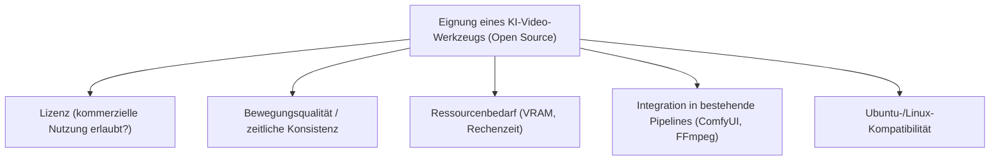
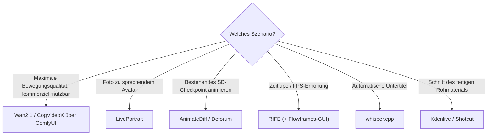

# Beste KI-Video-Tools — Top-20-Topliste (Open Source)

Die Übersicht [KI in der Film- und Videoproduktion](ki-filmproduktion.md) erklärt den gesamten Produktionsprozess Schritt für Schritt, die [Übersicht zur programmatischen Videogenerierung](index.md) listet code-getriebene Animations-Frameworks (Remotion, Manim, Motion Canvas). Diese Seite konzentriert sich auf einen konkreten Vergleich: Welche **quelloffenen KI-Modelle und -Werkzeuge zur Videogenerierung, -bearbeitung und -veredelung** sind aktuell die stärksten — von Text-zu-Video-Modellen über Frame-Interpolation bis zum klassischen Schnitt des generierten Rohmaterials?

!!! note "Hinweis: Modell ≠ Bedienoberfläche ≠ Bearbeitungswerkzeug"
    Ein Teil dieser Liste sind **Videogenerierungs-Modelle** (Wan2.1, HunyuanVideo, CogVideoX), die eine Oberfläche wie ComfyUI zum Ausführen benötigen; ein anderer Teil sind **spezialisierte Werkzeuge** für einen einzelnen Schritt der Pipeline (Frame-Interpolation, Upscaling, Lippensynchronisation, Untertitelung) oder klassische **Schnittprogramme** für das fertige Rohmaterial.

---

## Bewertungskriterien

!!! warning "Achtung: Viele Video- und Avatar-Modelle sind nicht-kommerziell lizenziert"
    Stable Video Diffusion, Wav2Lip und SadTalker stehen unter Forschungslizenzen ohne kommerzielle Nutzungserlaubnis. Bei Gesichts-/Stimmen-Animation (FaceFusion, LivePortrait, Wav2Lip, SadTalker) sind zusätzlich die **Einwilligung der abgebildeten Person** und die Kennzeichnungspflicht für synthetische Medien nach EU AI Act zu beachten. **Stand: Juli 2026.**

---

## Top 20 im Überblick

| Rang | Software/Modell | Anbieter | Lizenz | Kategorie | Einschätzung | Besondere Stärke | Schwäche |
|---|---|---|---|---|---|---|---|
| 1 | **Wan2.1** | Alibaba | Apache-2.0 | Text-/Image-to-Video-Modell | Sehr stark | Aktuell führendes offenes Videomodell, sehr aktive Community und ComfyUI-Integration | Hoher VRAM-Bedarf bei höheren Auflösungen/Längen |
| 2 | **ComfyUI (Video-Workflows)** | Community | GPL-3.0 | Bedienoberfläche | Sehr stark | Zentrale Oberfläche für praktisch alle offenen Videomodelle, siehe [ComfyUI & SD Automatisierung](../design/comfyui-workflow-anleitung.md) | Setup-Komplexität variiert stark je nach Modell |
| 3 | **HunyuanVideo** | Tencent | Tencent Hunyuan Community License (permissiv) | Text-to-Video-Modell | Sehr stark | Sehr hohe Bewegungs- und Bildqualität, state-of-the-art unter offenen Modellen | Sehr hoher Hardware-Bedarf (13 Mrd. Parameter) |
| 4 | **CogVideoX** | Zhipu AI/THUDM | Apache-2.0 | Text-/Image-to-Video-Modell | Stark | Gutes Verhältnis aus Qualität und Ressourcenbedarf, gut dokumentiert | Bewegungsdynamik teils hinter Wan2.1/HunyuanVideo |
| 5 | **Mochi 1** | Genmo AI | Apache-2.0 | Text-to-Video-Modell | Stark | Sehr realistische Bewegungsphysik, vollständig offen lizenziert | Hoher VRAM-Bedarf (10 Mrd. Parameter) |
| 6 | **LTX-Video** | Lightricks | Open Weights (permissiv) | Text-/Image-to-Video-Modell | Stark | Eines der schnellsten offenen Videomodelle, gut für zügige Iteration | Detailtreue bei komplexen Szenen hinter Wan2.1/HunyuanVideo |
| 7 | **LivePortrait** | Kuaishou/Alibaba | MIT | Portrait-/Avatar-Animation | Stark | Sehr flüssige, realistische Animation eines einzelnen Fotos per Antriebsvideo | Auf Portraitgesichter beschränkt |
| 8 | **Open-Sora** | HPC-AI Tech | Apache-2.0 | Text-to-Video-Modell (Forschung) | Solide bis stark | Vollständig transparentes, offenes Reimplementierungsprojekt eines Sora-ähnlichen Modells | Qualität hinter den kommerziell finanzierten Top-Modellen |
| 9 | **AnimateDiff** | Community | Apache-2.0 | Bewegungs-Erweiterung (Stable Diffusion) | Solide bis stark | Macht jedes bestehende SD/SDXL-Checkpoint animierbar, riesiges Motion-LoRA-Ökosystem | Bewegungsqualität hinter dedizierten Videomodellen |
| 10 | **RIFE** | Community | MIT | Frame-Interpolation | Solide bis stark | Sehr schnelle, hochwertige KI-Zwischenbildberechnung für Zeitlupen/FPS-Erhöhung | Reine Interpolation, keine Generierung neuer Inhalte |
| 11 | **Real-ESRGAN / Video2X** | Community | BSD-3-Clause | KI-Video-Upscaling | Solide bis stark | Sehr gute Detailschärfung/Hochskalierung von KI- oder Archivmaterial | Kann bei stark verrauschtem Ausgangsmaterial Artefakte erzeugen |
| 12 | **whisper.cpp** | Community (OpenAI-Whisper-Basis) | MIT | Automatische Untertitelung | Stark | Extrem schnelle, lokale Transkription für Untertitel in praktisch jeder Sprache | Reine Transkription, keine Video-Generierung/-Bearbeitung |
| 13 | **Stable Video Diffusion (SVD)** | Stability AI | Nicht-kommerzielle Forschungslizenz | Image-to-Video-Modell | Solide bis stark | Solide Basis-Bewegung aus Einzelbildern, gut in ComfyUI integriert | Lizenz schließt kommerzielle Nutzung aus |
| 14 | **Deforum** | Community | MIT | Keyframe-/Prompt-Scheduling | Solide | Sehr flexible, künstlerische Kamerafahrten und Übergänge über Stable Diffusion | Ergebnis eher künstlerisch als fotorealistisch |
| 15 | **FaceFusion** | Community | MIT (Kernkomponenten) | Gesichtsaustausch/-animation | Solide | Modernes, aktiv gepflegtes Nachfolgeprojekt der Roop/DeepFaceLive-Linie | Ethische/rechtliche Grenzen bei Personen ohne Einwilligung strikt beachten |
| 16 | **SadTalker** | Community (Forschung) | Nicht-kommerzielle Forschungslizenz | Talking-Head-Animation | Solide | Animiert ein einzelnes Foto direkt aus Audio inkl. Kopfbewegung | Nicht-kommerzielle Lizenz, Qualität hinter LivePortrait |
| 17 | **Wav2Lip** | Community (Forschung) | Nicht-kommerzielle Forschungslizenz | Lippensynchronisation | Solide | Etabliertes Referenzprojekt für Audio-zu-Lippen-Synchronisation | Nicht-kommerzielle Lizenz, Qualität hinter neueren Ansätzen |
| 18 | **Flowframes** | Community | GPL-3.0 | GUI für Frame-Interpolation | Solide | Benutzerfreundliche Oberfläche für RIFE/DAIN ohne Kommandozeile | Primär Windows-fokussiert, unter Ubuntu Eigenbau/Wine nötig |
| 19 | **Kdenlive** | KDE-Community | GPL-3.0 | Klassischer Videoschnitt | Solide | Sehr ausgereifter, funktionsreicher Linux-nativer Editor mit guter Ubuntu-Integration | Kein eigenes KI-Feature, reines Schnittwerkzeug für das Rohmaterial |
| 20 | **Shotcut** | Community | GPL-3.0 | Klassischer Videoschnitt | Solide | Vollwertiger, plattformübergreifender Editor als Basis für KI-generiertes Rohmaterial | Ebenfalls kein eigenes KI-Feature, reines Schnittwerkzeug |

!!! tip "Tipp: Rang ≠ einzige Entscheidungsgröße"
    Für **maximale Bewegungsqualität ohne Lizenz-Einschränkungen** ist Wan2.1 aktuell die zukunftssicherste Wahl, ausführbar über ComfyUI. Für **Avatare/Talking Heads** liefert LivePortrait die beste Qualität ohne die kommerziellen Einschränkungen von Wav2Lip/SadTalker. Für die **Post-Produktion** des generierten Materials (Zwischenbilder, Upscaling, Untertitel, Schnitt) sind RIFE, Real-ESRGAN, whisper.cpp und Kdenlive die etablierten Ergänzungswerkzeuge.

---

## Empfehlung nach Einsatzszenario

---

## 🔗 Verwandte Themen

- [Startseite](../../index.md) — zurück zur Dokumentations-Zentrale
- [KI in der Film- und Videoproduktion](ki-filmproduktion.md) — vollständiger Produktionsprozess von Idee bis Veröffentlichung
- [Programmatische Videogenerierung & Animation](index.md) — code-getriebene Animations-Frameworks (Remotion, Manim, Motion Canvas) statt KI-Modelle
- [Beste KI-Bildgenerierungs-Tools (Open Source, Top 20)](../design/ki-bildgenerierung-tools-topliste.md) — Bildmodelle als Ausgangsmaterial für Image-to-Video
- [ComfyUI & SD Automatisierung](../design/comfyui-workflow-anleitung.md) — vertiefende Praxis zu Rang 2
- [FFmpeg & Whisper Automatisierung](ffmpeg-whisper-automatisierung.md) — vertiefende Praxis zu Rang 12
- [FFmpeg Advanced Filtering & AV1](ffmpeg-advanced-filters.md)
