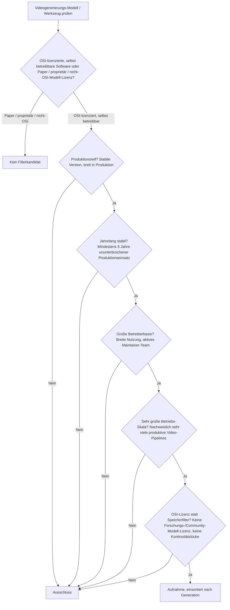
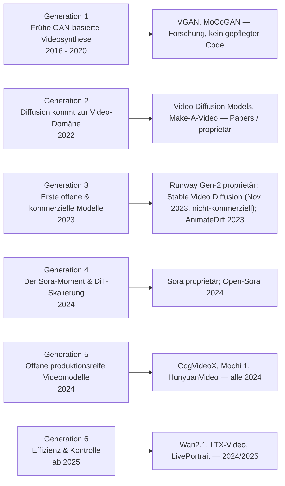
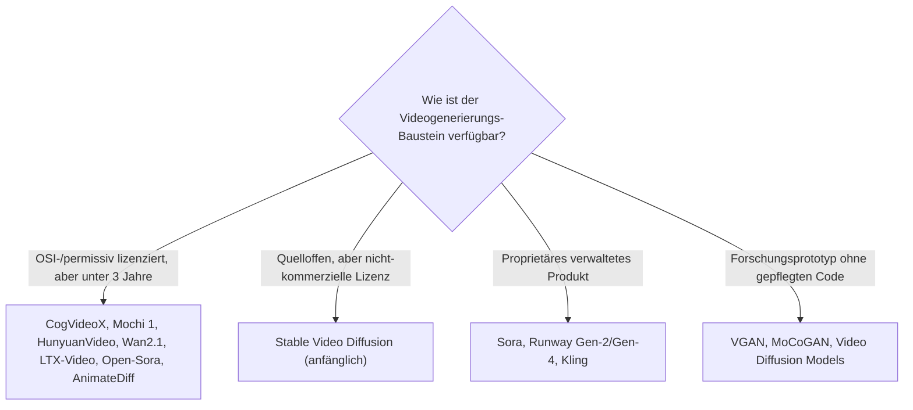

# Produktionsreife KI-Videogenerierung nach Generation — Reifegrad, Lizenz & Betriebs-Skala (kein Treffer — der klarste Null-Treffer der Kreativ-Achse, die Kategorie ist keine drei Jahre alt)

Die [Evolution und Architekturen digitaler KI-Videogenerierung](evolution-digitaler-ki-videogenerierung.md) ordnet die Kategorie chronologisch in sechs Generationen: frühe GAN-basierte Videosynthese (1), Diffusion kommt zur Video-Domäne (2), erste offene & kommerzielle Text-zu-Video-Modelle (3), der Sora-Moment & DiT-Skalierung (4), offene produktionsreife Videomodelle (5), Effizienz & Kontrolle als Priorität (6). Die [Topliste bester KI-Video-Tools (Top 20)](ki-video-tools-topliste.md) rankt die gesamte Kategorie. Diese Seite legt das **konservative** Fünf-Filter-Sieb der Familie an — produktionsreif · jahrelang stabil · große Betreiberbasis · sehr große Betriebs-Skala · Speicher dateibasiert oder PostgreSQL — und sortiert nach Generation.

!!! warning "Achtung: Kein Treffer — die klarste Null-Aussage der drei Kreativ-Achsen"
    Die praktisch nutzbare Text-zu-Video-Generierung beginnt frühestens 2023 (**Runway Gen-2**, **Stable Video Diffusion**), die eigenständigen offenen Modelle sogar erst 2024 (**CogVideoX**, **Mochi 1**, **HunyuanVideo**) und 2025 (**Wan2.1**, **LTX-Video**). Die Kategorie ist damit **keine drei Jahre alt** — jeder Filter, der fünf Jahre verlangt, schließt sie vollständig aus. Die frühe **GAN-Generation** (VGAN, MoCoGAN) ist Forschung ohne betreibbaren, gepflegten Code; **Sora** und **Runway** sind proprietär. Dasselbe Bild wie bei den [agentischen Tutor-Ökosystemen](../../wissen/e-learning/produktionsreife-agentische-tutor-oekosysteme-generationen-2026-topliste.md) — und noch schärfer: Der [Bildgenerierung](../design/produktionsreife-ki-bildgenerierung-generationen-2026-topliste.md) fehlt der Treffer nur knapp (AUTOMATIC1111 als Grenzfall), der Videogenerierung fehlt jedes reife Werkzeug mit Abstand. Der Speicherfilter läuft leer (Gewichte sind Dateien) und wird durch **OSI-Lizenz + Reifezeit** ersetzt.

---

## Die fünf harten Filter

!!! note "Hinweis: Eine drei Jahre alte Kategorie kann kein Fünf-Jahres-Sieb bestehen"
    Der Filter ist hier weniger eine Prüfung als eine Feststellung: Es gibt 2026 kein quelloffenes Videogenerierungs-Modell und keine quelloffene Videogenerierungs-Oberfläche, die auch nur die Hälfte der geforderten Produktionshistorie hat.

---

## Ergebnis: kein Treffer über sechs Generationen

---

## Warum keine Generation einen Treffer liefert

- **Generation 1 (GAN-basierte Videosynthese)**: **VGAN** (2016) und **MoCoGAN** (2018) übertrugen das GAN-Prinzip auf die Zeitdimension, skalierten dafür aber schlechter als für Einzelbilder — Forschungsprototypen ohne betreibbare, gepflegte Codebasis, 2018–2020 durch den Wechsel zu Diffusion abgelöst.
- **Generation 2 (Diffusion in der Video-Domäne)**: **Video Diffusion Models** und **Imagen Video** (Google, 2022) sind Papers bzw. proprietäre Systeme; **Make-A-Video** (Meta, 2022) wurde nie als betreibbares Modell veröffentlicht.
- **Generation 3 (erste offene & kommerzielle Modelle)**: **Runway Gen-2** ist ein proprietäres Produkt. **Stable Video Diffusion** (November 2023) ist das erste offene Image-to-Video-Modell, stand zunächst unter einer nicht-kommerziellen Lizenz und ist ~2,5 Jahre alt. **AnimateDiff** (2023) macht Stable-Diffusion-Checkpoints animierbar — ~3 Jahre.
- **Generation 4 (Sora-Moment & DiT)**: **Sora** (OpenAI, angekündigt Februar 2024) ist proprietär. **Open-Sora** (HPC-AI Tech, 2024) ist ein transparentes Reimplementierungsprojekt — ~2 Jahre.
- **Generation 5 (offene produktionsreife Modelle)**: **CogVideoX** (Zhipu AI), **Mochi 1** (Genmo), **HunyuanVideo** (Tencent) — alle aus 2024, teils mit permissiven Lizenzen, aber ~1,5–2 Jahre alt.
- **Generation 6 (Effizienz & Kontrolle)**: **Wan2.1** (Alibaba, 2025), **LTX-Video** (Lightricks, 2024/2025), **LivePortrait** (2024) — die jüngste Front der jüngsten Kreativ-Kategorie.

---

## OSI-Lizenz statt Speicherbackend

Modell-Gewichte sind Dateien — der Speicherfilter läuft leer. Die trennende Achse ist Reifezeit und Lizenz, und sie siebt hier restlos:

- Der Speicherfilter greift nicht: Ein Videomodell wird als Datei geladen, das generierte Material als Videodatei ausgegeben; die Anwendung darüber hält ihren Zustand relational.
- Die ersetzende Reifezeit-Achse ist hier keine Nuance, sondern ein Ausschluss: **kein einziges** Werkzeug oder Modell dieser Zeitachse ist drei Jahre alt.

Vertiefung zur Datenbankschicht der Generierungs-Anwendung: [PostgreSQL DBA Praxis-Handbuch](../../entwicklung/infrastruktur/postgresql-dba-praxis.md).

!!! warning "Achtung: Momentaufnahme, Stand August 2026"
    Diese Kategorie verändert sich am schnellsten aller Kreativ-Achsen. Ein erster Treffer ist frühestens 2028/2029 realistisch — wenn eines der 2023er-Werkzeuge (AnimateDiff, Stable Video Diffusion) die Fünf-Jahres-Marke mit dann breiter, quelloffener Betreiberbasis erreicht.

---

## Was bewusst nicht auf dieser Liste steht

| System | Erfüllt nicht | Anmerkung |
|---|---|---|
| **Sora, Runway Gen-2 / Gen-4, Kling** | Lizenzfilter | Proprietäre, verwaltete Videogenerierungs-Dienste |
| **Stable Video Diffusion** | Lizenz + Reifezeit | Anfänglich nicht-kommerzielle Lizenz; November 2023 |
| **CogVideoX, Mochi 1, HunyuanVideo, Wan2.1, LTX-Video, Open-Sora** | Reifezeit | Offene bzw. permissive Modelle — aber alle 2024/2025 |
| **AnimateDiff** | Reifezeit | Motion-Modul über Stable Diffusion, ~3 Jahre — jüngster Grenzfall |
| **LivePortrait** | Reifezeit / Kategorie | Spezialisierte Portrait-/Avatar-Animation, 2024 |
| **VGAN, MoCoGAN, Video Diffusion Models, Make-A-Video** | Kategorie / Kontinuität | Forschungsprototypen bzw. Papers ohne betreibbaren Code |

---

## 🔗 Verwandte Themen

- [Evolution und Architekturen digitaler KI-Videogenerierung](evolution-digitaler-ki-videogenerierung.md) — das sechsstufige Generationenmodell, nach dem diese Liste sortiert ist
- [Beste KI-Video-Tools (Open Source, Top 20)](ki-video-tools-topliste.md) — breiteste Basis-Topliste inklusive proprietärer Dienste und Post-Produktions-Werkzeuge
- [Produktionsreife KI-Bildgenerierung nach Generation (kein Treffer)](../design/produktionsreife-ki-bildgenerierung-generationen-2026-topliste.md) — die Bildmodelle als Ausgangsmaterial, ~2 Jahre älter, aber ebenfalls ohne Treffer
- [Produktionsreife KI-Modell-Generatoren nach Generation (kein Treffer)](../../künstliche-intelligenz/produktionsreife-ki-modell-generatoren-generationen-2026-topliste.md) — die übergeordnete Generator-Architektur-Achse
- [Produktionsreife agentische Tutor-Ökosysteme nach Generation (kein Treffer)](../../wissen/e-learning/produktionsreife-agentische-tutor-oekosysteme-generationen-2026-topliste.md) — dieselbe „Kategorie zu jung"-Struktur in der Bildungsdomäne
- [Programmatische Videogenerierung & Animation](index.md) — code-getriebene Animations-Frameworks als reifer Gegenentwurf
- [PostgreSQL DBA Praxis-Handbuch](../../entwicklung/infrastruktur/postgresql-dba-praxis.md) — Datenbankschicht der Generierungs-Anwendung
