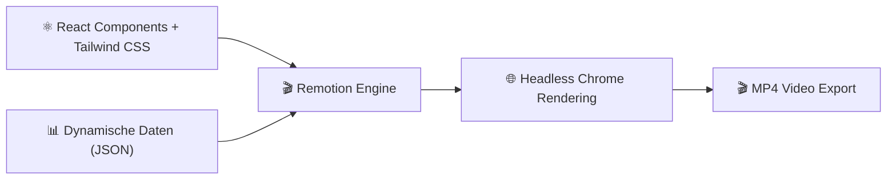

# Praxis-Guide: Remotion React-Based Video Generation

**Remotion** erlaubt das programmatische Erstellen von Videos, Animationen und Untertiteln in **React** und TypeScript und rendert diese als MP4-Videos.

---



---

## 🛠️ 1. Remotion Projekt erstellen

```bash
npx create-video@latest my-video
cd my-video
```

---

## 💻 2. React Video Component (`src/MyComposition.tsx`)

```tsx
import { AbsoluteFill, interpolate, useCurrentFrame, spring, useVideoConfig } from 'remotion';

export const MyComposition = ({ titleText }: { titleText: str }) => {
  const frame = useCurrentFrame();
  const { fps } = useVideoConfig();

  # Einblende-Animation berechnen
  const opacity = interpolate(frame, [0, 30], [0, 1], {
    extrapolateLeft: 'clamp',
    extrapolateRight: 'clamp',
  });

  const scale = spring({
    fps,
    frame,
    config: { damping: 10 },
  });

  return (
    <AbsoluteFill style={{ backgroundColor: '#0f172a', justifyContent: 'center', alignItems: 'center' }}>
      <h1 style={{ opacity, transform: `scale(${scale})`, color: '#38bdf8', fontSize: 80, fontFamily: 'sans-serif' }}>
        {titleText}
      </h1>
    </AbsoluteFill>
  );
};
```

---

## ⚡ 3. Video serverseitig rendern (CLI)

```bash
npx remotion render MyComp out.mp4 --props='{"titleText": "Hallo Antigravity!"}'
```

---

## 🔗 Verwandte Themen
* [Manim Animation Engine](manim-animation-guide.md) – Erklärvideos
* [FFmpeg Advanced Filtering](ffmpeg-advanced-filters.md) – Video-Encoding
* [KI in der Film- und Videoproduktion](ki-filmproduktion.md) – Übersicht
