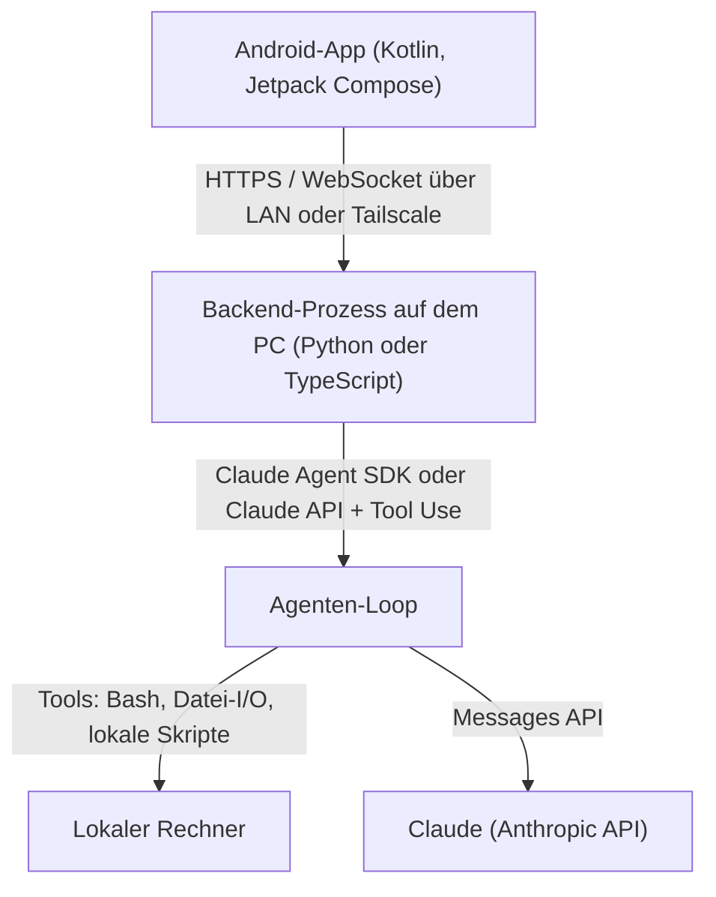
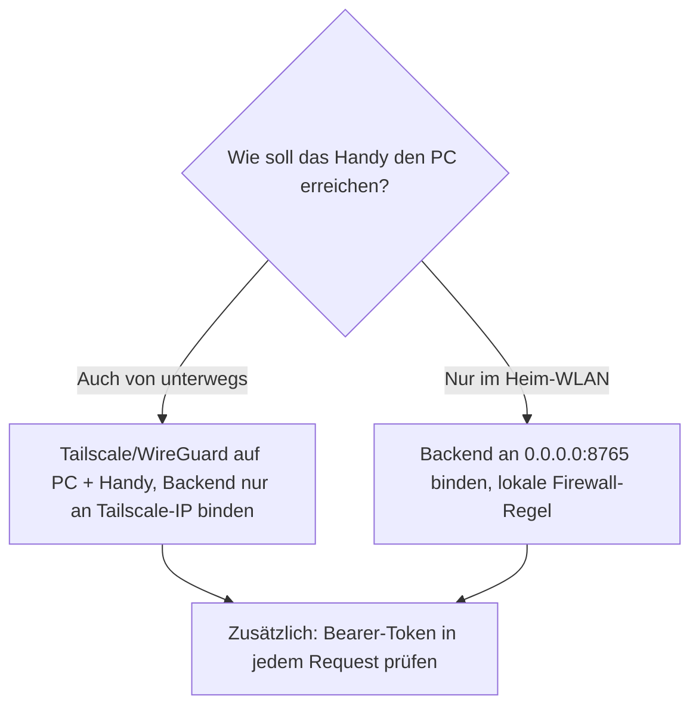

# Android-KI-Agent-Fernsteuerung für den lokalen PC selbst programmieren (Kotlin & KI-Agent-SDK)

Die [Fernsteuerungs-Topliste für den lokalen Rechner](android-ki-agent-fernsteuerung-lokal-topliste.md) stellt fertige Open-Source-Apps vor. Diese Seite geht den anderen Weg: eine **eigene Android-App in Kotlin**, die über eine selbst geschriebene Backend-Schicht einen KI-Agenten auf dem heimischen PC fernsteuert. Das Backend übernimmt die eigentliche Agenten-Logik (z. B. mit dem Claude Agent SDK oder der Claude API), die Kotlin-App ist ein schlanker Client, der per LAN oder VPN mit diesem Backend spricht.

!!! note "Hinweis: Warum ein Backend nötig ist"
    Es gibt kein offizielles Kotlin-/Android-SDK für Claude. Die Anthropic-SDKs existieren für Python, TypeScript, Java/Kotlin (JVM), Go, Ruby, C# und PHP — aber **Java/Kotlin bedeutet hier JVM-Server**, nicht Android. Die Android-App ruft daher nie direkt die Anthropic-API auf, sondern ausschließlich eine eigene HTTP-/WebSocket-Schnittstelle auf dem PC. Das ist zugleich der einzig sichere Weg: Ein API-Key, der in einer APK eingebettet ist, lässt sich durch Dekompilieren extrahieren.

---

## Architektur-Überblick



Drei Bausteine, drei Verantwortlichkeiten:

| Baustein | Sprache/Technologie | Aufgabe |
|---|---|---|
| Android-App | Kotlin, Jetpack Compose, Ktor Client oder OkHttp | Chat-UI, sendet Prompts, zeigt Streaming-Antworten |
| Backend-Prozess | Python (`claude-agent-sdk`) oder TypeScript (`@anthropic-ai/claude-agent-sdk`) | Hält den API-Key, betreibt den Agenten-Loop, exponiert eine eigene REST-/WebSocket-Schnittstelle |
| Claude | Anthropic API | Denkt, plant, ruft Tools auf |

!!! warning "Achtung: Claude Agent SDK ist kein Server"
    Das Claude Agent SDK (`claude-agent-sdk` / `@anthropic-ai/claude-agent-sdk`) ist Claude Code als Bibliothek — es liefert die Agenten-Schleife samt eingebauten Tools (Datei-Lesen/Schreiben, Bash, Web-Suche), aber **keine** HTTP-Schnittstelle nach außen. Diese Schicht (FastAPI, Express, Ktor auf JVM-Seite) muss selbst geschrieben werden. Alternativ eignet sich ein manueller Agenten-Loop direkt auf der Claude API mit Tool Use, wenn nur ein festes, kleines Tool-Set benötigt wird.

---

## Backend: Agenten-Prozess auf dem PC

Der Backend-Prozess läuft dauerhaft auf dem PC (z. B. als `systemd`-User-Service oder in `tmux`) und übersetzt eingehende HTTP-/WebSocket-Anfragen der Android-App in Aufrufe des Claude Agent SDK.

=== "Python (Claude Agent SDK)"
    ```python
    from fastapi import FastAPI
    from fastapi.responses import StreamingResponse
    from claude_agent_sdk import query, ClaudeAgentOptions

    app = FastAPI()

    @app.post("/chat")
    async def chat(prompt: str):
        options = ClaudeAgentOptions(
            cwd="/home/user/projekt",
            allowed_tools=["Read", "Write", "Bash"],
        )

        async def event_stream():
            async for message in query(prompt=prompt, options=options):
                yield f"data: {message}\n\n"

        return StreamingResponse(event_stream(), media_type="text/event-stream")
    ```

=== "TypeScript (Claude Agent SDK)"
    ```typescript
    import express from "express";
    import { query } from "@anthropic-ai/claude-agent-sdk";

    const app = express();
    app.use(express.json());

    app.post("/chat", async (req, res) => {
      res.setHeader("Content-Type", "text/event-stream");

      for await (const message of query({
        prompt: req.body.prompt,
        options: { cwd: "/home/user/projekt", allowedTools: ["Read", "Write", "Bash"] },
      })) {
        res.write(`data: ${JSON.stringify(message)}\n\n`);
      }
      res.end();
    });

    app.listen(8765);
    ```

Der Anthropic-API-Key steckt ausschließlich in der Umgebung dieses Prozesses (`ANTHROPIC_API_KEY` bzw. `ant auth login`) — die Android-App bekommt ihn nie zu Gesicht.

---

## Kotlin-Android-App: Client für das eigene Backend

Die App braucht nur einen HTTP-Client mit Streaming-Unterstützung (Server-Sent Events oder WebSocket) und eine Chat-Oberfläche. Ktor Client eignet sich für beides in einer gemeinsamen Kotlin-Codebasis.

```kotlin
// build.gradle.kts (Module: app)
dependencies {
    implementation("io.ktor:ktor-client-core:2.3.12")
    implementation("io.ktor:ktor-client-cio:2.3.12")
    implementation("io.ktor:ktor-client-content-negotiation:2.3.12")
}
```

```kotlin
class AgentClient(private val baseUrl: String) {
    private val client = HttpClient(CIO)

    suspend fun streamChat(prompt: String, onEvent: (String) -> Unit) {
        client.preparePost("$baseUrl/chat") {
            contentType(ContentType.Application.Json)
            setBody(mapOf("prompt" to prompt))
        }.execute { response ->
            val channel: ByteReadChannel = response.bodyAsChannel()
            while (!channel.isClosedForRead) {
                val line = channel.readUTF8Line() ?: continue
                if (line.startsWith("data: ")) onEvent(line.removePrefix("data: "))
            }
        }
    }
}
```

In der Compose-UI wird `streamChat` aus einer `ViewModel`-`viewModelScope.launch { }`-Coroutine aufgerufen; jedes empfangene Event hängt sich an eine `mutableStateListOf<String>` an, die die Chat-Bubbles rendert.

!!! tip "Tipp: WebSocket statt SSE bei bidirektionaler Steuerung"
    Server-Sent Events reichen für reines "Prompt rein, Antwort-Stream raus". Soll die App den Agenten mitten im Lauf unterbrechen können (Bash-Bestätigung, Abbruch), ist ein WebSocket (`ktor-client-websockets`) die bessere Wahl — dann lässt sich in beide Richtungen senden, ohne eine zweite Verbindung aufzumachen.

---

## Kommunikationsprotokoll

| Protokoll | Eignung | Bibliothek (Kotlin) |
|---|---|---|
| REST + Server-Sent Events | Einfacher Chat, ein Request pro Prompt | Ktor Client (`preparePost` + `bodyAsChannel`) |
| WebSocket | Bidirektional: Unterbrechen, Tool-Bestätigungen, Live-Status | `ktor-client-websockets` oder OkHttp `WebSocketListener` |
| Reine REST-Polling-API | Am einfachsten zu debuggen, aber kein Echtzeit-Feedback | Retrofit + `suspend fun` |

---

## Erreichbarkeit & Sicherheit



!!! warning "Achtung: Niemals ungeschützt ins offene Netz"
    Das selbstgebaute Backend hat i. d. R. keine eingebaute Authentifizierung. Mindestens ein statisches Bearer-Token (per `Authorization`-Header, serverseitig gegen eine Umgebungsvariable geprüft) einbauen, bevor der Port über den Router nach außen freigegeben wird — besser: gar nicht freigeben, sondern ausschließlich über [Tailscale](android-ki-agent-fernsteuerung-lokal-topliste.md) erreichbar machen, wie in der Fernsteuerungs-Topliste beschrieben.

Für den Ablauf "Wake-on-LAN, wenn der PC im Schlafmodus ist" gilt dieselbe Einschränkung wie bei den fertigen Apps aus der Topliste — ein Agenten-Backend, das nicht läuft, ist nicht erreichbar.

---

## Verwandte Themen

- [Startseite](../../index.md) — zurück zur Dokumentations-Zentrale
- [Beste KI-Agent-Fernsteuerung auf einem lokalen Rechner per Android (Top 20)](android-ki-agent-fernsteuerung-lokal-topliste.md) — fertige Open-Source-Apps statt Eigenbau
- [Android-KI-Agent-Fernsteuerung für Server selbst programmieren (Kotlin & KI-Agent-SDK)](android-ki-agent-fernsteuerung-server-sdk-kotlin.md) — dasselbe Konzept für einen dauerhaft laufenden Server
- [Fernsteuerung von Self-Hosting-Servern per Android (Top 20)](../../entwicklung/infrastruktur/android-server-fernsteuerung-opensource-topliste.md) — generische Fernsteuerungs-Tools als technisches Fundament
- [AI Agents – Das Praxis-Handbuch](../coding/ai-agents-praxis.md) — Grundlagen zu Agenten-Loop, Tools und MCP
- [Lokales RAG & LLM-Serving](../coding/lokales-rag-ollama.md) — Betrieb von Modellen auf dem eigenen Rechner
