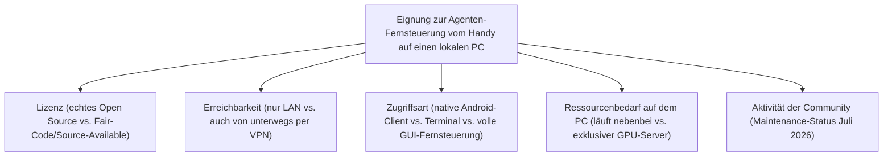
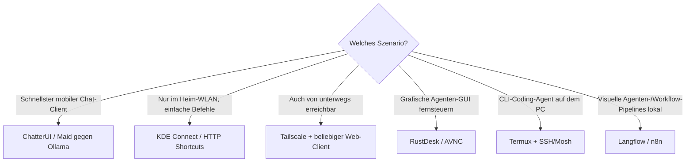

# Beste Open-Source-Apps zur Fernsteuerung von KI-Agenten auf einem lokalen Rechner per Android (Top 20)

Nicht jeder KI-Agent läuft auf einem dedizierten Server — oft ist es der heimische PC oder Laptop, der ohnehin schon eine potente GPU für lokale Modelle hat. Diese Seite listet **ausschließlich quelloffene** Wege, einen auf dem eigenen Rechner laufenden KI-Agenten vom Android-Handy aus zu erreichen: native mobile Clients, die sich per LAN oder VPN mit einem lokalen Modell-Server verbinden, sowie Terminal- und Remote-Desktop-Zugriff für Agenten mit CLI oder GUI.

!!! note "Hinweis: Abgrenzung zur Server-Variante"
    [Beste KI-Agent-Fernsteuerung auf einem Self-Hosting-Server per Android (Top 20)](android-ki-agent-fernsteuerung-server-topliste.md) behandelt dasselbe Konzept für einen dauerhaft laufenden, meist headless betriebenen Server. Diese Seite ist auf den **lokalen Arbeitsplatzrechner** zugeschnitten: Der PC läuft nicht zwingend rund um die Uhr, ist meist über das Heimnetz statt eine feste Domain erreichbar, und ein Teil der hier gelisteten Werkzeuge (KDE Connect, RustDesk, HTTP Shortcuts) ist speziell auf den schnellen LAN-Zugriff statt dauerhaften Fernbetrieb ausgelegt. Mehrere Werkzeuge (Open WebUI, Tailscale, LibreChat) tauchen auf beiden Seiten auf — hier jeweils im Kontext eines gegen den eigenen PC statt einen Server konfigurierten Setups.

---

## Bewertungskriterien

!!! warning "Achtung: Lokaler PC ist standardmäßig nur im eigenen WLAN erreichbar"
    Im Gegensatz zu einem Server mit fester IP/Domain hängt ein Heim-PC meist hinter einem NAT-Router ohne öffentliche Adresse. Ohne **Tailscale**, **WireGuard** oder eine vergleichbare VPN-Lösung funktionieren die meisten hier gelisteten Apps nur, solange sich das Handy im selben WLAN befindet. **Stand: Juli 2026.**

---

## Top 20 im Überblick

| Rang | Software | Kategorie | Lizenz | Zugriffsart | Besondere Stärke | Schwäche |
|---|---|---|---|---|---|---|
| 1 | **Ollama** | Lokaler Modell-Server | MIT | OpenAI-kompatible API im LAN/VPN | De-facto-Standard-Backend, praktisch jeder mobile Client dieser Liste kann sich damit verbinden | Selbst kein Chat-Interface, reiner Modell-Server |
| 2 | **llama.cpp** (llama-server) | Low-Level-Inferenz-Server | MIT | OpenAI-kompatible API im LAN/VPN | Sehr schlank, maximale Hardware-Kontrolle, Grundlage vieler anderer Tools dieser Liste | Konfiguration deutlich technischer als Ollama |
| 3 | **ChatterUI** | Native Android-Chat-App | AGPL-3.0 | Native App, „Remote Mode" gegen PC-Server | Läuft sowohl on-device als auch als Remote-Client gegen Ollama/llama.cpp auf dem PC, React-Native-Oberfläche | Remote-Mode-Konfiguration (IP/Port) manuell einzurichten |
| 4 | **Maid** | Native Android-Chat-App (Flutter) | MIT | Native App, remote gegen Ollama/llama.cpp | Ein Client für lokale GGUF-Modelle **und** Remote-Anbindung an den heimischen PC, plattformübergreifend (Flutter) | Kleinere Community als ChatterUI |
| 5 | **text-generation-webui** (oobabooga) | Lokale Chat-/Agenten-Web-UI | AGPL-3.0 | Responsive Web-UI im LAN/VPN | Sehr breite Modell-/Backend-Unterstützung, OpenAI-kompatibler API-Modus für andere Clients | Gradio-Oberfläche auf kleinem Handy-Bildschirm etwas eng |
| 6 | **KoboldCpp** | Ein-Datei-Inferenzserver | AGPL-3.0 | Eigene „Lite"-Web-UI, sehr mobilfreundlich | Ein einzelnes Programm ohne Installationsaufwand, „Lite"-UI extra für kleine Bildschirme optimiert | Weniger Plugin-/Tool-Ökosystem als Open WebUI |
| 7 | **Jan** | Lokaler Desktop-KI-Client | AGPL-3.0 | Lokaler API-Server-Modus, per LAN/VPN erreichbar | Umschaltbarer lokaler Server-Modus macht den Desktop-Client für mobile Apps ansprechbar | Server-Modus ist Zusatzfunktion, primär als Desktop-App gedacht |
| 8 | **GPT4All** | Lokaler Desktop-KI-Client | MIT | Lokaler API-Server-Modus, per LAN/VPN erreichbar | Sehr einsteigerfreundlich, reines MIT ohne Zusatzbedingungen | Modellauswahl/Performance hinter spezialisierteren Inferenz-Servern |
| 9 | **Open WebUI** (gegen lokalen PC) | Chat-/Agenten-Oberfläche | Open WebUI License (BSD-3-Basis + Branding-Pflicht) | PWA im LAN/VPN | Dieselbe ausgereifte Oberfläche wie im Server-Einsatz, hier direkt gegen den heimischen Ollama-Server | Läuft dauerhaft mit, PC muss für Zugriff eingeschaltet bleiben |
| 10 | **SillyTavern** (gegen lokalen Server) | Agenten-/Charakter-Frontend | AGPL-3.0 | Responsive Web-UI im LAN/VPN | Direkt gegen lokal laufendes KoboldCpp/text-generation-webui nutzbar, riesige Erweiterungsvielfalt | Setup aus mehreren Komponenten (Frontend + Backend) nötig |
| 11 | **HTTP Shortcuts** | Android-Automatisierungs-App | MIT | Native App, Homescreen-Widgets | Ein-Klick-Auslösung eigener Webhooks/Skripte auf dem PC direkt vom Homescreen, ganz ohne Chat-Oberfläche | Erfordert, dass der Agent/das Skript bereits einen HTTP-Endpunkt bereitstellt |
| 12 | **Home Assistant + Companion App** | Lokale Automatisierungs-„Agenten" | Apache-2.0 | Native Android-App | Assist-Sprachpipeline und Automatisierungen direkt auf dem eigenen PC/NAS, native App statt Browser | Fokus auf Smart-Home/Automatisierung, kein Allzweck-Chat-Agent |
| 13 | **Termux + SSH/Mosh** | Terminal-Fernzugriff | GPL-3.0/GPL-2.0 | Native App | CLI-Coding-Agent (Claude Code, Aider) im `tmux` auf dem PC laufen lassen und vom Handy aus andocken | Setup (SSH-Server auf dem PC, Schlüssel) einmalig nötig |
| 14 | **RustDesk** | Remote Desktop | AGPL-3.0 | Native App, volle GUI-Fernsteuerung | Sieht und steuert die komplette Desktop-Oberfläche, ideal für Agenten mit eigenem Fenster (Browser-Automatisierung, Desktop-Assistenten) | Für reine Text-/API-Agenten unnötig schwergewichtig |
| 15 | **AVNC** | VNC-Client | GPL-3.0 | Native App, Bildschirmzugriff | Schlanker, moderner VNC-Client als leichtere Alternative zu RustDesk | Server-seitig muss ein VNC-Server auf dem PC laufen |
| 16 | **KDE Connect** | LAN-Geräteintegration | GPL-2.0/LGPL | Native App, nur lokales Netz | Schnellster Weg für einfache Befehle/Datei-/Zwischenablage-Austausch zwischen Handy und PC im selben WLAN | Kein Zugriff außerhalb des lokalen Netzes ohne zusätzliches VPN |
| 17 | **Tailscale** (Android-Client) | VPN-Mesh | BSD-3-Clause (Client) | Native App | Macht den PC von überall erreichbar, nicht nur im Heim-WLAN, sehr einfaches Setup | Für reinen LAN-Betrieb overkill, wenn man nie unterwegs zugreift |
| 18 | **Langflow** | Visueller Agenten-/RAG-Flow-Builder | MIT | Responsive Web-UI im LAN/VPN | Lokal auf dem PC laufender Agenten-Builder, vom Handy aus im Browser bedienbar | Für einfache Chat-Anwendungsfälle überdimensioniert |
| 19 | **n8n** (lokal auf dem PC) | Automatisierungs-/Agenten-Workflows | Sustainable Use License (Fair-Code) | Responsive Web-UI im LAN/VPN | Workflows/Agenten-Nodes direkt auf dem eigenen Rechner, ohne dass ein Server dauerhaft laufen muss | Kein OSI-Open-Source, PC muss für aktive Workflows eingeschaltet bleiben |
| 20 | **LibreChat** (lokal betrieben) | Multi-Provider-Chat-/Agenten-UI | MIT | PWA im LAN/VPN | Dieselbe Oberfläche wie im Server-Einsatz, hier gegen lokale Modelle statt Cloud-APIs konfiguriert | Docker-Setup auf dem Arbeitsplatzrechner nötig |

!!! tip "Tipp: Rang ≠ einzige Entscheidungsgröße"
    Für den **einfachsten mobilen Einstieg** sind ChatterUI oder Maid direkt gegen einen laufenden Ollama-Server auf dem PC kaum zu schlagen — beide Apps funktionieren sowohl on-device als auch remote. Für **volle grafische Kontrolle** über einen Agenten mit eigenem Fenster ist RustDesk die richtige Wahl. Wer den PC **auch unterwegs, nicht nur im Heim-WLAN** erreichen will, kommt an Tailscale kaum vorbei.

---

## Empfehlung nach Einsatzszenario

!!! warning "Achtung: Lokaler PC im Standby/Schlafmodus ist nicht erreichbar"
    Anders als ein Server läuft ein Arbeitsplatzrechner selten rund um die Uhr. Für zuverlässigen Fernzugriff „Wake-on-LAN" aktivieren oder den PC bewusst im Energiesparplan vom automatischen Schlafmodus ausnehmen — sonst laufen Ollama/llama.cpp & Co. beim Fernzugriffsversuch schlicht nicht.

---

## Verwandte Themen

- [Startseite](../../index.md) — zurück zur Dokumentations-Zentrale
- [Beste KI-Agent-Fernsteuerung auf einem Self-Hosting-Server per Android (Top 20)](android-ki-agent-fernsteuerung-server-topliste.md) — dasselbe Konzept für einen dauerhaft laufenden Server statt den lokalen PC
- [Android-KI-Agent-Fernsteuerung für den lokalen PC selbst programmieren (Kotlin & KI-Agent-SDK)](android-ki-agent-fernsteuerung-lokal-sdk-kotlin.md) — eigene App statt fertiger Tools aus dieser Liste
- [Fernsteuerung von Self-Hosting-Servern per Android (Top 20)](../../entwicklung/infrastruktur/android-server-fernsteuerung-opensource-topliste.md) — generische Fernsteuerungs-Tools (u. a. Tailscale, RustDesk, KDE Connect) im ursprünglichen, nicht Agenten-spezifischen Kontext
- [Beste lokale Computer-KI-Agenten (Allgemein, Top 20)](lokale-ki-agenten-topliste.md) — Agenten, die den PC-Bildschirm selbst per Vision-Modell steuern, statt vom Handy aus ferngesteuert zu werden
- [Beste Mobile KI-Chat-Apps mit Live-Sprach- & Video-Modus (Android, Top 20)](../coding/mobile-ki-chat-live-topliste.md) — Gegenstück mit Cloud-gehosteten Modellen statt lokalem PC
- [Lokales RAG & LLM-Serving](../coding/lokales-rag-ollama.md) — Grundlagen zum Betrieb von Ollama & Co. auf dem eigenen Rechner
