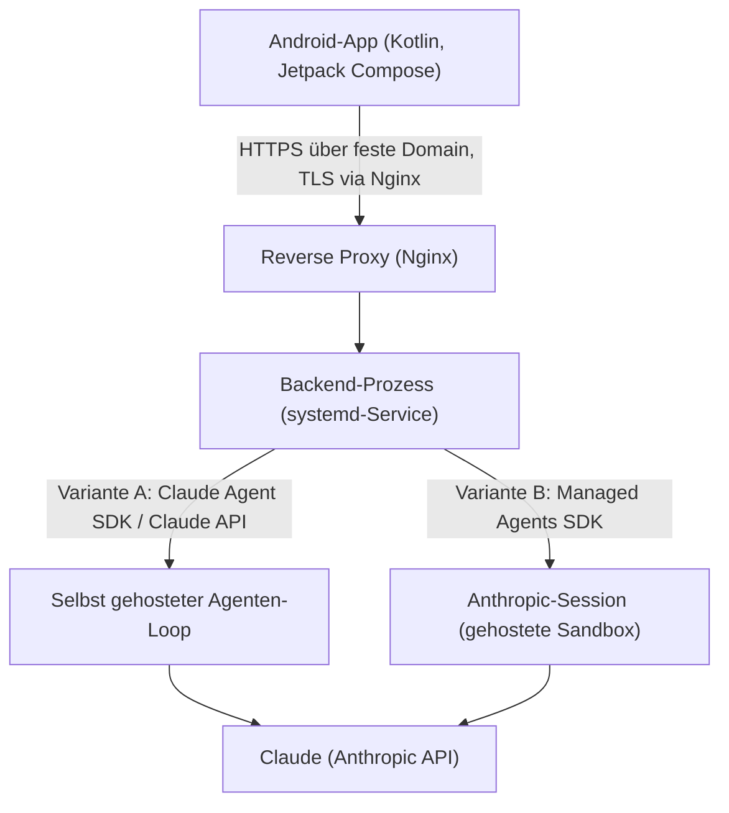
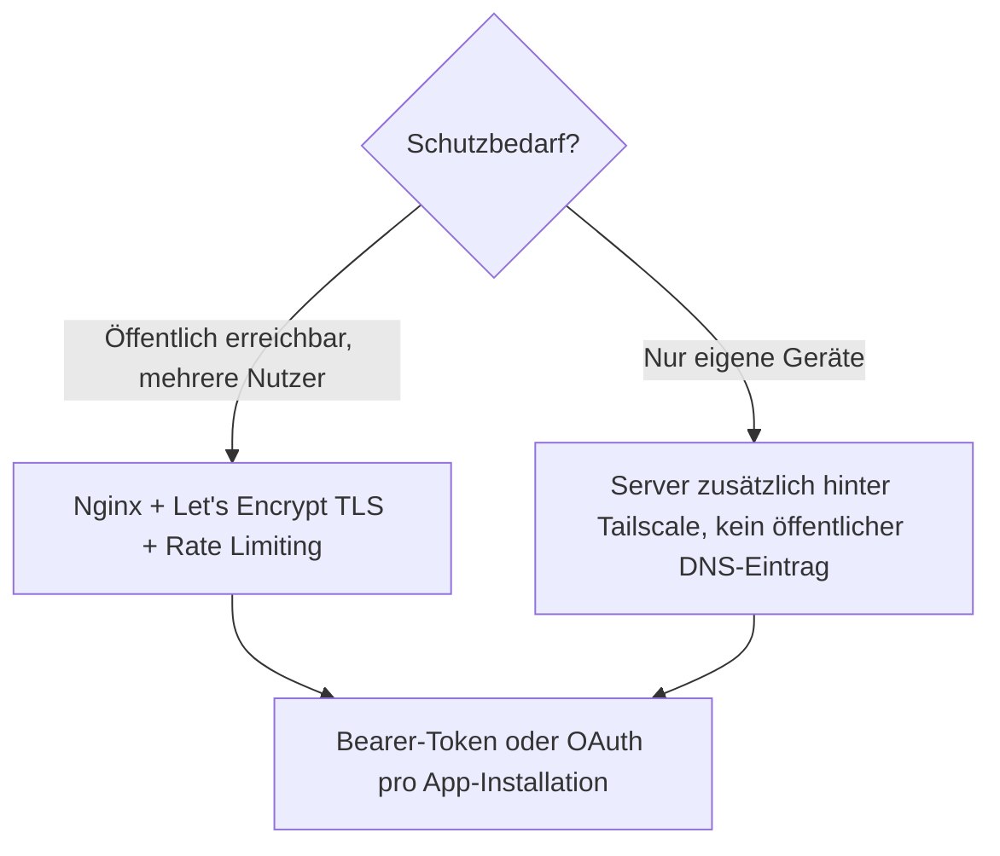

# Android-KI-Agent-Fernsteuerung für Server selbst programmieren (Kotlin & KI-Agent-SDK)

Die [Fernsteuerungs-Topliste für Self-Hosting-Server](android-ki-agent-fernsteuerung-server-topliste.md) stellt fertige Open-Source-Oberflächen vor. Diese Seite beschreibt den Eigenbau: eine **Kotlin-Android-App**, die einen dauerhaft auf einem Server laufenden KI-Agenten fernsteuert. Anders als beim [lokalen PC](android-ki-agent-fernsteuerung-lokal-sdk-kotlin.md) ist ein Server rund um die Uhr erreichbar, hat eine feste Domain und erlaubt sauberes TLS — das öffnet zwei Architektur-Varianten, die hier beide behandelt werden.

!!! note "Hinweis: Zwei Wege zum Backend"
    - **Selbst gehostet**: eigener Prozess auf dem Server mit dem Claude Agent SDK oder der Claude API, wie beim lokalen Aufbau — nur dauerhaft statt bei Bedarf.
    - **Anthropic Managed Agents**: Anthropic betreibt Agenten-Loop und Sandbox-Container selbst; der eigene Server übernimmt nur noch einen schlanken Proxy, der den API-Key hält und Session-Events an die App durchreicht.

    Für kleine, kontrollierte Setups ist die selbst gehostete Variante einfacher zu verstehen; für produktionsnahe, langlaufende Agenten-Sessions mit Tool-Sandbox nimmt Managed Agents viel Infrastrukturarbeit ab.

---

## Architektur-Überblick



| Baustein | Variante A: Self-Hosted | Variante B: Managed Agents |
|---|---|---|
| Agenten-Loop | Läuft im eigenen Backend-Prozess | Läuft bei Anthropic |
| Tool-Ausführung (Bash, Dateien) | In der eigenen Server-Umgebung | In einer von Anthropic gehosteten Session-Sandbox |
| Was der Server-Prozess selbst tut | Vollständige Agenten-Logik | Nur Proxy: Session anlegen, Events per SSE weiterreichen |
| Betriebsaufwand | Höher (eigene Sandbox-Härtung nötig) | Geringer (Container-Lifecycle liegt bei Anthropic) |

---

## Server-Setup: Reverse Proxy & TLS

Der Backend-Prozess lauscht nur auf `localhost`; Nginx terminiert TLS und reicht Anfragen durch — dieselbe Grundlage wie bei den [Nginx-Grundlagen](../../entwicklung/infrastruktur/nginx.md) und der [SSL/HTTPS-Anleitung](../../entwicklung/infrastruktur/nginx-ssl.md) dieser Dokumentation.

```nginx
location /agent/ {
    proxy_pass http://127.0.0.1:8765/;
    proxy_http_version 1.1;
    proxy_set_header Connection "";      # für SSE: Keep-Alive statt Chunked-Close
    proxy_buffering off;                 # Streaming-Events sofort durchreichen
    proxy_read_timeout 3600s;
}
```

---

## Variante A: Backend mit dem Claude Agent SDK

Strukturell identisch zum [lokalen Aufbau](android-ki-agent-fernsteuerung-lokal-sdk-kotlin.md#backend-agenten-prozess-auf-dem-pc), läuft aber als `systemd`-Service statt in `tmux`:

```ini
# /etc/systemd/system/ki-agent-backend.service
[Unit]
Description=KI-Agent-Backend für Android-Fernsteuerung
After=network.target

[Service]
User=agent
EnvironmentFile=/etc/ki-agent-backend.env   # enthält ANTHROPIC_API_KEY
ExecStart=/opt/ki-agent-backend/.venv/bin/uvicorn main:app --host 127.0.0.1 --port 8765
Restart=on-failure

[Install]
WantedBy=multi-user.target
```

---

## Variante B: Proxy vor Anthropic Managed Agents

Managed Agents übernimmt Agenten-Loop und Tool-Sandbox serverseitig bei Anthropic. Der eigene Server-Prozess legt beim Start einmalig einen Agenten an, öffnet pro Chat eine Session und reicht deren Event-Stream an die App weiter.

```python
# einmaliges Setup (nicht bei jedem Request!)
import anthropic

client = anthropic.Anthropic()

agent = client.beta.agents.create(
    name="Android-Fernsteuerungs-Agent",
    model="claude-opus-5",
    tools=[{"type": "agent_toolset_20260401"}],
)
environment = client.beta.environments.create(
    name="android-remote", config={"type": "cloud", "networking": {"type": "unrestricted"}},
)
# agent.id und environment.id in der Backend-Konfiguration speichern
```

```python
# pro Chat-Anfrage der App
from fastapi.responses import StreamingResponse

@app.post("/chat")
async def chat(prompt: str):
    session = client.beta.sessions.create(agent=AGENT_ID, environment_id=ENV_ID)

    async def event_stream():
        with client.beta.sessions.events.stream(session_id=session.id) as stream:
            client.beta.sessions.events.send(
                session_id=session.id,
                events=[{"type": "user.message", "content": [{"type": "text", "text": prompt}]}],
            )
            for event in stream:
                yield f"data: {event.model_dump_json()}\n\n"
                if event.type == "session.status_terminated":
                    break

    return StreamingResponse(event_stream(), media_type="text/event-stream")
```

!!! warning "Achtung: Agent nur einmal anlegen"
    `agents.create()` gehört ins Setup, nicht in den Request-Pfad — jeder erneute Aufruf erzeugt einen neuen, verwaisten Agenten. Die Kotlin-App sieht davon nichts: Für sie ändert sich zwischen Variante A und B nur, welches Backend hinter derselben `/chat`-Schnittstelle steckt.

---

## Kotlin-Android-App

Der Client ist unabhängig von der gewählten Backend-Variante — beide sprechen dasselbe `/chat`-SSE-Protokoll. Derselbe Ktor-Client wie im [lokalen Aufbau](android-ki-agent-fernsteuerung-lokal-sdk-kotlin.md#kotlin-android-app-client-fur-das-eigene-backend) funktioniert unverändert, nur die `baseUrl` zeigt jetzt auf die Server-Domain statt auf eine LAN-/Tailscale-Adresse:

```kotlin
val agentClient = AgentClient(baseUrl = "https://ki.example.com/agent")
```

Für den Login-Zustand (Bearer-Token statt Session-Cookie, da mobile Apps selten Cookie-Jars pflegen) empfiehlt sich `EncryptedSharedPreferences` zur Ablage des Tokens auf dem Gerät.

---

## Erreichbarkeit & Sicherheit



Die [Rate-Limiting-](../../entwicklung/infrastruktur/nginx-rate-limiting.md) und [Hardening-Anleitung](../../entwicklung/infrastruktur/nginx-hardening.md) dieser Dokumentation gelten unverändert für den `/agent/`-Location-Block — ein öffentlich erreichbares Agenten-Backend ist ein ebenso lohnendes Angriffsziel wie jeder andere API-Endpunkt.

!!! tip "Tipp: Managed Agents spart den Sandbox-Härtungsaufwand"
    Bei Variante A trägt der eigene Server die volle Verantwortung dafür, dass ein Bash-Tool-Aufruf des Agenten nicht den ganzen Server gefährdet (isolierter Nutzer, Container, begrenzte Rechte). Bei Variante B übernimmt Anthropic die Tool-Sandbox — der eigene Server muss nur noch den API-Key schützen und die Events durchreichen.

---

## Verwandte Themen

- [Startseite](../../index.md) — zurück zur Dokumentations-Zentrale
- [Beste KI-Agent-Fernsteuerung auf einem Self-Hosting-Server per Android (Top 20)](android-ki-agent-fernsteuerung-server-topliste.md) — fertige Open-Source-Apps statt Eigenbau
- [Android-KI-Agent-Fernsteuerung für den lokalen PC selbst programmieren (Kotlin & KI-Agent-SDK)](android-ki-agent-fernsteuerung-lokal-sdk-kotlin.md) — dasselbe Konzept für den heimischen Rechner statt einen Server
- [Fernsteuerung von Self-Hosting-Servern per Android (Top 20)](../../entwicklung/infrastruktur/android-server-fernsteuerung-opensource-topliste.md) — generische Fernsteuerungs-Tools als technisches Fundament
- [Nginx Grundlagen](../../entwicklung/infrastruktur/nginx.md) und [SSL & HTTPS](../../entwicklung/infrastruktur/nginx-ssl.md) — Reverse-Proxy-Setup für den Backend-Prozess
- [AI Agents – Das Praxis-Handbuch](../coding/ai-agents-praxis.md) — Grundlagen zu Agenten-Loop, Tools und MCP
