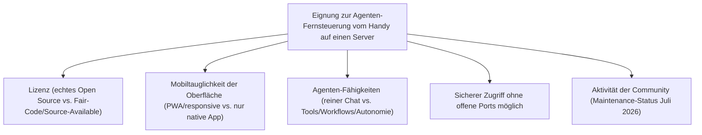
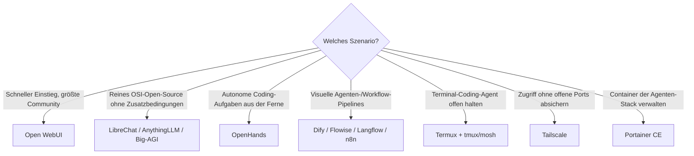

# Beste Open-Source-Apps zur Fernsteuerung von KI-Agenten auf einem Self-Hosting-Server per Android (Top 20)

Die [Fernsteuerungs-Topliste für Self-Hosting-Server](../../entwicklung/infrastruktur/android-server-fernsteuerung-opensource-topliste.md) deckt generische Server-Administration ab (SSH, VNC, Docker-Dashboards). Diese Seite geht einen Schritt weiter und konzentriert sich speziell auf **KI-Agenten, die dauerhaft auf einem eigenen Server laufen** — Chat-/Workflow-/Coding-Agenten, die vom Android-Handy aus als reine Fernbedienung angesprochen werden. Der Agent selbst rechnet auf dem Server (per Ollama, vLLM oder API-Anbindung), das Handy dient nur als Client — kein Modell läuft auf dem Telefon.

!!! note "Hinweis: Abgrenzung zu Nachbar-Toplisten"
    - [Beste Mobile KI-Chat-Apps mit Live-Sprach- & Video-Modus](../coding/mobile-ki-chat-live-topliste.md) — dort läuft das Modell beim jeweiligen Cloud-Anbieter (Google, OpenAI …), nicht auf dem eigenen Server
    - [Beste Self-Hosting-KI-Agenten (Allgemein, Top 20)](../coding/selbsthosting-ki-agenten-topliste.md) — bewertet die Agenten-Frameworks selbst, unabhängig vom mobilen Zugriffsweg
    - [Fernsteuerung von Self-Hosting-Servern per Android (Top 20)](../../entwicklung/infrastruktur/android-server-fernsteuerung-opensource-topliste.md) — generische Server-Tools ohne KI-Agenten-Bezug
    - **Diese Seite** — konkrete Apps/Oberflächen, mit denen ein auf dem Server laufender KI-Agent vom Android-Handy aus bedient wird

---

## Bewertungskriterien

!!! warning "Achtung: „Open Source" ist bei mehreren Agenten-Plattformen nur die halbe Wahrheit"
    Mehrere der prominentesten Projekte (Open WebUI, n8n, Dify, LobeChat) haben ihre Lizenz zwischen 2024 und 2026 von einer reinen OSI-Lizenz auf ein **Source-Available-/Fair-Code-Modell** mit Zusatzbedingungen (Branding-Pflicht, Einschränkung bei kommerziellem SaaS-Betrieb) umgestellt. Der Quellcode bleibt einsehbar und selbst hostbar, ist aber je nach Definition kein reines Open Source mehr — das jeweilige `LICENSE`-Dokument vor produktivem/kommerziellem Einsatz prüfen. **Stand: Juli 2026.**

---

## Top 20 im Überblick

| Rang | Software | Kategorie | Lizenz | Mobiler Zugriff | Besondere Stärke | Schwäche |
|---|---|---|---|---|---|---|
| 1 | **Open WebUI** | Chat-/Agenten-Oberfläche | Open WebUI License (BSD-3-Basis + Branding-Pflicht, seit v0.6.6) | PWA, „wie eine App" installierbar | Größte Community, riesiges Plugin-/Tool-Ökosystem, direkte Ollama-/OpenAI-API-Anbindung | Lizenzänderung 2025 sorgte für Fork-Debatten, kein reines OSI-Open-Source mehr |
| 2 | **LibreChat** | Multi-Provider-Chat-/Agenten-UI | MIT | PWA/responsive Web-UI | Agents-Endpoint mit Tools/Code-Interpreter, sehr aktive Entwicklung | Volle Agenten-Tiefe erfordert etwas Konfigurationsaufwand |
| 3 | **AnythingLLM** | RAG-/Agenten-Plattform (Docker-Server-Modus) | MIT | Responsive Web-UI | RAG + Agent-Flows aus einer Docker-Installation, einfache Ersteinrichtung | Agenten-Fähigkeiten (Flows) weniger mächtig als dedizierte Workflow-Tools |
| 4 | **Dify** | Visuelle Agenten-/Workflow-Plattform | Apache-2.0 + Zusatzbedingungen (Dify Open Source License) | Responsive Web-UI | Sehr ausgereifte visuelle Agenten-/RAG-Pipeline-Erstellung, produktionsreif | Logo-/Branding-Pflicht, kommerzieller Multi-Tenant-SaaS-Betrieb erfordert Lizenz |
| 5 | **Flowise (Community Edition)** | Low-Code-Agenten-Builder | Apache-2.0 (CE) | Responsive Web-UI | Reines Apache-2.0 für die CE, LangChain.js-Basis, sehr flexibel erweiterbar | Enterprise-Funktionen (SSO, RBAC) nur unter separater Lizenz |
| 6 | **n8n** | Automatisierungs-/Agenten-Workflows | Sustainable Use License (Fair-Code) | Responsive Web-UI | Riesiges Node-Ökosystem, KI-Agenten-Nodes direkt einsetzbar, sehr mächtig für Trigger/Workflows | Kein OSI-Open-Source, Weiterverkauf als eigenes SaaS-Angebot untersagt |
| 7 | **OpenHands** (ehem. OpenDevin) | Autonomer Coding-Agent | MIT | Responsive Web-UI | Vollautonome Coding-Aufgaben anstoßen und den Fortschritt live vom Handy verfolgen | Rechenintensiv, für komplexe Aufgaben leistungsfähiger Server nötig |
| 8 | **LobeChat** | Multi-Provider-Chat-Framework | LobeHub Community License (Apache-2.0-Basis + Zusatzbedingungen) | PWA, sehr mobil-optimiertes Design | Eines der optisch ausgereiftesten Self-Hosting-Chat-Frontends, Plugin-System | Kommerzielle abgeleitete Produkte benötigen separate Lizenz |
| 9 | **Big-AGI** (Open, self-hosted) | Multi-Modell-Chat/Agenten-Suite | MIT | Responsive Web-UI | „Beam"-Multi-Modell-Vergleich, viele AGI-Funktionen (Personas, Voice) in einer App | Konfiguration der vielen Funktionen anfangs unübersichtlich |
| 10 | **Langflow** | Visueller Agenten-/RAG-Flow-Builder | MIT | Responsive Web-UI | Reines MIT, visuelles Drag-&-Drop-Bauen kompletter Agenten-Pipelines | Für sehr komplexe Flows kann die Web-UI auf kleinem Bildschirm eng werden |
| 11 | **SillyTavern** | Agenten-/Charakter-Frontend | AGPL-3.0 | Responsive Web-UI | Extrem aktive Community, riesige Erweiterungsvielfalt, seit Jahren mobil genutzt | Oberfläche historisch auf Rollenspiel/Charaktere ausgelegt, nicht auf klassische Produktivität |
| 12 | **Khoj** | Persönlicher KI-Assistent („zweites Gehirn") | AGPL-3.0 | Web-UI + WhatsApp-Anbindung | Durchsucht eigene Notizen/Dokumente, per Chat oder WhatsApp erreichbar | Volle Funktionstiefe (Suche über eigene Daten) erfordert vorherige Indexierung |
| 13 | **Node-RED** | Flow-Automatisierung inkl. LLM-Nodes | Apache-2.0 | Responsive Web-Dashboard | Etabliertes, sehr stabiles Flow-Tool, LLM-/Agenten-Nodes per Community-Palette nachrüstbar | Agenten-Fokus schwächer ausgeprägt als bei n8n/Langflow |
| 14 | **Home Assistant + Companion App** | Automatisierungs-„Agent" (Assist-Pipeline) | Apache-2.0 | Native Android-App | Tiefste Integration für serverseitige Automatisierungen, native App statt Browser-Umweg | Fokus auf Smart-Home-/Automatisierungslogik, kein Allzweck-Chat-Agent |
| 15 | **Element** (Matrix-Client) | Sichere Chat-Brücke zum Agenten-Bot | Apache-2.0 | Native Android-App | Ende-zu-Ende-verschlüsselter, offener Chat-Standard, Agenten als Matrix-Bot anbindbar | Agenten-Anbindung erfordert eigene Bot-/Bridge-Konfiguration auf dem Server |
| 16 | **Termux + tmux/mosh** | Terminal-Sitzung offen halten | GPL-3.0 | Native App | CLI-Agenten (Claude Code, Aider, Goose) im `tmux` laufen lassen und von unterwegs jederzeit wieder andocken | Reine Terminal-Bedienung, kein grafisches Dashboard |
| 17 | **ntfy** | Push-Benachrichtigung bei Agenten-Ergebnis | Apache-2.0 | Native App | Meldet sofort, wenn ein lang laufender Server-Agenten-Task fertig ist, per einfachem HTTP-Aufruf | Kein Fernzugriff auf den Agenten selbst, nur Benachrichtigungskanal |
| 18 | **Tailscale** (Android-Client) | VPN-Mesh für sicheren Zugriff | BSD-3-Clause (Client) | Native App | Alle oben genannten Web-UIs ohne offene Ports erreichbar, sehr einfaches Setup | Koordinationsserver standardmäßig cloudbasiert (Alternative: Headscale) |
| 19 | **Chatbot UI** (mckaywrigley) | Schlanke ChatGPT-artige Oberfläche | MIT | Responsive Web-UI | Sehr leichtgewichtig, schnell selbst gehostet, klarer Code als Ausgangsbasis für eigene Anpassungen | Weniger Agenten-/Tool-Funktionen als Open WebUI oder LibreChat |
| 20 | **Portainer CE** | Docker-Verwaltung der Agenten-Container | Zlib | Responsive Web-UI | Agenten-Container (Ollama, Open WebUI, n8n & Co.) vom Handy aus neu starten, Logs prüfen, aktualisieren | Kein Chat-/Agenten-Interface selbst, nur die Betriebsebene darunter |

!!! tip "Tipp: Rang ≠ einzige Entscheidungsgröße"
    Für den **schnellsten Einstieg mit größter Community** ist Open WebUI kaum zu schlagen, sofern die Lizenzbedingungen (Branding, kein White-Label-Weiterverkauf) kein Problem darstellen. Wer **reines OSI-Open-Source ohne Zusatzbedingungen** will, ist mit LibreChat, AnythingLLM, Big-AGI oder Langflow besser bedient. Für **autonome, mehrstufige Aufgaben** statt reinem Chat sind OpenHands, Dify und n8n die mächtigsten Werkzeuge.

---

## Empfehlung nach Einsatzszenario

!!! warning "Achtung: Autonome Agenten brauchen zusätzliche Absicherung"
    Ein Coding- oder Automatisierungs-Agent (OpenHands, n8n, Dify-Workflows), der vom Handy aus Aufgaben erhält und autonom auf dem Server ausführt, sollte grundsätzlich in einer isolierten Umgebung (eigener Docker-Container/eigener Nutzer, begrenzte Berechtigungen) laufen — ein Fehlgriff des Agenten darf nicht den ganzen Server gefährden können.

---

## Verwandte Themen

- [Startseite](../../index.md) — zurück zur Dokumentations-Zentrale
- [Fernsteuerung von Self-Hosting-Servern per Android (Top 20)](../../entwicklung/infrastruktur/android-server-fernsteuerung-opensource-topliste.md) — generische Server-Fernsteuerungs-Tools als technisches Fundament dieser Seite
- [Beste KI-Agent-Fernsteuerung auf einem lokalen Rechner per Android (Top 20)](android-ki-agent-fernsteuerung-lokal-topliste.md) — dasselbe Konzept, wenn der Agent auf dem eigenen PC statt einem Server läuft
- [Android-KI-Agent-Fernsteuerung für Server selbst programmieren (Kotlin & KI-Agent-SDK)](android-ki-agent-fernsteuerung-server-sdk-kotlin.md) — eigene App statt fertiger Tools aus dieser Liste
- [Beste Self-Hosting-KI-Agenten (Allgemein, Top 20)](../coding/selbsthosting-ki-agenten-topliste.md) — Bewertung der Agenten-Frameworks selbst
- [Beste Mobile KI-Chat-Apps mit Live-Sprach- & Video-Modus (Android, Top 20)](../coding/mobile-ki-chat-live-topliste.md) — Gegenstück mit Cloud-gehosteten Modellen statt Self-Hosting
- [Lokales RAG & LLM-Serving](../coding/lokales-rag-ollama.md) — Grundlagen zum Betrieb der Modelle hinter diesen Oberflächen
