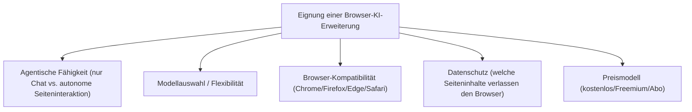
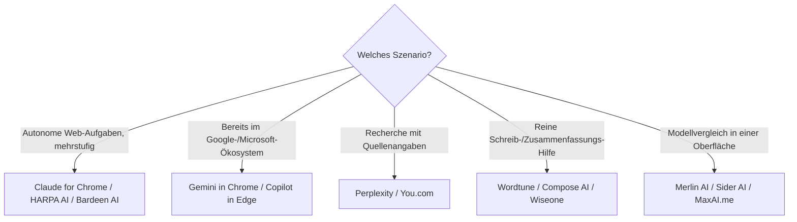

# Beste Browser-Erweiterungen mit KI-Agent — Top-20-Topliste

Als dritte Ebene neben Desktop-Steuerungs-Software ([Top 20](desktop-steuerungs-software-ki-topliste.md)) und Computer-Use-Agenten ([Top 20](lokale-ki-agenten-topliste.md)) gibt es **Browser-Erweiterungen mit KI-Agent** — Add-ons für Chrome, Firefox, Edge oder Safari, die von einfachen Chat-Sidebars bis zu autonomen Web-Aufgaben-Agenten reichen, die Formulare ausfüllen, Seiten zusammenfassen oder mehrstufige Web-Recherchen selbstständig durchführen.

!!! note "Hinweis: Chat-Sidebar ≠ autonomer Web-Agent"
    Ein Teil dieser Liste sind reine Chat-Erweiterungen mit Zugriff auf den aktuellen Tab-Inhalt (Merlin, Sider, Monica); ein anderer Teil sind Erweiterungen mit echtem **agentischem** Verhalten — sie klicken, tippen und navigieren selbstständig über mehrere Seiten hinweg (HARPA AI, Bardeen AI, Claude for Chrome). Diese Unterscheidung ist eines der wichtigsten Auswahlkriterien.

---

## Bewertungskriterien

!!! warning "Achtung: Weitreichende Berechtigungen genau prüfen"
    Browser-Erweiterungen mit KI-Agent benötigen oft Zugriff auf **alle** besuchten Webseiten, um Inhalte lesen und Aktionen ausführen zu können. Vor der Installation immer die angeforderten Berechtigungen prüfen — besonders bei Erweiterungen, die auch auf Banking- oder Firmenseiten aktiv bleiben sollen. **Stand: Juli 2026.**

---

## Top 20 im Überblick

| Rang | Erweiterung | Anbieter | Browser | Einschätzung | Besondere Stärke | Schwäche |
|---|---|---|---|---|---|---|
| 1 | **Claude for Chrome** | Anthropic | Chrome | Sehr stark | Echtes agentisches Verhalten (Formulare, Mehrschritt-Navigation), starke Basis aus der [Sprachmodell-Topliste](../coding/llm-rust-topliste.md) | Aktuell nur für Chrome verfügbar |
| 2 | **Google Gemini in Chrome** | Google | Chrome | Sehr stark | Nativ integriert, kein separater Installationsschritt, gute Seiten-Zusammenfassung | Enger an das Google-Ökosystem gebunden |
| 3 | **Microsoft Copilot in Edge** | Microsoft | Edge | Sehr stark | Tief in Edge integriert, gute Tab-übergreifende Kontextnutzung | Volle Funktionstiefe primär in Edge, nicht als eigenständige Erweiterung für andere Browser |
| 4 | **HARPA AI** | HARPA | Chrome/Edge | Stark | Eine der ausgereiftesten Erweiterungen für autonome, mehrstufige Web-Aufgaben | Konfiguration für komplexe Automatisierungen aufwendiger als reine Chat-Erweiterungen |
| 5 | **Bardeen AI** | Bardeen | Chrome | Stark | Guter Fokus auf wiederkehrende Workflow-Automatisierung über mehrere Webdienste hinweg | Für spontane Einzelaufgaben weniger geeignet als für wiederkehrende Workflows |
| 6 | **ChatGPT (offizielle Erweiterung)** | OpenAI | Chrome | Stark | Direkter Zugriff auf GPT-5.6-Modelle mit Seitenkontext | Agentische Web-Interaktion schmaler als bei HARPA/Bardeen |
| 7 | **Perplexity (Browser-Erweiterung)** | Perplexity | Chrome/Firefox/Edge | Solide bis stark | Gute Web-Recherche mit Quellenangaben direkt im Tab | Fokus stärker auf Recherche als auf Aktionsausführung |
| 8 | **Merlin AI** | Merlin | Chrome | Solide bis stark | Breite Modellauswahl in einer Oberfläche, praktisch für Modellvergleiche | Primär Chat-Sidebar, keine tiefe Automatisierung |
| 9 | **Sider AI** | Sider | Chrome/Edge | Solide bis stark | Sehr verbreitete Sidebar mit mehreren wählbaren Modellen | Ähnlich wie Merlin eher Chat- als Aktions-fokussiert |
| 10 | **Monica AI** | Monica | Chrome | Solide | Guter Allrounder für Zusammenfassungen, Übersetzung und Schreibhilfe | Weniger auf autonome Mehrschritt-Aufgaben ausgelegt |
| 11 | **MaxAI.me** | MaxAI | Chrome/Edge | Solide | Breite Modellauswahl inkl. Schreib-/Recherche-Vorlagen | Kein eigenständiger Web-Aktions-Agent wie HARPA |
| 12 | **You.com (Browser-Erweiterung)** | You.com | Chrome/Firefox | Solide | Kombiniert Websuche und Chat mit mehreren wählbaren Modellen | Allgemeiner Fokus, wenig spezialisiertes Workflow-Tooling |
| 13 | **Wiseone** | Wiseone | Chrome | Solide | Guter Fokus auf verständliches Zusammenfassen komplexer Fachartikel | Kein Aktions-/Automatisierungs-Fokus |
| 14 | **Compose AI** | Compose AI | Chrome | Ausreichend bis solide | Schnelle KI-Autovervollständigung beim Schreiben in beliebigen Webformularen | Kein eigenständiger Chat- oder Agenten-Modus |
| 15 | **Fyxer AI** | Fyxer | Chrome | Ausreichend bis solide | Guter Fokus auf E-Mail-Zusammenfassung und -Entwürfe im Browser | Eng auf E-Mail-Anwendungsfälle begrenzt |
| 16 | **WebChatGPT** | Community | Chrome/Firefox | Ausreichend bis solide | Fügt ChatGPT Websuch-Ergebnisse als zusätzlichen Kontext hinzu | Kein eigenständiges Modell, reine ChatGPT-Erweiterung |
| 17 | **Superpower ChatGPT** | Community | Chrome | Ausreichend | Praktische Zusatzfunktionen (Ordner, Prompt-Bibliothek) für bestehende ChatGPT-Nutzung | Setzt vollständig auf ChatGPT als Backend |
| 18 | **AIPRM** | AIPRM | Chrome | Ausreichend | Große Community-Prompt-Bibliothek direkt in ChatGPT nutzbar | Eher Prompt-Verwaltung als eigenständiger Agent |
| 19 | **TinaMind** | TinaMind | Chrome | Ausreichend | Leichtgewichtiger Gemini-basierter Seiten-Assistent | Kleinerer Funktionsumfang als etablierte Top 10 |
| 20 | **Wordtune** | AI21 Labs | Chrome/Edge | Grundlegend | Guter Fokus auf Umformulierung/Tonalität beim Schreiben | Kein Chat- oder Recherche-Agent, reines Schreibwerkzeug |

!!! tip "Tipp: Rang ≠ einzige Entscheidungsgröße"
    Für **autonome Web-Aufgaben** (Formulare ausfüllen, mehrstufige Recherche) sind HARPA AI und Bardeen AI aktuell die zuverlässigsten Erweiterungen. Für **reine Chat-/Zusammenfassungs-Unterstützung** genügt oft eine der leichtgewichtigeren Sidebar-Erweiterungen aus Rang 8–13, ohne die Berechtigungstiefe der Top 5 zu benötigen.

---

## Empfehlung nach Einsatzszenario

---

## 🔗 Verwandte Themen

- [Startseite](../../index.md) — zurück zur Dokumentations-Zentrale
- [Beste lokale Computer-KI-Agenten (Allgemein, Top 20)](lokale-ki-agenten-topliste.md) — Agenten mit vollem Bildschirmzugriff statt nur Browser-Tab
- [Beste Desktop-Steuerungs-Software mit KI (Top 20)](desktop-steuerungs-software-ki-topliste.md) — fertige RPA-/OS-native Software
- [Beste Desktop-Software mit vollständiger KI-Agent-Steuerung (Top 20)](desktop-agent-vollsteuerung-topliste.md) — Bewertung nach konkreten Funktionen (Maus, Tastatur, Fenster, Aufzeichnung)
- [Custom Chat-Assistenten im Anbieter-Vergleich](../coding/custom-chat-assistenten-anbieter-vergleich.md)
- [Beste Aggregatoren & Multi-Modell-Provider für Rust-Programmierung (Abo-Abrechnung, Top 20)](../coding/llm-aggregatoren-abo-rust-topliste.md) — einige der hier gelisteten Erweiterungen als Abo-Aggregatoren im Detail
- [Playwright & KI Web-Scraping](playwright-ki-extraction.md) — programmatische Alternative zu Browser-Erweiterungen
