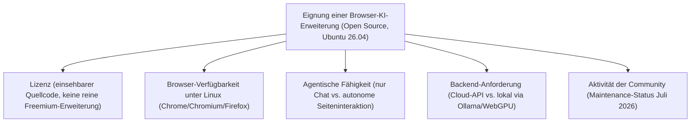
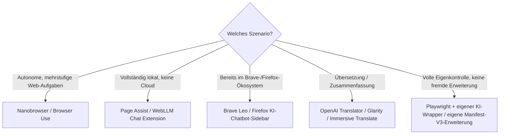

# Beste Browser-Erweiterungen mit KI-Agent — Top-20-Topliste (Open Source, Ubuntu 26.04)

Die [Browser-Erweiterungen-Topliste](browser-erweiterungen-ki-agent-topliste.md) bewertet den Markt breit — inklusive proprietärer Anbieter wie Claude for Chrome, Gemini in Chrome oder HARPA AI. Diese Seite filtert dieselbe Kategorie auf **quelloffene** Erweiterungen und Projekte, die unter **Ubuntu 26.04** tatsächlich einsetzbar sind.

!!! note "Hinweis: Ubuntu-Kompatibilität bedeutet hier etwas anderes als bei Desktop-Software"
    Browser-Erweiterungen laufen innerhalb der Browser-Sandbox — Wayland- vs. X11-Fragen wie bei der [Ubuntu-Desktop-Software-Topliste](desktop-software-opensource-ubuntu-topliste.md) spielen keine Rolle. Entscheidend ist stattdessen: (1) Läuft der Trägerbrowser (Chrome/Chromium, Firefox) überhaupt unter Ubuntu — Safari-exklusive Erweiterungen fallen damit automatisch heraus — und (2) benötigt die Erweiterung einen Native-Messaging-Host oder eine Begleit-App, die unter Linux nicht verfügbar ist.

---

## Bewertungskriterien

!!! warning "Achtung: Manche Projekte sind nur teilweise offen"
    Bei einigen Einträgen (z. B. Immersive Translate) ist nur ein Teil des Codes quelloffen, während Übersetzungs-/KI-Backends proprietär bleiben. „Open Source" bezieht sich hier auf die **Browser-Erweiterung selbst** — nicht zwingend auf jedes angebundene Modell-Backend. **Stand: Juli 2026.**

---

## Top 20 im Überblick

| Rang | Erweiterung/Projekt | Lizenz | Browser (Linux) | Einschätzung | Besondere Stärke | Schwäche |
|---|---|---|---|---|---|---|
| 1 | **Nanobrowser** | Apache-2.0 | Chrome/Chromium | Sehr stark | Quelloffene Multi-Agenten-Alternative zu proprietären Operator-Agenten, echte autonome Seiteninteraktion | Kleinere Community als etablierte proprietäre Konkurrenz |
| 2 | **Browser Use (Erweiterung/Bibliothek)** | MIT | Chrome/Chromium | Sehr stark | Sehr aktives Open-Source-Projekt, sowohl als Erweiterung als auch als Python-Bibliothek nutzbar | Erweiterungs-Variante weniger ausgereift als die Bibliothek |
| 3 | **Brave Leo** | MPL-2.0 (Brave-Basis) | Brave (Chromium-Basis) | Stark | Nativ in den quelloffenen Brave-Browser integriert, lokale und Cloud-Modelle wählbar, guter Datenschutzfokus | An den Brave-Browser gebunden statt als separate Erweiterung für andere Browser |
| 4 | **Firefox KI-Chatbot-Sidebar** | MPL-2.0 | Firefox | Stark | Nativ in den quelloffenen Firefox integriert, mehrere Chat-Anbieter wählbar | Experimenteller Status, Funktionsumfang schmaler als dedizierte Erweiterungen |
| 5 | **Page Assist** | MIT | Chrome/Chromium/Firefox | Stark | Web-UI direkt im Browser für vollständig lokale LLMs (Ollama u. a.), keine Cloud nötig | Erfordert einen bereits laufenden lokalen Modell-Server |
| 6 | **WebLLM Chat Extension** | Apache-2.0 | Chrome/Chromium | Stark | LLM-Inferenz läuft vollständig im Browser selbst via WebGPU, keine externe API oder Server nötig | Modellauswahl durch Browser-Speicher/GPU-Leistung begrenzt |
| 7 | **OpenAI Translator** | MIT | Chrome/Chromium/Firefox/Edge | Solide bis stark | Sehr verbreitetes Open-Source-Projekt, eigener API-Key nutzbar, aktive Community | Fokus primär auf Übersetzung/Textbearbeitung, kein voller Web-Agent |
| 8 | **Glarity** | MIT | Chrome/Chromium/Firefox | Solide bis stark | Gute Zusammenfassung von YouTube/Google/Artikeln, mehrere Modell-Backends wählbar | Kein eigenständiger autonomer Aktions-Agent |
| 9 | **WebChatGPT** | MIT | Chrome/Chromium/Firefox | Solide | Ergänzt ChatGPT um aktuelle Websuch-Ergebnisse als Kontext, quelloffen und einfach nachvollziehbar | Setzt vollständig auf ChatGPT als Backend |
| 10 | **ChatGPT for Google** | MIT | Chrome/Chromium/Firefox | Solide | Zeigt KI-Antworten direkt neben klassischen Suchergebnissen, langjährig gepflegtes Community-Projekt | Reine Such-Ergänzung, keine agentische Seiteninteraktion |
| 11 | **Superpower ChatGPT** | MIT | Chrome/Chromium | Solide | Praktische Zusatzfunktionen (Ordner, Prompt-Bibliothek) für bestehende ChatGPT-Nutzung, offener Code | Setzt vollständig auf ChatGPT als Backend |
| 12 | **ShareGPT** | MIT | Chrome/Chromium/Firefox | Ausreichend bis solide | Einfaches, quelloffenes Teilen/Exportieren von Chat-Verläufen | Kein eigener Chat- oder Agenten-Modus |
| 13 | **Immersive Translate** | Teilweise Open Source | Chrome/Chromium/Firefox/Edge | Ausreichend bis solide | Sehr verbreitete Übersetzungs-/Zusammenfassungs-Erweiterung mit großer Nutzerbasis | Nicht der gesamte Code offen, KI-Backend teils proprietär |
| 14 | **TaxyAI** | MIT (archiviert) | Chrome/Chromium | Ausreichend | Historisch bedeutendes Open-Source-Projekt für Vision-basierte, autonome Formularausfüllung | Entwicklung eingestellt, keine aktive Wartung mehr |
| 15 | **AutoTab** | MIT (archiviert) | Chrome/Chromium | Ausreichend | Früher offener Prototyp für GPT-4-gestützte Web-Automatisierung, gut dokumentiert als Lernressource | Entwicklung eingestellt, nicht für Produktivbetrieb geeignet |
| 16 | **GPT-4V-Act** | MIT (Forschungsprototyp) | Chrome/Chromium | Ausreichend | Frühes Konzept für Vision-Modell-gesteuerte Browsersteuerung per Screenshot-Overlay | Reiner Forschungsprototyp, keine produktionsreife Erweiterung |
| 17 | **Perplexica (Browser-Bookmarklet-Nutzung)** | MIT | Chrome/Chromium/Firefox | Ausreichend | Selbst gehostete, quelloffene Alternative zu Perplexity, per Bookmarklet direkt aus dem Browser aufrufbar | Keine echte Erweiterung, sondern Weiterleitung an eine selbst gehostete Web-App |
| 18 | **SearXNG + KI-Zusammenfassung (Community)** | AGPL-3.0 | Chrome/Chromium/Firefox | Ausreichend | Vollständig selbst hostbare Meta-Suche mit optionaler KI-Zusammenfassungs-Erweiterung, maximale Datenkontrolle | Setup von Suchmaschine und Erweiterung getrennt und aufwendiger als fertige Produkte |
| 19 | **Playwright + eigener KI-Wrapper (Eigenbau)** | Apache-2.0 | Chrome/Chromium/Firefox | Ausreichend | Volle Kontrolle über Browsersteuerung und Modellanbindung, siehe [Playwright-Grundlagen](playwright-anleitung.md) & [KI-Web-Scraping](playwright-ki-extraction.md) | Keine echte Erweiterung, sondern extern gesteuerter Browser; komplette Eigenentwicklung der Agentenlogik nötig |
| 20 | **Eigene Manifest-V3-Erweiterung mit LLM-API-Anbindung (Eigenbau)** | — | Chrome/Chromium/Firefox | Grundlegend | Maximale Anpassbarkeit, keine Abhängigkeit von fremdem Erweiterungs-Code | Vollständige Eigenentwicklung von UI, Berechtigungen und Modellanbindung nötig |

!!! tip "Tipp: Rang ≠ einzige Entscheidungsgröße"
    Für **echte autonome Web-Aufgaben** sind Nanobrowser und Browser Use aktuell die reifsten quelloffenen Optionen. Für **vollständig lokale Verarbeitung ohne jede Cloud-Anbindung** sind Page Assist (mit Ollama) und WebLLM Chat Extension (Inferenz direkt im Browser) die konsequentesten Lösungen, da bei ihnen keinerlei Seiteninhalt den eigenen Rechner verlässt.

---

## Empfehlung nach Einsatzszenario

---

## 🔗 Verwandte Themen

- [Startseite](../../index.md) — zurück zur Dokumentations-Zentrale
- [Beste Browser-Erweiterungen mit KI-Agent (Top 20)](browser-erweiterungen-ki-agent-topliste.md) — breiterer Produktüberblick inklusive proprietärer Anbieter
- [Beste Desktop-Steuerungs-Software mit KI (Open Source, Ubuntu 26.04, Top 20)](desktop-software-opensource-ubuntu-topliste.md) — dasselbe Doppel-Filterprinzip für Desktop-Software
- [Beste Computer-Use-Agenten für Ubuntu 26.04 (Top 20)](computer-use-agenten-ubuntu-topliste.md) — Ubuntu-Filter für Vision-/Computer-Use-Agenten
- [Beste lokale Computer-KI-Agenten (Allgemein, Top 20)](lokale-ki-agenten-topliste.md) — Agenten mit vollem Bildschirmzugriff statt nur Browser-Tab
- [Playwright Grundlagen](playwright-anleitung.md) — vertiefende Praxis zu Rang 19
- [Playwright & KI Web-Scraping](playwright-ki-extraction.md) — vertiefende Praxis zu Rang 19
- [Beste Voice-Steuerung-KI-Agenten (Open Source, Ubuntu 26.04, Top 20)](voice-steuerung-opensource-ubuntu-topliste.md) — dasselbe Doppel-Filterprinzip für Sprachsteuerung statt Browser-Erweiterungen
- [Beste Screenshot-Analyse-KI-Agenten (Open Source, Ubuntu 26.04, Top 20)](screenshot-analyse-opensource-ubuntu-topliste.md) — dasselbe Doppel-Filterprinzip für den Bildverständnis-Baustein
