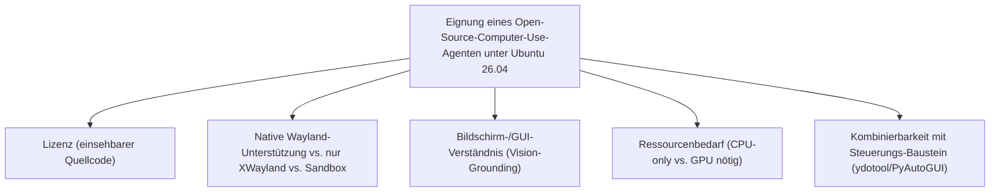
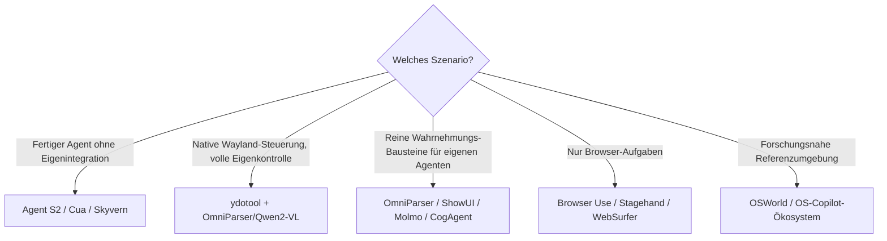

# Beste Computer-Use-Agenten für Ubuntu 26.04 — Top-20-Topliste (Open Source)

Die [Ubuntu-Topliste der Computer-Use-Agenten](computer-use-agenten-ubuntu-topliste.md) bewertet Vision-Agenten und Entwickler-Frameworks mit Ubuntu-Fokus — inklusive proprietärer Anbieter wie Claude Computer Use oder AskUI. Diese Seite filtert dieselbe Kategorie zusätzlich auf **quelloffene** Vision-Agenten, Frameworks und Modelle, die unter **Ubuntu 26.04** lauffähig sind.

!!! note "Hinweis: Abgrenzung zur Desktop-Software-Topliste (Open Source, Ubuntu 26.04)"
    Die [Desktop-Steuerungs-Software-Topliste (Open Source, Ubuntu 26.04)](desktop-software-opensource-ubuntu-topliste.md) bewertet breit — inklusive fertiger RPA-Tools (OpenRPA, TagUI, Robot Framework) und OS-nativer Erweiterungen. Diese Seite bleibt eng bei der ursprünglichen Definition der [Computer-Agenten-Topliste](lokale-ki-agenten-topliste.md): **Vision-Modelle und Entwickler-Frameworks**, die den Bildschirm per Vision-Grounding interpretieren, statt fertige Automatisierungs-Produkte.

---

## Bewertungskriterien

!!! warning "Achtung: Reine Vision-Modelle steuern noch nichts"
    Ein Teil dieser Liste (Qwen2-VL, ShowUI, Molmo, CogAgent, OmniParser) sind **Modelle/Bausteine**, die Bildschirminhalte interpretieren oder Klickkoordinaten liefern — die eigentliche Mausbewegung/Tastatureingabe muss mit einem separaten Baustein (`ydotool`, PyAutoGUI) verbunden werden. Nur die vollständigen Agenten-Projekte (Agent S2, Cua, Open Interpreter, Self-Operating Computer, AppAgent) bringen diese Verbindung bereits fertig mit. **Stand: Juli 2026.**

---

## Top 20 im Überblick

| Rang | Agent/Projekt | Lizenz | Deployment/Wayland-X11 | Einschätzung | Besondere Stärke | Schwäche |
|---|---|---|---|---|---|---|
| 1 | **Agent S2** | Apache-2.0 | Docker-/VM-Sandbox (OSWorld-Basis) | Sehr stark | Direkt gegen OSWorld-Ubuntu-VMs entwickelt und benchmarkt, exzellent dokumentierte Ubuntu-Kompatibilität | Setup der VM-Umgebung technisch anspruchsvoller als reine Desktop-Installation |
| 2 | **Cua (Computer-Use Agent)** | MIT | Docker-/KVM-Sandbox | Sehr stark | Sauberes VM-Sandboxing-Konzept, Session-Recording eingebaut, aktive Community | Dokumentation/Community stärker auf macOS ausgerichtet als auf Linux |
| 3 | **OSWorld / OS-Copilot-Ökosystem** | MIT/Apache-2.0 | VM-Sandbox (nativ Ubuntu) | Sehr stark | Die Referenz-Testumgebung selbst läuft auf Ubuntu, große Sammlung offener Agenten-Implementierungen | Primär Forschungs-/Benchmark-Ökosystem, weniger „fertiges Produkt" |
| 4 | **UI-TARS** | Apache-2.0 | X11/XWayland (Python/PyTorch) | Sehr stark | Offenes, speziell auf GUI-Grounding trainiertes Modell, vollständig lokal ausführbar | Native Wayland-Steuerung nicht eingebaut, läuft über X11-Kompatibilität |
| 5 | **OmniParser** | MIT | Modell/Backend (GPU/CPU-Inferenz) | Stark | Zerlegt beliebige Screenshots in klickbare UI-Elemente, macht jedes Vision-LLM zum Computer-Use-Agenten | Kein eigenständiger Agent, reiner Wahrnehmungs-Baustein |
| 6 | **Qwen2-VL** | Apache-2.0/Tongyi Qianwen | Modell/Backend (Ollama/vLLM, GPU) | Stark | Sehr starkes offenes GUI-/Dokumentverständnis, einfach selbst hostbar unter Ubuntu | Für flüssige Antwortzeiten GPU mit ausreichend VRAM empfohlen |
| 7 | **CogAgent** | Apache-2.0 | Modell/Backend (GPU-Inferenz) | Stark | Speziell auf GUI-Agenten-Aufgaben trainiertes Vision-Language-Modell | Höherer VRAM-Bedarf als kompaktere Modelle |
| 8 | **Skyvern** | AGPL-3.0 | Docker-nativ | Stark | Als Docker-Compose-Stack konzipiert, auf einem Ubuntu-Server besonders unkompliziert selbst hostbar | AGPL-Lizenz bei kommerziellem Einsatz beachten |
| 9 | **ydotool + KI-Wrapper (Eigenbau)** | GPL-3.0 | Nativ Wayland (uinput) | Stark | Einzige Lösung mit echter nativer Wayland-Unterstützung ohne XWayland-Umweg, siehe [Grundlagen](ydotool-anleitung.md) & [Wayland-Praxis](ydotool-wayland-praxis.md) | KI-Bildverständnis muss komplett selbst integriert werden |
| 10 | **Open Interpreter** | AGPL-3.0 | X11/XWayland (Python-Backend) | Stark | Sehr verbreitetes Python-Tool, `pip install`-Installation, aktive Ubuntu-Nutzerbasis | Volle GUI-Steuerung unter reinem Wayland eingeschränkter als unter X11 |
| 11 | **ShowUI** | Apache-2.0 | Modell/Backend (GPU-Inferenz) | Solide bis stark | Kompaktes, speziell auf GUI-Grounding spezialisiertes Vision-Language-Modell | Jüngeres Projekt, kleinere Community als UI-TARS |
| 12 | **Molmo** | Apache-2.0 | Modell/Backend (GPU-Inferenz) | Solide bis stark | Sehr gutes offenes Grounding (Pointing) auch bei kleinen UI-Elementen | Primäres Forschungsmodell, weniger fertige Agenten-Tooling drumherum |
| 13 | **AppAgent** | MIT | X11/XWayland (Python-Framework) | Solide bis stark | Offenes Framework für autonome App-/GUI-Exploration, gut erweiterbar | Ursprünglich auf Smartphone-Apps ausgelegt, Desktop-Anpassung selbst nötig |
| 14 | **Browser Use** | MIT | Playwright (browserintern) | Stark | Sehr aktives Projekt, `pip install`-Installation, unabhängig von Wayland/X11-Fragen | Kein Zugriff außerhalb des Browsers |
| 15 | **Stagehand** | MIT | Playwright (browserintern) | Stark | Zuverlässig unter Ubuntu, unabhängig vom Display-Server, gute Entwickler-Ergonomie | Auf Browser-Aufgaben begrenzt |
| 16 | **LLaVA** | Apache-2.0 (je nach Backbone) | Modell/Backend (Ollama/`llama.cpp`) | Solide | Breite Ollama-Unterstützung, sehr aktive Community, einfacher Einstieg | Genauigkeit bei sehr kleinem UI-Text hinter spezialisierten GUI-Modellen |
| 17 | **Magentic-One** | MIT | X11/XWayland + Playwright-Anteile | Solide bis stark | Python-/AutoGen-Ökosystem sehr gut unter Ubuntu paketierbar (`pip`/`conda`) | Setup-Komplexität durch Multi-Agenten-Architektur höher |
| 18 | **WebSurfer (AutoGen-Ökosystem)** | MIT | Playwright (browserintern) | Solide | Guter Baustein für eigene Multi-Agenten-Kompositionen unter Linux | Für sich genommen kein vollständiger Desktop-Agent |
| 19 | **PyAutoGUI + KI-Wrapper (Eigenbau)** | BSD-3-Clause | Nur X11/XWayland | Ausreichend bis solide | Sehr einfacher Einstieg, riesige Community-Basis an Beispielen | Unter reinem Wayland funktional eingeschränkt |
| 20 | **Self-Operating Computer** | MIT | X11/XWayland (PyAutoGUI-Backend) | Ausreichend | Einfaches, gut lesbares Grundgerüst für eigene Experimente | Erbt dieselbe Wayland-Einschränkung wie PyAutoGUI |

!!! tip "Tipp: Rang ≠ einzige Entscheidungsgröße"
    Für **maximale Wayland-Nativität ohne Sandbox** bleibt `ydotool` die einzige wirklich native Steuerungs-Option — kombiniert mit OmniParser oder Qwen2-VL als Wahrnehmungs-Baustein entsteht daraus ein vollständig quelloffener, nativer Wayland-Agent. Für **volle, fertige Agenten-Erfahrung ohne Eigenintegration** sind Agent S2, Cua und Skyvern die konsequenteste Wahl, da Wahrnehmung und Steuerung dort bereits verbunden sind.

---

## Empfehlung nach Einsatzszenario

---

## 🔗 Verwandte Themen

- [Startseite](../../index.md) — zurück zur Dokumentations-Zentrale
- [Beste Computer-Use-Agenten für Ubuntu 26.04 (Top 20)](computer-use-agenten-ubuntu-topliste.md) — breiterer Ubuntu-Filter inklusive proprietärer Anbieter
- [Beste lokale Computer-KI-Agenten (Allgemein, Top 20)](lokale-ki-agenten-topliste.md) — plattformübergreifende Gesamtliste
- [Beste Desktop-Steuerungs-Software mit KI (Open Source, Ubuntu 26.04, Top 20)](desktop-software-opensource-ubuntu-topliste.md) — breiterer Open-Source-Filter inklusive RPA-/Launcher-Tools
- [Beste Desktop-Software mit vollständiger KI-Agent-Steuerung (Open Source, Ubuntu 26.04, Top 20)](desktop-agent-vollsteuerung-opensource-ubuntu-topliste.md)
- [Beste Screenshot-Analyse-KI-Agenten (Open Source, Ubuntu 26.04, Top 20)](screenshot-analyse-opensource-ubuntu-topliste.md) — der Wahrnehmungs-Baustein hinter Rang 5/6/7/11/12 im Detail
- [ydotool Grundlagen](ydotool-anleitung.md) — vertiefende Praxis zu Rang 9
- [ydotool: Wayland Automatisierung](ydotool-wayland-praxis.md) — vertiefende Praxis zu Rang 9
- [PyAutoGUI Grundlagen](pyautogui-anleitung.md) — vertiefende Praxis zu Rang 19
