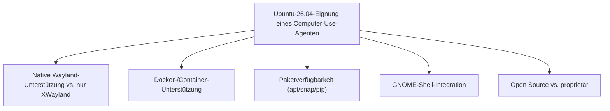
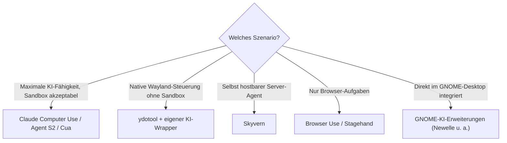

# Beste Computer-Use-Agenten für Ubuntu 26.04 — Top-20-Topliste

Die [allgemeine Computer-Agenten-Topliste](lokale-ki-agenten-topliste.md) bewertet Vision-Agenten plattformübergreifend. Diese Seite filtert gezielt auf **Ubuntu 26.04** (aktuelle LTS-Version, Standard-Desktop GNOME Shell auf Wayland) und ordnet ein, welche Computer-Use-Agenten dort tatsächlich zuverlässig laufen — inklusive der für Linux typischen Stolperfallen zwischen nativem Wayland und dem X11-Kompatibilitätslayer (XWayland).

!!! warning "Achtung: Wayland ist die zentrale Weiche unter Ubuntu"
    Seit GNOME Shell standardmäßig auf **Wayland** statt X11 läuft, funktionieren viele ältere Automatisierungswerkzeuge (die auf `xdotool`/X11-APIs aufbauen, z. B. klassisches PyAutoGUI) nur eingeschränkt oder ausschließlich über den XWayland-Kompatibilitätslayer für einzelne Anwendungen — nicht systemweit. Werkzeuge auf Basis von `ydotool` (kernelseitiges `uinput`) oder Docker-/VM-Sandboxing umgehen dieses Problem grundsätzlich. **Stand: Juli 2026, Ubuntu 26.04 LTS.**

---

## Bewertungskriterien

---

## Top 20 im Überblick

| Rang | Agent | Anbieter | Wayland/X11 | Einschätzung | Besondere Stärke | Schwäche |
|---|---|---|---|---|---|---|
| 1 | **Claude Computer Use** | Anthropic | Docker-Sandbox (Ubuntu-Basis-Image) | Sehr stark | Referenz-Container basiert selbst auf Ubuntu — läuft dadurch besonders reibungslos als Docker-Container auf einem Ubuntu-26.04-Host | Läuft in eigener Sandbox, keine direkte Steuerung der Host-Sitzung ohne Zusatzkonfiguration |
| 2 | **Agent S2** | Simular AI | Docker-/VM-Sandbox (OSWorld-Basis) | Sehr stark | Entwickelt/benchmarkt direkt gegen OSWorld-Ubuntu-VMs, exzellent dokumentierte Ubuntu-Kompatibilität | Setup der VM-Umgebung technisch anspruchsvoller als reine Desktop-Installation |
| 3 | **OSWorld / OS-Copilot-Ökosystem** | Forschungs-Community | VM-Sandbox (nativ Ubuntu) | Sehr stark | Die Referenz-Testumgebung selbst läuft auf Ubuntu — jeder dagegen entwickelte Agent ist de facto Ubuntu-erprobt | Primär Forschungs-/Benchmark-Ökosystem, weniger „fertiges Produkt" |
| 4 | **ydotool + KI-Wrapper (Eigenbau)** | Eigenbau, siehe [Grundlagen](ydotool-anleitung.md) & [Wayland-Praxis](ydotool-wayland-praxis.md) | Nativ Wayland (uinput) | Stark | Einzige Lösung in dieser Liste mit echter nativer Wayland-Unterstützung ohne XWayland-Umweg | KI-Bildverständnis muss komplett selbst integriert werden |
| 5 | **Cua (Computer-Use Agent)** | Cua-Projekt | Docker-/KVM-Sandbox | Stark | Unterstützt neben macOS auch Linux-VMs/-Container, gutes Sandboxing-Konzept | Dokumentation/Community stärker auf macOS ausgerichtet |
| 6 | **Open Interpreter** | Community | X11/XWayland (Python-Backend) | Stark | Sehr verbreitetes Python-Tool, `pip install`-Installation, aktive Ubuntu-Nutzerbasis | Volle GUI-Steuerung unter reinem Wayland eingeschränkter als unter X11-Sitzungen |
| 7 | **UI-TARS** | ByteDance | X11/XWayland (Python/PyTorch) | Stark | Offenes, lokal ausführbares Modell, gute Linux-Paketkompatibilität (PyTorch-Ökosystem) | Native Wayland-Steuerung nicht eingebaut, läuft über X11-Kompatibilität |
| 8 | **Skyvern** | Skyvern AI | Docker-nativ | Stark | Als Docker-Compose-Stack konzipiert — auf einem Ubuntu-Server besonders unkompliziert selbst hostbar | AGPL-Lizenz bei kommerziellem Einsatz beachten |
| 9 | **Browser Use** | Community | Playwright (browserintern, OS-unabhängig) | Stark | Steuert den Browser direkt über das Playwright-Protokoll, dadurch unabhängig von Wayland/X11-Fragen | Kein Zugriff außerhalb des Browsers |
| 10 | **Stagehand** | Browserbase | Playwright (browserintern) | Stark | Wie Browser Use unabhängig vom Display-Server, zuverlässig unter Ubuntu | Ebenfalls auf Browser-Aufgaben begrenzt |
| 11 | **Magentic-One** | Microsoft (AutoGen) | X11/XWayland + Playwright-Anteile | Solide bis stark | Python-/AutoGen-Ökosystem sehr gut unter Ubuntu paketierbar (`pip`/`conda`) | Setup-Komplexität durch Multi-Agenten-Architektur höher |
| 12 | **AskUI** | AskUI | X11/XWayland, dokumentierter Linux-Support | Solide bis stark | Offiziell dokumentierte Linux-Unterstützung für QA-/RPA-Workflows | Proprietäres Enterprise-Produkt, kein kostenloses Self-Hosting |
| 13 | **Robocorp / Sema4.ai** | Sema4.ai | X11/XWayland (Python-Basis) | Solide | Gute Linux-Paketierung über Python/Conda, Control-Room-Dashboard plattformunabhängig | GUI-Steuerungstiefe unter reinem Wayland geringer als unter X11 |
| 14 | **Robot Framework + RPA Framework** | Community, siehe [Grundlagen](robot-framework-anleitung.md) | X11/XWayland (Python-Basis) | Solide | Sehr gute Ubuntu-/`apt`-/`pip`-Integration, große bestehende Praxis-Basis | Native Wayland-GUI-Steuerung erfordert zusätzliche `ydotool`-Anbindung |
| 15 | **TagUI** | AI Singapore (Open Source) | X11/XWayland | Solide | Leichtgewichtige Installation, gute Linux-Unterstützung dokumentiert | Reine Kommandozeilen-/Skript-Bedienung ohne grafisches Dashboard |
| 16 | **OpenRPA** | OpenRPA (Open Source) | X11/XWayland (.NET Core/Mono) | Solide | Kostenlos, quelloffen, .NET-Core-Basis läuft nativ unter Ubuntu | Kleinere Community, .NET-Core-Setup unter Linux etwas fummeliger als reine Python-Tools |
| 17 | **GNOME-KI-Erweiterungen (z. B. Newelle)** | Community | Nativ GNOME Shell/Wayland | Solide | Direkt in Ubuntus Standard-Desktop integriert, keine Zusatzsoftware für die Basisbedienung nötig | Funktionsumfang uneinheitlich, abhängig von der jeweiligen Erweiterung |
| 18 | **PyAutoGUI + KI-Wrapper (Eigenbau)** | Eigenbau, siehe [Grundlagen](pyautogui-anleitung.md) | Nur X11/XWayland | Ausreichend bis solide | Sehr einfacher Einstieg, riesige Community-Basis an Beispielen | Unter reinem Wayland (Standard seit mehreren Ubuntu-LTS-Versionen) funktional eingeschränkt |
| 19 | **Self-Operating Computer** | OthersideAI (Open Source) | X11/XWayland (PyAutoGUI-Backend) | Ausreichend | Einfaches Grundgerüst für eigene Experimente | Erbt dieselbe Wayland-Einschränkung wie PyAutoGUI |
| 20 | **WebSurfer (AutoGen-Ökosystem)** | Microsoft (AutoGen) | Playwright (browserintern) | Ausreichend | Guter Baustein für eigene Multi-Agenten-Kompositionen unter Linux | Für sich genommen kein vollständiger Desktop-Agent |

!!! tip "Tipp: Rang ≠ einzige Entscheidungsgröße"
    Für **reine Wayland-Kompatibilität ohne Kompromisse** ist `ydotool` aktuell die einzig wirklich native Option unter Ubuntu 26.04 — allerdings ohne eingebautes KI-Bildverständnis. Für **volle KI-Fähigkeiten ohne Wayland-Bastelei** sind Docker-/Sandbox-basierte Agenten (Claude Computer Use, Agent S2, Cua, Skyvern) die zuverlässigste Wahl, da sie unabhängig vom Host-Display-Server in einer eigenen Umgebung laufen.

---

## Empfehlung nach Einsatzszenario

---

## 🔗 Verwandte Themen

- [Startseite](../../index.md) — zurück zur Dokumentations-Zentrale
- [Beste lokale Computer-KI-Agenten (Allgemein, Top 20)](lokale-ki-agenten-topliste.md) — plattformübergreifende Gesamtliste
- [Beste Desktop-Software mit vollständiger KI-Agent-Steuerung (Top 20)](desktop-agent-vollsteuerung-topliste.md)
- [ydotool Grundlagen](ydotool-anleitung.md) — native Low-Level-Steuerung unter Wayland
- [ydotool: Wayland Automatisierung](ydotool-wayland-praxis.md) — vertiefende Praxis zu Rang 4
- [PyAutoGUI Grundlagen](pyautogui-anleitung.md) — X11-basierte Alternative mit Wayland-Einschränkungen
- [Linux Praxis-Handbuch](../../entwicklung/system/linux-praxis.md) — Grundlagen zu Ubuntu/Linux-Administration
