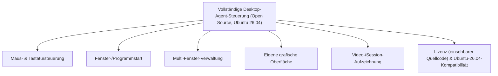
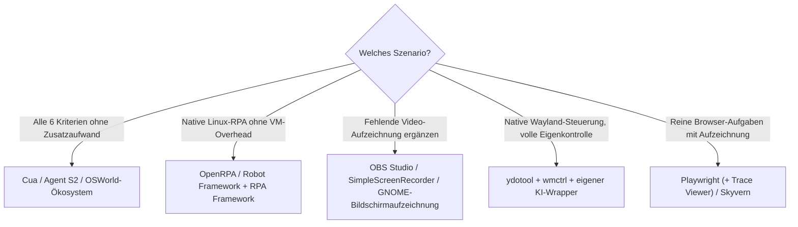

# Beste Desktop-Software mit vollständiger KI-Agent-Steuerung — Top-20-Topliste (Open Source, Ubuntu 26.04)

Die [Topliste der vollständigen KI-Agent-Steuerung](desktop-agent-vollsteuerung-topliste.md) bewertet Desktop-Software nach sechs konkreten Funktionen — **Maussteuerung, Tastatursteuerung, Fenster-/Programmstart, Multi-Fenster-Verwaltung, eigene grafische Oberfläche und Video-/Session-Aufzeichnung** — unabhängig von Lizenz oder Plattform. Diese Seite filtert dieselben sechs Kriterien auf **quelloffene** Software, die unter **Ubuntu 26.04** einsetzbar ist.

!!! note "Hinweis: Unter Linux ist Video-/Session-Aufzeichnung meist ein separater Baustein"
    Anders als bei geschlossenen Enterprise-RPA-Suiten (UiPath, Automation Anywhere), die alle sechs Kriterien „aus einer Hand" liefern, deckt im Open-Source-Ökosystem selten ein einzelnes Projekt alle sechs Funktionen gleichzeitig ab. Besonders die native Video-/Session-Aufzeichnung fehlt vielen schlanken Linux-Agenten-Stacks — sie muss oft mit einem eigenständigen Aufzeichnungswerkzeug (OBS Studio, SimpleScreenRecorder, GNOME-Bildschirmaufzeichnung) kombiniert werden. Diese Bausteine sind deshalb bewusst mit in die Liste aufgenommen. **Stand: Juli 2026.**

---

## Bewertungskriterien

!!! warning "Achtung: Sandbox-Lösungen decken die 6 Kriterien am vollständigsten ab"
    VM-/Docker-Sandbox-basierte Agenten (Cua, Agent S2, OSWorld) erfüllen alle sechs Kriterien am konsequentesten, da die gesamte Sitzung inklusive Aufzeichnung Teil des Sandbox-Konzepts ist. Native Linux-Tools (ydotool, PyAutoGUI, Robot Framework) sind bei Maus-/Tastatursteuerung ausgereift, benötigen für Dashboard und Aufzeichnung aber fast immer Zusatzwerkzeuge. **Stand: Juli 2026.**

---

## Top 20 im Überblick

| Rang | Software | Lizenz | Abdeckung der 6 Kernfunktionen | Einschätzung | Besondere Stärke | Schwäche |
|---|---|---|---|---|---|---|
| 1 | **Cua (Computer-Use Agent)** | MIT | Vollständig — VM-Sandbox mit Live-GUI-Viewer, volle Maus-/Tastatursteuerung und Multi-Fenster innerhalb der isolierten Umgebung, Session-Recording eingebaut | Sehr stark | Konsequentestes Sandbox-Konzept in dieser Liste, alle 6 Kriterien „ab Werk" abgedeckt | Linux-VM-Setup weniger ausführlich dokumentiert als der macOS-Pfad |
| 2 | **Agent S2** | Apache-2.0 | Vollständig — direkt gegen OSWorld-Ubuntu-VMs entwickelt, Steuerung und Aufzeichnung Teil des Benchmark-Harness | Sehr stark | Exzellent dokumentierte Ubuntu-Kompatibilität, quelloffene Referenzimplementierung | Setup der VM-Umgebung technisch anspruchsvoller als reine Desktop-Installation |
| 3 | **OSWorld / OS-Copilot-Ökosystem** | MIT/Apache-2.0 | Vollständig — native Ubuntu-VM als Referenzumgebung, Recording fester Bestandteil des Test-Harness | Stark | Die Referenz-Testumgebung selbst läuft auf Ubuntu, große Sammlung offener Agenten-Implementierungen | Primär Forschungs-/Benchmark-Ökosystem, kein „fertiges Produkt" |
| 4 | **OpenRPA** | AGPL-3.0 | Weitgehend vollständig — Designer als GUI, Recorder für Maus/Tastatur, Multi-Fenster-fähig, Ausführungsprotokolle statt echtem Video | Stark | Kostenlos, quelloffen, .NET-Core-Basis läuft nativ unter Ubuntu | Keine native Video-Aufzeichnung, nur textuelle/Screenshot-Protokolle |
| 5 | **Robot Framework + RPA Framework** | Apache-2.0 | Weitgehend vollständig — RPA.Python für Maus/Tastatur/Fenster, RIDE als GUI, Screenshots statt Video | Stark | Sehr gute `apt`-/`pip`-Integration, große Praxis-Basis, siehe [Grundlagen](robot-framework-anleitung.md) | Echte Video-Aufzeichnung erfordert Zusatzintegration (z. B. OBS Studio) |
| 6 | **UI-TARS** | Apache-2.0 | Teilweise — starke Maus-/Tastatursteuerung per Vision-Modell, kein Dashboard/Recording „ab Werk" | Solide bis stark | Offenes, lokal ausführbares Modell, gute Linux-/PyTorch-Paketkompatibilität | Kein fertiges Dashboard/GUI, Aufzeichnung muss selbst ergänzt werden |
| 7 | **Skyvern** | AGPL-3.0 | Teilweise — volle Steuerung und Web-Dashboard, aber primär auf browserbasierte Formulare statt allgemeine Desktop-Fenster ausgelegt | Solide bis stark | Docker-Compose-Stack, auf Ubuntu-Server besonders unkompliziert selbst hostbar | Fokus auf Web-Formulare statt allgemeiner Multi-Fenster-Desktop-Steuerung |
| 8 | **Self-Operating Computer** | MIT | Teilweise — Maus-/Tastatursteuerung und einfache GUI vorhanden, keine dedizierte Video-Aufzeichnung | Solide | Einfaches, gut lesbares Grundgerüst für eigene Experimente | Fenster-/Multi-Fenster-Verwaltung weniger ausgereift als bei RPA-Tools |
| 9 | **SikuliX** | MIT | Teilweise — bildbasierte Maus-/Tastatursteuerung, eigene IDE als GUI, keine native Video-Aufzeichnung | Solide | Sehr lange etabliert, große bestehende Skript-/Beispiel-Basis | Kein KI-gestütztes Verständnis, reines Bild-Matching statt Vision-Modell |
| 10 | **TagUI** | Apache-2.0 | Teilweise — Maus-/Tastatursteuerung und visueller Recorder vorhanden, kaum eigenständiges Dashboard | Solide | Leichtgewichtige Installation, gute Linux-Unterstützung dokumentiert | Reine Kommandozeilen-/Skript-Bedienung, keine grafische Oberfläche im eigentlichen Sinn |
| 11 | **ydotool + wmctrl + KI-Wrapper (Eigenbau)** | GPL-3.0 | Teilweise — native Wayland-Maus-/Tastatursteuerung via `ydotool`, Fensterverwaltung via `wmctrl`/Kompositor-IPC | Solide | Einzige Kombination mit echter nativer Wayland-Steuerung, siehe [Grundlagen](ydotool-anleitung.md) & [Wayland-Praxis](ydotool-wayland-praxis.md) | Kein GUI/Video-Baustein — muss komplett selbst ergänzt werden |
| 12 | **Playwright (+ eigener KI-Wrapper)** | Apache-2.0 | Teilweise — volle Steuerung inkl. Trace-Viewer-Aufzeichnung, aber nur Browser-„Fenster" statt echtem Desktop | Solide | Sehr ausgereifte, eingebaute Session-Aufzeichnung (Trace Viewer), siehe [Grundlagen](playwright-anleitung.md) | Kein echtes Desktop-Multi-Fenster, auf den Browser beschränkt |
| 13 | **OBS Studio (als Recording-Baustein)** | GPL-2.0 | Ergänzungs-Baustein — deckt gezielt die Video-/Session-Aufzeichnung ab, die vielen schlanken Linux-Agenten-Stacks fehlt | Solide | Sehr ausgereifte, quelloffene Bildschirmaufzeichnung, Standard-Kombination mit Rang 4/5/6 | Kein eigener Agent, reines Aufzeichnungswerkzeug zur Kombination mit anderen Einträgen |
| 14 | **SimpleScreenRecorder** | GPL-3.0 | Ergänzungs-Baustein — leichtgewichtige native Linux-Aufzeichnung als schlankere OBS-Alternative | Solide | Geringer Ressourcenbedarf, einfache Konfiguration | Wie OBS kein eigener Agent, nur Aufzeichnung |
| 15 | **GNOME-Shell-Bildschirmaufzeichnung (eingebaut)** | GPL-2.0 | Ergänzungs-Baustein — native, ohne Zusatzsoftware verfügbare Aufzeichnung unter Ubuntus Standard-Desktop | Solide | Direkt in Ubuntu integriert (`Strg+Shift+Alt+R`), keine Installation nötig | Keine Steuerungsfunktion, ausschließlich Aufzeichnung |
| 16 | **Browser Use** | MIT | Teilweise — gute Steuerung, kein Multi-Fenster-Desktop-Konzept | Ausreichend bis solide | Sehr aktives Open-Source-Projekt, unabhängig von Wayland/X11-Fragen | Auf Browser-Tab beschränkt, keine Fenster-/Programmverwaltung |
| 17 | **Open Interpreter** | AGPL-3.0 | Teilweise — Maus-/Tastatur-/Programmstart je nach Backend, kein eigenes Dashboard | Ausreichend bis solide | Sehr verbreitetes Python-Tool, natürlichsprachige Steuerung | Kein natives GUI-Dashboard oder Video-Recording |
| 18 | **Magentic-One** | MIT | Teilweise — Multi-Agenten-Rollen inkl. Datei-/Browser-Zugriff, kein einheitliches Desktop-GUI-Dashboard | Ausreichend | Python-/AutoGen-Ökosystem gut unter Ubuntu paketierbar | Setup-Komplexität durch Multi-Agenten-Architektur, kein zentrales Aufzeichnungs-Dashboard |
| 19 | **PyAutoGUI + eigener KI-Wrapper (Eigenbau)** | BSD-3-Clause | Teilweise — Maus-/Tastatursteuerung vorhanden, GUI und Aufzeichnung komplett Eigenbau | Ausreichend | Sehr einfacher Einstieg, riesige Community-Basis, siehe [Grundlagen](pyautogui-anleitung.md) | Nur X11/XWayland, unter reinem Wayland funktional eingeschränkt |
| 20 | **Robot Framework + OBS + ydotool (Eigenbau-Komplettstack)** | Apache-2.0/GPL (Kombination) | Baukasten zur vollständigen Eigenabdeckung aller 6 Kriterien | Ausreichend | Volle Kontrolle über jede der sechs Funktionen einzeln wählbar | Komplette Integrationsarbeit selbst zu leisten, kein fertiges Produkt |

!!! tip "Tipp: Rang ≠ einzige Entscheidungsgröße"
    Für **alle sechs Kriterien ohne Zusatzaufwand** sind Cua, Agent S2 und OSWorld die einzigen Einträge, die dank ihres Sandbox-Konzepts wirklich vollständig sind. Für **native Linux-Steuerung ohne VM-Overhead** liefern OpenRPA und Robot Framework die beste Abdeckung von fünf der sechs Kriterien — die fehlende Video-Aufzeichnung lässt sich unkompliziert mit OBS Studio oder der eingebauten GNOME-Bildschirmaufzeichnung ergänzen.

---

## Empfehlung nach Einsatzszenario

---

## 🔗 Verwandte Themen

- [Startseite](../../index.md) — zurück zur Dokumentations-Zentrale
- [Beste Desktop-Software mit vollständiger KI-Agent-Steuerung (Top 20)](desktop-agent-vollsteuerung-topliste.md) — breiterer Produktüberblick inklusive proprietärer Enterprise-RPA-Software
- [Beste Desktop-Steuerungs-Software mit KI (Open Source, Ubuntu 26.04, Top 20)](desktop-software-opensource-ubuntu-topliste.md) — dasselbe Doppel-Filterprinzip ohne Fokus auf die sechs Kernfunktionen
- [Beste Computer-Use-Agenten für Ubuntu 26.04 (Top 20)](computer-use-agenten-ubuntu-topliste.md) — Ubuntu-Filter für Vision-/Computer-Use-Agenten
- [Beste Browser-Erweiterungen mit KI-Agent (Open Source, Ubuntu 26.04, Top 20)](browser-erweiterungen-opensource-ubuntu-topliste.md)
- [Beste Voice-Steuerung-KI-Agenten für CLI-Automatisierung (Top 20)](voice-steuerung-cli-automatisierung-topliste.md)
- [ydotool Grundlagen](ydotool-anleitung.md) — vertiefende Praxis zu Rang 11
- [Robot Framework Grundlagen](robot-framework-anleitung.md) — vertiefende Praxis zu Rang 5
- [Playwright Grundlagen](playwright-anleitung.md) — vertiefende Praxis zu Rang 12
- [PyAutoGUI Grundlagen](pyautogui-anleitung.md) — vertiefende Praxis zu Rang 19
