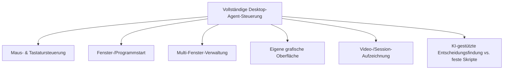
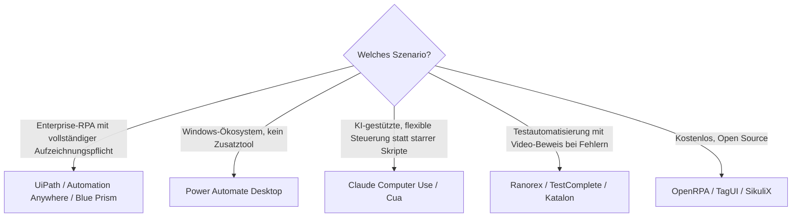

# Beste Desktop-Software mit vollständiger KI-Agent-Steuerung — Top-20-Topliste

Diese Seite bewertet Desktop-Software gezielt nach einem konkreten Funktionsumfang: **Maussteuerung, Tastatursteuerung, Fenster-/Programmstart, Verwaltung mehrerer Fenster gleichzeitig, eine eigene grafische Oberfläche zur Überwachung laufender Aktionen und die Fähigkeit, Bildschirm-/Videoaufzeichnungen der eigenen Aktionen zu erstellen**. Anders als die [Desktop-Steuerungs-Software-Topliste](desktop-steuerungs-software-ki-topliste.md) (breiter Produktüberblick) und die [Computer-Agenten-Topliste](lokale-ki-agenten-topliste.md) (Fokus auf Vision-Modelle) geht es hier ausschließlich darum, welche Tools **alle sechs** dieser konkreten Fähigkeiten gemeinsam abdecken.

!!! note "Hinweis: Die sechs Bewertungsdimensionen im Detail"
    - **Maussteuerung** — Klicks, Drag & Drop, Scrollen an beliebigen Bildschirmkoordinaten
    - **Tastatursteuerung** — Texteingabe, Tastenkombinationen, Shortcuts
    - **Fenster-/Programmstart** — eigenständiges Öffnen von Anwendungen und Fenstern
    - **Multi-Fenster-Verwaltung** — Wechsel zwischen mehreren gleichzeitig offenen Fenstern/Anwendungen
    - **Eigene grafische Oberfläche** — Dashboard/Viewer, der laufende oder geplante Aktionen sichtbar macht
    - **Video-/Session-Aufzeichnung** — Aufzeichnung der durchgeführten Aktionen zur Kontrolle, Fehlersuche oder Dokumentation

---

## Bewertungskriterien

!!! warning "Achtung: Video-/Session-Aufzeichnung nicht mit Datenschutz verwechseln"
    Eine Aufzeichnungsfunktion dokumentiert, was der Agent getan hat — sie schützt nicht automatisch vor Fehlverhalten. Aufzeichnungen können zudem sensible Bildschirminhalte (Passwörter, Kundendaten) enthalten und sollten entsprechend restriktiv gespeichert/gesichert werden. **Stand: Juli 2026.**

---

## Top 20 im Überblick

| Rang | Software | Anbieter | Einschätzung | Abdeckung der 6 Kernfunktionen | Schwäche |
|---|---|---|---|---|---|
| 1 | **UiPath** | UiPath | Sehr stark | Vollständig — Recorder erfasst Maus/Tastatur, Orchestrator-Dashboard, Fenster-/Prozessverwaltung, Aufzeichnung jedes Automatisierungslaufs | Enterprise-Lizenzierung und Einrichtungsaufwand hoch |
| 2 | **Automation Anywhere** | Automation Anywhere | Sehr stark | Vollständig — Control Room als zentrales Dashboard, detaillierte Ausführungsprotokolle inkl. Aufzeichnung | Ähnlich hoher Einrichtungsaufwand wie UiPath |
| 3 | **Blue Prism** | SS&C Blue Prism | Sehr stark | Vollständig — Control Room, Process Studio als grafische Oberfläche, vollständige Audit-Aufzeichnung jeder Aktion | Konfiguration eher auf IT-Abteilungen als Einzelnutzer zugeschnitten |
| 4 | **Power Automate Desktop** | Microsoft | Stark | Vollständig — UI-Flow-Recorder erfasst Maus/Tastatur, Konsole zur Flow-Verwaltung, Ausführungsverlauf mit Screenshots | Volle Aufzeichnungstiefe teils an höhere Lizenzstufen gekoppelt |
| 5 | **Claude Computer Use** | Anthropic | Stark | Weitgehend vollständig — volle Maus-/Tastatursteuerung und Fenster-/Programmstart per API, Referenzimplementierung mit Live-Viewer, Aktionsverlauf über Screenshots rekonstruierbar | Kein fertiges „Video"-Exportformat ohne eigene Zusatzintegration |
| 6 | **Cua (Computer-Use Agent)** | Cua-Projekt | Stark | Vollständig — VM-Sandbox mit Live-GUI-Viewer, vollständige Steuerung innerhalb der isolierten Umgebung, Session-Recording eingebaut | Primär auf macOS ausgerichtet |
| 7 | **Robocorp / Sema4.ai** | Sema4.ai | Stark | Vollständig — Control Room als Dashboard, Recorder für Maus/Tastatur, Ausführungsprotokolle mit Screenshots | Erfordert mehr technisches Know-how als reine No-Code-Tools |
| 8 | **WorkFusion** | WorkFusion | Solide bis stark | Vollständig — Control Tower als Dashboard, vollständige Prozessaufzeichnung, Multi-Fenster-fähig | Kleinere Verbreitung als UiPath/Automation Anywhere |
| 9 | **AskUI** | AskUI | Solide bis stark | Vollständig — Vision-basierte Maus-/Tastatursteuerung, Test-Run-Dashboard mit Aufzeichnung jedes Laufs | Primär auf QA-/Testautomatisierung ausgerichtet |
| 10 | **Ranorex Studio** | Ranorex | Solide bis stark | Vollständig — Recorder, eigene IDE als grafische Oberfläche, Video-Aufzeichnung bei fehlgeschlagenen Testläufen | Primär Testautomatisierungs-Tool, kein allgemeiner KI-Agent |
| 11 | **TestComplete** | SmartBear | Solide | Vollständig — Recorder mit KI-gestützter Objekterkennung, eigene IDE, Video-Log fehlgeschlagener Läufe | Lizenzkosten und Fokus stark auf Testautomatisierung |
| 12 | **Katalon Studio** | Katalon | Solide | Vollständig — Recorder, eigene Oberfläche, KI-gestützte „Self-Healing"-Objekterkennung, Testreports mit Screenshots/Video | Ähnlich wie TestComplete primär QA-fokussiert |
| 13 | **UI-TARS** | ByteDance | Solide | Weitgehend — starke Maus-/Tastatursteuerung per Vision-Modell, Referenz-Demos mit Bildschirmaufzeichnung | Kein fertiges Dashboard/GUI „ab Werk", eher Modell/Bibliothek |
| 14 | **Leapwork** | Leapwork | Solide | Vollständig — visueller No-Code-Flow-Builder als GUI, Recorder, KI-gestützte Objekterkennung, Testprotokolle mit Video | Eher auf Testautomatisierung als allgemeine Desktop-Agentur ausgelegt |
| 15 | **OpenRPA** | OpenRPA (Open Source) | Solide | Vollständig — Designer als GUI, Recorder, Ausführungsprotokolle | Kleinere Community als kommerzielle Top 10 |
| 16 | **NICE RPA** | NICE | Solide | Vollständig — Automation Finder/Control Center als Dashboard, vollständige Aufzeichnung | Enterprise-Fokus, weniger für Einzelnutzer gedacht |
| 17 | **Self-Operating Computer** | OthersideAI (Open Source) | Ausreichend bis solide | Teilweise — Maus-/Tastatursteuerung und einfache GUI vorhanden, keine dedizierte Video-Aufzeichnungsfunktion | Fenster-/Multi-Fenster-Verwaltung weniger ausgereift als bei RPA-Tools |
| 18 | **TagUI** | AI Singapore (Open Source) | Ausreichend bis solide | Teilweise — Maus-/Tastatursteuerung und visueller Recorder vorhanden, kaum eigenständiges Dashboard | Reine Kommandozeilen-/Skript-Bedienung, keine grafische Oberfläche im eigentlichen Sinn |
| 19 | **SikuliX** | Community (Open Source) | Ausreichend | Teilweise — bildbasierte Maus-/Tastatursteuerung, eigene IDE als GUI, keine native Video-Aufzeichnung | Kein KI-gestütztes Verständnis, reines Bild-Matching |
| 20 | **Robot Framework + RPA Framework** | Community (Open Source) | Ausreichend | Teilweise — RPA.Python-Bibliothek für Maus/Tastatur, RIDE als GUI, Screenshots statt echter Videoaufzeichnung, siehe [Robot Framework Grundlagen](robot-framework-anleitung.md) | Erfordert vollständige Eigenentwicklung der Aufzeichnungslogik |

!!! tip "Tipp: Rang ≠ einzige Entscheidungsgröße"
    Für **vollständige Abdeckung aller sechs Kriterien ohne Zusatzaufwand** liefern die Top 12 durchgehend fertige Lösungen. Für **KI-gestützte, flexible Entscheidungsfindung statt starrer Skripte** sind Claude Computer Use, Cua und UI-TARS trotz niedrigerer formaler Abdeckung oft die zukunftsfähigere Wahl, da sie auf veränderte Bildschirminhalte reagieren statt feste Koordinaten abzuspielen.

---

## Empfehlung nach Einsatzszenario

---

## 🔗 Verwandte Themen

- [Startseite](../../index.md) — zurück zur Dokumentations-Zentrale
- [Beste Desktop-Steuerungs-Software mit KI (Top 20)](desktop-steuerungs-software-ki-topliste.md) — breiterer Produktüberblick ohne Fokus auf diese sechs Kernfunktionen
- [Beste lokale Computer-KI-Agenten (Allgemein, Top 20)](lokale-ki-agenten-topliste.md) — Vision-Modelle und Frameworks im Detail
- [Beste Browser-Erweiterungen mit KI-Agent (Top 20)](browser-erweiterungen-ki-agent-topliste.md) — Browser-Tab statt vollem Desktop-Zugriff
- [Robot Framework Grundlagen](robot-framework-anleitung.md) — Eigenbau-Baustein für Rang 20
- [PyAutoGUI Grundlagen](pyautogui-anleitung.md) — Maus-/Tastatursteuerung als Eigenbau-Baustein
- [Beste Voice-Steuerung-KI-Agenten (Top 20)](voice-steuerung-ki-agent-topliste.md) — Sprachsteuerung statt Maus/Tastatur
