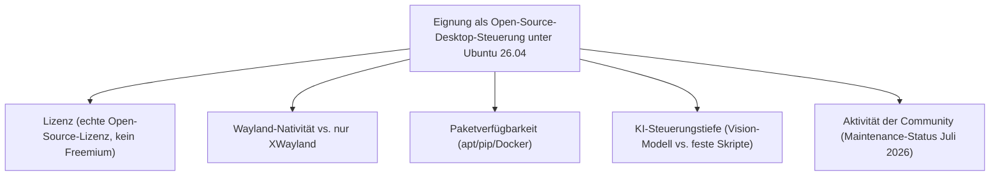
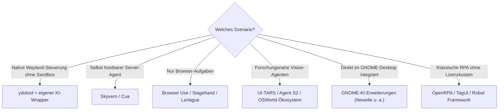

# Beste Desktop-Steuerungs-Software mit KI — Top-20-Topliste (Open Source, Ubuntu 26.04)

Die [Desktop-Steuerungs-Software-Topliste](desktop-steuerungs-software-ki-topliste.md) bewertet fertige Produkte unabhängig von Lizenzmodell und Plattform, die [Ubuntu-Topliste der Computer-Use-Agenten](computer-use-agenten-ubuntu-topliste.md) filtert nur auf Vision-/Computer-Use-Agenten und schließt proprietäre Tools ausdrücklich mit ein. Diese Seite kombiniert **beide Filter zugleich**: ausschließlich **quelloffene** Software (Lizenz mit einsehbarem Quellcode, keine reinen Freemium-/Trial-Modelle) mit **KI-gestützter** Desktop-Steuerung, die unter **Ubuntu 26.04 LTS** tatsächlich lauffähig ist.

!!! note "Hinweis: Abgrenzung zu den beiden Nachbar-Toplisten"
    - [Desktop-Steuerungs-Software-Topliste](desktop-steuerungs-software-ki-topliste.md) — breiter Produktüberblick, auch proprietär, plattformübergreifend (viele Einträge nur Windows/macOS)
    - [Computer-Use-Agenten für Ubuntu 26.04](computer-use-agenten-ubuntu-topliste.md) — Ubuntu-Filter, aber inklusive proprietärer Anbieter (Claude Computer Use, AskUI)
    - **Diese Seite** — nur Software, die **beide** Kriterien gleichzeitig erfüllt: quelloffen **und** unter Ubuntu 26.04 einsetzbar

---

## Bewertungskriterien

!!! warning "Achtung: „Open Source" bedeutet nicht automatisch „ohne Cloud-Abhängigkeit"
    Mehrere Einträge (UI-TARS, Agent S2, Cua) sind quelloffen, benötigen für die eigentliche KI-Inferenz aber ein Vision-Modell — lokal per GPU oder über eine externe API. Quelloffener Code garantiert keine vollständig lokale Verarbeitung; das jeweilige Modell-Backend separat prüfen. **Stand: Juli 2026, Ubuntu 26.04 LTS.**

---

## Top 20 im Überblick

| Rang | Software | Lizenz | Wayland/X11 | Einschätzung | Besondere Stärke | Schwäche |
|---|---|---|---|---|---|---|
| 1 | **ydotool + KI-Wrapper (Eigenbau)** | GPL-3.0 | Nativ Wayland (uinput) | Sehr stark | Einzige Lösung mit echter nativer Wayland-Unterstützung ohne XWayland-Umweg, siehe [Grundlagen](ydotool-anleitung.md) & [Wayland-Praxis](ydotool-wayland-praxis.md) | KI-Bildverständnis muss komplett selbst integriert werden |
| 2 | **Skyvern** | AGPL-3.0 | Docker-nativ | Sehr stark | Als Docker-Compose-Stack konzipiert, auf Ubuntu-Server besonders unkompliziert selbst hostbar | AGPL-Lizenz bei kommerziellem Einsatz beachten |
| 3 | **Cua (Computer-Use Agent)** | MIT | Docker-/KVM-Sandbox | Stark | Aktive Community, sauberes VM-Sandboxing-Konzept, Session-Recording eingebaut | Dokumentation/Community stärker auf macOS ausgerichtet als auf Linux |
| 4 | **Browser Use** | MIT | Playwright (browserintern) | Stark | Sehr aktives Projekt, `pip install`-Installation, unabhängig von Wayland/X11-Fragen | Kein Zugriff außerhalb des Browsers |
| 5 | **UI-TARS** | Apache-2.0 | X11/XWayland (Python/PyTorch) | Stark | Offenes Modellgewicht, gute Linux-/PyTorch-Paketkompatibilität | Native Wayland-Steuerung nicht eingebaut, kein fertiges Dashboard |
| 6 | **Open Interpreter** | AGPL-3.0 | X11/XWayland (Python-Backend) | Stark | Sehr verbreitetes Python-Tool, breite Ubuntu-Nutzerbasis, natürlichsprachige Steuerung | Volle GUI-Steuerung unter reinem Wayland eingeschränkter als unter X11 |
| 7 | **Stagehand** | MIT | Playwright (browserintern) | Stark | Zuverlässig unter Ubuntu, unabhängig vom Display-Server, gute Entwickler-Ergonomie | Auf Browser-Aufgaben begrenzt |
| 8 | **Agent S2** | Apache-2.0 | Docker-/VM-Sandbox (OSWorld-Basis) | Stark | Direkt gegen OSWorld-Ubuntu-VMs entwickelt und benchmarkt, exzellent dokumentierte Kompatibilität | Setup der VM-Umgebung technisch anspruchsvoller als reine Desktop-Installation |
| 9 | **Robot Framework + RPA Framework** | Apache-2.0 | X11/XWayland (Python-Basis) | Solide bis stark | Sehr gute `apt`-/`pip`-Integration, große Praxis-Basis, siehe [Grundlagen](robot-framework-anleitung.md) | Native Wayland-GUI-Steuerung erfordert zusätzliche `ydotool`-Anbindung |
| 10 | **Magentic-One** | MIT | X11/XWayland + Playwright-Anteile | Solide bis stark | Python-/AutoGen-Ökosystem sehr gut unter Ubuntu paketierbar (`pip`/`conda`) | Setup-Komplexität durch Multi-Agenten-Architektur höher |
| 11 | **OpenRPA** | AGPL-3.0 | X11/XWayland (.NET Core/Mono) | Solide | Kostenlos, quelloffen, .NET-Core-Basis läuft nativ unter Ubuntu, eigene GUI (Designer) | Kleinere Community, .NET-Core-Setup unter Linux etwas fummeliger als reine Python-Tools |
| 12 | **TagUI** | Apache-2.0 | X11/XWayland | Solide | Leichtgewichtige Installation, gute Linux-Unterstützung dokumentiert | Reine Kommandozeilen-/Skript-Bedienung ohne grafisches Dashboard |
| 13 | **GNOME-KI-Erweiterungen (Newelle u. a.)** | GPL-3.0 | Nativ GNOME Shell/Wayland | Solide | Direkt in Ubuntus Standard-Desktop integriert, keine Zusatzsoftware für Basisbedienung nötig | Funktionsumfang uneinheitlich, abhängig von der jeweiligen Erweiterung |
| 14 | **AutoKey** | GPL-3.0 | X11/XWayland | Solide | Linux-natives Automatisierungs-/Skript-Tool mit Python-Anbindung, seit Jahren etabliert | Keine eingebaute KI — Anbindung an ein Modell muss selbst geschrieben werden |
| 15 | **WebSurfer (AutoGen-Ökosystem)** | MIT | Playwright (browserintern) | Solide | Guter Baustein für eigene Multi-Agenten-Kompositionen unter Linux | Für sich genommen kein vollständiger Desktop-Agent |
| 16 | **OSWorld / OS-Copilot-Ökosystem** | MIT/Apache-2.0 (je nach Teilprojekt) | VM-Sandbox (nativ Ubuntu) | Solide | Referenz-Testumgebung läuft selbst auf Ubuntu, große Sammlung offener Agenten-Implementierungen | Primär Forschungs-/Benchmark-Ökosystem, kein „fertiges Produkt" |
| 17 | **LaVague** | Apache-2.0 | Playwright/Selenium (browserintern) | Ausreichend bis solide | Offenes Agenten-Framework speziell für Web-Automatisierung, aktive Entwicklung | Fokus fast ausschließlich auf Browser, kein Desktop-weiter Zugriff |
| 18 | **PyAutoGUI + KI-Wrapper (Eigenbau)** | BSD-3-Clause | Nur X11/XWayland | Ausreichend bis solide | Sehr einfacher Einstieg, riesige Community-Basis an Beispielen, siehe [Grundlagen](pyautogui-anleitung.md) | Unter reinem Wayland (Standard seit mehreren Ubuntu-LTS-Versionen) funktional eingeschränkt |
| 19 | **Self-Operating Computer** | MIT | X11/XWayland (PyAutoGUI-Backend) | Ausreichend | Einfaches, gut lesbares Grundgerüst für eigene Experimente | Erbt dieselbe Wayland-Einschränkung wie PyAutoGUI, keine Video-Aufzeichnung |
| 20 | **SikuliX** | MIT | X11/XWayland (Java) | Ausreichend | Bildbasierte Maus-/Tastatursteuerung, eigene IDE als GUI, sehr lange etabliert | Kein KI-gestütztes Verständnis, reines Bild-Matching statt Vision-Modell |

!!! tip "Tipp: Rang ≠ einzige Entscheidungsgröße"
    Für **maximale Wayland-Nativität ohne Sandbox** bleibt `ydotool` die einzig wirklich native Option — allerdings ohne eingebautes KI-Bildverständnis. Für **volle, quelloffene KI-Agentenfähigkeiten** sind Skyvern, Cua und Agent S2 die stärksten Kandidaten, da sie unabhängig vom Host-Display-Server in einer eigenen, containerisierten Umgebung laufen und dabei vollständig selbst hostbar bleiben.

---

## Empfehlung nach Einsatzszenario

---

## 🔗 Verwandte Themen

- [Startseite](../../index.md) — zurück zur Dokumentations-Zentrale
- [Beste Desktop-Steuerungs-Software mit KI (Top 20)](desktop-steuerungs-software-ki-topliste.md) — breiterer Produktüberblick inklusive proprietärer Software
- [Beste Computer-Use-Agenten für Ubuntu 26.04 (Top 20)](computer-use-agenten-ubuntu-topliste.md) — Ubuntu-Filter inklusive proprietärer Anbieter
- [Beste lokale Computer-KI-Agenten (Allgemein, Top 20)](lokale-ki-agenten-topliste.md) — plattformübergreifende Gesamtliste
- [Beste Self-Hosting-KI-Agenten (Allgemein, Top 20)](../coding/selbsthosting-ki-agenten-topliste.md)
- [ydotool Grundlagen](ydotool-anleitung.md) — native Low-Level-Steuerung unter Wayland
- [ydotool: Wayland Automatisierung](ydotool-wayland-praxis.md) — vertiefende Praxis zu Rang 1
- [Robot Framework Grundlagen](robot-framework-anleitung.md) — vertiefende Praxis zu Rang 9
- [PyAutoGUI Grundlagen](pyautogui-anleitung.md) — vertiefende Praxis zu Rang 18
- [Beste Browser-Erweiterungen mit KI-Agent (Open Source, Ubuntu 26.04, Top 20)](browser-erweiterungen-opensource-ubuntu-topliste.md) — dasselbe Doppel-Filterprinzip für Browser-Erweiterungen statt Desktop-Software
- [Beste Voice-Steuerung-KI-Agenten (Open Source, Ubuntu 26.04, Top 20)](voice-steuerung-opensource-ubuntu-topliste.md) — dasselbe Doppel-Filterprinzip für Sprachsteuerung statt Desktop-Software
- [Beste Screenshot-Analyse-KI-Agenten (Open Source, Ubuntu 26.04, Top 20)](screenshot-analyse-opensource-ubuntu-topliste.md) — dasselbe Doppel-Filterprinzip für den Bildverständnis-Baustein
- [Beste Desktop-Software mit vollständiger KI-Agent-Steuerung (Open Source, Ubuntu 26.04, Top 20)](desktop-agent-vollsteuerung-opensource-ubuntu-topliste.md) — Vertiefung nach den 6 konkreten Kernfunktionen (Maus, Tastatur, Fenster, Aufzeichnung)
