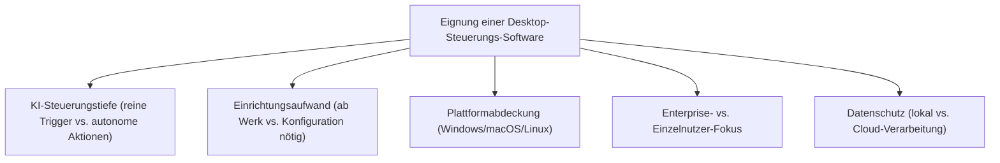
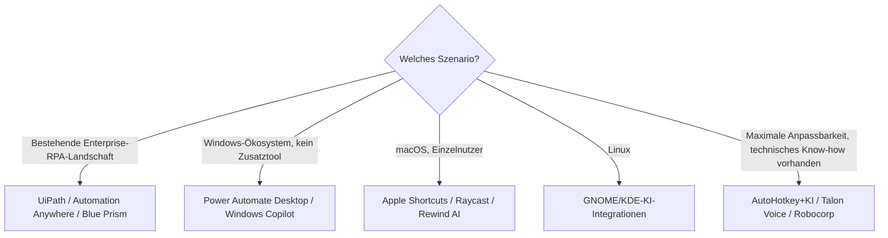

# Beste Desktop-Steuerungs-Software mit KI — Top-20-Topliste

Die [Topliste lokaler Computer-KI-Agenten](lokale-ki-agenten-topliste.md) bewertet Vision-Agenten und Entwickler-Frameworks (Claude Computer Use, UI-TARS, Agent S2, …), die meist eigene Konfiguration oder API-Zugänge voraussetzen. Diese Seite geht den anderen Weg: **fertige, installierbare Desktop-Software** — klassische RPA-Werkzeuge mit KI-Erweiterung, Betriebssystem-eigene Assistenten und Consumer-Automatisierungs-Tools, die ohne eigene Entwicklungsarbeit direkt einsatzbereit sind.

!!! note "Hinweis: Abgrenzung zur Computer-Agenten-Topliste"
    Die [Computer-Agenten-Topliste](lokale-ki-agenten-topliste.md) bewertet Vision-Modelle und Open-Source-Frameworks, die typischerweise selbst zusammengesetzt/konfiguriert werden. Diese Seite bewertet **fertige Softwareprodukte** — installieren, anmelden, loslegen — von Enterprise-RPA über Betriebssystem-Assistenten bis zu Consumer-Automatisierungs-Apps.

---

## Bewertungskriterien

!!! warning "Achtung: KI-Funktionsumfang variiert stark je nach Lizenz-Tier"
    Bei mehreren Einträgen (UiPath, Automation Anywhere, Power Automate Desktop) sind KI-Agentenfunktionen nur in höheren, kostenpflichtigen Editionen enthalten — die Basisversion bietet oft nur klassische, regelbasierte Automatisierung ohne KI. Vor einer Entscheidung die genaue Editions-/Lizenzstruktur prüfen. **Stand: Juli 2026.**

---

## Top 20 im Überblick

| Rang | Software | Anbieter | Kategorie | Plattform | Einschätzung | Besondere Stärke | Schwäche |
|---|---|---|---|---|---|---|---|
| 1 | **UiPath (mit Autopilot)** | UiPath | Enterprise-RPA | Windows | Sehr stark | Marktführer, sehr ausgereifte KI-Erweiterung für bestehende RPA-Workflows | Lizenzkosten und Einrichtung auf große Organisationen zugeschnitten |
| 2 | **Microsoft Power Automate Desktop (mit Copilot)** | Microsoft | RPA (Windows-nativ) | Windows | Sehr stark | In Windows/Microsoft-365 integriert, guter Einstieg ohne Zusatzsoftware | KI-Agentenfunktionen an Microsoft-365-Lizenzstufe gekoppelt |
| 3 | **Automation Anywhere (mit AARI)** | Automation Anywhere | Enterprise-RPA | Windows | Sehr stark | Gute Cloud-Orchestrierung großer Agenten-Flotten | Ähnlich hoher Einrichtungsaufwand wie UiPath |
| 4 | **Windows Copilot (Copilot+ PC Actions)** | Microsoft | OS-natives Feature | Windows | Stark | Kein separates Setup nötig, tief ins Betriebssystem integriert | Actions-Funktionsumfang schrittweise ausgerollt, nicht überall verfügbar |
| 5 | **Apple Shortcuts + Siri (App Intents)** | Apple | OS-natives Feature | macOS/iOS | Stark | Vollständig On-Device möglich, gute Datenschutz-Eigenschaften | Auf das Apple-Ökosystem beschränkt |
| 6 | **Blue Prism** | SS&C Blue Prism | Enterprise-RPA | Windows | Stark | Etablierter Enterprise-Anbieter mit wachsender KI-Agenten-Anbindung | Setup-Komplexität vergleichbar mit UiPath/Automation Anywhere |
| 7 | **Raycast (mit KI-Erweiterung)** | Raycast | Launcher + Automatisierung | macOS | Stark | Sehr angenehme Bedienung, schnelle KI-gestützte Befehle und Workflows | Nur macOS, weniger auf komplexe Multi-Schritt-Prozesse ausgelegt |
| 8 | **Rewind AI** | Rewind AI | Lokales Gedächtnis + Aktionen | macOS | Solide bis stark | Lokale Aufzeichnung als Grundlage für kontextbezogene KI-Aktionen | Steuerungsfähigkeiten schmaler als bei reinen RPA-Tools |
| 9 | **Robocorp / Sema4.ai** | Sema4.ai | RPA (entwicklernah, Open Source) | Windows/macOS/Linux | Solide bis stark | Code-nahe, gut versionierbare Automatisierung mit KI-Agenten-Anbindung | Erfordert mehr technisches Know-how als reine No-Code-Tools |
| 10 | **PowerToys (mit KI-Erweiterungen)** | Microsoft | Systemwerkzeug-Sammlung | Windows | Solide | Kostenlos, offizielle Microsoft-Erweiterung (z. B. „Advanced Paste" mit KI) | Kein vollständiger Agent, eher punktuelle KI-Helfer |
| 11 | **Talon Voice** | Talon | Sprachsteuerung | Windows/macOS/Linux | Solide | Sehr präzise sprachbasierte Steuerung, auch für Coding geeignet | Einrichtung/Eigenkonfiguration aufwendiger als klassische Klick-Automatisierung |
| 12 | **Keyboard Maestro (mit KI-Trigger)** | Stairways Software | Makro-/Automatisierungs-Tool | macOS | Solide | Sehr mächtiges klassisches Makro-System, per Community-Plugins KI-erweiterbar | KI-Integration nicht nativ, sondern über Zusatz-Workflows |
| 13 | **Alfred (mit Workflows)** | Running with Crayons | Launcher + Automatisierung | macOS | Solide | Große Workflow-Community, KI-Erweiterungen über Drittanbieter-Workflows | Kein eingebauter, offizieller KI-Agent |
| 14 | **BetterTouchTool** | Andreas Hegenberg | Gesten-/Automatisierungs-Tool | macOS | Ausreichend bis solide | Sehr detaillierte Trigger-Konfiguration, KI-Aktionen über Zusatzintegration | KI-Funktionen eher Ergänzung als Kernfeature |
| 15 | **WorkFusion** | WorkFusion | Enterprise-RPA + KI | Windows | Ausreichend bis solide | Fokus auf regulierte Branchen (Banken/Versicherungen) mit KI-Dokumentenverarbeitung | Kleinere Verbreitung als UiPath/Automation Anywhere |
| 16 | **Zapier Desktop (mit Agents)** | Zapier | Automatisierungs-App | Windows/macOS | Ausreichend bis solide | Riesiges Integrations-Ökosystem, lokale App als Ergänzung zur Cloud-Plattform | Primär Cloud-Workflow-Tool, lokale Desktop-Steuerung sekundär |
| 17 | **GNOME/KDE-KI-Integrationen** | Community | OS-native Erweiterungen | Linux | Ausreichend bis solide | Wachsende KI-Integration im Linux-Desktop-Ökosystem, quelloffen | Funktionsumfang uneinheitlich je nach Distribution/Erweiterung |
| 18 | **Dragon Professional** | Nuance/Microsoft | Diktat- + Steuerungssoftware | Windows | Ausreichend | Sehr ausgereifte Spracherkennung mit Jahrzehnten an Entwicklung | KI-Agentenfunktionen jenseits von Diktat/einfacher Steuerung begrenzt |
| 19 | **AutoHotkey + KI-Wrapper** | Community | Skript-Automatisierung | Windows | Ausreichend | Maximale Anpassbarkeit für erfahrene Nutzer, riesige bestehende Skript-Basis | KI-Anbindung vollständig selbst zu bauen, kein Produkt „ab Werk" |
| 20 | **Automator (klassisch)** | Apple | Workflow-Werkzeug | macOS | Grundlegend | Seit Langem in macOS integriert, einfacher Einstieg für Basis-Automatisierung | Kaum eigenständige KI-Funktionen, wird zunehmend von Shortcuts abgelöst |

!!! tip "Tipp: Rang ≠ einzige Entscheidungsgröße"
    Für **Unternehmen mit bestehenden RPA-Prozessen** zahlen sich die Top 3/6 (UiPath, Power Automate Desktop, Automation Anywhere, Blue Prism) durch nahtlose Erweiterung bestehender Workflows aus. Für **Einzelnutzer ohne IT-Abteilung** sind Betriebssystem-native Lösungen (Windows Copilot, Apple Shortcuts) oder leichte Tools wie Raycast oft der praktischere und günstigere Einstieg.

---

## Empfehlung nach Einsatzszenario

---

## 🔗 Verwandte Themen

- [Startseite](../../index.md) — zurück zur Dokumentations-Zentrale
- [Beste lokale Computer-KI-Agenten (Allgemein, Top 20)](lokale-ki-agenten-topliste.md) — Vision-Agenten und Entwickler-Frameworks statt fertiger Software
- [Übersicht Desktop-Automatisierung](index.md)
- [PyAutoGUI Grundlagen](pyautogui-anleitung.md) — klassische, koordinatenbasierte Automatisierung als Eigenbau-Alternative
- [ydotool Grundlagen](ydotool-anleitung.md) — Low-Level-Steuerung unter Linux/Wayland
- [Beste KI-Agent-CLIs (Allgemein, Top 20)](../coding/ki-agent-cli-topliste.md)
- [Beste Self-Hosting-KI-Agenten (Allgemein, Top 20)](../coding/selbsthosting-ki-agenten-topliste.md)
