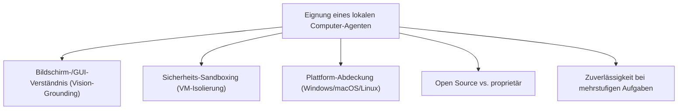
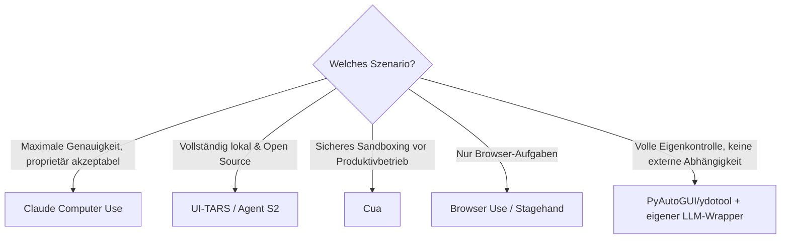

# Beste lokale Computer-KI-Agenten (Allgemein) — Top-20-Topliste

Neben serverseitigen Agenten-Frameworks ([Self-Hosting-KI-Agenten](../coding/selbsthosting-ki-agenten-topliste.md)) und gehosteten Plattformen ([Cloud-KI-Agenten](../coding/cloud-ki-agenten-topliste.md)) gibt es eine dritte Kategorie: **Computer-Use-Agenten**, die den eigenen Bildschirm sehen und Maus/Tastatur direkt auf dem lokalen Rechner steuern — Anwendungen öffnen, Formulare ausfüllen, zwischen Programmen wechseln, wie ein Mensch es tun würde. Diese Seite ordnet die verbreiteten lokalen Computer-Agenten ein und ergänzt damit die praxisnahen Anleitungen zu [PyAutoGUI](pyautogui-anleitung.md), [Playwright](playwright-anleitung.md), [Robot Framework](robot-framework-anleitung.md) und [ydotool](ydotool-anleitung.md) in diesem Bereich.

!!! note "Hinweis: Computer-Use-Agent ≠ klassisches Automatisierungsskript"
    Klassische Automatisierung (PyAutoGUI, ydotool) folgt festen, vorher programmierten Koordinaten/Abläufen. Ein Computer-Use-Agent interpretiert stattdessen den Bildschirminhalt per Vision-Modell zur Laufzeit und entscheidet selbstständig, wohin geklickt wird — dadurch robuster gegenüber UI-Änderungen, aber auch unvorhersehbarer und langsamer.

---

## Bewertungskriterien

!!! warning "Achtung: Computer-Use ist eine junge, riskante Kategorie"
    Agenten mit direkter Maus-/Tastatursteuerung können unbeabsichtigt Daten löschen, falsche Formulare absenden oder Zahlungen auslösen, wenn sie einen Bildschirminhalt fehlinterpretieren. Produktivbetrieb ohne Sandboxing (siehe Rang 1–6) oder ohne Bestätigungsschritt vor kritischen Aktionen wird nicht empfohlen. **Stand: Juli 2026.**

---

## Top 20 im Überblick

| Rang | Agent | Anbieter | Lizenz | Einschätzung | Besondere Stärke | Schwäche |
|---|---|---|---|---|---|---|
| 1 | **Claude Computer Use** | Anthropic | Proprietär (API) | Sehr stark | Genauestes Bildschirmverständnis in dieser Liste, gute mehrstufige Planung komplexer Abläufe | Läuft über API-Aufrufe, keine vollständig eigenständige lokale Inferenz |
| 2 | **UI-TARS** | ByteDance | Apache-2.0 | Sehr stark | Offenes, speziell auf GUI-Grounding trainiertes Modell, vollständig lokal ausführbar | Setup/Feinabstimmung erfordert mehr Eigenarbeit als proprietäre Lösungen |
| 3 | **Agent S2** | Simular AI | Apache-2.0 | Stark | Gute Ergebnisse auf OSWorld-Benchmarks, quelloffene Referenzimplementierung | Kleinere Community als etablierte proprietäre Anbieter |
| 4 | **Cua (Computer-Use Agent)** | Cua-Projekt | Open Source | Stark | VM-Sandboxing als Kernkonzept — Aktionen laufen isoliert statt direkt auf dem Host | Primär auf macOS ausgerichtet |
| 5 | **Self-Operating Computer** | OthersideAI | MIT | Stark | Pionierprojekt mit großer Community, gute Dokumentation für eigene Experimente | Weniger ausgereift bei komplexen Mehrschritt-Aufgaben als neuere Agenten |
| 6 | **Magentic-One** | Microsoft (AutoGen) | MIT | Stark | Multi-Agenten-Ansatz mit spezialisierten Rollen (WebSurfer, FileSurfer, Coder) | Setup-Komplexität höher als bei Einzel-Agenten-Lösungen |
| 7 | **Browser Use** | Community | MIT | Stark | Sehr verbreitete Open-Source-Bibliothek für browserfokussierte Agenten-Aufgaben | Kein allgemeiner Desktop-Zugriff jenseits des Browsers |
| 8 | **Stagehand** | Browserbase | Apache-2.0/MIT | Stark | Zuverlässiges Browser-Automatisierungs-Framework mit KI-Fallback bei brüchigen Selektoren | Ebenfalls browserfokussiert, kein OS-weiter Zugriff |
| 9 | **Skyvern** | Skyvern AI | AGPL-3.0 (Open Source) | Solide bis stark | Selbst hostbar, guter Formular-/Workflow-Fokus | AGPL-Lizenz bei kommerziellem Einsatz beachten |
| 10 | **AskUI** | AskUI | Proprietär (Enterprise) | Solide bis stark | Auf QA-/RPA-Anwendungsfälle spezialisiert, gute Enterprise-Unterstützung | Kein kostenloses Open-Source-Modell wie bei Top 5 |
| 11 | **Microsoft Copilot Actions (Windows)** | Microsoft | Proprietär (in Windows integriert) | Solide | Kein separates Setup nötig, tief ins Betriebssystem integriert | Nur unter Windows verfügbar, Funktionsumfang schrittweise ausgerollt |
| 12 | **Apple Intelligence (App Intents/Siri-Agenten)** | Apple | Proprietär (in macOS/iOS integriert) | Solide | Vollständig On-Device, gute Datenschutz-Eigenschaften | Auf das Apple-Ökosystem beschränkt, Funktionsumfang enger als bei Top 5 |
| 13 | **Nova Act** | Amazon | Proprietär (SDK) | Solide | Gute AWS-Ökosystem-Anbindung für browserbasierte Agenten-Aufgaben | Primär browserfokussiert wie Browser Use/Stagehand |
| 14 | **Runner H** | H Company | Proprietär | Solide | Generalistischer Ansatz für lokale wie Cloud-Aufgaben | Kleinere Nutzerbasis, weniger öffentliche Praxis-Berichte |
| 15 | **WebSurfer (eigenständig)** | Microsoft (AutoGen-Ökosystem) | MIT | Solide | Guter Baustein für eigene Multi-Agenten-Kompositionen | Für sich genommen kein vollständiger Desktop-Agent |
| 16 | **Rewind AI / Limitless** | Rewind AI | Proprietär | Solide | Fokus auf lokales Gedächtnis („was habe ich gesehen/getan") als Grundlage für Agenten-Aktionen | Aktions-/Steuerungsfähigkeiten schmaler als bei reinen Computer-Use-Agenten |
| 17 | **AgentSea / Surfkit** | AgentSea | Open Source | Ausreichend bis solide | Nützliches Tooling/Framework-Ökosystem für eigene Computer-Agenten | Eher Baukasten als fertiger Agent |
| 18 | **OS-Copilot (OSWorld-Ökosystem)** | Forschungs-Community | Open Source | Ausreichend bis solide | Guter Ausgangspunkt für Forschung/Benchmarking eigener Agenten | Weniger produktionsreif als kommerzielle Top 10 |
| 19 | **PyAutoGUI + eigener LLM-Wrapper** | Eigenbau (siehe [Grundlagen](pyautogui-anleitung.md) & [OpenCV/OCR](pyautogui-ocr-vision.md)) | — | Ausreichend | Volle Kontrolle, keine externe Abhängigkeit von einem fertigen Agenten-Produkt | Erfordert vollständige Eigenentwicklung der Entscheidungslogik |
| 20 | **ydotool + KI-Bildanalyse (Eigenbau)** | Eigenbau (siehe [Grundlagen](ydotool-anleitung.md) & [Wayland-Praxis](ydotool-wayland-praxis.md)) | — | Grundlegend | Einzige Lösung in dieser Liste mit nativer Wayland-Unterstützung ohne X11-Umweg | Reine Low-Level-Steuerung, KI-Bildverständnis muss komplett selbst gebaut werden |

!!! tip "Tipp: Rang ≠ einzige Entscheidungsgröße"
    Für **maximale Sicherheit** zählt vor allem VM-Sandboxing (Cua) oder API-basierte Ausführung mit Bestätigungsschritt (Claude Computer Use) — nicht der reine Rang. Für **reine Browser-Aufgaben** sind spezialisierte Agenten wie Browser Use oder Stagehand oft zuverlässiger als allgemeine Desktop-Agenten, da der Aufgabenbereich enger und dadurch besser abgesichert ist.

---

## Empfehlung nach Einsatzszenario

!!! warning "Achtung: Vor Produktiveinsatz immer in Sandbox testen"
    Unabhängig vom gewählten Agenten empfiehlt sich ein isoliertes Testsystem (VM, separater Benutzer-Account ohne Zugriff auf sensible Daten) für die erste Erprobungsphase — insbesondere bei Agenten ohne eingebautes Sandboxing wie Self-Operating Computer oder Magentic-One.

---

## 🔗 Verwandte Themen

- [Startseite](../../index.md) — zurück zur Dokumentations-Zentrale
- [Übersicht Desktop-Automatisierung](index.md)
- [PyAutoGUI Grundlagen](pyautogui-anleitung.md) — klassische, koordinatenbasierte Automatisierung als Baustein für Eigenbau-Agenten
- [PyAutoGUI: OpenCV & OCR](pyautogui-ocr-vision.md) — Bildverständnis als Vorstufe zu vollständigem Vision-Grounding
- [Playwright Grundlagen](playwright-anleitung.md) — browserfokussierte Automatisierungsbasis
- [Playwright & KI Web-Scraping](playwright-ki-extraction.md)
- [ydotool Grundlagen](ydotool-anleitung.md) — Low-Level-Steuerung unter Wayland
- [Beste Self-Hosting-KI-Agenten (Allgemein, Top 20)](../coding/selbsthosting-ki-agenten-topliste.md) — serverseitige Agenten-Frameworks
- [Beste Cloud-KI-Agenten (Allgemein, Top 20)](../coding/cloud-ki-agenten-topliste.md) — gehostete Agenten-Plattformen
- [Beste Desktop-Steuerungs-Software mit KI (Top 20)](desktop-steuerungs-software-ki-topliste.md) — fertige RPA-/OS-native Software statt Frameworks/Modellen
- [Beste Browser-Erweiterungen mit KI-Agent (Top 20)](browser-erweiterungen-ki-agent-topliste.md) — Browser-Tab statt vollem Bildschirmzugriff
- [Beste Desktop-Software mit vollständiger KI-Agent-Steuerung (Top 20)](desktop-agent-vollsteuerung-topliste.md) — Bewertung nach konkreten Funktionen (Maus, Tastatur, Fenster, Aufzeichnung)
- [Beste Voice-Steuerung-KI-Agenten (Top 20)](voice-steuerung-ki-agent-topliste.md) — Sprachsteuerung als weitere Steuerungsebene
- [Beste Computer-Use-Agenten für Ubuntu 26.04 (Top 20)](computer-use-agenten-ubuntu-topliste.md) — dieselbe Kategorie gefiltert auf Ubuntu-/Wayland-Kompatibilität
