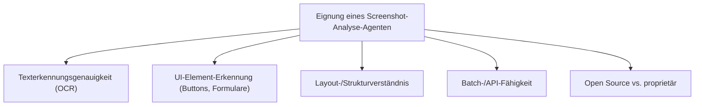
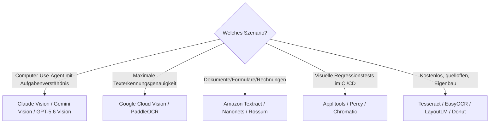

# Beste Screenshot-Analyse-KI-Agenten — Top-20-Topliste

Screenshot-Verständnis ist die Grundlage jedes Computer-Use-Agenten (siehe [Computer-Agenten-Topliste](lokale-ki-agenten-topliste.md)) — bevor Maus oder Tastatur gesteuert werden kann, muss der Bildschirminhalt zuverlässig interpretiert werden: Text erkennen, UI-Elemente lokalisieren, Layout verstehen. Diese Seite bewertet dedizierte Werkzeuge und Modelle für genau diesen Analyseschritt, unabhängig davon, ob sie Teil eines größeren Agenten sind oder eigenständig für Dokumentenverarbeitung, Testautomatisierung oder Barrierefreiheits-Prüfung eingesetzt werden.

!!! note "Hinweis: Drei unterschiedliche Analyseziele"
    - **Texterkennung (OCR)** — reinen Text aus dem Bild extrahieren
    - **UI-Element-Erkennung** — Buttons, Formulare, Icons lokalisieren und semantisch einordnen (Grundlage für Computer-Use-Agenten)
    - **Layout-/Dokumentenverständnis** — Struktur (Tabellen, Formulare, Abschnitte) erkennen, nicht nur Einzeltext

---

## Bewertungskriterien

!!! warning "Achtung: Modelle vs. fertige Produkte unterschiedlich einsetzbar"
    Ein Teil dieser Liste sind API-Dienste/Modelle, die in eigene Anwendungen integriert werden (Google Cloud Vision, LayoutLM); ein anderer Teil sind fertige Endnutzer-Werkzeuge (Snagit, Applitools). Diese Unterscheidung fließt als Kriterium mit ein. **Stand: Juli 2026.**

---

## Top 20 im Überblick

| Rang | Werkzeug/Modell | Anbieter | Kategorie | Einschätzung | Besondere Stärke | Schwäche |
|---|---|---|---|---|---|---|
| 1 | **Claude Vision** | Anthropic | Multimodales LLM | Sehr stark | Bestes Gesamtverständnis für UI-Kontext (welcher Button macht was), Grundlage von Claude Computer Use | Kein dediziertes OCR-Feintuning wie spezialisierte Vision-APIs |
| 2 | **Gemini Vision** | Google | Multimodales LLM | Sehr stark | Sehr präzise Texterkennung auch bei komplexen Layouts, riesiges Kontextfenster für viele Screenshots gleichzeitig | Volle Funktionstiefe primär über Google-Cloud-Anbindung |
| 3 | **GPT-5.6 Vision** | OpenAI | Multimodales LLM | Sehr stark | Sehr gutes semantisches Verständnis von Screenshots im Kontext einer laufenden Aufgabe | Reine OCR-Präzision bei sehr kleinem Text teils hinter spezialisierten APIs |
| 4 | **Google Cloud Vision API** | Google | Dedizierte OCR-/Bildanalyse-API | Stark | Sehr hohe Texterkennungsgenauigkeit, gute Batch-Verarbeitung großer Mengen | Kein eigenständiges semantisches „Aufgabenverständnis" wie bei LLMs |
| 5 | **Azure AI Vision** | Microsoft | Dedizierte OCR-/Bildanalyse-API | Stark | Gute Integration in bestehende Microsoft-/Azure-Infrastruktur | Ähnlich wie Google Cloud Vision primär reine Erkennung ohne Aufgabenkontext |
| 6 | **Amazon Textract** | AWS | Dokumenten-/Formular-Analyse-API | Stark | Sehr gutes Formular-/Tabellenverständnis, starke AWS-Ökosystem-Anbindung | Fokus stärker auf Dokumente als auf allgemeine App-Screenshots |
| 7 | **UI-TARS** | ByteDance | Vision-Modell (GUI-Grounding) | Stark | Speziell auf UI-Element-Erkennung trainiert, offen und lokal ausführbar | Weniger geeignet für reine Dokumenten-/Texterkennung als OCR-Spezialisten |
| 8 | **PaddleOCR** | Baidu (Open Source) | OCR-Bibliothek | Solide bis stark | Sehr hohe Texterkennungsgenauigkeit, quelloffen, mehrsprachig | Keine eingebaute semantische UI-Element-Erkennung |
| 9 | **LayoutLM** | Microsoft (Open Source) | Dokumentenverständnis-Modell | Solide bis stark | Gutes Layout-/Strukturverständnis (Tabellen, Formulare) auf offenem Modell | Erfordert mehr Eigenintegration als fertige APIs |
| 10 | **Donut** | Naver (Open Source) | OCR-freies Dokumentenverständnis | Solide bis stark | Kein separater OCR-Schritt nötig, direktes Bild-zu-Struktur-Verständnis | Kleinere Community als LayoutLM |
| 11 | **Applitools (Visual AI)** | Applitools | UI-Testing mit KI | Solide | Sehr gutes KI-gestütztes visuelles Diffing für Regressionstests, ignoriert irrelevante Pixel-Unterschiede | Primär auf Testautomatisierung ausgelegt, kein Allzweck-Screenshot-Tool |
| 12 | **Percy (BrowserStack)** | BrowserStack | Visuelle Regressionstests | Solide | Gute Integration in bestehende CI/CD-Pipelines, siehe auch [Playwright Visual Regression](playwright-visual-regression.md) | Ähnlich wie Applitools eng auf Testautomatisierung fokussiert |
| 13 | **Chromatic** | Chromatic (Storybook) | UI-Review mit Screenshot-Diffing | Solide | Sehr gute Integration in Storybook-basierte Frontend-Workflows | Nur sinnvoll bei bestehender Storybook-Nutzung |
| 14 | **EasyOCR** | Community (Open Source) | OCR-Bibliothek | Solide | Einfache Python-Integration, gute mehrsprachige Erkennung | Genauigkeit bei sehr kleinem/verzerrtem Text hinter PaddleOCR |
| 15 | **Tesseract OCR (+ KI-Wrapper)** | Community (Open Source) | OCR-Bibliothek, siehe [PyAutoGUI: OpenCV & OCR](pyautogui-ocr-vision.md) | Solide | Sehr etabliert, riesige Dokumentation/Community, kostenlos | Reine Texterkennung ohne semantisches Verständnis „ab Werk" |
| 16 | **Nanonets** | Nanonets | Dokumenten-Datenextraktion | Ausreichend bis solide | Guter No-Code-Einstieg für strukturierte Datenextraktion aus Screenshots/Scans | Primär auf Geschäftsdokumente (Rechnungen etc.) ausgelegt |
| 17 | **Rossum** | Rossum | Dokumenten-KI (Rechnungen etc.) | Ausreichend bis solide | Starker Fokus auf Rechnungs-/Belegverarbeitung mit hoher Genauigkeit | Kein Allzweck-Screenshot-Analyse-Tool |
| 18 | **Docparser** | Docparser | Dokumenten-Datenextraktion | Ausreichend | Einfache Regel-/Vorlagen-basierte Extraktion, ergänzt um KI-Erkennung | Weniger flexibel bei stark wechselnden Layouts als LLM-basierte Ansätze |
| 19 | **Snagit (mit KI-Funktionen)** | TechSmith | Screenshot-Tool mit KI-Zusammenfassung | Ausreichend | Guter Alltagswerkzeug-Charakter für schnelle Screenshot-Erfassung plus Zusammenfassung | Kein eigenständiger Agent, eher Erfassungs-/Annotations-Tool |
| 20 | **Pieces for Developers** | Pieces | Kontext-/Snippet-Erfassung mit Screenshot-Bezug | Ausreichend | Praktisch zum Sammeln von Code-Screenshots mit KI-Kontext für spätere Wiederverwendung | Kein eigenständiges OCR-/UI-Erkennungsmodell, eher Organisationswerkzeug |

!!! tip "Tipp: Rang ≠ einzige Entscheidungsgröße"
    Für **Computer-Use-Agenten mit Aufgabenverständnis** sind die multimodalen LLMs (Claude Vision, Gemini Vision, GPT-5.6 Vision) die richtige Wahl. Für **reine Texterkennung mit maximaler Genauigkeit** liefern dedizierte OCR-APIs/Bibliotheken (Google Cloud Vision, PaddleOCR) oft bessere Ergebnisse als ein allgemeines multimodales Modell. Für **UI-Testing/Regressionsprüfung** sind Applitools, Percy und Chromatic zweckmäßiger als generische Vision-Modelle.

---

## Empfehlung nach Einsatzszenario

---

## 🔗 Verwandte Themen

- [Startseite](../../index.md) — zurück zur Dokumentations-Zentrale
- [Beste lokale Computer-KI-Agenten (Allgemein, Top 20)](lokale-ki-agenten-topliste.md) — nutzen Screenshot-Analyse als Grundlagenschritt
- [Beste Computer-Use-Agenten für Ubuntu 26.04 (Top 20)](computer-use-agenten-ubuntu-topliste.md)
- [PyAutoGUI: OpenCV & OCR](pyautogui-ocr-vision.md) — praktische Grundlagen zu Rang 15
- [Playwright Visual Regression](playwright-visual-regression.md) — vertiefender Praxis-Guide zu Rang 12/13
- [Beste Desktop-Software mit vollständiger KI-Agent-Steuerung (Top 20)](desktop-agent-vollsteuerung-topliste.md)
- [Beste Screenshot-Analyse-KI-Agenten (Open Source, Ubuntu 26.04, Top 20)](screenshot-analyse-opensource-ubuntu-topliste.md) — nur quelloffene, lokal betreibbare Modelle/Bibliotheken
