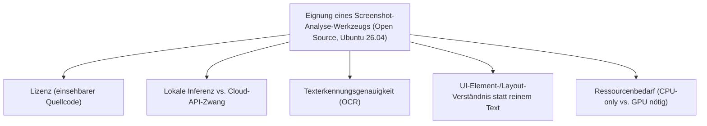
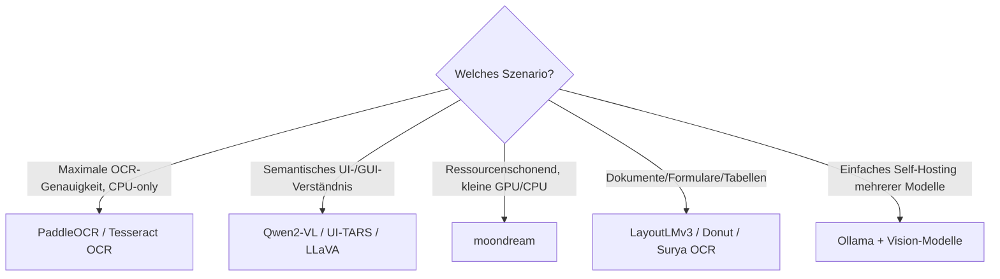

# Beste Screenshot-Analyse-KI-Agenten — Top-20-Topliste (Open Source, Ubuntu 26.04)

Die [Screenshot-Analyse-Topliste](screenshot-analyse-ki-agent-topliste.md) bewertet den Markt breit — inklusive proprietärer Cloud-APIs (Google Cloud Vision, Azure AI Vision) und kommerzieller Endnutzer-Werkzeuge (Snagit, Applitools). Diese Seite filtert dieselbe Kategorie auf **quelloffene** Modelle und Bibliotheken, die unter **Ubuntu 26.04 lokal** betrieben werden können — ohne Cloud-API-Zwang.

!!! note "Hinweis: Was unter Ubuntu 26.04 bei Screenshot-Analyse zählt"
    Entscheidend ist hier vor allem: (1) native `apt`-/`pip`-Paketierung oder ein unkompliziertes Docker-/Ollama-Deployment, (2) vollständige lokale Inferenz ohne zwingende Cloud-API, und (3) keine Abhängigkeit von Windows-spezifischen Komponenten (COM-Objekte, .NET-Bibliotheken), wie sie bei manchen kommerziellen OCR-Werkzeugen vorausgesetzt werden.

---

## Bewertungskriterien

!!! warning "Achtung: GPU-Anforderungen stark unterschiedlich"
    Multimodale Vision-LLMs (Qwen2-VL, LLaVA, UI-TARS) liefern deutlich besseres semantisches Verständnis als klassische OCR-Bibliotheken, benötigen für flüssige Antwortzeiten aber meist eine GPU mit ausreichend VRAM. Auf reinen CPU-Ubuntu-Servern sind klassische OCR-Tools (Tesseract, PaddleOCR) oder besonders kompakte Modelle wie moondream oft die praktikablere Wahl. **Stand: Juli 2026.**

---

## Top 20 im Überblick

| Rang | Werkzeug/Modell | Lizenz | Kategorie | Einschätzung | Besondere Stärke | Schwäche |
|---|---|---|---|---|---|---|
| 1 | **PaddleOCR** | Apache-2.0 | OCR-Bibliothek | Sehr stark | Sehr hohe Texterkennungsgenauigkeit, mehrsprachig, exzellente `pip`-Kompatibilität unter Ubuntu | Keine eingebaute semantische UI-Element-Erkennung |
| 2 | **Tesseract OCR** | Apache-2.0 | OCR-Bibliothek | Sehr stark | Nativ per `apt install tesseract-ocr`, riesige Dokumentation/Community, läuft auf reiner CPU | Reine Texterkennung ohne semantisches Verständnis „ab Werk" |
| 3 | **Qwen2-VL** | Apache-2.0/Tongyi Qianwen | Multimodales Vision-LLM | Sehr stark | Sehr starkes offenes GUI-/Dokumentverständnis, einfach selbst hostbar via Ollama/vLLM unter Ubuntu | Für flüssige Antwortzeiten GPU mit ausreichend VRAM empfohlen |
| 4 | **UI-TARS** | Apache-2.0 | Vision-Modell (GUI-Grounding) | Stark | Speziell auf UI-Element-Erkennung trainiert, vollständig lokal ausführbar | Weniger geeignet für reine Dokumenten-/Texterkennung als OCR-Spezialisten |
| 5 | **LLaVA** | Apache-2.0 (je nach Backbone) | Multimodales Vision-LLM | Stark | Breite Ollama-/`llama.cpp`-Unterstützung, sehr aktive Community | Genauigkeit bei sehr kleinem UI-Text hinter spezialisierten OCR-Modellen |
| 6 | **Florence-2** | MIT | Vision-Foundation-Modell | Stark | Vereint OCR, Objekterkennung und Bildbeschreibung in einem kompakten offenen Modell | Weniger spezialisiert auf UI-Screenshots als UI-TARS |
| 7 | **moondream** | Apache-2.0 | Kompaktes Vision-LLM | Stark | Sehr ressourcenschonend, läuft auch auf reiner CPU/kleiner GPU flüssig unter Ubuntu | Semantische Tiefe geringer als bei größeren Vision-LLMs |
| 8 | **GOT-OCR2.0** | Apache-2.0 | Einheitliches OCR-Modell | Stark | Moderner Ansatz, ersetzt mehrstufige klassische OCR-Pipelines durch ein einziges Modell | Jüngeres Projekt, kleinere Community als etablierte OCR-Bibliotheken |
| 9 | **LayoutLMv3** | MIT | Dokumentenverständnis-Modell | Solide bis stark | Gutes Layout-/Strukturverständnis (Tabellen, Formulare) auf offenem Modell | Erfordert mehr Eigenintegration als fertige APIs |
| 10 | **Donut** | MIT | OCR-freies Dokumentenverständnis | Solide bis stark | Kein separater OCR-Schritt nötig, direktes Bild-zu-Struktur-Verständnis | Kleinere Community als LayoutLM |
| 11 | **Surya OCR** | GPL-3.0 | OCR + Layout-Analyse | Solide bis stark | Kombiniert Texterkennung mit Layout-Analyse in einem modernen Open-Source-Paket | Jüngeres Projekt, Reifegrad noch hinter Tesseract/PaddleOCR |
| 12 | **docTR** | Apache-2.0 | Dokumenten-Text-Erkennung | Solide | Saubere Python-API, gute End-to-End-Pipeline aus Erkennung und Layout | Kleinere Modellauswahl als PaddleOCR |
| 13 | **EasyOCR** | Apache-2.0 | OCR-Bibliothek | Solide | Einfache Python-Integration, gute mehrsprachige Erkennung | Genauigkeit bei sehr kleinem/verzerrtem Text hinter PaddleOCR |
| 14 | **Marker** | GPL-3.0 | PDF-/Dokument-Konvertierung (Layout+OCR) | Solide | Sehr gute Umwandlung von Screenshots/PDFs in strukturiertes Markdown | Primär auf Dokumente statt allgemeine App-Screenshots ausgelegt |
| 15 | **Kraken OCR** | Apache-2.0 | OCR-Engine (historische Texte) | Solide | Sehr gut für historische/handschriftliche Dokumente, Linux-native Kernkomponente | Für moderne UI-Screenshots weniger optimiert als Allzweck-OCR |
| 16 | **OCRmyPDF (+ Tesseract)** | MPL-2.0 | PDF-OCR-Werkzeug | Solide | Nativ per `apt install ocrmypdf`, fügt PDFs direkt eine durchsuchbare Textebene hinzu | Auf PDF-Workflows spezialisiert, kein allgemeines Screenshot-Tool |
| 17 | **Ollama + Vision-Modelle** | MIT (Ollama) | Self-Hosting-Plattform | Solide | Ein-Kommando-Deployment von LLaVA/Qwen2-VL/moondream unter Ubuntu, einheitliche API | Modellqualität hängt vollständig vom gewählten Vision-Modell ab |
| 18 | **Apache Tika (OCR-Modul)** | Apache-2.0 | Dokumentenanalyse-Toolkit | Ausreichend bis solide | Breites Format-Spektrum, gute Integration in bestehende Java-/Ubuntu-Server-Pipelines | Java-Abhängigkeit, OCR selbst läuft intern über Tesseract |
| 19 | **OpenCV + eigener KI-Wrapper (Eigenbau)** | Apache-2.0 | CV-Bibliothek | Ausreichend | Volle Kontrolle über Bildvorverarbeitung, siehe [PyAutoGUI: OpenCV & OCR](pyautogui-ocr-vision.md) | Semantisches Verständnis muss komplett selbst ergänzt werden |
| 20 | **Tesseract/PaddleOCR + eigener Agenten-Stack (Eigenbau)** | Apache-2.0 | Eigenbau-Kombination | Ausreichend | Maximale Anpassbarkeit, keine Abhängigkeit von einem fertigen Produkt | Erfordert vollständige Eigenentwicklung der Aufgaben-/Entscheidungslogik |

!!! tip "Tipp: Rang ≠ einzige Entscheidungsgröße"
    Für **reine Texterkennung mit maximaler Genauigkeit ohne GPU** sind PaddleOCR und Tesseract weiterhin die zuverlässigsten Optionen. Für **semantisches UI-/Aufgabenverständnis** wie bei Computer-Use-Agenten sind Qwen2-VL, UI-TARS und LLaVA die stärksten quelloffenen Alternativen zu proprietären multimodalen LLMs — benötigen dafür aber deutlich mehr Rechenleistung.

---

## Empfehlung nach Einsatzszenario

---

## 🔗 Verwandte Themen

- [Startseite](../../index.md) — zurück zur Dokumentations-Zentrale
- [Beste Screenshot-Analyse-KI-Agenten (Top 20)](screenshot-analyse-ki-agent-topliste.md) — breiterer Produktüberblick inklusive proprietärer Cloud-APIs
- [Beste Computer-Use-Agenten für Ubuntu 26.04 (Top 20)](computer-use-agenten-ubuntu-topliste.md) — Ubuntu-Filter für die darauf aufbauenden Vision-Agenten
- [Beste Desktop-Steuerungs-Software mit KI (Open Source, Ubuntu 26.04, Top 20)](desktop-software-opensource-ubuntu-topliste.md) — dasselbe Doppel-Filterprinzip für Desktop-Software
- [Beste Browser-Erweiterungen mit KI-Agent (Open Source, Ubuntu 26.04, Top 20)](browser-erweiterungen-opensource-ubuntu-topliste.md) — dasselbe Doppel-Filterprinzip für Browser-Erweiterungen
- [Beste Voice-Steuerung-KI-Agenten (Open Source, Ubuntu 26.04, Top 20)](voice-steuerung-opensource-ubuntu-topliste.md) — dasselbe Doppel-Filterprinzip für Sprachsteuerung
- [Beste lokale Computer-KI-Agenten (Allgemein, Top 20)](lokale-ki-agenten-topliste.md) — nutzen Screenshot-Analyse als Grundlagenschritt
- [PyAutoGUI: OpenCV & OCR](pyautogui-ocr-vision.md) — praktische Grundlagen zu Rang 19
