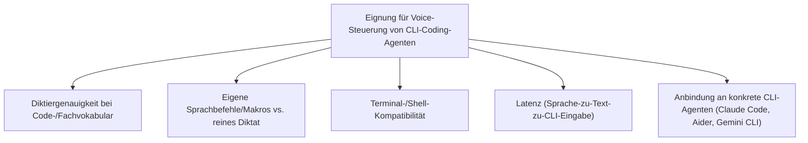
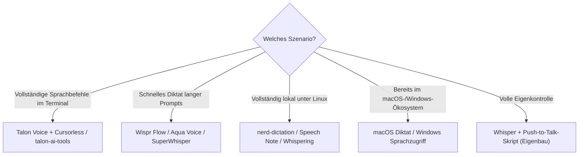

# Beste Voice-Steuerung-KI-Agenten für CLI-Automatisierung — Top-20-Topliste

Die [allgemeine Voice-Steuerung-Topliste](voice-steuerung-ki-agent-topliste.md) bewertet Sprachassistenten breit — von Smartphone-Assistenten bis Smart-Home-Steuerung. Diese Seite filtert gezielt auf einen einzigen Anwendungsfall: **Sprachsteuerung terminalbasierter KI-Coding-Agenten** wie [Claude Code](../coding/claude-code-praxis.md), [Aider oder Gemini CLI](../coding/ki-agent-cli-topliste.md) — also Werkzeuge, mit denen sich Prompts diktieren, Code-Navigation per Sprachbefehl durchführen oder ganze CLI-Sessions freihändig steuern lassen.

!!! note "Hinweis: Drei unterschiedliche Sprachsteuerungs-Ebenen in dieser Serie"
    - [Voice-Steuerung-Topliste (Allgemein)](voice-steuerung-ki-agent-topliste.md) — Smartphone-/Smart-Home-/Consumer-Assistenten
    - [Voice-Steuerung (Open Source, Ubuntu 26.04)](voice-steuerung-opensource-ubuntu-topliste.md) — dieselbe Kategorie gefiltert auf quelloffene, lokal betreibbare Projekte
    - **Diese Seite** — Sprachsteuerung speziell zur Bedienung von **CLI-Coding-Agenten** im Terminal, unabhängig von Lizenz oder Betriebssystem

---

## Bewertungskriterien

!!! warning "Achtung: Reines Diktat ≠ vollständige Terminal-Steuerung"
    Viele Einträge dieser Liste (Wispr Flow, SuperWhisper, macOS Diktat) wandeln Sprache zuverlässig in Text um, der dann in ein CLI-Prompt-Feld eingefügt wird — sie steuern das Terminal selbst aber nicht per Sprachbefehl (Tab-Wechsel, Befehlsausführung, Navigation). Nur Talon Voice und darauf aufbauende Projekte bieten echte, frei programmierbare Terminal-Sprachbefehle. **Stand: Juli 2026.**

---

## Top 20 im Überblick

| Rang | Werkzeug | Anbieter | Kategorie | Einschätzung | Besondere Stärke | Schwäche |
|---|---|---|---|---|---|---|
| 1 | **Talon Voice + Cursorless** | Talon (+ Community) | Entwickler-Sprachsteuerung | Sehr stark | Präziseste, vollständig programmierbare Sprachsteuerung für jeden Editor/jedes Terminal inkl. Claude Code/Aider | Steile Lernkurve, eigene Befehlssprache nötig |
| 2 | **Serenade** | Serenade | Entwickler-Sprachsteuerung (Coding) | Sehr stark | Speziell auf Code-Diktat/-Navigation zugeschnitten, funktioniert auch direkt im Terminal | Schmalerer Fokus als Talon bei allgemeiner Terminalbedienung |
| 3 | **Wispr Flow** | Wispr AI | Voice-Dictation-App (Entwickler-Fokus) | Stark | Sehr natürliche, schnelle Diktierfunktion systemweit inkl. Terminal, gute Kontextanpassung an Code | Cloud-Verarbeitung, keine vollständig lokale Option |
| 4 | **Aqua Voice** | Aqua | Voice-Dictation-App (Entwickler-Fokus) | Stark | Gute Editier-Sprachbefehle speziell für Code-/Terminal-Diktat statt reinem Text | Kleinere Nutzerbasis als Wispr Flow |
| 5 | **SuperWhisper** | SuperWhisper | Voice-Dictation-App (macOS) | Stark | Lokale Whisper-Verarbeitung möglich, systemweite Diktat-Hotkeys inkl. Terminal | Nur macOS |
| 6 | **VoiceInk** | VoiceInk (Open Source) | Voice-Dictation-App (macOS) | Solide bis stark | Quelloffen, lokale Whisper-Modelle, kostenlos | Nur macOS |
| 7 | **talon-ai-tools** | Community | Talon-Erweiterung | Solide bis stark | Bindet LLM-gestützte Sprachbefehle direkt in Talon ein — gute Basis, um Claude Code/Aider freihändig zu steuern | Setup erfordert bereits laufende Talon-Installation |
| 8 | **nerd-dictation** | Community (Open Source) | Linux-Diktat-Tool | Solide bis stark | Leichtgewichtiges, natives Linux-Diktat direkt in jedes Terminal per X11/Wayland-Texteingabe | Reines Diktat, keine eigenen Sprachbefehle/Makros |
| 9 | **Speech Note** | Community (Open Source) | Linux-Diktat-App | Solide | Grafische Oberfläche für Offline-Diktat unter Linux, gut geeignet für lange Prompts an CLI-Agenten | Kein eigenes Befehlssystem für Terminal-Aktionen |
| 10 | **Whispering** | Community (Open Source) | Cross-Platform-Diktat-App | Solide | Quelloffen, lokale oder Cloud-Whisper-Verarbeitung wählbar, Push-to-Talk systemweit | Jüngeres Projekt, kleinere Community |
| 11 | **macOS Diktat (System)** | Apple | OS-native Diktierfunktion | Solide | Kostenlos, systemweit inkl. Terminal.app/iTerm nutzbar | Keine Coding-spezifischen Sprachbefehle |
| 12 | **Windows Sprachzugriff (Voice Access)** | Microsoft | OS-native Sprachsteuerung | Solide | Vollständige Terminal-/PowerShell-Bedienung inkl. Navigation per Sprache | Keine Coding-spezifische Befehlssprache wie Talon |
| 13 | **Whisper + Push-to-Talk-Skript (Eigenbau)** | Eigenbau (OpenAI Whisper) | Eigenbau-Diktat-Pipeline | Solide | Volle Kontrolle, direkte Anbindung an jede CLI (Claude Code, Aider, Gemini CLI) | Erfordert eigenes Hotkey-/Einfüge-Skript |
| 14 | **Talon + Claude-Code-Community-Grammatik** | Community | Talon-Erweiterung | Solide | Fertige Community-Skripte zur direkten Sprachsteuerung laufender Claude-Code-Sessions | Abhängig von Community-Pflege, nicht offiziell unterstützt |
| 15 | **Cursorless (eigenständig)** | Community (Open Source) | Struktur-Sprachbefehle | Solide | Sehr präzise strukturelle Code-Bearbeitung, gut in Terminal-Editoren (vim/neovim) nutzbar | Benötigt weiterhin Talon als Basis-Engine |
| 16 | **Willow (+ eigener CLI-Trigger)** | Willow-Projekt (Open Source) | Self-Hosted Voice-Assistent | Ausreichend bis solide | Selbst hostbarer Inferenz-Server, per eigenem Skript an CLI-Agenten anbindbar | Kein fertiges Coding-/Terminal-Profil „ab Werk" |
| 17 | **Home Assistant Assist (+ Shell-Command)** | Open Source | Self-Hosted Voice-Assistent | Ausreichend bis solide | Lässt sich über die Shell-Command-Integration an beliebige CLI-Befehle koppeln | Ursprünglich für Smart Home gedacht, Coding-Anwendungsfälle erfordern Eigenkonfiguration |
| 18 | **GitHub Copilot Voice (eingestellt)** | GitHub | Historisches Voice-Coding-Feature | Ausreichend | Frühes, wegweisendes Voice-to-Code-Konzept | Einstellung 2023, nicht mehr verfügbar/gepflegt |
| 19 | **Dragon Professional (+ eigenes Terminal-Profil)** | Nuance/Microsoft | Diktier-/Steuerungssoftware | Ausreichend | Sehr ausgereifte reine Spracherkennung als Basis für ein eigenes Terminal-Profil | Kein Coding-/CLI-Profil „ab Werk", muss selbst konfiguriert werden |
| 20 | **Whisper + eigener Agenten-Stack (Eigenbau)** | Eigenbau | Eigenbau-Baustein | Grundlegend | Maximale Flexibilität, keine Abhängigkeit von einem fertigen Produkt | Vollständige Eigenentwicklung der gesamten Pipeline nötig |

!!! tip "Tipp: Rang ≠ einzige Entscheidungsgröße"
    Für **echte Sprachbefehle im Terminal** (Tabs wechseln, Befehle ausführen, Cursor-Navigation) führt kein Weg an Talon Voice vorbei — die Top 3 der [allgemeinen Voice-Topliste](voice-steuerung-ki-agent-topliste.md) sind hierfür ungeeignet, da sie primär andere Ökosysteme bedienen. Für **reines, schnelles Diktieren langer Prompts** an einen CLI-Agenten sind Wispr Flow, Aqua Voice und SuperWhisper oft der pragmatischere, einfacher einzurichtende Einstieg.

---

## Empfehlung nach Einsatzszenario

---

## 🔗 Verwandte Themen

- [Startseite](../../index.md) — zurück zur Dokumentations-Zentrale
- [Beste Voice-Steuerung-KI-Agenten (Top 20)](voice-steuerung-ki-agent-topliste.md) — breiterer Produktüberblick jenseits von CLI-Coding-Agenten
- [Beste Voice-Steuerung-KI-Agenten (Open Source, Ubuntu 26.04, Top 20)](voice-steuerung-opensource-ubuntu-topliste.md) — Open-Source-Filter derselben Grundkategorie
- [Beste KI-Agent-CLIs (Allgemein, Top 20)](../coding/ki-agent-cli-topliste.md) — die per Sprache gesteuerten CLI-Agenten selbst im Detail
- [Claude Code Praxis-Handbuch](../coding/claude-code-praxis.md) — Zielwerkzeug für Rang 1/7/14
- [Antigravity CLI 2 — Übersicht](../coding/antigravity-cli.md) — weiteres mögliches Zielwerkzeug für sprachgesteuerte Sessions
- [Beste lokale Computer-KI-Agenten (Allgemein, Top 20)](lokale-ki-agenten-topliste.md) — Bildschirm-/Maussteuerung statt reiner Sprachsteuerung
