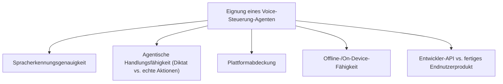
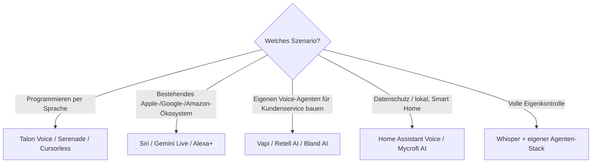

# Beste Voice-Steuerung-KI-Agenten — Top-20-Topliste

Als vierte Steuerungsebene neben Desktop-Software ([Top 20](desktop-steuerungs-software-ki-topliste.md)), Computer-Agenten ([Top 20](lokale-ki-agenten-topliste.md)) und Browser-Erweiterungen ([Top 20](browser-erweiterungen-ki-agent-topliste.md)) geht es hier um **sprachgesteuerte KI-Agenten** — von klassischen Sprachassistenten mit agentischen Aktionen bis zu Entwickler-Plattformen für den Bau eigener Voice-Agenten.

!!! note "Hinweis: Diktat ≠ agentische Sprachsteuerung"
    Ein Teil dieser Liste transkribiert lediglich Sprache zu Text (klassisches Diktat); der relevantere Teil führt darüber hinaus **eigenständige Aktionen** aus — Apps öffnen, Termine buchen, Code editieren, Smart-Home-Geräte steuern. Diese Unterscheidung ist das wichtigste Auswahlkriterium.

---

## Bewertungskriterien

!!! warning "Achtung: Spracherkennung in lauten Umgebungen und bei Dialekten"
    Erkennungsgenauigkeit schwankt je nach Anbieter deutlich bei Hintergrundgeräuschen, starken Dialekten oder Fachvokabular (z. B. Code-Diktat). Vor Produktivnutzung immer mit realistischen Testbedingungen prüfen. **Stand: Juli 2026.**

---

## Top 20 im Überblick

| Rang | Agent | Anbieter | Kategorie | Einschätzung | Besondere Stärke | Schwäche |
|---|---|---|---|---|---|---|
| 1 | **Siri (mit App Intents)** | Apple | OS-nativer Assistent | Sehr stark | Vollständig On-Device möglich, tiefe App-übergreifende Aktionsausführung im Apple-Ökosystem | Auf Apple-Geräte beschränkt |
| 2 | **Google Gemini Live** | Google | Mobiler Assistent | Sehr stark | Sehr gutes Sprach-/Kontextverständnis, agentische Aktionen über Android-Apps hinweg | Volle Funktionstiefe primär auf Android |
| 3 | **Talon Voice** | Talon | Entwickler-Sprachsteuerung | Sehr stark | Präziseste Sprachsteuerung für Coding und volle Desktop-Bedienung, plattformübergreifend | Einrichtung/Eigenkonfiguration aufwendiger als Consumer-Assistenten |
| 4 | **Amazon Alexa+** | Amazon | Consumer-Assistent | Stark | Generative-KI-Erweiterung mit deutlich mehr agentischen Fähigkeiten als die klassische Alexa | Volle Funktionstiefe an Amazon-Geräte/-Dienste gebunden |
| 5 | **Microsoft Copilot Voice / Windows Voice Access** | Microsoft | OS-native Sprachsteuerung | Stark | Vollständige Windows-Bedienung per Sprache, gute Copilot-Integration für agentische Aufgaben | Primär Windows-fokussiert |
| 6 | **macOS Voice Control** | Apple | OS-native Bedienungshilfe | Stark | Vollständige System-/App-Steuerung per Sprache inkl. Grid-/Nummern-Overlay, On-Device | Weniger „intelligent" im Sinne generativer KI als Siri selbst |
| 7 | **Serenade** | Serenade | Entwickler-Sprachsteuerung (Coding) | Stark | Speziell auf Code-Diktat und -Navigation zugeschnitten, gute IDE-Integration | Schmalerer Anwendungsbereich als Talon (primär Coding) |
| 8 | **Cursorless (+ Talon)** | Community (Open Source) | Entwickler-Sprachsteuerung (Coding) | Stark | Sehr präzise strukturelle Code-Bearbeitung per Sprachbefehl statt reinem Diktat | Steile Lernkurve, eigene Befehlssprache nötig |
| 9 | **ElevenLabs Conversational AI** | ElevenLabs | Entwickler-Plattform | Stark | Sehr realistische Sprachausgabe, gute API für eigene Voice-Agenten mit Aktionsanbindung | Erfordert eigene Entwicklungsarbeit zur vollständigen Integration |
| 10 | **Vapi** | Vapi | Entwickler-Plattform (Voice-Agent-API) | Solide bis stark | Guter Baukasten speziell für Telefonie-/Voice-Agenten mit Tool-Anbindung | Kein fertiges Endnutzerprodukt, reine Entwickler-API |
| 11 | **Retell AI** | Retell AI | Entwickler-Plattform (Voice-Agent-API) | Solide bis stark | Guter Fokus auf Kundenservice-/Callcenter-Voice-Agenten | Ähnlich wie Vapi primär Entwickler-Zielgruppe |
| 12 | **Bland AI** | Bland AI | Entwickler-Plattform (Voice-Agent-API) | Solide | Guter Skalierungsfokus für automatisierte Telefonanrufe | Kein Endnutzerprodukt, reine API-Plattform |
| 13 | **Home Assistant Voice (+ lokales LLM)** | Open Source | Smart-Home-Sprachsteuerung | Solide | Vollständig lokal/self-hostbar, gute Datenschutz-Eigenschaften | Einrichtung erfordert mehr technisches Know-how als Cloud-Assistenten |
| 14 | **Mycroft AI / OpenVoiceOS** | Community (Open Source) | Sprachassistenten-Plattform | Solide | Quelloffen, anpassbar, keine Cloud-Abhängigkeit nötig | Spracherkennungsqualität hinter kommerziellen Top-Anbietern |
| 15 | **Rasa (Voice-Erweiterung)** | Rasa | Entwickler-Framework | Solide | Guter Baustein für eigene, unternehmensspezifische Voice-Agenten | Erfordert deutlich mehr Eigenentwicklung als fertige Plattformen |
| 16 | **Dragon Professional** | Nuance/Microsoft | Diktat- + Steuerungssoftware | Solide | Sehr ausgereifte Spracherkennung mit langer Entwicklungsgeschichte | Agentische Aktionen jenseits von Diktat/einfacher Steuerung begrenzt |
| 17 | **Meta AI (Ray-Ban Meta Glasses)** | Meta | Wearable-Assistent | Ausreichend bis solide | Freihändige Bedienung direkt über die Brille, gute Alltagsintegration | Funktionsumfang enger als bei vollwertigen Smartphone-Assistenten |
| 18 | **Rabbit R1 (LAM)** | Rabbit | Dediziertes Voice-Gerät | Ausreichend bis solide | Eigenständiges Gerät mit „Large Action Model" für App-Steuerung | Kleinerer Funktionsumfang als etablierte Smartphone-Assistenten |
| 19 | **Pi (Inflection AI)** | Inflection AI | Konversations-Assistent | Ausreichend | Angenehmer, sehr natürlicher Gesprächsstil | Agentische Aktionsausführung schmaler als bei Top 10 |
| 20 | **Whisper + eigener Agenten-Stack (Eigenbau)** | Eigenbau (OpenAI Whisper als Basis) | Entwickler-Baustein | Ausreichend | Volle Kontrolle, keine Abhängigkeit von einem fertigen Produkt | Erfordert vollständige Eigenentwicklung der Aktionslogik |

!!! tip "Tipp: Rang ≠ einzige Entscheidungsgröße"
    Für **Coding per Sprache** sind Talon Voice, Serenade und Cursorless die spezialisiertesten Werkzeuge — deutlich präziser als allgemeine Assistenten. Für **eigene Voice-Agenten-Produkte** (Kundenservice, Telefonie) sind Vapi, Retell AI und Bland AI die passenderen Entwickler-Plattformen als Consumer-Assistenten.

---

## Empfehlung nach Einsatzszenario

---

## 🔗 Verwandte Themen

- [Startseite](../../index.md) — zurück zur Dokumentations-Zentrale
- [Beste Desktop-Software mit vollständiger KI-Agent-Steuerung (Top 20)](desktop-agent-vollsteuerung-topliste.md) — Maus-/Tastatursteuerung statt Sprache
- [Beste lokale Computer-KI-Agenten (Allgemein, Top 20)](lokale-ki-agenten-topliste.md)
- [Beste Browser-Erweiterungen mit KI-Agent (Top 20)](browser-erweiterungen-ki-agent-topliste.md)
- [Beste Desktop-Steuerungs-Software mit KI (Top 20)](desktop-steuerungs-software-ki-topliste.md)
- [AI Voice Cloning (XTTS v2)](../../kreativ/audio/ai-voice-cloning-xtts.md) — verwandte Sprachsynthese-Technik
