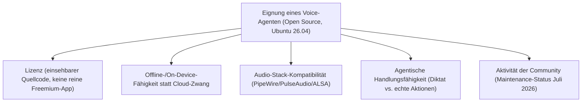
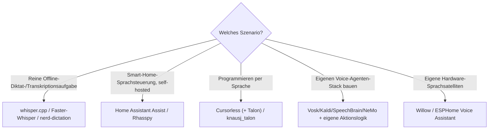

# Beste Voice-Steuerung-KI-Agenten — Top-20-Topliste (Open Source, Ubuntu 26.04)

Die [Voice-Steuerung-Topliste](voice-steuerung-ki-agent-topliste.md) bewertet den Markt breit — inklusive proprietärer, OS-gebundener Assistenten wie Siri, Gemini Live oder Windows Voice Access, die unter Linux ohnehin nicht verfügbar sind. Diese Seite filtert dieselbe Kategorie auf **quelloffene** Sprachsteuerungs-Projekte, die unter **Ubuntu 26.04** tatsächlich lauffähig sind.

!!! note "Hinweis: Was unter Ubuntu 26.04 bei Sprachsteuerung zählt"
    Anders als bei Desktop-Software (Wayland/X11) oder Browser-Erweiterungen (Native-Messaging-Hosts) entscheidet bei Voice-Agenten vor allem: (1) läuft die Audio-Pipeline sauber über PipeWire/PulseAudio, (2) ist die Erkennung/Synthese vollständig **offline** möglich statt an einen proprietären Cloud-Dienst gebunden, und (3) existiert eine native `apt`/`pip`/Docker-Installation ohne Windows- oder macOS-Abhängigkeit.

---

## Bewertungskriterien

!!! warning "Achtung: Manche Projekte sind nur teilweise offen"
    Bei Cursorless ist nur die Skript-/Grammatik-Ebene quelloffen, während die darunterliegende Talon-Spracherkennungs-Engine proprietär (aber kostenlos nutzbar) bleibt. Bei mehreren Einträgen (Mycroft AI, Coqui STT, Snips) ist die Kernentwicklung inzwischen verlangsamt oder eingestellt — vor Produktivnutzung die aktuelle Repository-Aktivität prüfen. **Stand: Juli 2026.**

---

## Top 20 im Überblick

| Rang | Projekt | Lizenz | Offline-fähig | Einschätzung | Besondere Stärke | Schwäche |
|---|---|---|---|---|---|---|
| 1 | **whisper.cpp** | MIT | Vollständig | Sehr stark | Extrem schnelle CPU-Inferenz ohne Cloud, exzellente Ubuntu-Paketierung (`make`/`cmake`), riesige Community | Reine Transkription, keine eingebaute Aktionsausführung |
| 2 | **Home Assistant Assist (Year of Voice)** | Apache-2.0 | Vollständig | Sehr stark | Vollständig self-hostbare Smart-Home-Sprachsteuerung, native Linux-/Docker-Installation, sehr aktiv weiterentwickelt | Fokus auf Smart-Home-Befehle statt allgemeiner Desktop-Agent |
| 3 | **Rhasspy** | MIT | Vollständig | Sehr stark | Komplettes Offline-Sprachassistenten-Toolkit, Docker-Image speziell für Linux-Server | Projekt-Aktivität seit Integration in Home Assistant Assist zurückgegangen |
| 4 | **Vosk** | Apache-2.0 | Vollständig | Stark | Sehr leichtgewichtiges Offline-Spracherkennungs-Toolkit, gute `pip`-Kompatibilität, viele Sprachmodelle | Reine Spracherkennung ohne eingebaute Aktionslogik |
| 5 | **Faster-Whisper** | MIT | Vollständig | Stark | Deutlich schnellere Whisper-Inferenz via CTranslate2, gut mit/ohne GPU unter Ubuntu nutzbar | Wie Whisper reine Transkription ohne Agentenlogik |
| 6 | **nerd-dictation** | GPL-3.0 | Vollständig | Stark | Sehr leichtgewichtiges Linux-natives Diktat-Tool auf Vosk-Basis, direkt für X11/Wayland-Texteingabe gedacht | Nur Diktat, keine agentischen Aktionen |
| 7 | **Speech Note** | GPL-3.0 | Vollständig | Solide bis stark | Native GNOME/Linux-Desktop-App für Offline-Diktat mit Whisper-/Vosk-Backends, eigene grafische Oberfläche | Primär Diktat-Tool, keine Aktionssteuerung |
| 8 | **Cursorless (+ Talon)** | MIT (Cursorless) | Vollständig | Solide bis stark | Sehr präzise strukturelle Code-Bearbeitung per Sprachbefehl statt reinem Diktat | Benötigt den nicht quelloffenen Talon-Kern als Spracherkennungs-Engine |
| 9 | **SpeechBrain** | Apache-2.0 | Vollständig | Solide bis stark | Vielseitiges PyTorch-Toolkit für ASR/TTS/Sprechererkennung, guter Baustein für eigene Voice-Agenten | Framework statt fertiger Assistent, erfordert eigene Integration |
| 10 | **NVIDIA NeMo (ASR-Module)** | Apache-2.0 | Vollständig | Solide bis stark | Sehr ausgereifte ASR-Modelle, gute Ubuntu-/CUDA-Paketierung | GPU-Anforderungen für gute Performance, technisch anspruchsvoller Einstieg |
| 11 | **Piper** | MIT | Vollständig | Solide | Sehr schnelle, leichtgewichtige lokale Sprachsynthese (TTS), oft mit Rhasspy/Home Assistant kombiniert | Nur Sprachausgabe, kein Spracherkennungs-/Aktionsteil |
| 12 | **Coqui STT** | MPL-2.0 | Vollständig | Solide | Nachfolger von Mozilla DeepSpeech, quelloffene STT-Engine mit guter Linux-Unterstützung | Projekt-Aktivität seit 2024 stark zurückgegangen |
| 13 | **Kaldi** | Apache-2.0 | Vollständig | Solide | Etabliertes, sehr flexibles Forschungs-Toolkit für Spracherkennung, Linux-native Kernkomponente | Hohe Einstiegshürde, eher für Forschung als fertige Assistenten |
| 14 | **Willow / Willow Inference Server** | Apache-2.0 | Vollständig | Solide | Offene Sprachassistenten-Plattform mit selbst hostbarem Inferenz-Server, Docker-Deployment unter Ubuntu | Ökosystem primär auf eigene ESP32-Hardware-Satelliten ausgelegt |
| 15 | **Mycroft AI / OpenVoiceOS** | Apache-2.0/GPL | Vollständig | Solide | Quelloffene Sprachassistenten-Plattform, keine Cloud-Abhängigkeit nötig | Spracherkennungsqualität hinter kommerziellen Top-Anbietern, Kernprojekt nur eingeschränkt aktiv |
| 16 | **LocalAI (Audio-Plugins)** | MIT | Vollständig | Solide | Self-hostbare, OpenAI-API-kompatible Whisper-/TTS-Anbindung, einfach per Docker unter Ubuntu betreibbar | Betrieb/Konfiguration aufwendiger als fertige Endnutzer-Assistenten |
| 17 | **ESPHome Voice Assistant (Year of Voice)** | GPL-3.0/MIT | Vollständig | Ausreichend bis solide | Offene Firmware für eigene Sprachsteuerungs-Hardware, tief mit Home Assistant integriert | Erfordert eigene Hardware-Satelliten, kein reines Softwareprodukt für den Desktop |
| 18 | **Snips (Community-Nachfolgeprojekte)** | Apache-2.0 (Teilkomponenten) | Vollständig | Ausreichend | Historisch bedeutendes offenes On-Device-NLU-Projekt, einzelne Komponenten weiterhin nutzbar | Ursprüngliches Projekt eingestellt, nur noch über Community-Forks verfügbar |
| 19 | **Talon + Community-Skripte (knausj_talon)** | MIT (nur Skripte) | Vollständig | Ausreichend bis solide | Weiterhin präziseste Sprachsteuerung für Coding, Skript-Basis vollständig offen einsehbar | Talon-Spracherkennungs-Kern selbst ist nicht quelloffen, nur kostenlos nutzbar |
| 20 | **Whisper + eigener Agenten-Stack (Eigenbau)** | MIT (Whisper) | Vollständig | Ausreichend | Volle Kontrolle, keine Abhängigkeit von einem fertigen Produkt | Erfordert vollständige Eigenentwicklung der Aktionslogik |

!!! tip "Tipp: Rang ≠ einzige Entscheidungsgröße"
    Für **reine, schnelle Offline-Transkription** ist whisper.cpp (bzw. Faster-Whisper mit GPU) aktuell die zuverlässigste Wahl. Für **echte agentische Sprachsteuerung des Smart Home** ist Home Assistant Assist am weitesten ausgereift, da es Erkennung, Intent-Verarbeitung und Aktionsausführung bereits vollständig integriert — bei den reinen ASR-Toolkits (Vosk, Kaldi, NeMo, SpeechBrain) muss die Aktionslogik dagegen selbst gebaut werden.

---

## Empfehlung nach Einsatzszenario

---

## 🔗 Verwandte Themen

- [Startseite](../../index.md) — zurück zur Dokumentations-Zentrale
- [Beste Voice-Steuerung-KI-Agenten (Top 20)](voice-steuerung-ki-agent-topliste.md) — breiterer Produktüberblick inklusive proprietärer OS-Assistenten
- [Beste Desktop-Steuerungs-Software mit KI (Open Source, Ubuntu 26.04, Top 20)](desktop-software-opensource-ubuntu-topliste.md) — dasselbe Doppel-Filterprinzip für Desktop-Software
- [Beste Browser-Erweiterungen mit KI-Agent (Open Source, Ubuntu 26.04, Top 20)](browser-erweiterungen-opensource-ubuntu-topliste.md) — dasselbe Doppel-Filterprinzip für Browser-Erweiterungen
- [Beste Computer-Use-Agenten für Ubuntu 26.04 (Top 20)](computer-use-agenten-ubuntu-topliste.md) — Ubuntu-Filter für Vision-/Computer-Use-Agenten
- [Beste lokale Computer-KI-Agenten (Allgemein, Top 20)](lokale-ki-agenten-topliste.md)
- [Beste Screenshot-Analyse-KI-Agenten (Open Source, Ubuntu 26.04, Top 20)](screenshot-analyse-opensource-ubuntu-topliste.md) — dasselbe Doppel-Filterprinzip für den Bildverständnis-Baustein
- [Beste Voice-Steuerung-KI-Agenten für CLI-Automatisierung (Top 20)](voice-steuerung-cli-automatisierung-topliste.md) — Fokus auf Sprachsteuerung von Terminal-Coding-Agenten statt Open-Source-/Ubuntu-Filter
- [AI Voice Cloning (XTTS v2)](../../kreativ/audio/ai-voice-cloning-xtts.md) — verwandte Sprachsynthese-Technik
