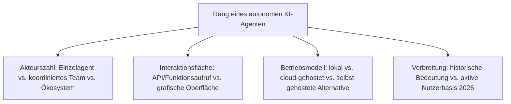
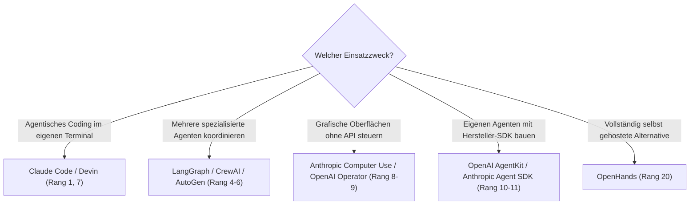

# Beste autonome KI-Agenten 2026 — Top-20-Topliste

Die [Evolution und Architekturen digitaler Autonomer KI-Agenten](evolution-digitaler-autonome-ki-agenten.md) ordnet diese Architekturlinie chronologisch — vom autonomen Einzel-Agenten über Orchestrierungs-Frameworks, Coding- und Computer-Use-Agenten bis zu herstellerseitigen Agenten-Baukästen und Multi-Agenten-Ökosystemen. Diese Seite übersetzt die Chronologie in eine **Momentaufnahme 2026**: 20 Systeme, Frameworks und Standards, die 2026 tatsächlich prägend sind.

!!! note "Hinweis: Framework, Produkt und Protokoll gemeinsam gerankt"
    Diese Liste mischt bewusst Endnutzer-Produkte (Claude Code, Devin) mit Orchestrierungs-Frameworks (LangGraph, CrewAI) und Standards (MCP, ACP) — alle drei Ebenen prägen 2026 gemeinsam, wie autonome Agenten tatsächlich gebaut und betrieben werden.

---

## Bewertungskriterien

---

## Top 20 im Überblick

| Rang | System | Generation | Besondere Stärke |
|---|---|---|---|
| 1 | **Claude Code** | 3 (Autonome Coding-Agenten) | Agentisches Coding-Werkzeug mit vollem Datei-, Werkzeug- und Ausführungszugriff, auch der Stack hinter diesem Repository |
| 2 | **Model Context Protocol (MCP)** | 6 (Multi-Agenten-Ökosysteme & Cloud-Agenten-Plattformen) | Standardisierter Werkzeugzugriff, herstellerübergreifend statt proprietärer Integrationen |
| 3 | **AutoGPT** | 1 (Der autonome Einzel-Agent) | Erster breit bekannter autonomer Agent, löste die gesamte Agenten-Experimentierwelle aus |
| 4 | **LangGraph** | 2 (Orchestrierungs-Frameworks) | Zustandsgraph-basierte Orchestrierung arbeitsteiliger Agenten |
| 5 | **CrewAI** | 2 (Orchestrierungs-Frameworks) | Rollenbasierte „Crews" aus Agenten mit fest zugewiesenen Aufgaben |
| 6 | **AutoGen** | 2 (Orchestrierungs-Frameworks) | Konversationsbasierte Multi-Agenten-Koordination |
| 7 | **Devin** | 3 (Autonome Coding-Agenten) | Als „erster KI-Software-Ingenieur" vermarktet, plant und testet Code über längere Aufgaben hinweg |
| 8 | **Anthropic Computer Use** | 4 (Computer-Use- & Browser-Agenten) | Steuert Maus/Tastatur direkt über Screenshot-Analyse, für Anwendungen ohne API |
| 9 | **OpenAI Operator** | 4 (Computer-Use- & Browser-Agenten) | Browsergesteuerter Agent für webbasierte Mehrschrittaufgaben |
| 10 | **OpenAI AgentKit** | 5 (Herstellerseitige Agenten-Baukästen) | Herstellerseitiges Framework zum Bau eigener Agenten-Anwendungen |
| 11 | **Anthropic Agent SDK** | 5 (Herstellerseitige Agenten-Baukästen) | SDK für agentische Coding-Werkzeuge |
| 12 | **Agent Client Protocol (ACP)** | 5 (Herstellerseitige Agenten-Baukästen) | Standardisierte Schnittstelle zwischen Agenten und Editor-/Client-Umgebungen |
| 13 | **BabyAGI** | 1 (Der autonome Einzel-Agent) | Minimalistische Referenzimplementierung des „Plan → Ausführen → Neue Aufgaben generieren"-Musters |
| 14 | **Semantic Kernel** (Microsoft) | 2 (Orchestrierungs-Frameworks) | Microsofts Orchestrierungs-Framework für Agenten-Plugins im .NET-/Python-Ökosystem |
| 15 | **Replit Agent** | 3 (Autonome Coding-Agenten) | Browserbasierter Coding-Agent mit direkt integriertem Deployment |
| 16 | **GitHub Copilot Workspace** | 3 (Autonome Coding-Agenten) | Aufgabenorientierter Coding-Agent direkt im GitHub-Workflow |
| 17 | **Google Project Mariner** | 4 (Computer-Use- & Browser-Agenten) | Browsergesteuerter Agent aus Googles Gemini-Ökosystem |
| 18 | **Manus** | 6 (Multi-Agenten-Ökosysteme & Cloud-Agenten-Plattformen) | Cloud-gehosteter, allgemeiner autonomer Agent für offen formulierte Mehrschrittaufgaben |
| 19 | **E2B** | 6 (Multi-Agenten-Ökosysteme & Cloud-Agenten-Plattformen) | Cloud-Sandbox-Infrastruktur speziell für die sichere Ausführung von Agenten-Code |
| 20 | **OpenHands** (ehem. OpenDevin) | 6 (Multi-Agenten-Ökosysteme & Cloud-Agenten-Plattformen) | Offene Selfhosting-Alternative zu proprietären Coding-Agenten-Plattformen |

---

## Highlights im Detail

### Rang 1–2: Coding-Agent und Werkzeug-Standard als tragendes Paar
Claude Code und MCP zeigen gemeinsam, wie Generation 3 (Coding) und Generation 6 (Ökosystem) dieser Zeitachse ineinandergreifen — ein Coding-Agent, der über einen offenen Standard beliebige Werkzeuge anspricht, statt proprietärer Einzelintegrationen, siehe [Generation 6](evolution-digitaler-autonome-ki-agenten.md#generation-6-multi-agenten-okosysteme-cloud-agenten-plattformen-ab-2025).

### Rang 3, 13: die Gründergeneration zeigte zuerst die Grenzen auf
AutoGPT und BabyAGI etablierten das Muster autonomer Zielverfolgung — ohne prüfende zweite Instanz neigten Einzel-Agenten aber zu Endlosschleifen, die direkte Motivation für die Rollenteilung in Generation 2, siehe [Generation 1](evolution-digitaler-autonome-ki-agenten.md#generation-1-der-autonome-einzel-agent-hype-und-ernuchterung-2023).

### Rang 18–20: Cloud-Plattform und Selfhosting-Alternative als bewusste Gegenpole
Manus und E2B stehen für gehostete Agenten-Infrastruktur, OpenHands für die offene Alternative mit voller Datenhoheit — dieselbe Cloud-vs.-Selfhosting-Entscheidung wie bei MLOps- und RAG-Plattformen in benachbarten Zeitachsen.

---

## Entscheidungshilfe nach Einsatzzweck

!!! tip "Tipp: die KI-Haupt-Zeitachse separat prüfen"
    Diese Liste vertieft Generation 6 der übergeordneten Chronologie — für den vollständigen Sechs-Generationen-Überblick siehe [Beste KI-Anwendungen 2026](ki-anwendungen-2026-topliste.md).

---

## 🔗 Verwandte Themen

- [Startseite](../index.md) — zurück zur Dokumentations-Zentrale
- [Evolution und Architekturen digitaler Autonomer KI-Agenten](evolution-digitaler-autonome-ki-agenten.md) — chronologisches Generationenmodell, dessen aktuellen Stand diese Topliste zusammenfasst
- [Beste KI-Anwendungen 2026 (Top 20)](ki-anwendungen-2026-topliste.md) — Gesamtmarkt-Topliste über alle sechs KI-Generationen hinweg
- [Evolution und Architekturen digitaler Multi-Agenten-Wissensökosysteme](../wissen/dokumentation/evolution-digitaler-multiagenten-wissensoekosysteme.md) — analoge Orchestrierungs-Zeitachse speziell für Wissenspflege
- [AI Agents – Das Praxis-Handbuch & Architektur-Leitfaden](coding/ai-agents-praxis.md) — praktische Vertiefung
- [Claude Code in der Praxis](coding/claude-code-praxis.md) — Vertiefung zu Rang 1
- [Beste MCP-Server (Top 20)](coding/mcp-server-topliste.md) — Vertiefung zu Rang 2
- [Beste Rust-Bausteine für KI-Anwendungen 2026 (Top 10)](rust-ki-anwendungen-2026-topliste.md) — Rust-Implementierung von MCP und Agenten-Serving-Backends
- [KI-Modelle & Frameworks: Übersicht](index.md) — Gesamtübersicht Modell-Kategorien und Frameworks
