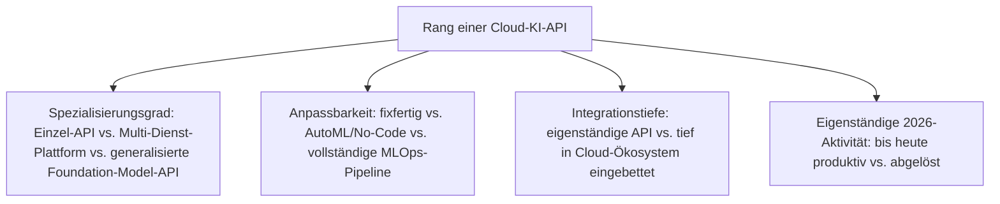
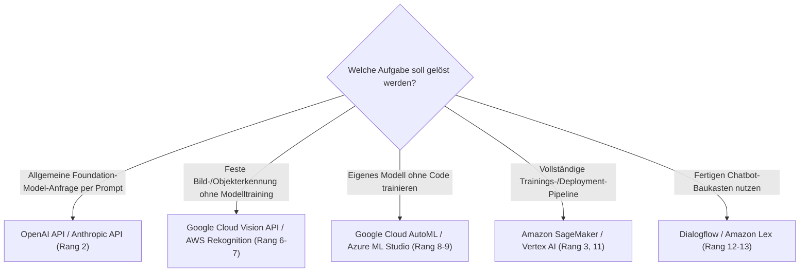

# Beste Cloud-KI-APIs — Top-15-Topliste

Die [Evolution und Architekturen digitaler Cloud-KI-APIs](evolution-digitaler-cloud-ki-apis.md) ordnet diese Architekturlinie chronologisch — von den ersten Vision-APIs über Sprach-/Text-APIs, Konversations-Plattformen und Enterprise-AutoML bis zu MLOps-Plattformen, die schließlich von generalisierten Foundation-Model-APIs abgelöst werden. Diese Seite übersetzt die Chronologie in eine **nach architektonischer Bedeutung gerankte Top-15-Liste**.

!!! note "Hinweis: Einzel-API und Foundation-Model-API koexistieren 2026"
    Wie die Quellchronologie festhält, verdrängt die generalisierte Foundation-Model-API viele, aber nicht alle spezialisierten Einzel-APIs — Enterprise-Workloads mit festen Compliance-Anforderungen nutzen weiterhin gezielt einzelne Vision-/Sprach-APIs statt eines generalisierten Modells.

---

## Bewertungskriterien

---

## Top 15 im Überblick

| Rang | System | Generation | Status 2026 | Historische/aktuelle Bedeutung |
|---|---|---|---|---|
| 1 | **GPT-3-API** | 6 (Foundation-Model-APIs lösen Einzel-APIs ab) | Historisch (als Meilenstein) | Erstes breit zugängliches Foundation-Modell per API, ein Endpunkt ersetzt viele Einzel-APIs |
| 2 | **OpenAI API / Anthropic API / Google AI-APIs** | 6 (Foundation-Model-APIs lösen Einzel-APIs ab) | Aktiv | Etablieren „Prompting" statt Einzel-API-Auswahl als dominantes Interaktionsmodell 2026 |
| 3 | **Amazon SageMaker** | 5 (MLOps & Modell-Deployment-as-a-Service) | Aktiv | Vollständige Pipeline von Datenaufbereitung über Training bis Deployment |
| 4 | **IBM Watson** | 4 (Enterprise-KI-Plattformen & AutoML) | Aktiv | Frühe Enterprise-KI-Plattform, bekannt durch den Jeopardy!-Auftritt 2011 |
| 5 | **Azure Cognitive Services** (ehem. Microsoft Cognitive Services) | 1b (erste Cloud-Vision-APIs) | Aktiv | Bündelt Vision-, Sprach- und Sprachverarbeitungs-APIs unter einer Marke |
| 6 | **AWS Rekognition** | 1c (erste Cloud-Vision-APIs) | Aktiv | Gesichts-/Objekterkennung tief in die AWS-Infrastruktur integriert |
| 7 | **Google Cloud Vision API** | 1a (erste Cloud-Vision-APIs) | Aktiv | Einer der ersten breit verfügbaren Cloud-Dienste für vortrainierte Deep-Learning-Modelle als API-Funktion |
| 8 | **Google Cloud AutoML** | 4 (Enterprise-KI-Plattformen & AutoML) | Aktiv | Training eigener Modelle über eine grafische Oberfläche statt Code |
| 9 | **Azure Machine Learning Studio** | 4 (Enterprise-KI-Plattformen & AutoML) | Aktiv | Drag-and-Drop-ML-Pipeline-Erstellung für Fachanwender ohne Data-Science-Hintergrund |
| 10 | **MLflow** | 5 (MLOps & Modell-Deployment-as-a-Service) | Aktiv | Open-Source-Experiment-Tracking und Modell-Versionierung, cloud-unabhängig einsetzbar |
| 11 | **Vertex AI** | 5 (MLOps & Modell-Deployment-as-a-Service) | Aktiv | Googles konsolidierte Plattform aus mehreren zuvor getrennten ML-Diensten |
| 12 | **Dialogflow** | 3 (Konversations-Plattformen-as-a-Service) | Aktiv (Nische) | Intent-basierte Konversationsdesign-Plattform, seit 2016 |
| 13 | **Amazon Lex** | 3 (Konversations-Plattformen-as-a-Service) | Aktiv (Nische) | Dieselbe Technologie, die Alexa antreibt, als eigenständige API |
| 14 | **Microsoft Bot Framework** | 3 (Konversations-Plattformen-as-a-Service) | Aktiv (Nische) | Framework plus verwaltete Hosting-Infrastruktur für Chatbots |
| 15 | **Text-/Sprachverarbeitungs-APIs** (Google Cloud NL / AWS Comprehend / Azure Text Analytics) | 2 (Sprach- und Textverarbeitungs-APIs) | Aktiv (Nische) | Sentiment-Analyse, Entitätserkennung und Sprachidentifikation per Einzel-API |

---

## Highlights im Detail

### Rang 1–2: die Konsolidierung zur Foundation-Model-API
GPT-3-API und die heutigen OpenAI-/Anthropic-/Google-APIs markieren den größten Architekturbruch dieser Zeitachse — ein einziger Endpunkt deckt Aufgaben ab, für die zuvor mehrere Generation-1–3-APIs nötig waren, siehe [Generation 6](evolution-digitaler-cloud-ki-apis.md#generation-6-foundation-model-apis-losen-einzel-apis-ab-ab-2020).

### Rang 5–7: die Gründergeneration bleibt Enterprise-Fundament
Azure Cognitive Services, AWS Rekognition und Google Cloud Vision API zeigen, dass spezialisierte Einzel-APIs trotz Foundation-Model-Konsolidierung nicht verschwunden sind — viele Enterprise-Workloads nutzen weiterhin gezielt eine Aufgabe pro API, siehe [Generation 1](evolution-digitaler-cloud-ki-apis.md#generation-1-die-ersten-cloud-vision-apis-2015-2016).

### Rang 3, 10–11: MLOps als eigenständige Disziplin
Amazon SageMaker, MLflow und Vertex AI verschieben den Fokus von einzelnen APIs zu End-to-End-Pipelines für Training, Versionierung und Deployment eigener Modelle — eine Ebene, die auch im Foundation-Model-Zeitalter für Fine-Tuning und eigene Modelle relevant bleibt.

---

## Wegweiser: von API-Bedarf zu passendem Dienst

!!! tip "Tipp: die KI-Haupt-Zeitachse separat prüfen"
    Diese Liste vertieft Generation 3 der übergeordneten Chronologie — für den vollständigen Sechs-Generationen-Überblick siehe [Beste KI-Anwendungen 2026](ki-anwendungen-2026-topliste.md).

---

## 🔗 Verwandte Themen

- [Startseite](../index.md) — zurück zur Dokumentations-Zentrale
- [Evolution und Architekturen digitaler Cloud-KI-APIs](evolution-digitaler-cloud-ki-apis.md) — chronologisches Generationenmodell, dessen aktuellen Stand diese Topliste zusammenfasst
- [Produktionsreife Cloud-KI-APIs nach Generation (Top 1)](produktionsreife-cloud-ki-apis-generationen-2026-topliste.md) — dieselbe Chronologie durch das konservative Fünf-Filter-Sieb; von den 15 Rängen besteht nur MLflow, alle verwalteten Anbieter-Dienste fallen am Selbstbetrieb
- [Beste KI-Anwendungen 2026 (Top 20)](ki-anwendungen-2026-topliste.md) — Gesamtmarkt-Topliste über alle sechs KI-Generationen hinweg
- [Beste Deep-Learning-Anwendungen 2026 (Top 15)](deep-learning-anwendungen-2026-topliste.md) — Vorgänger-Generation, deren Modelle hinter diesen APIs laufen
- [Multi-LLM- & Sprachmodell-Anbieter im Vergleich](coding/llm-anbieter-vergleich.md) — aktuelle Foundation-Model-API-Anbieter im Detail
- [KI-Modelle & Frameworks: Übersicht](index.md) — Gesamtübersicht Modell-Kategorien und Frameworks
