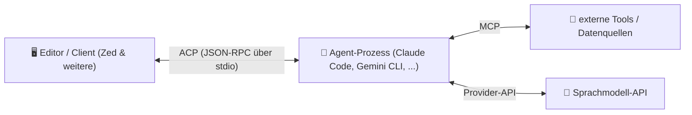
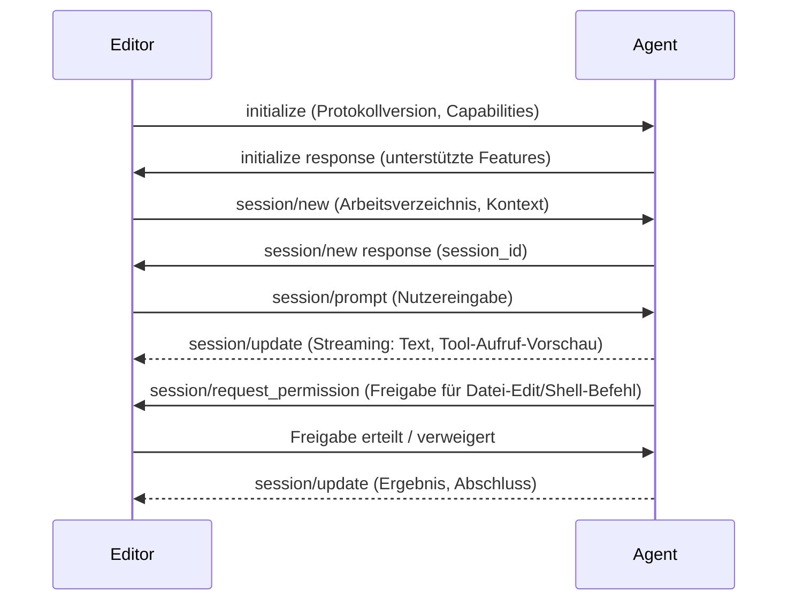

# Agent Client Protocol (ACP) — Übersicht

Das **Agent Client Protocol (ACP)** ist ein offenes, JSON-RPC-basiertes Protokoll von Zed Industries, das die Kommunikation zwischen einem **Editor/Client** (z. B. Zed, perspektivisch weitere IDEs) und einem **KI-Coding-Agenten** (z. B. Claude Code, Gemini CLI) standardisiert — ähnlich wie das Language Server Protocol (LSP) die Kommunikation zwischen Editor und Sprachserver standardisiert hat, nur für agentische Coding-Workflows statt reiner Code-Intelligenz.

!!! note "Hinweis: Abgrenzung zu MCP"
    ACP und das [Model Context Protocol (MCP)](antigravity-cli-advanced-mcp-cicd.md) lösen unterschiedliche Probleme und ergänzen sich: **MCP** standardisiert, wie ein Agent auf externe Tools/Datenquellen zugreift. **ACP** standardisiert, wie ein Editor/Client mit dem Agentenprozess selbst spricht (Sitzung starten, Prompts senden, Streaming-Updates empfangen, Tool-Aufrufe zur Bestätigung anzeigen). Ein Agent kann beide Protokolle gleichzeitig nutzen: ACP zum Editor, MCP zu seinen eigenen Tools.

---

## Architektur



Der Editor startet den Agenten als Subprozess und kommuniziert über **JSON-RPC 2.0 auf Standard-Ein-/Ausgabe** — keine Netzwerk-Ports, keine zusätzliche Infrastruktur. Das senkt die Integrationshürde für Editor-Hersteller erheblich, da derselbe Mechanismus wie bei LSP-Sprachservern wiederverwendet werden kann.

!!! warning "Achtung: junges, sich entwickelndes Protokoll"
    ACP wurde erst 2025 von Zed veröffentlicht und befindet sich noch in aktiver Weiterentwicklung — Methoden-Namen und Payload-Strukturen können sich zwischen Versionen ändern. Vor Produktiveinsatz die aktuelle Spezifikation im offiziellen Repository prüfen. **Stand: Juli 2026.**

---

## Kernkonzepte des Protokollflusses



Zentrale Bausteine:

- **Sessions** — jede Konversation läuft in einer eigenen Session mit eigenem Arbeitskontext.
- **Streaming Updates** — der Agent meldet Fortschritt inkrementell (Text-Tokens, Tool-Aufrufe, Diffs), der Editor rendert live statt auf eine fertige Antwort zu warten.
- **Permission Requests** — bevor der Agent eine Datei ändert oder einen Shell-Befehl ausführt, kann er über das Protokoll eine explizite Nutzerfreigabe anfordern — der Editor entscheidet über die UI, nicht der Agent selbst.
- **Content Blocks** — Antworten bestehen aus typisierten Blöcken (Text, Diff, Tool-Aufruf, Bild), die der Client passend rendert.

---

## Beispiel: JSON-RPC-Nachricht

```json
{
  "jsonrpc": "2.0",
  "id": 3,
  "method": "session/prompt",
  "params": {
    "sessionId": "sess_8f2a1c",
    "prompt": [
      { "type": "text", "text": "Refactore die Funktion parse_config in src/config.rs" }
    ]
  }
}
```

Der Agent antwortet nicht mit einer einzelnen Nachricht, sondern mit einer Folge von `session/update`-Notifications, bis er den Auftrag als abgeschlossen meldet.

---

## Für Editor- bzw. Agent-Entwickler

=== "Editor-Seite (ACP-Client implementieren)"
    - Agentenprozess als Subprozess starten und stdio verbinden.
    - `initialize` senden, unterstützte Capabilities (z. B. Diff-Rendering, Bild-Anhänge) aushandeln.
    - `session/update`-Notifications entgegennehmen und inkrementell in der UI rendern.
    - `session/request_permission` mit einer nachvollziehbaren Freigabe-UI beantworten (Datei-Diff anzeigen, Shell-Befehl anzeigen).

=== "Agent-Seite (ACP-Server implementieren)"
    - JSON-RPC-Handling auf stdio statt eigenem Chat-UI implementieren.
    - Antworten in inkrementelle `session/update`-Schritte statt einer Ausgabe am Stück zerlegen.
    - Vor destruktiven Aktionen (Datei-Schreiben, Shell-Ausführung) `session/request_permission` statt stiller Ausführung nutzen.
    - Eigene MCP-Tool-Anbindung unabhängig vom ACP-Kanal zum Editor betreiben.

---

## Unterstützung in der Praxis

Referenzimplementierung ist der **Zed-Editor** selbst, der ACP als natives Protokoll für externe Agenten nutzt. Weitere CLI-Agenten (u. a. aus der [KI-Agent-CLI-Topliste](ki-agent-cli-topliste.md)) bieten zunehmend ACP-Adapter an, um ohne editor-spezifischen Extra-Code in mehreren Editoren nutzbar zu sein — der eigentliche Vorteil eines offenen Protokolls gegenüber proprietären Einzelintegrationen.

!!! tip "Tipp: Warum das für Entscheider relevant ist"
    Ein Agent mit ACP-Unterstützung lässt sich potenziell in **jedem** ACP-fähigen Editor nutzen, ohne dass Editor- und Agent-Hersteller eine dedizierte Integration pflegen müssen — dieselbe Entkopplung, die LSP seinerzeit für Sprachserver gebracht hat. Bei der Tool-Auswahl lohnt sich daher ein Blick darauf, ob ein CLI-Agent nur proprietär in einen Editor eingebettet ist oder über ACP grundsätzlich editor-unabhängig bleibt.

---

## 🔗 Verwandte Themen

- [Startseite](../../index.md) — zurück zur Dokumentations-Zentrale
- [Beste Alternativen zum Agent Client Protocol (ACP), Top 20](agent-client-protocol-alternativen-topliste.md) — verwandte und konkurrierende Protokolle/Ansätze im Vergleich
- [Beste KI-Agent-CLIs (Allgemein, Top 20)](ki-agent-cli-topliste.md) — Agenten, die potenziell ACP-Adapter bereitstellen
- [Beste KI-Agent-IDEs (Allgemein, Top 20)](ki-agent-ide-topliste.md) — Editoren als ACP-Gegenstück (Client-Seite)
- [Beste KI-Agent-SDKs nach Programmiersprachen-Vielfalt (Top 20)](ki-agent-sdk-sprachen-topliste.md) — Agent-Frameworks, die ACP als Editor-Anbindung nutzen könnten
- [Antigravity CLI 2 — Kapitel 9: MCP, Headless & Security](antigravity-cli-advanced-mcp-cicd.md) — Gegenstück-Protokoll für Tool-/Datenanbindung
- [Claude Code Praxis-Handbuch](claude-code-praxis.md) — CLI-Agent mit Editor-Integrationsmöglichkeiten
